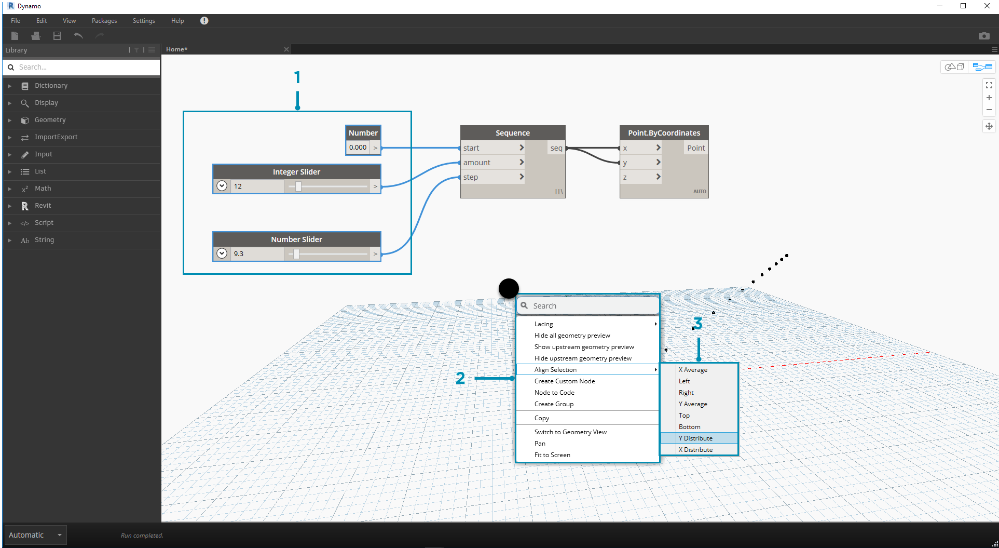
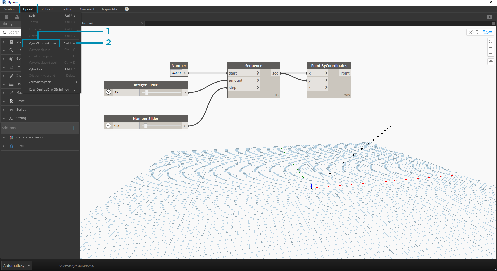

## Správa programu

Vizuální programování může být kreativní činnost, tok programu a uživatelské vstupy se však můžou velmi rychle stát složitými a na pracovní ploše nepřehlednými. Podívejme se na některé osvědčené postupy pro správu programu.

### Zarovnání

Jakmile na pracovní plochu přidáte několik uzlů, můžete je chtít přeuspořádat, aby byly přehledné. Výběrem více než jednoho uzlu a kliknutím pravým tlačítkem na pracovní plochu se ve vyskakovacím okně zobrazí nabídka **Zarovnat výběr** s možnostmi pro zarovnání a rozmístění po osách X a Y.

> 1. Vyberte více než jeden uzel
2. Klikněte pravým tlačítkem myši na pracovní plochu
3. Použijte možnosti **Zarovnat výběr**

### Poznámky

Zkušení uživatelé dokážou číst vizuální program tím, že se podívají na názvy uzlů a budou sledovat tok programu. Dobrým zvykem je vkládat na pracovní plochu popisy. Aplikace Dynamo obsahuje uzel **Note** s upravitelným textovým polem. Poznámky lze na pracovní plochu přidávat dvěma způsoby:

> 1. Přejděte do nabídky Upravit > Vytvořit poznámku
2. Použijte kombinaci kláves Ctrl+W

Po přidání poznámky na pracovní plochu se zobrazí textové pole pro úpravu textu. Po vytvoření lze poznámku upravit dvojitým kliknutím nebo kliknutím pravým tlačítkem na uzel Note.

### Seskupování

S tím, jak se vizuální program zvětšuje, může být užitečné označit větší kroky jako celky. Větší počty uzlů je možné označit jako **skupinu**, což kolem nich na pozadí vytvoří barevný rámeček a název. Pokud je vybrán více než jeden uzel, skupinu lze vytvořit třemi způsoby:

> 1. Přejděte do nabídky Upravit > Vytvořit skupinu
2. Použijte kombinaci kláves Ctrl+G
3. Klikněte pravým tlačítkem myši na pracovní plochu a vyberte možnost „Vytvořit skupinu“

Po vytvoření skupiny je možné upravit její nastavení, například název a barvu. 

> Tip: Použití poznámek a skupin je účinný způsob, jak zvýšit přehlednost a srozumitelnost v souboru.

Zde je náš program z části 2.4 doplněný o poznámky a skupiny:

> 1. Poznámka: „Parametry mřížky“
2. Poznámka: „Body mřížky“
3. Skupina: „Tvorba mřížky z bodů“
4. Skupina: „Tvorba bodu atraktoru“
5. Poznámka: „Kalibrace hodnot vzdálenosti“
6. Poznámka: „Proměnná mřížka kružnic“

