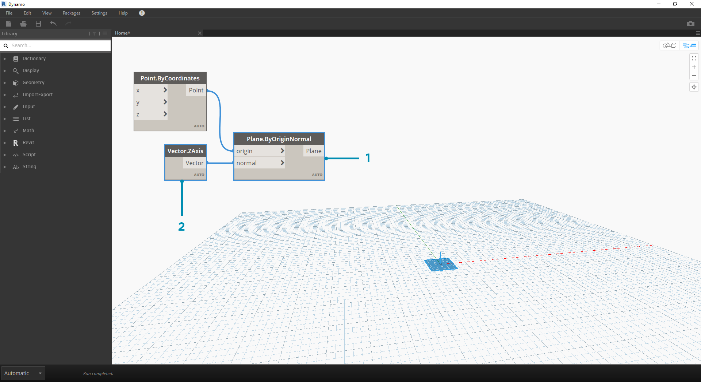
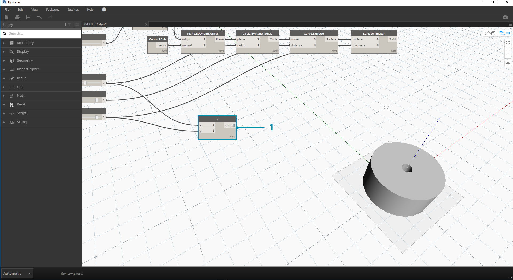

## Data

Data jsou součástí našich programů. Prochází dráty a zadávají vstupy pro uzly, kde se zpracují do nové formy výstupních dat. Pojďme si prohlédnout definici dat, jak jsou strukturována a začít je používat v aplikaci Dynamo.

### Co jsou data?

Data jsou souborem hodnot kvalitativních nebo kvantitativních proměnných. Nejjednodušší forma dat jsou například čísla jako ```0```, ```3.14``` nebo ```17```. Data však mohou být také různých typů: proměnná představující měnící se čísla (```height```), znaky (```myName```); geometrii (```Circle```) nebo seznam datových položek (```1,2,3,5,8,13. ..```). Potřebujeme data pro přidání do vstupních portů uzlů aplikace Dynamo – můžeme mít data bez akcí, ale potřebujeme data pro zpracování akcí, které reprezentují uzly. Pokud do pracovního prostoru přidáme uzel, pokud nebude mít k dispozici žádný vstup, bude výsledkem funkce, nikoli výsledek akce.


> 1. Jednoduchá data
2. Data a akce (uzel A) se úspěšně spustí
3. Akce (Uzel A) bez zadání dat vrátí obecnou funkci

### Pozor na hodnoty Null

Typ ```'null'``` představuje absenci dat. I když je to abstraktní koncept, pravděpodobně se k němu dostanete při práci s vizuálním programováním. Pokud akce nevytvoří platný výsledek, uzel vrátí hodnotu null. Testování nulových hodnot a odstraňování nulových hodnot z datové struktury je klíčovou součástí vytváření robustních programů.

|Ikona|Název/Syntaxe|Vstupy|Výstupy|
| -- | -- | -- | -- |
||Object.IsNull|obj|booleovský|

### Datové struktury

Při vizuálním programování můžeme velmi rychle vygenerovat velké množství dat a vyžadovat způsob správy jejich hierarchie. Jedná se o úlohu datových struktur, organizačních schémat, ve kterých ukládáme data. Specifika datových struktur a způsob jejich použití se liší mezi jednotlivými programovacími jazyky. V aplikaci Dynamo přidáme hierarchii k datům prostřednictvím seznamů. To prozkoumáme v pozdějších kapitolách, ale začneme jednoduše:

Seznam představuje kolekci položek umístěných do jedné struktury dat:

* Mám pět prstů (*položek*) na ruce (*seznam*).
* Deset domů (*položek*) je na mojí ulici (*seznam*).


> 1. Uzel **Number Sequence** definuje seznam čísel pomocí vstupů *start*, *množství* a *krok*. Pomocí těchto uzlů jsme vytvořili dva samostatné seznamy deseti čísel, z nichž jeden se pohybuje od *100–109* a druhý se pohybuje od *0–9*.
2. Uzel **List.GetItemAtIndex** slouží k výběru položky v seznamu na určitém indexu. Při výběru hodnoty *0* se první položka zobrazí v seznamu (v tomto případě *100*).
3. Pokud použijeme stejný postup na druhý seznam, získáme hodnotu *0*, první položku v seznamu.
4. Nyní sloučíme dva seznamy do jednoho pomocí uzlu **List.Create**. Uzel vytvoří *seznam seznamů.* Tím se změní struktura dat.
5. Pokud použijete znovu parametr **List.GetItemAtIndex**, s indexem nastaveným na hodnotu *0*, získáme první řádek seznamu seznamů. To znamená, že se seznam považuje za položku, což se poněkud liší od ostatních skriptovacích jazyků. V pozdějších kapitolách se dostaneme k pokročilejší manipulaci se seznamy a datovými strukturami.

Základní koncept pro pochopení hierarchie dat v aplikaci Dynamo: **S ohledem na datovou strukturu jsou seznamy považovány za položky.** Jinými slovy, aplikace Dynamo funguje s postupem shora dolů pro pochopení datových struktur. Co to znamená? Pojďme to projít s příkladem.

### Použití dat k vytvoření řetězu válců

> Stáhněte si vzorový soubor, který je přiložen k tomuto cvičení (klikněte pravým tlačítkem a vyberte příkaz Uložit odkaz jako...): [Stavební bloky programů – Data.dyn](datasets/4-1/Building Blocks of Programs - Data.dyn). Úplný seznam vzorových souborů naleznete v dodatku.

V tomto prvním příkladu sestavíme válec se skořepinou, který prochází hierarchií geometrie, o níž se v této části pojednává. 

> 1. **Point.ByCoordinates –** po přidání uzlu na pracovní plochu vidíme bod v počátku rastru náhledu aplikace Dynamo. Výchozí hodnoty vstupů *x, y* a *z* jsou *0,0*, což nám dává bod v tomto umístění.



> 1. **Plane.ByOriginNormal** – Dalším krokem v hierarchii geometrie je rovina. Existuje několik způsobů, jak vytvořit rovinu, my pro vstup použijeme počátek a normálu. Počátek je uzel bodu vytvořený v předchozím kroku.
2. **Vector.ZAxis –** toto je sjednocený vektor ve směru Z. Všimněte si, že nejsou k dispozici vstupy, pouze vektor o hodnotě [0,0,1]. Toto je vstupní hodnota *normal* pro uzel *Plane.ByOriginNormal*. Tím se v náhledu aplikace Dynamo zobrazí obdélníková rovina.


> 1. **Circle.ByPlaneRadius –** Rozšiřujeme hierarchii. Nyní vytvoříme oblouk z roviny v předchozím kroku. Po zapojení do uzlu se v počátku zobrazí kružnice. Výchozí poloměr v uzlu je hodnota *1*.


> 1. **Curve.Extrude –** Teď provedeme vylepšení přidáním hloubky a přechodem do třetího rozměru. Tento uzel vytvoří povrch z křivky jejím vysunutím. Výchozí vzdálenost v uzlu je *1* a měli bychom ve výřezu vidět válec.


> 1. **Surface.Thicken –** Tento uzel nám umožňuje vytvořit uzavřené těleso odsazením povrchu o danou vzdálenost a uzavřením tvaru. Výchozí hodnota tloušťky je *1* a válec se skořepinou je ve výřezu zobrazen v souladu s těmito hodnotami.


> 1. **Number Slider –** Místo použití výchozích hodnot pro všechny tyto vstupy přidejte do modelu parametrický ovládací prvek.
2. **Domain Edit – **po přidání posuvníku čísla na pracovní plochu klikněte na stříšku v levé horní části a zobrazte možnosti domény.
3. **Min/Max/Krok –** změňte hodnoty *min*, *max* a *step* na *0*,*2* a *0.01*. Toto provedeme, abychom mohli řídit velikost celkové geometrie.


> 1. **Number Sliders –** Ve všech výchozích vstupech zkopírujte a vložte tento posuvník čísla (vyberte posuvník, stiskněte Ctrl+C a pak Ctrl+V) několikrát, dokud nebudou mít všechny vstupy s výchozími hodnotami posuvník. Aby definice fungovala, některé hodnoty posuvníku musí být větší než nula (například k zesílení plochy je potřeba hloubka vysunutí).

Nyní jsme vytvořili parametrický válec se skořepinou s těmito posuvníky. Zkuste některé z těchto parametrů změnit a sledujte, jak se geometrie dynamicky aktualizuje ve výřezu aplikace Dynamo.


> 1. **Number Sliders – ** přidali jsme na plochu hodně posuvníků a je potřeba vyčistit rozhraní nástroje, který jsme právě vytvořili. Klikněte pravým tlačítkem na jeden posuvník, vyberte položku Přejmenovat... a změňte každý posuvník na vhodný název pro jeho parametr. Názvy najdete v&nbsp;obrázku nahoře.

V tomto okamžiku jsme vytvořili úžasnou věc s rozšiřujícím se válcem. Toto je aktuálně jeden objekt, podívejme se, jak vytvořit pole válců, které zůstávají dynamicky propojeny. Za tímto účelem vytvoříme seznam válců, místo práce s jednou položkou.



> 1. **Addition (+) –** naším cílem je přidat řadu válců vedle válce, který jsme vytvořili. Pokud chceme přidat jeden válec vedle aktuálního válce, je nutné zvážit poloměr válce a tloušťku jeho skořepiny. Toto číslo získáme sečtením dvou hodnot posuvníků.


> Tento krok je mnohem náročnější, takže ho projdeme pomalu: cílem je vytvořit seznam čísel, která definují umístění každého válce v řadě.

> 1. **Multiplication – ** Nejprve chceme vynásobit hodnotu z předchozího kroku hodnotou 2. Hodnota z předchozího kroku představuje poloměr a chceme válec posunout o plný průměr.
2. **Number Sequence – ** Pomocí tohoto uzlu vytvoříme pole čísel. První vstup je uzel *multiplication* z předchozího kroku do hodnoty *step*. Hodnotu *start* lze nastavit na *0.0* pomocí uzlu *number*.
3. **Integer Slider – ** Pro hodnotu *množství* připojíme posuvník celého čísla. Tím se definuje počet vytvořených válců.
4. **Output – ** Tento seznam zobrazuje vzdálenost přesunutou pro každý válec v poli a je parametricky řízen původními posuvníky.


> 1. Tento krok je dostatečně jednoduchý – zadejte posloupnost definovanou v předchozím kroku do vstupu *x* původního uzlu *Point.ByCoordinates*. Tím nahradíte posuvník *pointX*, který lze odstranit. Nyní se ve výřezu zobrazuje pole válců (zkontrolujte, zda je číslo posuvníku větší než 0).


> Řetěz válců je stále dynamicky spojen se všemi posuvníky. Upravte každý posuvník, abyste viděli aktualizaci definice.

