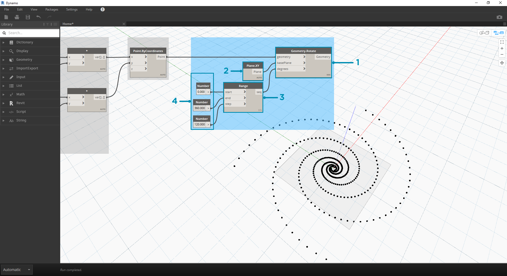

## Matematika

Pokud jsou nejjednodušší formou dat čísla, nejjednodušším způsobem, jak se tato čísla mohou odlišit, je použití funkce Mathematics. Od jednoduchých operátorů, jako je dělení, až k trigonometrickým funkcím, možnost Math je skvělým způsobem, jak začít zkoumat číselné vztahy a vzory.

### Aritmetické operátory

Operátory jsou sada komponent, které používají algebraické funkce se dvěma číselnými vstupními hodnotami, které vrací jednu výstupní hodnotu (součet, rozdíl, násobení, dělení atd.). Najdete je pod položkou Operátory > Akce.

|Ikona|Název|Syntaxe|Vstupy|Výstupy|
| -- | -- | -- | -- | -- |
||Součet|+|var[]...[], var[]...[]|var[]...[]|
||Odčítání|-|var[]...[], var[]...[]|var[]...[]|
||Násobení|*|var[]...[], var[]...[]|var[]...[]|
||Dělení|/|var[]...[], var[]...[]|var[]...[]|

### Parametrický vzorec

> Stáhněte si vzorový soubor, který je přiložen k tomuto cvičení (klikněte pravým tlačítkem a vyberte příkaz Uložit odkaz jako...): [Stavební bloky programů – Math.dyn](datasets/4-2/Building Blocks of Programs - Math.dyn). Úplný seznam vzorových souborů naleznete v dodatku.

Další logický krok spočívá v kombinování operátorů a proměnných, které vytvoří složitější vztah prostřednictvím **vzorců**. Vytvoříme vzorec, který lze ovládat vstupními parametry, jako jsou posuvníky.

> 1. **Number Sequence:** Definuje posloupnost čísel na základě tří vstupů: *start, amount* a *step*. Tato sekvence představuje „t“ v parametrické rovnici, takže chceme použít seznam, který je dostatečně velký k definici přechodnice.

Výše uvedený krok vytvořil seznam čísel definujících parametrickou doménu. Zlatá přechodnice je definována jako rovnice: = a =. Skupina uzlů níže představuje tuto rovnici ve vizuálním programovacím tvaru.

> Při procházení skupiny uzlů se snažte věnovat pozornost souvislosti mezi vizuálním programem a psanou rovnicí.

> 1. **Number Slider:** Přidejte na kreslicí plochu dva posuvníky. Tyto posuvníky budou představovat proměnné *a* a *b* parametrické rovnice. Představují konstantu, která je flexibilní, nebo parametry, které lze upravit podle požadovaného výsledku.
2. ** * :** uzel násobení je reprezentován hvězdičkou. Toto použijeme opakovaně k připojení násobných proměnných
3. **Math.RadiansToDegree:** Hodnoty '*t*' je nutné převést na stupně pro jejich vyhodnocení v trigonometrických funkcích. Nezapomeňte, že aplikace Dynamo pro vyhodnocení těchto funkcí ve výchozím stavu používá stupně.
4. **Math.Pow:** jako funkce '*t*' a čísla '*e*' vytvoří sekvenci Fibonacci.
5. **Math.Cos a Math.Sin:** Tyto dvě trigonometrické funkce odliší souřadnice X a souřadnice Y každého parametrického bodu.
6. **Watch: **Nyní vidíte, že náš výstup jsou dva seznamy, které budou tvořit souřadnice *x* a *y* bodů použitých k vytvoření přechodnice.

### Od vzorce ke geometrii

Nyní bude většina uzlů z předchozího kroku fungovat dobře, ale je to hodně práce. Chcete-li vytvořit efektivnější pracovní postup, podívejte se do části **Bloky kódů** (část 3.3.2.3) a definujte řetězec výrazů aplikace Dynamo do jednoho uzlu. V této další řadě kroků se podíváme na použití parametrické rovnice k nakreslení spirály Fibonacci. 

> 1. **Point.ByCoordinates:** Spojte horní uzel násobení se vstupem *x* a dolní část se vstupem *y*. Nyní vidíte parametrickou spirálu bodů na obrazovce.

> 1. **Polycurve.ByPoints:** Připojte soubor Point.ByCoordinates z předchozího kroku do *bodů*. Možnost *connectLastToFirst* můžeme nechat bez vstupu, protože neděláme uzavřený oblouk. Tím se vytvoří přechodnice, která prochází každým bodem definovaným v předchozím kroku.

Nyní jsme dokončili spirálu Fibonacci. Pojďme pokračovat ve dvou různých cvičeních, které pojmenujeme Nautilus a Sunflower. Jedná se o abstrakce přírodních systémů, ale dvě různá použití Fibonacciho spirály budou dobře zastoupena.

### Od spirály k Nautilus

> 1. Jako bod přesunu začneme stejným krokem z předchozího cvičení: Vytvoření spirálového pole bodů pomocí uzlu **Point.ByCoordinates**.

> 1. **Polycurve.ByPoints:** Opět se jedná o uzel z předchozího cvičení, který použijeme jako referenci.
2. **Circle.ByCenterPointRadius:** Zde použijeme kruhový uzel se stejnými vstupy jako v předchozím kroku. Výchozí hodnota poloměru je *1.0*, takže je vidět okamžitý výstup kružnic. Je okamžitě čitelné, jak se body dále odchýlí od počátku.

> 1. **Circle.ByCenterPointRadius:** Pro vytvoření dynamičtějšího pole kružnic je nutné, aby původní číselná posloupnost (posloupnost '*t*') byla zadána do hodnoty poloměru.
2. **Number Sequence:** Toto je původní pole '*t*'. Přidáním této hodnoty do poloměru se středy kružnic stále od počátku liší, ale poloměr kružnic se zvětšuje a vytváří Fibonacciho kruhový graf. Bonusové body, pokud to vytvoříte ve 3D.

### Od Nautilus k Phyllotaxis Pattern

Teď, když jsme udělali kruhovou skořepinu Nautilus, pojďme skočit do parametrických rastrů. Použijeme základní otočení Fibonacciho spirály k vytvoření Fibonacciho rastru a výsledek bude modelován po [růstu slunečnicových semen.](http://ms.unimelb.edu.au/~segerman/papers/sunflower_spiral_fibonacci_metric.pdf)

> 1. Jako bod přesunu začneme znovu stejným krokem z předchozího cvičení: Vytvoření spirálového pole bodů pomocí uzlu **Point.ByCoordinates**.

> 1. **Geometry.Rotate:** Existuje několik možností Geometry.Rotate. Ujistěte se, že jste vybrali uzel se vstupy *geometry*,*basePlane* a *degrees*. Připojte položku **Point.ByCoordinates** ke vstupu geometrie.
2. **Plane.XY:** Připojte se ke vstupu *basePlane*. Otočíme se kolem počátku, což je stejné umístění jako základna přechodnice.
3. **Number Range:** Pro náš vstup stupně chceme vytvořit více otočení. To můžeme provést rychle pomocí komponenty Number Range. Připojte jej ke vstupu *degrees*.
4. **Number:** A k definování rozsahu čísel přidejte na kreslicí plochu ve vertikálním pořadí tři uzly čísel. Shora dolů přiřaďte hodnoty *0.0,360.0* a *120.0* v uvedeném pořadí. Toto jsou řídicí otáčení přechodnice. Po připojení tří uzlů čísel k uzlu si všimněte výstupních výsledků z uzlu **Number Range**.

Náš výstup se začíná podobat víru. Upravíme některé parametry položky **Number Range** a podíváme se, jak se výsledky mění: 

> 1. Změňte velikost kroku uzlu **Number Range** z *120.0* na *36.0*. Všimněte si, že tím vznikají další otáčení, a proto získáváme hustý rastr.

> 1. Změňte velikost kroku uzlu **Number Range** z *36.0* na *3.6*. To nám nyní dává mnohem hustější rastr a směr přechodnice není jasný. Dámy a pánové, vytvořili jsme slunečnici.

