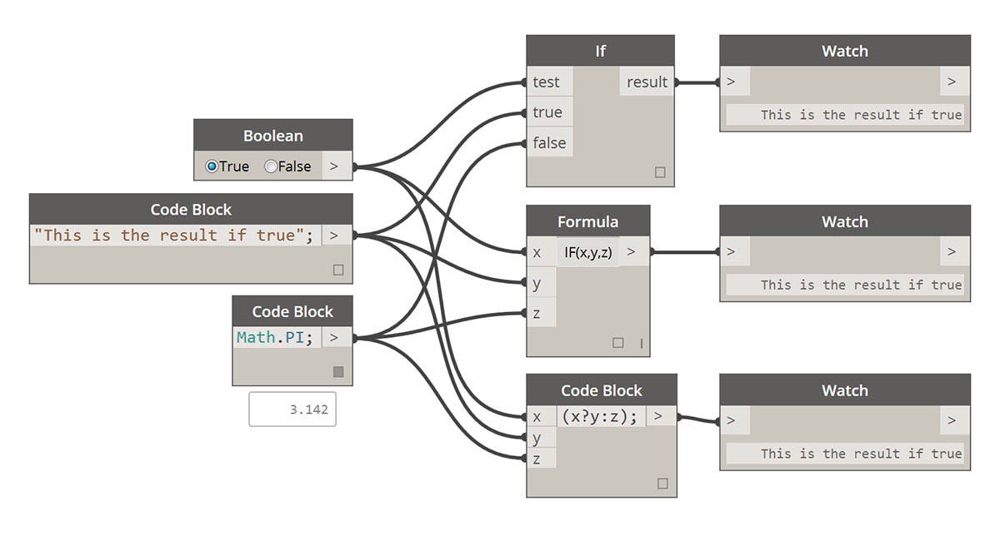

## Logika

Modul **Logic** nebo konkrétněji **Conditional Logic** umožňuje určit akci nebo sadu akcí na základě testu. Po vyhodnocení testu budeme mít booleovskou hodnotu představující ```True``` nebo ```False```, kterou můžeme použít k řízení toku programu.

### Booleovské hodnoty

Číselné proměnné mohou ukládat celou řadu různých čísel. Booleovské proměnné mohou ukládat pouze dvě hodnoty, které se označují jako True nebo False, Yes nebo No, 1 nebo 0. Pomocí booleovských hodnot lze výpočty provádět jen zřídka, protože jsou omezené.

### Podmíněné výrazy

Výraz „If“ je klíčovou koncepcí programování: „Pokud je *tato hodnota* pravdivá, *toto* se stane, jinak se stane *něco jiného*. Výsledná akce výrazu je řízena booleovskou hodnotou. Příkaz „If“ lze v aplikaci Dynamo definovat několika způsoby:

|Ikona|Název|Syntaxe|Vstupy|Výstupy|
| -- | -- | -- | -- | -- |
||If|If|test, true, false|výsledek|
||Vzorec|IF(x,y,z)|x, y, z|výsledek|
||Blok kódu|(x?y:z)|x, y, z|výsledek|

Pojďme si projít stručný příklad každého z těchto tří uzlů v akci pomocí podmíněného výrazu „If“:



> Na tomto obrázku je hodnota *boolean* nastavena na hodnotu *true*, což znamená, že výsledkem je řetězec: *„toto je výsledek, pokud je hodnota true“.* Tři uzly vytvářející výraz *If* zde fungují identicky.


> Uzly opět fungují identicky. Pokud je hodnota *boolean* změněna na *false*, výsledkem je číslo *Pi*, jak je definováno v původním výrazu *If*.

### Filtrování seznamu

> Stáhněte si vzorový soubor, který je přiložen k tomuto cvičení (klikněte pravým tlačítkem a vyberte příkaz Uložit odkaz jako...): [Stavební bloky programů – Logic.dyn](datasets/4-3/Building Blocks of Programs - Logic.dyn). Úplný seznam vzorových souborů naleznete v dodatku.

Pomocí logiky rozdělíme seznam čísel do seznamu sudých čísel a seznamu lichých čísel.


> 1. **Number Range –** přidejte na kreslicí plochu číselný rozsah.
2. **Numbers – ** Přidejte na kreslicí plochu tři uzly čísel. Hodnota pro každý uzel čísla by měla být: *0.0* pro *start*, *10.0* pro *end* a *1.0* pro *step*.
3. **Output – ** náš výstup je seznam 11 čísel v rozsahu od 0 do 10.
4. **Modulo (%)–** *Number Range* do *x* a *2,0* do *y*. Tím se vypočítá zbytek po dělení 2 pro každé číslo v seznamu. Výstup z tohoto seznamu nám poskytne seznam hodnot, které se mění v rozmezí 0 až 1.
5. **Test rovnosti (==) –** přidá na kreslicí plochu test rovnosti. Výstup *modulo* lze přidat do vstupu *x* a *0,0* do vstupu *y*.
6. **Watch –** Výstupem testu rovnosti je seznam hodnot, které se mění na hodnotu true a false. Jedná se o hodnoty použité k oddělení položek v seznamu. *0* (nebo *true*) představuje sudá čísla a (*1* nebo *false*) představuje lichá čísla.
7. **List.FilterByBoolMask –** tento uzel filtruje hodnoty do dvou různých seznamů na základě vstupní booleovské hodnoty. Původní položku *number range* zadejte do vstupu *list* a výstup položky *equality test* do vstupu *mask*. Výstup *in* představuje hodnoty true, zatímco výstup *out* představuje hodnoty false.
8. **Watch – ** výsledkem je seznam sudých čísel a seznam lichých čísel. Použili jsme logické operátory k oddělení seznamů do vzorů.

### Z logiky na geometrii

Budeme vycházet z logiky stanovené v prvním cvičení a použijeme toto nastavení na operaci modelování.

 Vyjdeme z předchozího cvičení se stejnými uzly. Jediné výjimky (kromě změny formátu jsou):

> 1. Vstupní hodnoty byly změněny.
2. Vložení seznamu bylo odpojeno od položky *List.FilterByBoolMask*. Teď je necháme stranou, ale později se budou hodit.


> Začneme vzájemným spojením uzlů, jak je znázorněno na obrázku výše. Tato skupina uzlů představuje parametrickou rovnici k definování oblouku úsečky. Několik poznámek:

> 1. **První posuvník** by měl mít hodnoty min 1, max 4 a step 0,01.
2. **Druhý posuvník** by měl mít hodnoty min. 0, max 1 a step 0,01.
3. **PolyCurve.ByPoints –** pokud je zkopírováno výše uvedené schéma uzlu, výsledkem je křivka sinu ve výřezu náhledu aplikace Dynamo.

Zde je metoda pro vstupy: použijte uzly čísel pro statické vlastnosti a posuvníky pro flexibilnější hodnoty. Chceme zachovat původní číselný rozsah, který definujeme na začátku tohoto kroku. Křivka sinu, kterou zde vytvoříme, by však měla mít určitou flexibilitu. Posunutím těchto posuvníků můžeme sledovat, jak oblouk aktualizuje svou frekvenci a amplitudu.


> Trochu přeskočíme v definici, takže se podíváme na konec, abychom mohli odkazovat na to, k čemu míříme. První dva kroky jsou provedeny samostatně, nyní je chceme spojit. Pomocí křivky základního sinu budeme řídit umístění komponent zipu a použijeme logiku true/false k přepínání mezi malými a většími poli.


> 1. **Math.RemapRange – ** Pomocí číselné sekvence vytvořené v kroku 01 vytvoříme novou řadu čísel přemapováním rozsahu. Původní čísla z kroku 01 jsou v rozsahu 0-100. Tato čísla se pohybují v rozsahu od 0 do 1 podle hodnot *newMin* a *newMax*.


> 1. **Curve.PointAtParameter – ** Zadejte *Polycurve.ByPoints* (z kroku 2) do *curve* a *RemapRange* do *param*. Tento krok vytvoří body podél křivky. Čísla byla přemapována na 0 až 1, protože vstup *param* hledá hodnoty v tomto rozsahu. Hodnota *0* představuje počáteční bod, hodnota *1* představuje koncové body. Všechna čísla mezi hodnotami jsou vyhodnocena v rozsahu *[0,1]*.


> 1. **List.FilterByBoolMask – ** Zadejte *Curve.PointAtParameter* z předchozího kroku do vstupu *list*.
2. **Watch –** uzel kukátka *in* a uzel kukátka pro *out* zobrazuje, že máme dva seznamy představující sudé indexy a liché indexy. Tyto body jsou seřazeny stejným způsobem na křivce, kterou ukážeme v dalším kroku.


> 1. **Cuboid.ByLength** – znovu vytvořte spojení uvedená na obrázku výše, abyste získali zip podél sinusové křivky. Kvádr je pouze kvádr a definujeme jeho velikost na základě bodu křivky ve středu kvádru. Logika sudého nebo lichého rozdělení by nyní měla být v modelu jasná.


> 1. **Number Slider –** Přejdeme zpět na začátek definice, měníme posuvník čísel a sledujeme aktualizaci zipu. Horní řádek obrázků představuje hodnoty rozsahu pro horní posuvník čísla. Toto je frekvence vlny.
2. **Number Slider –** Dolní řádek obrázků představuje rozsah hodnot pro dolní posuvník. Toto je amplituda vlny.

