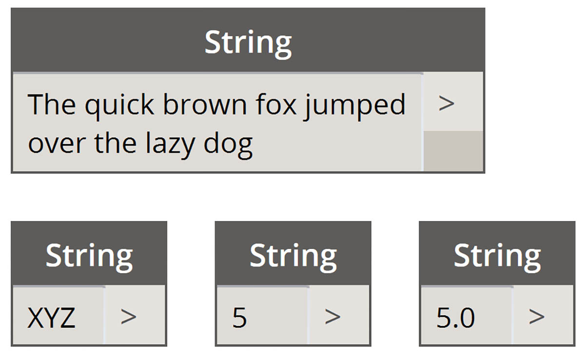
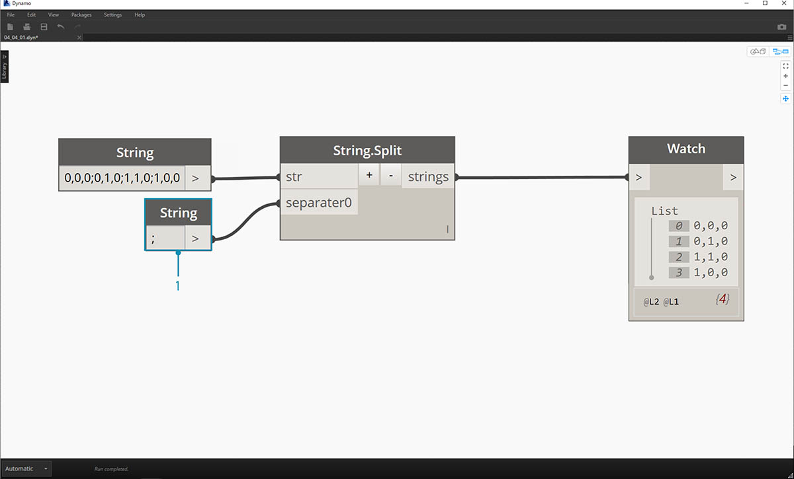
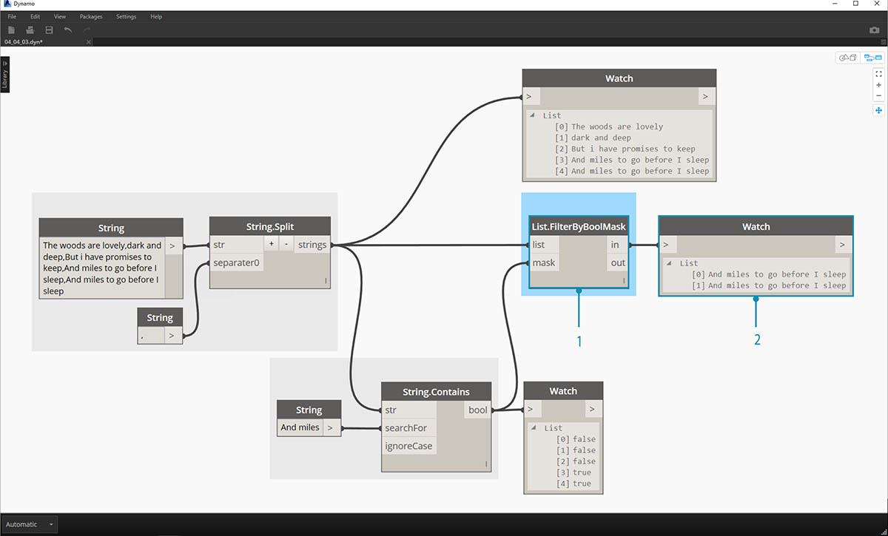

## Řetězce

**String** je formálně sekvence znaků představujících doslovnou konstantu nebo určitý typ proměnné. Neformálně je řetězec označení pro text. Pracovali jsme s celými i desetinnými čísly, abychom mohli řídit parametry, a stejně můžeme pracovat s textem.

### Vytváření řetězců

Řetězce lze použít pro širokou řadu aplikací, včetně definování uživatelských parametrů, opatření sady dokumentace poznámkami a analýzy textových datasetů. Uzel řetězce se nachází v kategorii Core>Input.

> Výše uvedené vzorové uzly jsou řetězce. Číslo může být reprezentováno jako řetězec, jako písmeno nebo celé pole textu.

### Dotazování řetězců

> Stáhněte si vzorový soubor, který je přiložen k tomuto cvičení (klikněte pravým tlačítkem a vyberte příkaz Uložit odkaz jako...): [Stavební bloky programů – Strings.dyn](datasets/4-4/Building Blocks of Programs - Strings.dyn). Úplný seznam vzorových souborů naleznete v dodatku.

Pomocí dotazů na řetězce můžete rychle analyzovat velké množství dat. O některých základních operacích, které mohou urychlit pracovní postup a pomoci při interoperabilitě softwaru, se budeme bavit.

Následující obrázek bere v úvahu řetězec dat pocházejících z externí tabulky. Řetězec představuje vrcholy obdélníku v rovině XY. V miniaturním cvičení projdeme některé operace rozdělení řetězce:

> 1. Oddělovač „;“ rozdělí každý vrchol obdélníku. Tím se vytvoří seznam se čtyřmi položkami pro každý vrchol.

> 1. Kliknutím na tlačítko *+* uprostřed uzlu vytvoříte nový oddělovač.
2. Na kreslicí plochu přidejte řetězec „*,*“ a zadejte jej do nového vstupu oddělovače.
3. Výsledkem je nyní seznam deseti položek. Uzel se nejprve rozdělí podle položky *separator0* a potom podle položky *separator1*.

Zatímco výše uvedený seznam položek může vypadat jako čísla, jsou stále považovány za samostatné řetězce v aplikaci Dynamo. Aby bylo možné vytvořit body, je nutné jejich datový typ převést z řetězce na číslo. To se provádí pomocí uzlu String.ToNumber

> 1. Tento uzel je přímočarý. Zapojte výsledky prvku String.Split do vstupu. Výstup nevypadá jinak, ale datový typ je nyní *number* místo *string*.

> 1. U některých základních dalších operací je nyní v počátku nakreslen obdélník podle původního vstupu řetězce.

### Manipulace s řetězci

Protože řetězec je obecným textovým objektem, jsou použity v široké škále aplikací. Podívejme se na některé hlavní akce v aplikaci Dynamo v části Core>String Category:

Tato metoda spojí dva řetězce v zadaném pořadí. Takto se v seznamu vezme každý doslovný řetězec a vytvoří se jeden sloučený řetězec.

> Obrázek výše představuje zřetězení tří řetězců:

> 1. Řetězce přidejte nebo odeberte ze zřetězení kliknutím na tlačítka +/- uprostřed uzlu.
2. Výstup obsahuje jeden zřetězený řetězec, včetně mezer a interpunkcí.

Metoda spojení je velmi podobný zřetězení, s výjimkou toho, že má přidanou hladinu interpunkcí.

Pokud jste pracovali v aplikaci Excel, mohli jste potkat soubor CSV. To znamená hodnoty oddělené čárkou. Jako oddělovač s uzlem join lze použít čárku (nebo v tomto případě dvě čárky), aby bylo možné vytvořit podobnou datovou strukturu: 

> Obrázek výše představuje spojení dvou řetězců:

> 1. Vstup oddělovače umožňuje vytvořit řetězec, který rozdělí spojené řetězce.

### Práce s řetězci

V tomto cvičení použijeme metody dotazování a manipulace s řetězci, abychom dekonstruovali poslední sloku díla Roberta Frosta [Stopping By Woods on a Snowy Evening](http://www.poetryfoundation.org/poem/171621). Není to nejpraktičtější použití, ale pomůže nám to pochopit koncept akcí řetězců, když je použijeme na čitelné řádky básně.

> Začneme základním rozdělením řetězce sloky. Nejprve si všimneme, že zápis je formátován na základě čárek. Tento formát použijeme k rozdělení každého řádku do jednotlivých položek.

> 1. Základní řetězec je vložen do uzlu řetězce.
2. K označení oddělovače se používá další uzel řetězce. V tomto případě používáme čárku.
3. Na kreslicí plochu se přidá uzel String.Split a připojí se ke dvěma řetězcům.
4. Výstup ukazuje, že jsme nyní rozdělili čáry do jednotlivých prvků.

> Teď se pojďme dostat k dobré části básně: poslední dva řádky. Původní sloka byla jedna datová položka. Tato data jsme rozdělili na jednotlivé položky v prvním kroku. Teď musíme najít text, který hledáme. I když to *můžeme* provést výběrem posledních dvou položek seznamu, pokud se jednalo o celou knihu, nechceme si vše přečíst a ručně izolovat prvky.

> 1. Místo ručního vyhledávání použijeme uzel String.Contains uzel pro vyhledávání sady znaků. To je podobné jako příkaz Najít v textovém procesoru. V tomto případě získáme výsledek true nebo false, pokud je tento podřetězec nalezen v položce.
2. Ve vstupu searchFor definujeme podřetězec, který hledáme v rámci sloky. Použijeme uzel řetězce s textem „And miles“.
3. Výstup nám dává seznam hodnot false a true. Pomocí této booleovské logiky filtrujeme prvky v dalším kroku.

> 1. List.FilterByBoolMask je uzel, který chceme použít k procházení hodnot false a true. Výstup „in“ vrátí výrazy s hodnotou „mask“ vstupu true, zatímco výstup „out“ vrací příkazy, které jsou false.
2. Náš výstup z „in“ je podle očekávání, a dává nám poslední dva řádky sloky.

> Teď chceme tyto dva řádky sloučit dohromady. Při zobrazení výstupu předchozího kroku si všimneme, že jsou v seznamu dvě položky:

> 1. Pomocí dvou uzlů List.GetItemAtIndex lze izolovat položky pomocí hodnot 0 a 1 jako vstupu indexu.
2. Výstup každého uzlu nám poskytne seřazené poslední dva řádky.

> Ke sloučení těchto dvou položek do jedné použijte uzel String.Join:

> 1. Po přidání uzlu String.Join si všimneme, že potřebujeme oddělovač.
2. K vytvoření oddělovače přidáme na kreslicí plochu uzel řetězce a zadáme do něj čárku.
3. Poslední výstup sloučil poslední dvě položky do jedné.

Může se zdát, že je to hodně práce pro izolování posledních dvou řádků, a je to pravda, řetězcové operace často vyžadují nějakou přípravnou práci. Jsou však škálovatelné a lze je relativně snadno použít u velkých datasetů. Pokud parametricky pracujete s tabulkami a interoperabilitou, nezapomeňte na řetězcové operace.

