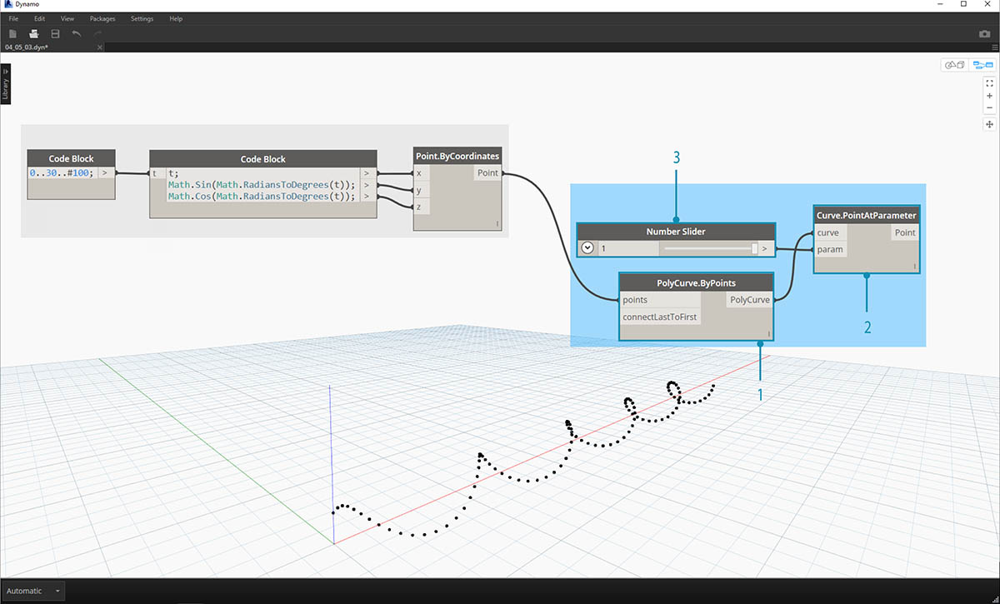
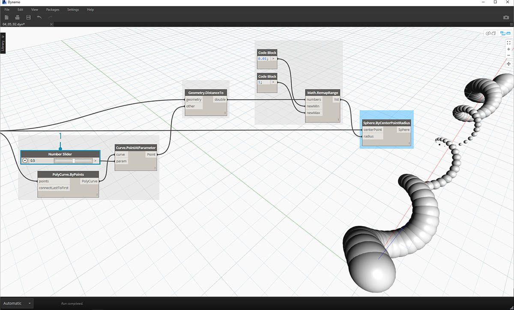
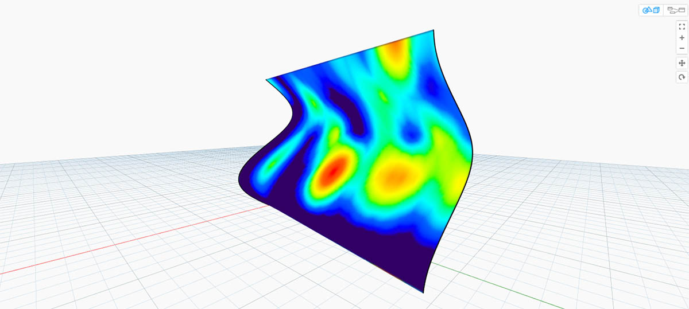
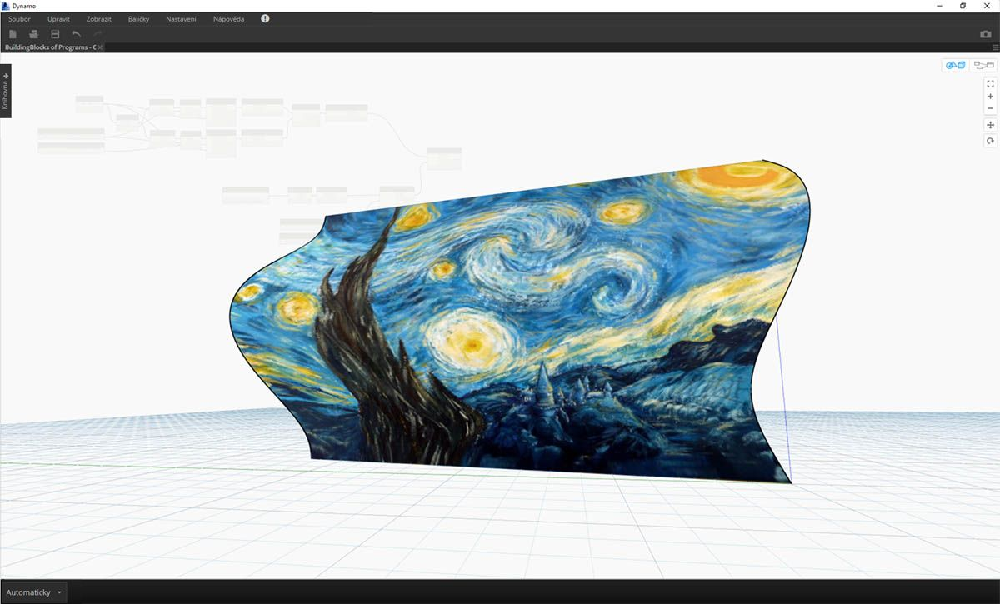

## Barva

Barva je skvělý datový typ k tvorbě působivých vizuálních prvků a k rozlišení částí výstupu ve vizuálním programu. Při práci s abstraktními daty a proměnlivými čísly je někdy obtížné zjistit, co se do jaké míry mění. Toto je skvělé využití pro barvy.

### Tvorba barev

Barvy v aplikaci Dynamo jsou tvořeny pomocí vstupů ARGB. To odpovídá kanálům Alfa, Červená, Zelená a Modrá. Alfa představuje *průhlednost* barvy, zatímco ostatní tři se používají jako primární barvy k tvorbě celého spektra barev.

|Ikona|Název|Syntaxe|Vstupy|Výstupy|
| -- | -- | -- | -- | -- |
||Barva ARGB|Color.ByARGB|A,R,G,B|barva|

### Dotazování se na hodnoty barev

Barvy v níže uvedené tabulce se dotazují na vlastnosti, které se používají k definování barvy: Alfa, Červená, Zelená a Modrá. Všimněte si, že uzel Color.Components nám předá všechny čtyři kanály v samostatných výstupech, což je lepší k dotazování vlastností barvy.

|Ikona|Název|Syntaxe|Vstupy|Výstupy|
| -- | -- | -- | -- | -- |
||Abecední|Color.Alpha|barva|A|
||Červená|Color.Red|barva|R|
||Zelená|Color.Green|barva|G|
||Modrá|Color.Blue|barva|B|
||Komponenty|Color.Components|barva|A,R,G,B|

Barvy v tabulce níže odpovídají **barevnému prostoru HSB**. Rozdělení barvy na odstín, sytost a jas je pravděpodobně intuitivnější pro interpretaci barvy: Jaká barva by to měla být? Jak moc sytá má být? A jak moc světlá, či tmavá má být? Toto je rozbor odstínu, respektive sytosti, respektive jasu.

|Ikona|Název dotazu|Syntaxe|Vstupy|Výstupy|
| -- | -- | -- | -- | -- |
||Odstín|Color.Hue|barva|Odstín|
||Sytost|Color.Saturation|barva|Sytost|
||Jas|Color.Brightness|barva|Jas|

### Rozsah barev

Rozsah barev je podobný uzlu **Remap Range** z části 4.2: přemapuje seznam čísel do jiné domény. Místo mapování do *číselné* domény však mapuje *barevný gradient* podle vstupních čísel v rozsahu od 0 do 1.

Aktuální uzel funguje dobře, pokud však všechno začne fungovat napoprvé, něco je zřejmě špatně. Nejlepší způsob, jak se s barevným gradientem seznámit, je provést interaktivní test. Nyní provedeme rychlé cvičení a probereme, jak nastavit gradient s výstupními barvami odpovídajícími číslům.

> 1. **Definujte tři barvy: ** Pomocí uzlu bloku kódu definujte *červenou, zelenou* a *modrou* zadáním příslušných kombinací hodnot *0* a *255*.
2. **Vytvořte seznam:** Slučte tři barvy do jednoho seznamu.
3. **Definujte indexy: ** Vytvořte seznam k definování umístění uzlů jednotlivých barev (v rozsahu od 0 do 1). Všimněte si, že u zelené barvy je hodnota 0,75. Tímto se zelená barva umístí do 3/4 přes vodorovný gradient na posuvníku rozsahu barev.
4. **Blok kódu: ** Zadejte hodnoty (mezi 0 a 1), které chcete převést na barvy.

### Náhled barvy

Uzel **Display.ByGeometry** umožňuje vybarvit geometrii ve výřezu aplikace Dynamo. Toto je užitečné při oddělení různých typů geometrie, předvedení parametrické koncepce nebo definování legendy analýzy pro simulaci. Vstupy jsou jednoduché: geometrie a barva. Vstup barev je za účelem vytvoření gradientu jako na obrázku výše připojen k uzlu **color range**.

### Cvičení s barvami

> Stáhněte si vzorový soubor, který je přiložen k tomuto cvičení (klikněte pravým tlačítkem a vyberte příkaz „Uložit odkaz jako...“): [Building Blocks of Programs – Color.dyn](datasets/4-5/Building Blocks of Programs - Color.dyn). Úplný seznam vzorových souborů naleznete v dodatku.

Toto cvičení je zaměřeno na parametrické řízení barvy rovnoběžně s geometrií. Geometrie je základní šroubovice, kterou níže definujeme pomocí **bloku kódu** (3.2.3). Jedná se o rychlý a snadný způsob tvorby parametrické funkce; vzhledem k tomu, že se soustředíme na barvu (místo geometrie), můžeme efektivně vytvořit šroubovici pomocí bloku kódu, aniž by došlo k zaplnění kreslicí plochy. K čím složitějším materiálům se příručka Primer dostane, tím častěji se bude používat blok kódu.

> 1. **Blok kódu:** Definujte dva bloky kódu s výše uvedenými vzorci. Toto je rychlá parametrická metoda tvorby spirály.
2. **Point.ByCoordinates:** Připojte tři výstupy z bloku kódu k souřadnicím uzlu.

Nyní je vidět pole bodů tvořících šroubovici. Dalším krokem je tvorba křivky procházející body, aby bylo možné vizualizovat šroubovici.

> 1. **PolyCurve.ByPoints:** Připojte výstup *Point.ByCoordinates* ke vstupu *points* u uzlu. Vznikne šroubovitá křivka.
2. **Curve.PointAtParameter:** Připojte výstup *PolyCurve.ByPoints* ke vstupu *curve*. Účelem tohoto kroku je vytvořit parametrický bod atraktoru, který se posouvá podél křivky. Vzhledem k tomu, že křivka vyhodnocuje bod v parametru, bude nutné zadat hodnotu *param* v rozmezí od 0 do 1.
3. **Posuvník čísel:** Po přidání na kreslicí plochu změňte hodnotu *min* na *0,0*, hodnotu *max* na *1,0* a hodnotu *step* na *,01*. Připojte výstup posuvníku ke vstupu *param* u uzlu *Curve.PointAtParameter*. Nyní je vidět bod podél délky šroubovice, který je vyjádřen procentem posuvníku (0 v počátečním bodě, 1 v koncovém bodě).

Po vytvoření referenčního bodu nyní porovnáme vzdálenost od referenčního bodu k původním bodům, čímž se definuje šroubovice. Tato hodnota vzdálenosti bude řídit geometrii i barvu.

> 1. **Geometry.DistanceTo:** Připojte výstup *Curve.PointAtParameter* ke *vstupu*. Připojte uzel *Point.ByCoordinates* ke vstupu *geometry.
2. **Watch:** Výsledný výstup zobrazuje seznam vzdáleností od každého bodu šroubovice k referenčnímu bodu podél křivky.

Dalším krokem je řízení parametrů pomocí seznamu vzdáleností od bodů šroubovice k referenčnímu bodu. Pomocí těchto hodnot vzdáleností se definují poloměry řady koulí podél křivky. Aby se koule udržely ve vhodné velikosti, je nutné *přemapovat* hodnoty vzdálenosti.

> 1. **Math.RemapRange:** Připojte výstup *Geometry.DistanceTo* ke vstupu čísel.
2. **Blok kódu:** připojte blok kódu s hodnotou *0,01* ke vstupu *newMin* a blok kódu s hodnotou *1* ke vstupu *newMax*.
3. **Watch:** Připojte výstup *Math.RemapRange* k jednomu uzlu a výstup *Geometry.DistanceTo* k jinému. Porovnejte výsledky.

V tomto kroku došlo k přemapování seznamu vzdáleností do menšího rozsahu. Hodnoty *newMin* a *newMax* je možné upravit, je však vidět lícování. Hodnoty se přemapují a budou mít stejný *poměr rozložení* v rámci celé domény.

> 1. **Sphere.ByCenterPointRadius:** Připojte výstup *Math.RemapRange* ke vstupu *radius* a původní výstup *Point.ByCoordinates* připojte ke vstupu *centerPoint*.

> 1. **Posuvník čísel:** Změňte hodnotu posuvníku čísel a sledujte, jak se aktualizuje velikost koulí. Nyní máme parametrický objekt jig.

Velikost koulí ukazuje parametrické pole definované referenčním bodem podél křivky. Použijeme stejnou koncepci u poloměru koule, abychom mohli řídit jejich barvu.

> 1. **Color Range:** Přidejte horní část kreslicí plochy. Při přejetí kurzoru nad vstupem *value* si všimněte, že požadovaná čísla jsou v rozsahu 0 až 1. Čísla z výstupu *Geometry.DistanceTo* je nutné přemapovat, aby byla kompatibilní s touto doménou.
2. **Sphere.ByCenterPointRadius:** V tuto chvíli vypněte náhled u tohoto uzlu (*Klikněte pravým tlačítkem > Náhled*)

> 1. **Math.RemapRange:** Tento proces by vám měl být známý. Připojte výstup *Geometry.DistanceTo* ke vstupu čísel.
2. **Blok kódu:** Podobně jako v předchozím kroku vytvořte hodnotu *0* pro vstup *newMin* a hodnotu *1* pro zadání *newMax*. Všimněte si, že v tomto případě je možné definovat dva výstupy z jednoho bloku kódu.
3. **Color Range:** Připojte výstup *Math.RemapRange* ke vstupu *value*.

> 1. **Color.ByARGB:** Toto je akce, pomocí které se vytvoří dvě barvy. I přesto, že tento proces může vypadat neobvykle, je stejný jako u barev RGB v jiném softwaru, jen se přitom využije vizuální programování.
2. **Blok kódu:** Vytvořte dvě hodnoty *0* a *255*. Připojte dva výstupy ke dvěma vstupům *Color.ByARGB* podle výše uvedeného obrázku (případně vytvořte jakékoli dvě požadované barvy).
3. **Color Range:** Vstup *colors* vyžaduje seznam barev. Tento seznam je potřeba vytvořit ze dvou barev vytvořených v předchozím kroku.
4. **List.Create:** Slučte dvě barvy do jednoho seznamu. Připojte výstup ke vstupu *colors* u uzlu *Color Range*.

> 1. **Display.ByGeometryColor:** Připojte položku *Sphere.ByCenterPointRadius* ke vstupu *geometry* a uzel *Color Range* připojte ke vstupu *color*. Nyní máme hladký gradient v celé doméně křivky.

> Pokud se změní hodnota *posuvníku čísel* z dřívějšího místa v definici, barvy a velikosti se aktualizují. V tomto případě spolu barvy a velikost poloměru přímo souvisí: nyní existuje vizuální propojení mezi dvěma parametry.

### Barva na površích

Uzel **Display.BySurfaceColor** umožňuje mapovat data po celém povrchu pomocí barvy. Tato funkce nabízí určité zajímavé možnosti vizualizace dat obdržených přes diskrétní analýzu, jako je analýza slunečného světla, energetická analýza a analýza blízkosti. Použití barvy na povrch v aplikaci Dynamo je podobné jako použití textury na materiál v jiných prostředích CAD. Krátké cvičení níže znázorňuje použití tohoto nástroje.

### Cvičení barev na površích

> Stáhněte si vzorový soubor, který je přiložen k tomuto cvičení (klikněte pravým tlačítkem a vyberte příkaz „Uložit odkaz jako...“): [Building Blocks of Programs – ColorOnSurface.zip](datasets/4-5/BuildingBlocks of Programs - ColorOnSurface.zip). Úplný seznam vzorových souborů naleznete v dodatku.

> Nejprve je třeba vytvořit (nebo odkázat) povrch, který se použije jako vstup pro uzel **Display.BySurfaceColor**. V tomto příkladu se šablonuje mezi křivkami sinu a kosinu.

> 1. Tato **skupina** uzlů vytváří body podél osy Z a poté je posunuje podle sinových a kosinových funkcí. Pomocí dvou seznamů bodů se poté vygenerují křivky NURBS.
2. **Surface.ByLoft**: Vygenerujte interpolovaný povrch mezi křivkami NURBS v seznamu.

> 1. **Cesta k souboru**: Vyberte soubor obrázku, který se bude vzorkovat pro následná data pixelů.
2. Pomocí uzlu **File.FromPath** převeďte cestu k souboru na soubor a poté jej předejte do uzlu **Image.ReadFromFile**. Tím vytvoříte obrázek pro vzorkování.
3. **Image.Pixels**: Zadejte obrázek a zadejte hodnotu vzorku, která se má použít ve směru rozměrů X a Y obrázku.
4. **Posuvník**: Zadejte hodnoty vzorků pro uzel **Image.Pixels**
5. **Display.BySurfaceColor**: Namapujte pole hodnot barev přes celý povrch podél směru X, respektive Y.

> Podrobný náhled výstupního povrchu s rozlišením 400x300 vzorků.

