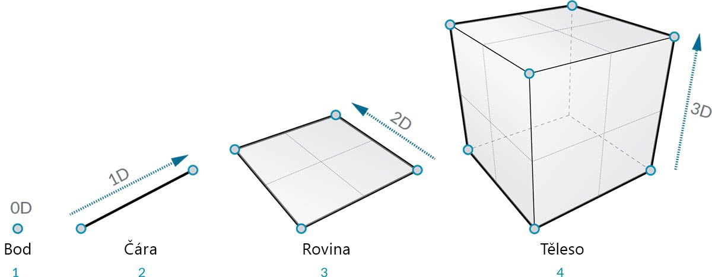
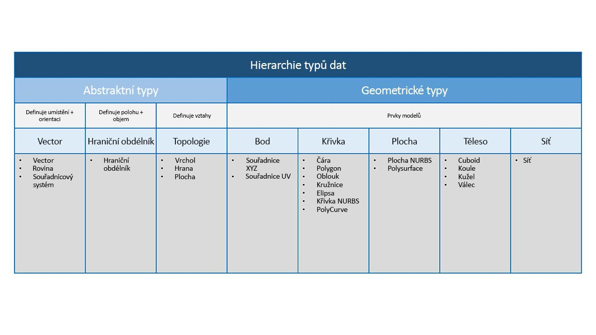

## Přehled geometrie
**Geometrie** je jazyk designu. Pokud má programovací jazyk nebo prostředí geometrické jádro, můžeme odemknout možnosti navrhování přesných a robustních modelů, automatizaci návrhových procedur a vytváření iterací návrhů pomocí algoritmů.

### Základy
Geometrie je tradičně definována jako studium tvaru, velikosti, relativní polohy tvarů a vlastností prostoru. Toto pole má bohatou historii sahající tisíce let. S příchodem a popularizací počítače jsme získali mocný nástroj pro definování, zkoumání a generování geometrie. Nyní je tak snadné vypočítat výsledek složitých geometrických interakcí, že téměř nevnímáme, že to děláme.

> Pokud chcete zjistit, jak může být diverzní a složitá geometrie využívána silou vašeho počítače, proveďte rychlé webové vyhledávání Stanford Bunny – kanonického modelu použitého k testování algoritmů.

Pochopení geometrie v kontextu algoritmů, výpočtů a složitosti může znít náročně. Existuje však několik klíčových a poměrně jednoduchých zásad, které můžeme stanovit jako základ pro zahájení tvorby pokročilejších aplikací:

1. Geometrie jsou **data** – pro počítač a aplikaci Dynamo se zajíček neliší od čísla.
2. Geometrie je založena na **abstrakci** – v zásadě jsou geometrické prvky popsány čísly, vztahy a vzorci v daném prostorovém souřadnicovém systému
3. Geometrie má **hierarchii** – body se spojí, aby se vytvořily úsečky, úsečky se spojí, aby se vytvořily povrchy, a tak dále
4. Geometrie současně popisuje **součást i celek** – když máme křivku, je to jak tvar i všechny možné body podél ní

V praxi tyto zásady znamenají, že je nutné vědět, s čím pracujeme (jaký typ geometrie, jak byla vytvořena, atd.) abychom mohli plynule sestavovat, rozebírat a znovu seskupovat různé geometrie při vývoji složitějších modelů.

### Procházení hierarchií
Věnujme chvíli času sledování vztahu mezi abstraktním a hierarchickým popisem geometrie. Protože tyto dva koncepty spolu souvisí, ale ne vždy zjevně, můžeme se rychle dostat do koncepčních problémů, jakmile začneme vyvíjet hlubší pracovní postupy nebo modely. Pro začátek používáme dimenzionalitu jako jednoduchý popis toho, co vytváříme. Počet kót potřebných k popisu tvaru nám dává vědět, jak je Geometrie uspořádána hierarchicky.

> 1. **Bod** (definovaný souřadnicemi) nemá žádné kóty – jsou to jen čísla popisující jednotlivé souřadnice
2. **Úsečka** (definovaná dvěma body) má nyní *jednu* kótu – úsečku lze „procházet“ dopředu (kladný směr), nebo dozadu (záporný směr)
3. **Rovina** (definovaná dvěma úsečkami) má *dvě* kóty – nyní je možné procházet i vlevo a vpravo
4. **Kvádr** (definovaný dvěma rovinami) má *tři* kóty – můžeme definovat polohu vzhledem ke směru nahoru nebo dolů

Dimenzionalita je pohodlný způsob, jak začít kategorizovat geometrii, ale nemusí být nutně nejlepší. Nakonec, nemodelujeme jen body, čáry, roviny a kvádry – co když chci něco s křivkami? Dále existuje celá další kategorie geometrických typů, které jsou zcela abstraktní a definují vlastnosti, například orientaci, objem nebo vztahy mezi součástmi. Nemůžeme uchopit vektor, tak jak ho definujeme vzhledem k tomu, co vidíme v prostoru? Podrobnější kategorizace geometrické hierarchie by měla rozlišovat rozdíl mezi abstraktními typy nebo „pomocnými objekty“, z nichž každý můžeme seskupovat podle toho, s čím pomáhají, a typy, které pomáhají popisovat tvar prvků modelu.

### Geometrie v aplikaci Dynamo Sandbox

Co to znamená pro používání aplikace Dynamo? Pochopení typů geometrie a způsobu jejich vztahů nám umožní procházet kolekci **Geometry Nodes**, která je pro nás v knihovně k dispozici. Uzly geometrie jsou uspořádány abecedně a ne hierarchicky – zde jsou zobrazeny podobně jako jejich rozvržení v rozhraní aplikace Dynamo.

Navíc by se vytváření modelů v aplikaci Dynamo a připojení náhledu toho, co vidíme v náhledu pozadí, k toku dat v grafu mělo časem stát více intuitivní.

> 1. Všimněte si předpokládaného souřadnicového systému vykresleného pomocí rastru a barevných os
3. Vybrané uzly rendrují odpovídající geometrii (pokud uzel vytvoří geometrii) na pozadí, přičemž barva zvýraznění je stejná

> Stáhněte si vzorový soubor, který doprovází tento obrázek (klikněte pravým tlačítkem a vyberte příkaz Uložit odkaz jako...): [Geometry for Computational Design - Geometry Overview.dyn](datasets/5-1/Geometry for Computational Design - Geometry Overview.dyn). Úplný seznam vzorových souborů najdete v dodatku.

### Další práce s geometrií
Vytváření modelů v aplikaci Dynamo není omezeno na to, co lze vytvořit pomocí uzlů. Zde jsou některé klíčové způsoby, jak posunout práci s geometrií na vyšší úroveň:

1. Aplikace Dynamo umožňuje importovat soubory – zkuste použít soubor CSV pro mračna bodů nebo soubor SAT pro načtení povrchů
2. Při práci s aplikací Revit můžeme odkazovat na prvky aplikace Revit, které se mají použít v aplikaci Dynamo
3. Nástroj Dynamo Package Manager nabízí další funkce pro rozšířené typy geometrie a operace – podívejte se do balíčku [Mesh Toolkit](https://github.com/DynamoDS/Dynamo/wiki/Dynamo-Mesh-Toolkit).

