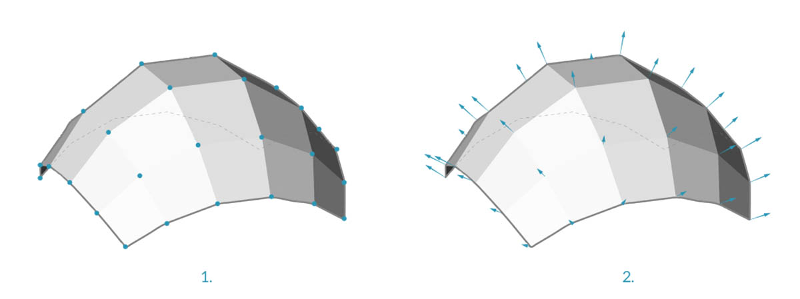
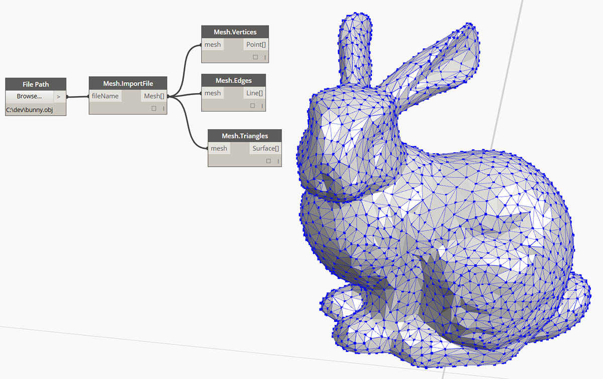

## Sítě

V oblasti výpočetního modelování jsou sítě jednou z nejvhodnějších forem reprezentujících 3D geometrii. Geometrie sítě může být lehká a flexibilní alternativa práce s NURBS a sítě se používají ve všech případech od rendrování a vizualizací až po digitální výrobu a 3D tisk.

### Co je síť?

Síť je kolekce čtyřúhelníků a trojúhelníků, které představují geometrii povrchu nebo tělesa. Podobně jako u těles zahrnuje struktura objektu sítě vrcholy, hrany a plochy. Další vlastnosti, které činí sítě jedinečnými, například normály, jsou také jedinečné.


> 1. Vrcholy sítě
2. Hrany sítě *Hrany pouze s jednou sousední plochou se nazývají „Nahé“. Všechny ostatní hrany jsou „Oblečené“.
3. Plochy sítě

### Prvky sítě

Aplikace Dynamo definuje sítě pomocí datové struktury vrcholu plochy. Na základní úrovni je tato struktura jednoduchou kolekcí bodů, které jsou seskupeny do polygonů. Body sítě se nazývají vrcholy, zatímco polygony podobné povrchu se nazývají plochy. K vytvoření sítě je potřeba seznam vrcholů a systém seskupení těchto vrcholů do plochy nazývané skupina indexů.


> 1. Seznam vrcholů
2. Seznam indexových skupin pro definování ploch

#### Vrcholy + normály vrcholů

Vrcholy sítě jsou jednoduše seznam bodů. Index vrcholů je velmi důležitý při vytváření sítě nebo při získávání informací o struktuře sítě. Pro každý vrchol existuje také odpovídající normála vrcholu (vektor), která popisuje průměrný směr připojených ploch, a pomáhá nám pochopit „vnitřní“ a „vnější“ orientaci sítě.



> 1. Vrcholy
2. Normály vrcholu

#### Plochy

Plocha je uspořádaný seznam tří nebo čtyř vrcholů. Reprezentace „povrchu“ plochy sítě je proto implikována podle polohy indexovaných vrcholů. Seznam vrcholů, které tvoří síť, již máme. Místo toho, aby jednotlivé body definovaly plochu, jednoduše použijeme index vrcholů. To nám také umožňuje použít stejný vrchol ve více než jedné ploše.


> 1. Čtyřhranná plocha vytvořená pomocí indexů 0, 1, 2 a 3
2. Trojúhelníková plocha vytvořená pomocí indexů 1, 4 a 2 Všimněte si, že indexové skupiny lze posunout v jejich pořadí – pokud je posloupnost seřazena proti směru hodinových ručiček, bude plocha správně definována

### Sítě versus povrchy NURBS

Jak se liší geometrie sítě od geometrie NURBS? Kdy můžete chtít použít jedno místo druhého?

#### Parametrizace

V předchozí kapitole jsme viděli, že povrchy NURBS jsou definovány řadou křivek NURBS, které se pohybují ve dvou směrech. Tyto směry jsou označeny ```U``` a ```V``` a umožňují parametrizaci povrchu NURB podle dvourozměrné povrchové domény. Samotné křivky jsou uloženy jako rovnice v počítači, takže výsledné povrchy lze vypočítat na libovolně velkou přesnost. Může být však obtížné spojit několik povrchů NURBS dohromady. Spojením dvou povrchů NURBS vznikne polypovrch, kde různé části geometrie budou mít různé parametry UV a definice křivek.


> 1. Povrch
2. Křivka Isoparametric (Isoparm)
3. Řídicí bod povrchu
4. Řídicí polygon povrchu
5. Izoparametrický bod
6. Povrch rámu
7. Síť
8. Nahá hrana
9. Síť sítě
10. Hrany sítě
11. Normála vrcholu
12. Plocha sítě / Normála plochy sítě

Sítě se naopak skládají z diskrétního počtu přesně definovaných vrcholů a ploch. Síť vrcholů obecně nelze definovat pomocí jednoduchých souřadnic ```UV``` a protože jsou plochy diskrétní, je množství přesnosti zabudováno do sítě a lze je změnit pouze zjemněním sítě a přidáním dalších ploch. Díky nedostatku matematických popisů mohou sítě pružněji zpracovávat složité geometrie v rámci jediné sítě.

### Místní versus globální vliv

Dalším důležitým rozdílem je rozsah, ve kterém místní změna v geometrii sítě nebo NURBS ovlivňuje celý tvar. Přesun jednoho vrcholu sítě ovlivní pouze plochy, které sousedí s daným vrcholem. V površích NURBS je rozsah vlivu složitější a závisí na stupni povrchu a také na váhách a uzlech řídicích bodů. Obecně platí, že přesunutím jednoho řídicího bodu v povrchu NURBS dojde k hladší a rozsáhlejší změně geometrie.


> 1. Povrch NURBS – přesun řídicího bodu má vliv napříč celým tvarem
2. Geometrie sítě – přesun vrcholu má vliv pouze na přilehlé prvky

Jedna podoba, která může být užitečná, je porovnání vektorového obrázku (složeného z úseček a křivek) s rastrovým obrázkem (složeným z jednotlivých pixelů). Při přiblížení vektorového obrázku zůstanou křivky ostré a jasné, zatímco přiblížení rastrového obrázku má za následek zvětšení jednotlivých pixelů. V této analogii lze povrchy NURBS porovnat s vektorovým obrázkem, protože existuje hladký matematický vztah, zatímco síť se chová podobně jako rastrový obrázek s nastaveným rozlišením.

### Sada nástrojů pro sítě

Možnosti sítě aplikace Dynamo lze rozšířit instalací balíčku [Sada nástrojů sítí](https://github.com/DynamoDS/Dynamo/wiki/Dynamo-Mesh-Toolkit). Sada nástrojů sítí aplikace Dynamo poskytuje nástroje pro import sítí z externích formátů souborů, vytvoření sítě z objektů geometrie aplikace Dynamo a ruční vytvoření sítí pomocí jejich vrcholů a indexů. Knihovna také poskytuje nástroje k úpravám sítí, opravě sítí nebo extrahování horizontálních řezů pro použití ve výrobě.

Příklad použití sady nástrojů sítí najdete v kapitole 10.2.



