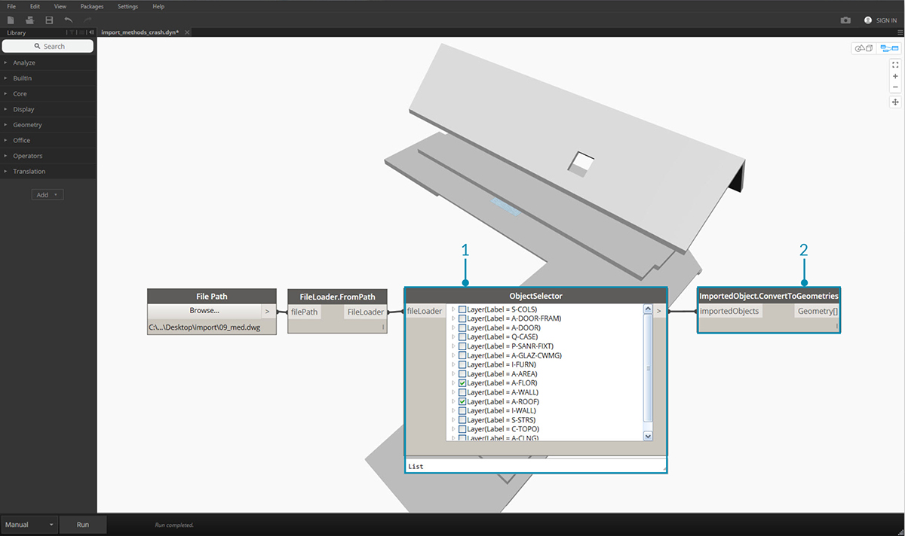

## Importování geometrie

Geometrii lze do aplikace Dynamo importovat několika způsoby. V předchozí části jsme demonstrovali importování sítí pomocí *sady nástrojů pro sítě* – je možné importovat také modely těles ze souborů .SAT. Díky tomu lze vyvinout geometrii na jiné platformě, načíst ji do aplikace Dynamo a použít na ni parametrické operace pomocí vizuálního programování.

Další metoda pro importování geometrie používá proces nazvaný *Překlad ATF*. V tomto případě je možné importovat nejen geometrii, ale celou strukturu souborů. Například lze určit, které hladiny ze souboru .DWG se mají importovat, aniž by bylo nutné importovat celý model. Tento postup bude podrobněji demonstrován níže.

### Importování geometrie ze souboru DWG

Uzly pro importování souborů DWG do prostředí aplikace Dynamo se nacházejí na kartě *Překlad* (Poznámka: tyto nástroje jsou k dispozici pouze v aplikaci [Dynamo Studio](http://www.autodesk.com/products/dynamo-studio/overview)). Následující příklady ukazují komponenty pro nalezení souboru, importování jeho obsahu a jeho převod na použitelnou geometrii aplikace Dynamo. Aplikace Dynamo také umožňuje filtrovat a vybrat určité objekty k importování ze souboru DWG – viz níže. Další informace o importování geometrie ze souboru DWG naleznete v [příspěvku na blogu Bena Goh](http://dynamobim.org/dwg-import-in-dynamo-studio-0-9-1/).

### Načtení importovaných objektů

Nejjednodušším způsobem, jak importovat soubor DWG do aplikace Dynamo Studio, je import celého souboru na pracovní plochu:

> 1. Pomocí komponenty cesty k souboru vyhledejte soubor DWG k importování do aplikace Dynamo.
2. Připojte ji k uzlu **FileLoader.FromPath**, čímž soubor načtete.
3. Pomocí komponenty **FileLoader.GetImportedObjects** načtěte geometrii do aplikace Dynamo Studio.
4. Uzel **ImportedObject.ConvertToGeometries** převede objekty na použitelnou geometrii na pracovní ploše aplikace Dynamo.

Jak je znázorněno na obrázku výše, do aplikace Dynamo jsou importovány všechny typy geometrií v souboru DWG – plochy, sítě, křivky a čáry.

### Filtr objektů

Chcete-li určit, které geometrie ze souboru DWG budou importovány, můžete přidat další uzly **ObjectFilter**. Uzel **ObjectFilter** je kompatibilní s uzlem **FileLoader** nebo se seznamem objektů **ImportedObject** a jeho výstupem je seznam objektů **ImportedObject**.

Na následujících obrázcích jsou znázorněny podmíněné výrazy v uzlech **ObjectFilter**. Všechny objekty **ImportedObject**, které splňují některou z uvedených podmínek, projdou filtrem. Filtrování lze nastavit podle popisku hladiny (tj. názvu hladiny), typu geometrie, barvy atd., a lze jej použít spolu s dalšími filtry ke zpřesnění výběru.

> 1. Nahraďte uzel **FileLoader.GetImportedObjects** uzlem **ObjectFilter**, který vám umožní vyhledat určité podmínky v souboru DWG. – v tomto případě bude importována pouze geometrie plochy, čímž se odeberou všechny křivky a čáry z předchozího obrázku.
2. Připojte filtr k uzlu **ImportedObject.ConvertToGeometries**, čímž vyfiltrovanou geometrii importujete.

Přidáním dvou filtrů s různými podmínkami můžete seznam geometrií rozdělit do více toků:

> 1. Nahraďte uzel **FileLoader.GetImportedObjects** dvěma uzly **ObjectFilter** s různými podmínkami. Tím se geometrie z jednoho souboru rozdělí na dva různé toky.
2. Připojte filtr k uzlu **ImportedObject.ConvertToGeometries**, čímž vyfiltrovanou geometrii importujete.
3. Připojte uzel **ImportedObject.ConvertToGeometries** k uzlu **Display.ByGeometryColor**, který jednotlivé toky obarví různými barvami.

### Explicitní výběr objektů

Uzel **ObjectSelector** nabízí alternativní způsob, jak importovat objekty ze souboru DWG. Tato metoda na rozdíl od filtrů umožňuje vybrat konkrétní objekty a hladiny k importování do aplikace Dynamo.

> 1. Nahraďte uzel **FileLoader.GetImportedObjects** uzlem **ObjectSelector**, který vám umožní vybrat konkrétní hladiny a objekty ze souboru DWG.
2. Připojte filtr k uzlu **ImportedObject.ConvertToGeometries**.

