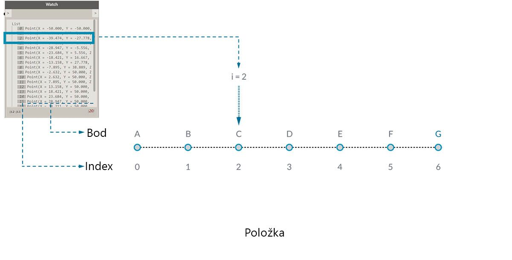
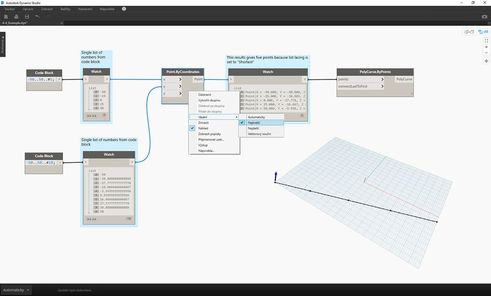
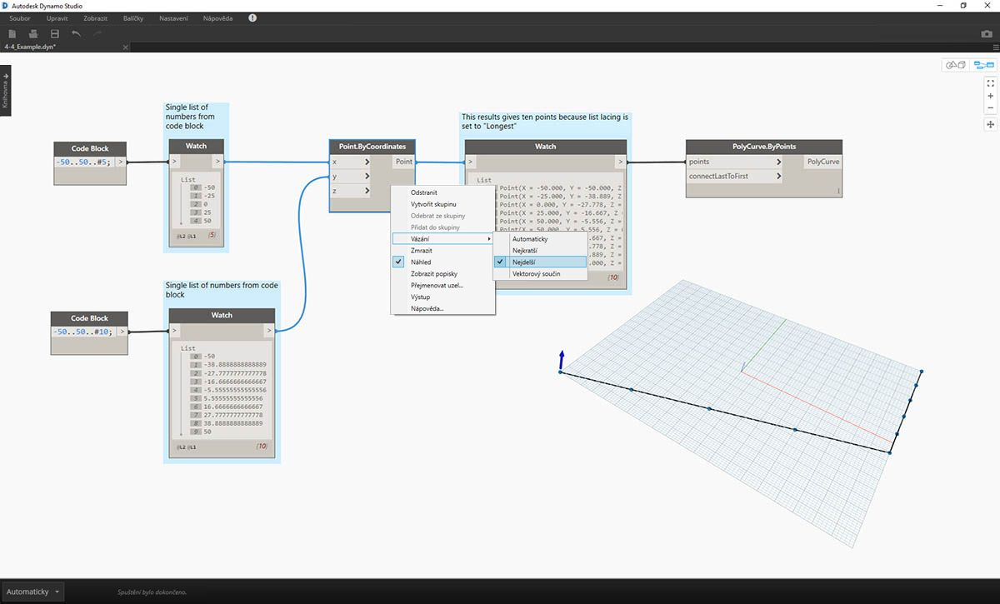
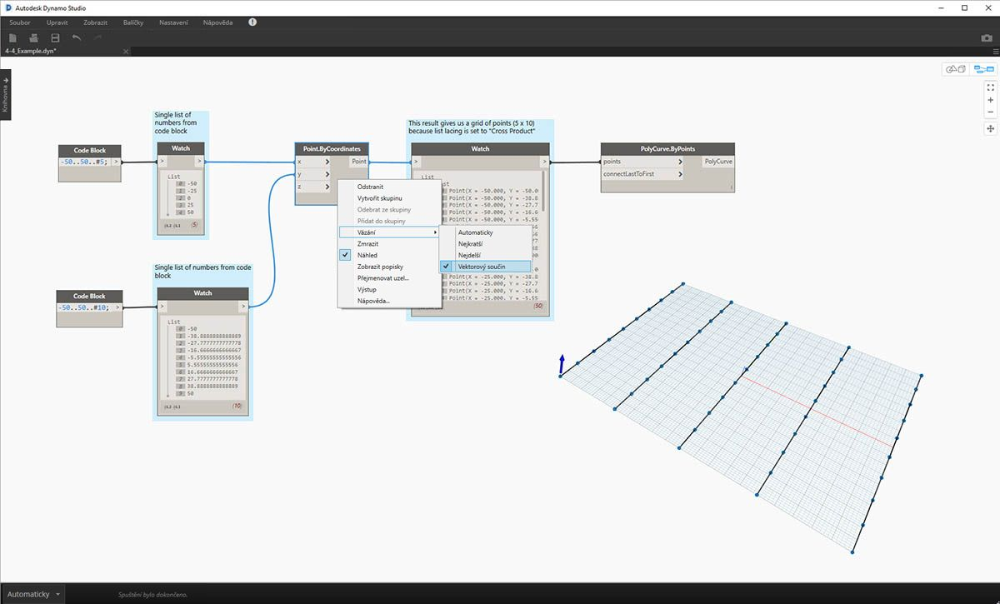

## Co je to seznam?

Seznam je kolekce prvků nebo položek. Vezměte si například trs banánů. Každý banán je položka v seznamu (nebo v trsu). Je jednodušší sebrat celý trs banánů, než brát každý banán jednotlivě, a to samé platí pro seskupení prvků podle parametrických vztahů v datové struktuře.

> Autor fotografie: [Augustus Binu](https://commons.wikimedia.org/wiki/File:Bananas_white_background_DS.jpg?fastcci_from=11404890&c1=11404890&d1=15&s=200&a=list).

Při nákupu potravin naskládáme všechny zakoupené položky do tašky. Tato taška je také seznam. Pokud chceme vyrobit banánový chléb, potřebujeme 3 trsy banánů (chceme vyrobit *hodně* banánového chleba). Taška představuje seznam trsů banánů a každý trs představuje seznam banánů. Taška je seznam seznamů (dvourozměrný) a banán je seznam (jednorozměrný).

V aplikaci Dynamo jsou data seznamu seřazena a první položka v každém seznamu má index „0“. Níže rozebereme způsob, jak v aplikaci Dynamo definovat seznamy a jak spolu více seznamů vzájemně souvisí.

## Nulové indexy

Jedna věc, která se může zdát podivnou, je, že první index seznamu je vždy 0, nikoli 1. Čili pokud je řeč o první položce seznamu, ve skutečnosti máme na mysli položku s indexem 0.

Pokud byste například měli spočítat prsty na pravé ruce, existuje šance, že byste napočítali od 1 do 5. Pokud byste však vložili prsty do seznamu, aplikace Dynamo by jim přiřadila index 0 až 4. Ačkoli se toto může zdát začátečníkům v programování velmi zvláštní, nulové indexy jsou ve většině výpočetních systémů běžnou praxí.

Všimněte si, že v seznamu stále máme 5 položek; je to proto, že seznam používá systém počítání od nuly. A položky uložené v seznamu nemusí být jen čísla. Mohou to být položky jakéhokoli datového typu, který aplikace Dynamo podporuje, například body, křivky, povrchy, rodiny atd.

Nejjednodušším způsobem, jak se je možné se dívat na datový typ uložený v seznamu je nejčastěji propojení uzlu Watch s výstupem jiného uzlu. Ve výchozím nastavení uzel Watch automaticky zobrazí všechny indexy na levé straně seznamu a data zobrazí vpravo.

Tyto indexy jsou velice důležitým prvkem při práci se seznamy.

### Vstupy a výstupy

Vstupy a výstupy náležející k seznamům se liší podle toho, jaký uzel aplikace Dynamo se použije. Jako příklad použijte seznam bodů a připojte tento výstup ke dvěma různým uzlům aplikace Dynamo: *PolyCurve.ByPoints* a *Circle.ByCenterPointRadius*:

> 1. Vstup *points* uzlu *PolyCurve.ByPoints* hledá strukturu *„Point[]“*. Tato struktura představuje seznam bodů.
2. Výstup uzlu *PolyCurve.ByPoints* je samostatný objekt PolyCurve vytvořený ze seznamu pěti bodů.
3. Vstup *centerPoint* uzlu *Circle.ByCenterPointRadius* žádá o objekt *„Point“*.
4. Výstup uzlu *Circle.ByCenterPointRadius* je seznam pěti kružnic, jejichž středy odpovídají původnímu seznamu bodů.

Vstupní data pro uzly *PolyCurve.ByPoints* a *Circle.ByCenterPointRadius* jsou stejná, uzel Polycurve však předává jeden objekt PolyCurve, zatímco uzel Circle předává 5 kružnic se středy v každém bodu. Je to intuitivní: Objekt PolyCurve je vykreslen jako křivka spojující 5 bodů, zatímco kružnice v každém bodu vytvářejí jinou kružnici. Co se tedy děje s daty?

Po přejetí kurzoru nad vstupem *points* uzlu *Polycurve.ByPoints* zjistíte, že vstup hledá strukturu *„Point[]“*. Všimněte si závorek na konci. To představuje seznam bodů a k vytvoření objektu PolyCurve je třeba na vstupu seznam pro každý objekt PolyCurve. Tento uzel proto zhušťuje každý seznam do jednoho objektu PolyCurve.

Na druhou stranu vstup *centerPoint* uzlu *Circle.ByCenterPointRadius* žádá objekt *„Point“*. Tento uzel hledá jeden bod jako položku k definování středu kružnice. Proto ze vstupních dat vznikne pět kružnic. Rozlišování těchto vstupů v aplikaci Dynamo vám pomůže pochopit, jak uzly při zpracování dat fungují.

### Vázání

Porovnávání dat je problém bez čistého řešení. Dochází k němu, pokud má uzel přístup různě velkým vstupům. Změna algoritmu porovnávání dat může vést k naprosto odlišným výsledkům.

Představte si uzel, který tvoří segmenty úseček mezi body (Line.ByStartPointEndPoint). Bude mít dva vstupní parametry, které oba předávají souřadnice bodů:

Jak vidíte, existují různé způsoby kreslení čar mezi těmito množinami bodů. Možnosti vázání naleznete po kliknutí pravým tlačítkem na střed uzlu a výběru nabídky „Vázání“.

### Základní soubor

> Stáhněte si vzorový soubor, který je přiložen k tomuto cvičení (klikněte pravým tlačítkem a vyberte příkaz „Uložit odkaz jako...“): [Lacing.dyn](datasets/6-1/Lacing.dyn). Úplný seznam vzorových souborů naleznete v dodatku.

Pomocí tohoto základního souboru znázorníme níže operace vázání tím, že definujeme nejkratší seznam, nejdelší seznam a vektorový součin.

> 1. U uzlu *Point.ByCoordinates* se změní vázání, ale nic jiného se u grafu výše nezmění.

#### Nejkratší seznam

Nejjednodušším způsobem je spojovat vstupy jedna ku jedné, dokud jeden z datových proudů nedojde na konec. Tomuto se říká algoritmus „Nejkratší seznam“. Jedná se o výchozí chování uzlů aplikace Dynamo:

> Změnou vázání na *nejkratší seznam* získáte základní diagonální čáru složenou z pěti bodů. Pět bodů je délka kratšího seznamu, takže vázání nejkratšího seznamu se zastaví, jakmile dorazí na konec jednoho ze seznamů.

#### Nejdelší seznam

Algoritmus „Nejdelší seznam“ připojuje vstupy a opakovaně využívá prvky tak dlouho, dokud všechny datové proudy nedojdou na konec:

> Změnou vázání na *nejdelší seznam* získáte diagonální čáru, která se vertikálně rozšíří. Poslední položka v seznamu 5 položek bude opakována tak dlouho, dokud nebude dosaženo délky delšího seznamu, což je stejné chování jako metoda koncepčního diagramu.

#### Vektorový součin

Metoda „Vektorový součin“ provede všechna možná připojení:

> Změnou vázání na *Vektorový součin* získáte všechny kombinace mezi všemi seznamy, což vytvoří osnovu bodů o rozměrech 5x10. Jedná se o datovou strukturu ekvivalentní k vektorovému součinu, jak je ukázáno v koncepčním diagramu výše, až na to, že data jsou nyní seznamy seznamů. Pokud připojíme objekt PolyCurve, uvidíme, že každý seznam je definovaný hodnotou X, což znamená, že máme řadu vertikálních čar.

