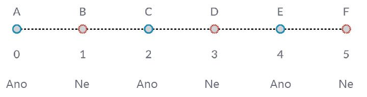

## Práce se seznamy

Teď, když jsme stanovili, co je to seznam, pojďme si promluvit o operacích, které s ním můžeme provádět. Představte si seznam jako balíček karet. Seznam je balíček a každá karta představuje položku.


> Autor fotografie: [Christian Gidlöf](https://commons.wikimedia.org/wiki/File:Playing_cards_modified.jpg)

Jaké **dotazy** ze seznamu vytvoříme? Tím získáte přístup k existujícím vlastnostem.

* Počet karet v balíčku? 52.
* Počet barev? 4.
* Materiál? Papír.
* Délka? 3,5" nebo 89 mm.
* Šířka? 2,5" nebo 64 mm.

Jaké **akce** můžeme se seznamem provést? Tím se změní seznam podle dané operace.

* Můžeme zamíchat balíček.
* Můžeme ho seřadit podle hodnot.
* Můžeme ho seřadit podle barev.
* Můžeme balíček rozdělit.
* Můžeme balíček rozdělit rozdáním karet.
* Můžeme z balíčku vybrat konkrétní kartu.

Všechny výše uvedené operace mají analogické uzly aplikace Dynamo pro práci se seznamy obecných dat. Níže uvedené lekce ukážou některé základní operace, které můžeme provádět na seznamech.

## Operace se seznamem

Obrázek níže je základní graf, který použijeme k demonstraci základních operací seznamu. Prozkoumáme, jak spravovat data v seznamu a jak prezentovat vizuální výsledky.

#### Cvičení – Operace se seznamem

> Stáhněte si vzorový soubor, který je přiložen k tomuto cvičení (klikněte pravým tlačítkem a vyberte příkaz Uložit odkaz jako...): [List-Operations.dyn](datasets/6-2/List-Operations.dyn). Úplný seznam vzorových souborů naleznete v dodatku.


> 1. Začněte s *blokem kódu* s hodnotou ```500;```
2. Zapojte vstup *x* uzlu *Point.ByCoordinates*.
3. Bod z předchozího kroku zadejte do vstupu počátku uzlu *Plane.ByOriginNormal*.
4. Pomocí uzlu *Circle.ByPlaneRadius* vložte uzel z předchozího kroku do vstupu roviny.
5. Pomocí *bloku kódu* určete hodnotu ```50;``` pro *poloměr*. Toto je první kruh, který vytvoříme.
6. Pomocí uzlu *Geometry.Translate* posuňte kružnici o 100 jednotek ve směru osy Z.
7. Pomocí uzlu *bloku kódu* definujte rozsah deseti čísel mezi 0 a 1 s tímto řádkem kódu: ```0..1..#10;```
8. Blok kódu můžete vložit z předchozího kroku do vstupu *param* dvou uzlů *Curve.PointAtParameter*. Přidejte hodnotu *Circle.ByPlaneRadius* do vstupu křivky horního uzlu a *Geometry.Translate* na vstup křivky uzlu pod ním.
9. Pomocí uzlů *Line.ByStartPointEndPoint* spojte dva uzly *Curve.PointAtParameter*.


> 1. Uzel *Watch3D* zobrazuje výsledky položky *Line.ByStartPointEndPoint*. Kreslíme čáry mezi dvěma kružnicemi, které představují základní operace se seznamem, a pomocí tohoto základního grafu aplikace Dynamo projdeme níže uvedenými akcemi v seznamu.

### List.Count


> Uzel *List.Count* je jednoduchý: spočítá počet hodnot v seznamu a vrátí dané číslo. Tento uzel je při práci se seznamy seznamů složitější, ale to si předvedeme v následujících částech.

#### Cvičení – List.Count

> Stáhněte si vzorový soubor, který je přiložen k tomuto cvičení (klikněte pravým tlačítkem a vyberte příkaz Uložit odkaz jako...): [List-Count.dyn](datasets/6-2/List-Count.dyn). Úplný seznam vzorových souborů naleznete v dodatku.


> 1. Uzel *List.Count* vrací počet řádků v uzlu *Line.ByStartPointEndPoint*. V tomto případě je hodnota 10, která souhlasí s počtem bodů vytvořených z původního uzlu *bloku kódu*.

### List.GetItemAtIndex


> *List.GetItemAtIndex* je základní způsob, jak dotazovat položku v seznamu. Na obrázku výše použijeme index *2* k dotazování na bod označený *C*.

#### Cvičení – List.GetItemAtIndex

> Stáhněte si vzorový soubor, který je přiložen k tomuto cvičení (klikněte pravým tlačítkem a vyberte příkaz Uložit odkaz jako...): [List-GetItemAtIndex.dyn](datasets/6-2/List-GetItemAtIndex.dyn). Úplný seznam vzorových souborů naleznete v dodatku.


> 1. Pomocí uzlu *List.GetItemAtIndex* vybereme index *0* nebo první položku v seznamu řádků.
2. Uzel *Watch3D* ukazuje, že jsme vybrali jednu čáru. Poznámka: Chcete-li zobrazit obrázek výše, ujistěte se, že jste vypnuli náhled *Line.ByStartPointEndPoint*.

### List.Reverse


> Možnost *List.Reverse* obrátí pořadí všech položek v seznamu.

#### Cvičení – List.Reverse

> Stáhněte si vzorový soubor, který je přiložen k tomuto cvičení (klikněte pravým tlačítkem a vyberte příkaz Uložit odkaz jako...): [List-Reverse.dyn](datasets/6-2/List-Reverse.dyn). Úplný seznam vzorových souborů naleznete v dodatku.


> 1. Chcete-li správně zobrazit obrácený seznam čar, vytvořte více čar změnou bloku kódu na ```0..1..#100;```
2. Vložte uzel *List.Reverse* mezi položky *Curve.PointAtParameter* a *Line.ByStartPointEndPoint* pro jeden ze seznamů bodů.
3. Uzly *Watch3D* zobrazují dva různé výsledky. První zobrazí výsledek bez obráceného seznamu. Čáry se připojují vertikálně k sousedním bodům. Obrácený seznam však spojí všechny body v opačném pořadí v druhém seznamu.

### List.ShiftIndices


> *List.ShiftIndices* je dobrý nástroj ke tvorbě zkroucení, šroubovicových vzorů nebo jiných podobných manipulací s daty. Tento uzel přemístí položky v seznamu do daného počtu indexů.

#### Cvičení – List.ShiftIndices

> Stáhněte si vzorový soubor, který je přiložen k tomuto cvičení (klikněte pravým tlačítkem a vyberte příkaz Uložit odkaz jako...): [List-ShiftIndices.dyn](datasets/6-2/List-ShiftIndices.dyn). Úplný seznam vzorových souborů naleznete v dodatku.


> 1. Stejným postupem jako při otáčení seznamu vložte *List.ShiftIndices* do polí *Curve.PointAtParameter* a *Line.ByStartPointEndPoint*.
2. Pomocí *bloku kódu* označte hodnotu *1* pro posunutí seznamu o jeden index.
3. Všimněte si, že změna je jemná, ale všechny čáry v dolním uzlu *Watch3D* se posunuly o jeden index při připojení k druhé sadě bodů.


> 1. Pokud například změníte hodnotu *bloku kódu* na větší, například *30*, všimneme si významného rozdílu mezi příčnými čarami. V tomto případě funguje posun jako čočka kamery, což vytváří v původní válcové formě otočení.

### List.FilterByBooleanMask



> Položka *List.FilterByBooleanMask* odebere určité položky podle seznamu logických hodnot nebo podle hodnot true nebo false.

#### Cvičení – List.FilterByBooleanMask

> Stáhněte si vzorový soubor, který je přiložen k tomuto cvičení (klikněte pravým tlačítkem a vyberte příkaz Uložit odkaz jako...): [List-FilterByBooleanMask.dyn](datasets/6-2/List-FilterByBooleanMask.dyn). Úplný seznam vzorových souborů naleznete v dodatku.


> Aby bylo možné vytvořit seznam hodnot true nebo false, je třeba ještě trochu pracovat...

> 1. Pomocí *bloku kódu* definujte výraz pomocí syntaxe: ```0..List.Count(list);```. Připojte uzel *Curve.PointAtParameter* ke vstupu *list*. Toto nastavení projdeme více v kapitole bloku kódu, ale v tomto případě nám řádek kódu poskytuje seznam reprezentující každý index uzlu *Curve.PointAtParameter*.
2. Pomocí uzlu *%* (modulo) spojte výstup *bloku kódu* se vstupem *x* a hodnotu *4* do vstupu *y*. Tak získáme zbytek po dělení seznamu indexů 4. Modulo je velmi užitečné pro vytváření vzorů. Všechny hodnoty budou možné zbytky po dělení 4: 0, 1, 2, 3.
3. Z uzlu *modulus* víme, že hodnota 0 znamená, že index je dělitelný 4 (0,4,8 atd.). Pomocí uzlu *==* můžeme testovat dělitelnost testováním proti hodnotě *0*.
4. Uzel *Watch* zobrazuje pouze toto: máme vzor s hodnotou true / false, který zní: *true, false, false, false...*.
5. Pomocí tohoto vzoru true/false připojte vstupní hodnotu masky dvou uzlů *List.FilterByBooleanMask*.
6. Spojte uzel *Curve.PointAtParameter* s každým vstupem seznamu pro *List.FilterByBooleanMask*.
7. Výstup *Filter.ByBooleanMask* čte hodnoty *in* a *out*. *In* představuje hodnoty, které měly hodnotu masky *true*, zatímco *out* představuje hodnoty, které měly hodnotu *false*. Zadáním výstupů *in* do vstupů *startPoint* a *endPoint* uzlu *Line.ByStartPointEndPoint* jsme vytvořili filtrovaný seznam čar.
8. Uzel *Watch3D* ukazuje, že máme méně čar než bodů. Vybrali jsme pouze 25 % uzlů filtrováním pouze hodnot true.

