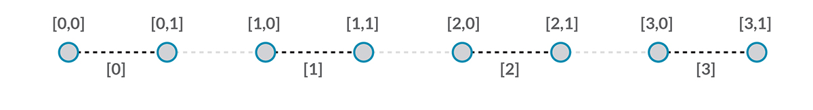
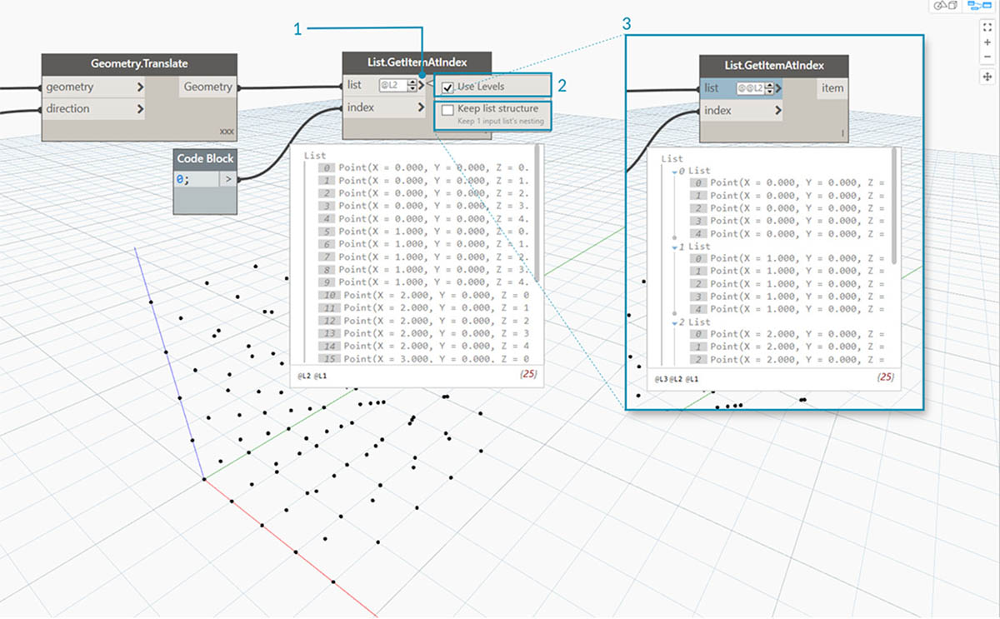
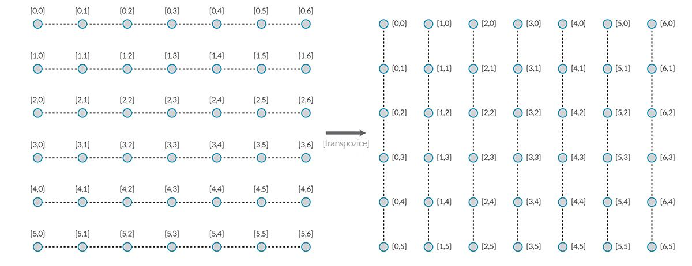
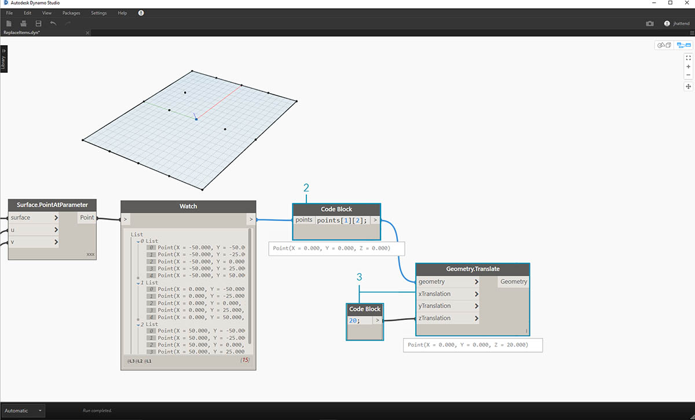

## Seznamy seznamů

Do hierarchie bude nyní přidána další vrstva. Pokud vezmeme sadu karet z původního příkladu a vytvoříme krabici, která obsahuje více sad, krabice nyní představuje seznam sad a každá sada představuje seznam karet. Tomuto se říká seznam seznamů. Analogie v této části vychází z toho, že níže uvedená červená krabice obsahuje seznam skupin mincí a každá skupina obsahuje seznam centů.


> Fotografii pořídil uživatel [Dori](https://commons.wikimedia.org/wiki/File:Stack_of_coins_0214.jpg).

Jaké **dotazy** můžeme u seznamu seznamů provádět? Díky tomuto bude možný přístup k existujícím vlastnostem.

* Počet typů mincí? 2.
* Hodnoty typů mincí? $0,01 a $0,25.
* Materiál čtvrťáků? 75 % měď a 25 % nikl.
* Materiál centů? 97,5 % zinek a 2,5 % mědi.

Jaké **akce** můžeme provést u seznamu seznamů? Tímto se změní seznam seznamů podle dané operace.

* Výběr konkrétního sloupku čtvrťáků nebo centů.
* Výběr konkrétního čtvrťáku nebo centu.
* Přeuspořádání sloupků čtvrťáků a centů
* Sloučení sloupků dohromady.

I zde aplikace Dynamo obsahuje analogický uzel pro každou z výše uvedených operací. Vzhledem k tomu, že pracujeme s abstraktními daty a ne s fyzickými objekty, potřebujeme sadu pravidel, která řídí pohyb nahoru a dolů v hierarchii dat.

Při práci se seznamy seznamů jsou data vrstvená a složitá, díky tomu však nastává příležitost provést skvělé parametrické operace. Níže uvedené lekce podrobně rozebírají základy a popisují několik dalších operací.

## Hierarchie shora dolů

Základní koncepce této části: **Aplikace Dynamo zpracovává seznamy jako objekty samy o sobě**. Tato hierarchie shora dolů se vyvíjí s ohledem na objektově orientované programování. Místo výběru dílčích prvků pomocí příkazu, například výrazem List.GetItemAtIndex, vybere aplikace Dynamo tento index v hlavním seznamu v datové struktuře. A tato položka může být i dalším seznamem. Následuje rozbor pomocí vzorového obrázku:

#### Cvičení – Hierarchie shora dolů

> Stáhněte si vzorový soubor, který je přiložen k tomuto cvičení (klikněte pravým tlačítkem a vyberte příkaz „Uložit odkaz jako...“): [Top-Down-Hierarchy.dyn](datasets/6-3/Top-Down-Hierarchy.dyn). Úplný seznam vzorových souborů naleznete v dodatku.


> 1. Pomocí *bloku kódu* jsme definovali dva rozsahy:``` 0..2; 0..3; ```
2. Tyto rozsahy jsou připojeny k uzlu *Point.ByCoordinates* s vázáním nastaveným na hodnotu *„Vektorový součin“*. Tím se vytvoří osnova bodů a také se na výstupu vrátí seznam seznamů.
3. Všimněte si, že uzel *Watch* předává 3 seznamy se 4 položkami v každém seznamu.
4. Při použití funkce *List.GetItemAtIndex* s indexem 0 aplikace Dynamo vybere první seznam a veškerý jeho obsah. Jiné programy mohou vybrat první položku každého seznamu v datové struktuře, aplikace Dynamo však při práci s daty využívá hierarchii shora dolů.

### Metody Flatten a List.Flatten

Metoda Flatten odebere všechny vrstvy dat z datové struktury. Toto je užitečné, pokud hierarchie dat nejsou pro vaši operaci podstatné, může to však představovat riziko, protože dojde k odebrání informací. Následující příklad znázorňuje výsledek vyrovnání seznamu dat.

#### Cvičení – Vyrovnání

> Stáhněte si vzorový soubor, který je přiložen k tomuto cvičení (klikněte pravým tlačítkem a vyberte příkaz „Uložit odkaz jako...“): [Flatten.dyn](datasets/6-3/Flatten.dyn). Úplný seznam vzorových souborů naleznete v dodatku.


> 1. Vložte jeden řádek kódu k definování rozsahu v *bloku kódu*:``` -250..-150..#4; ```
2. Připojením *bloku kódu* ke vstupu *x* a *y* uzlu *Point.ByCoordinates* nastavíme vázání na hodnotu *„Vektorový součin“*, abychom získali osnovu bodů.
3. Uzel *Watch* zobrazuje, že je k dispozici seznam seznamů.
4. Uzel *PolyCurve.ByPoints* bude odkazovat na každý seznam a vytvoří příslušný objekt polycurve. Všimněte si, že v náhledu aplikace Dynamo se v osnově nachází čtyři objekty polycurve představující každý řádek.


> 1. Vložením *vyrovnání* před uzel objektu polycurve byl vytvořen jeden seznam pro všechny body. Uzel objektu polycurve odkazuje na seznam k vytvoření jedné křivky a vzhledem k tomu, že všechny body jsou v jednom seznamu, vznikne objekt polycurve cik-cak, který se táhne přes celý seznam bodů.

K dispozici jsou také možnosti k vyrovnání izolovaných vrstev dat. Pomocí uzlu List.Flatten můžete definovat nastavený počet vrstev dat, které mají být vyrovnány z horní části hierarchie. Jedná se o skutečně užitečný nástroj, pokud máte potíže se složitými datovými strukturami, které nejsou nezbytně důležité pro váš pracovní postup. Další možností je použít uzel vyrovnání jako funkci v uzlu List.Map. Další informace o uzlu [List.Map](#listmap-and-listcombine) naleznete níže.

### Uzel Chop

Při parametrickém modelování je také občas vhodné přidat do existujícího seznamu další datovou strukturu. K tomuto účelu existuje také mnoho uzlů a Chop je tou nejzákladnější verzí. Pomocí uzlu Chop je možné rozdělit seznam na podseznamy s nastaveným počtem položek.

#### Cvičení – List.Chop

> Stáhněte si vzorový soubor, který je přiložen k tomuto cvičení (klikněte pravým tlačítkem a vyberte příkaz „Uložit odkaz jako...“): [Chop.dyn](datasets/6-3/Chop.dyn). Úplný seznam vzorových souborů naleznete v dodatku.



> Položka *List.Chop _s proměnnou _subLength* o hodnotě 2 vytvoří 4 seznamy se 2 položkami.

Příkaz Rozdělit rozdělí seznamy podle dané délky seznamu. V některých případech je příkaz Rozdělit opak příkazu Vyrovnat: místo odebrání datové struktury se přidají nové vrstvy. Toto je užitečný nástroj u geometrických operací, viz příklad níže.


### List.Map a List.Combine

Metoda List.Map/Combine použije funkci sady na vstupní seznam, ale o jeden krok níže v hierarchii. Kombinace jsou stejné jako u map, kromě toho, že mohou mít více vstupů odpovídajících zadání dané funkce.

#### Cvičení – List.Map

*Poznámka: Toto cvičení bylo vytvořeno pomocí předchozí verze aplikace Dynamo. Většina funkcionality metody List.Map byla vyřešena přidáním funkce List@Level. Další informace naleznete v části [List@Level](#listlevel) níže.*

> Stáhněte si vzorový soubor, který je přiložen k tomuto cvičení (klikněte pravým tlačítkem a vyberte příkaz „Uložit odkaz jako...“): [Map.dyn](datasets/6-3/Map.dyn). Úplný seznam vzorových souborů naleznete v dodatku.

V rámci rychlého úvodu nyní zopakujeme uzel List.Count z předchozí části.


> Uzel *List.Count* spočítá všechny položky v seznamu. Pomocí tohoto nástroje znázorníme, jak funguje metoda *List.Map*.


> 1. Vložte dva řádky kódu do *bloku kódu*:

```
-50..50..#Nx;
-50..50..#Ny;
```

Blok kódu vytvoří po provedení zadání do tohoto kódu dva vstupy pro proměnné Nx a Ny.

2. Pomocí dvou *celočíselných posuvníků* definujte hodnoty *Nx* a *Ny* jejich připojením k *bloku kódu*.
3. Připojte každý řádek bloku kódu do příslušných vstupů *X* a *Y* uzlu *Point.ByCoordinates*. Klikněte pravým tlačítkem na uzel, vyberte položku „Vázání“ a vyberte položku *„Vektorový součin“*. Tím se vytvoří osnova bodů. Vzhledem k tomu, že jsme definovali rozsah od -50 do 50, bude se rozsah pohybovat ve výchozí osnově aplikace Dynamo.
4. Uzel *Watch* zobrazí vytvořené body. Všimněte si datové struktury. Vytvořili jsme seznam seznamů. Každý seznam představuje řádek bodů v osnově.


> 1. Připojte uzel *List.Count* k výstupu uzlu watch z předchozího kroku.
2. Připojte uzel *Watch* k výstupu uzlu List.Count.

Všimněte si, že uzel List.Count vrací hodnotu 5. Jedná se o hodnotu rovnou proměnné "Nx", jak je definována v bloku kódu. Jak je to možné?

* Nejprve uzel Point.ByCoordinates použije jako primární vstup pro tvorbu seznamů vstup „x“. Pokud má proměnná Nx hodnotu 5 a proměnná Ny hodnotu 3, vznikne seznam 5 seznamů a každý z těch seznamů bude mít 3 položky.
* Vzhledem k tomu, že aplikace Dynamo zpracovává seznamy jako objekty samy o sobě, na hlavní seznam v hierarchii se použije uzel List.Count. Výsledkem je hodnota 5, nebo počet seznamů v hlavním seznamu.


> 1. Pomocí uzlu *List.Map* bude proveden krok dolů v hierarchii a na této úrovni se provede *„funkce“*.
2. Všimněte si, že uzel *List.Count* nemá žádný vstup. Používá se jako funkce, takže uzel *List.Count* se použije na každý jednotlivý seznam, o jeden krok níže v hierarchii. Prázdný vstup uzlu *List.Count* odpovídá zadání seznamu uzlu *List.Map*.
3. Výsledky metody *List.Count* nyní obsahují 5 položek, z nichž každá má hodnotu 3. Toto představuje délku každého dílčího seznamu.

#### Cvičení – List.Combine

*Poznámka: Toto cvičení bylo vytvořeno pomocí předchozí verze aplikace Dynamo. Většina funkcionality metody List.Combine byla vyřešena přidáním funkce List@Level. Další informace naleznete v části *[*List@Level*](#listlevel)* níže.*

> Stáhněte si vzorový soubor, který je přiložen k tomuto cvičení (klikněte pravým tlačítkem a vyberte příkaz „Uložit odkaz jako...“): [Combine.dyn](datasets/6-3/Combine.dyn). Úplný seznam vzorových souborů naleznete v dodatku.

V tomto cvičení použijeme podobnou logiku jako u uzlu List.Map, ale s více prvky. V tomto případě je třeba rozdělit seznam křivek jedinečným počtem bodů.


> 1. Pomocí *bloku kódu* definujte rozsah pomocí syntaxe: ```..20..#4; ```a hodnoty ```20; ``` pod tímto řádkem.
2. Připojte *blok kódu* ke dvěma uzlům *Point.ByCoordinates*.
3. Vytvořte uzel *Line.ByStartPointEndPoint* z uzlů *Point.ByCoordinates*.
4. Uzel *Watch* zobrazuje čtyři čáry.


> 1. Pod grafem tvorby čáry je třeba vytvořit pomocí _bloku kódu _ čtyři rozdílné rozsahy, aby se čáry rozdělily jedinečně. Toho je možné dosáhnout následujícími řádky kódu:
```
0..1..#3;
0..1..#4;
0..1..#5;
0..1..#6;
```

2. Pomocí uzlu *List.Create* sloučíme čtyři čáry z *bloku kódu* do jednoho seznamu.
3. Uzel *Watch* zobrazí seznam seznamů.


> 1. Uzel *Curve.PointAtParameter* nebude při připojení čar přímo k hodnotám *parametrů* fungovat. Je nutné sestoupit v hierarchii o úroveň níže. K tomu použijeme metodu *List.Combine*.


> Pomocí metody *List.Combine* můžeme úspěšně rozdělit každou čáru podle daných rozsahů. Je to trochu složitější, proto následuje podrobný rozbor tohoto procesu do hloubky.
> 1. Nejprve na kreslicí plochu přidejte uzel *Curve.PointAtParameter*. Zde to bude *„funkce“* _nebo *„kombinátor“*, který použijeme na uzel _List.Combine*. Více informací o tomto se dozvíte za okamžik.
> 2. Přidejte na kreslicí plochu uzel *List.Combine*. Kliknutím na symbol *„+“* nebo *„-“* přidáte nebo odeberete vstupy. V tomto případě použijeme výchozí dva vstupy v uzlu.
> 3. Chceme připojit uzel *Curve.PointAtParameter* do vstupu *„comb“* v uzlu *List.Combine*. A ještě jeden důležitý uzel: Klikněte pravým tlačítkem na vstup *„param“ _uzlu _Curve.PointAtParameter* a zrušte zaškrtnutí políčka *„Použít výchozí hodnotu“*. Výchozí hodnoty u vstupů aplikace Dynamo je nutné při spuštění uzlu jako funkce odstranit. Jinými slovy, bychom měli s výchozími hodnotami počítat tak, jako kdyby k nim byly připojené další uzly. Vzhledem k tomu je nutné v tomto případě odstranit výchozí hodnoty.
> 4. Víme, že máme dva vstupy, čáry a parametry k tvorbě bodů. Jak je ale připojit ke vstupům uzlu *List.Combine* a v jakém pořadí?
> 5. Prázdné vstupy uzlu *Curve.PointAtParameter* je nutné shora dolů vyplnit do kombinátoru v nezměněném pořadí. Čáry jsou tedy připojeny k seznamu *list1* uzlu *List.Combine*.
> 6. V následujícím postupu budou hodnoty parametrů připojeny ke vstupu *list2* uzlu *List.Combine*.
> 7. Uzel *Watch* a náhled aplikace Dynamo zobrazují 4 čáry, z nichž je každá rozdělena podle rozsahů v *bloků kódu*.

### Funkce List@Level

Funkce List@Level, která je preferována před metodou List.Map, umožňuje přímo vybrat, se kterými úrovněmi seznamu chcete pracovat přímo u vstupního portu uzlu. Tuto funkci je možné použít na libovolný příchozí vstup uzlu a umožní přístup k úrovním seznamů rychleji a snadněji než jiné metody. Stačí jen uzlu určit úroveň seznamu, kterou chcete použít jako vstup, a uzel pak provede vše ostatní.

#### Cvičení – Funkce List@Level

V tomto cvičení izolujeme konkrétní úroveň dat pomocí funkce List@Level.

> Stáhněte si vzorový soubor, který je přiložen k tomuto cvičení (klikněte pravým tlačítkem a vyberte příkaz „Uložit odkaz jako...“): [List@Level](datasets/6-3/Listatlevel.dyn). Úplný seznam vzorových souborů naleznete v dodatku.


> 1. Začneme jednoduchou 3D osnovou bodů.
2. Vzhledem k tomu, že je osnova vytvořena pomocí rozsahu hodnot X, Y a Z, víme, že data jsou strukturována do tří vrstev: seznam X, seznam Y a seznam Z.
3. Tyto vrstvy existují v různých **úrovních**. Úrovně jsou značeny v dolní části bubliny náhledu. Sloupce úrovní seznamu odpovídají výše uvedeným datům seznamu, aby se snadněji rozpoznalo, na které úrovni se pracuje.
4. Úrovně seznamu jsou uspořádány v obráceném pořadí, čili data nejnižší úrovně jsou vždy v úrovni „L1“. Toto vám pomůže zajistit, aby grafy fungovaly podle plánu, i když se něco v předcházejícím dění změní.



> 1. Chcete-li použít funkci List@Level, klikněte na tlačítko „>“. V této nabídce se zobrazí dvě zaškrtávací políčka.
2. **Použít úrovně** – zapíná funkcionalitu List@Level. Po kliknutí na tuto možnost budete moci kliknout na požadovanou úroveň seznamu a vybrat vstupní úrovně seznamu, které má uzel použít. Pomocí této nabídky můžete rychle vyzkoušet různé možnosti úrovně kliknutím nahoru nebo dolů.
3. **Zachovat strukturu seznamu** – pokud je tato možnost povolena, bude možné zachovat strukturu úrovně tohoto vstupu. Někdy můžete mít data záměrně uspořádaná do dílčích seznamů. Zaškrtnutím této možnosti můžete organizaci seznamu ponechat nedotčenou a neztratit žádné informace.

Pomocí naší jednoduché 3D osnovy je možné získat přístup a vizualizovat strukturu seznamu přepnutím mezi úrovněmi seznamu. Každá úroveň seznamu a kombinace indexu vrátí jinou sadu bodů z původní 3D sady.


> 1. Možnost „@L2“ v aplikaci DesignScript umožňuje vybrat pouze seznam na úrovni 2.
2. Seznam na úrovni 2 s indexem 0 obsahuje pouze první sadu bodů Y, které vracejí pouze osnovu XZ.
3. Pokud se filtr úrovně změní na možnost „L1“, je možné zobrazit vše v první úrovni seznamu. Seznam na úrovni 1 s indexem 0 obsahuje všechny 3D body ve vyrovnaném seznamu.
4. Pokud se pokusíte o totéž u možnosti „L3“, zobrazí se pouze body třetí úrovně seznamu. Seznam na úrovni 2 s indexem 0 obsahuje pouze první sadu bodů Z, které vracejí pouze osnovu XY.
5. Pokud se pokusíte o totéž u možnosti „L4“, zobrazí se pouze body třetí úrovně seznamu. Seznam na úrovni 4 s indexem 0 obsahuje pouze první sadu bodů X, které vracejí pouze osnovu YZ.

Ačkoliv tento příklad je také možné vytvořit pomocí metody List.Map, List@Level výrazně zjednodušuje interakci, takže přístup k datům uzlů je snadný. Níže naleznete porovnání metod List.Map a List@Level:


> 1. Ačkoliv obě metody nabízí přístup ke stejným bodům, metoda List@Level umožňuje snadno přepínat mezi hladinami dat v rámci jednoho uzlu.
2. K získání přístupu k bodové osnově pomocí metody List.Map je potřeba kromě uzlu List.Map i uzel List.GetItemAtIndex. Pro každou úroveň seznamu, u které pokročíme na nižší úroveň je třeba použít další uzel List.Map. Podle složitosti seznamů může být vyžadováno přidání značného množství uzlů List.Map do grafu, abyste získali přístup ke správné úrovni informací.
3. V tomto příkladu uzel List.GetItemAtIndex s uzlem List.Map vrátí stejnou sadu bodů se stejnou strukturou seznamu jako když je v metodě List.GetItemAtIndex vybrána možnost '@L3'.

### Transpozice

Transpozice je základní funkcí při práci se seznamy seznamů. Stejně jako v tabulkových programech i zde transpozice převrátí sloupce a řádky datové struktury. Níže je znázorněn příklad se základní maticí a v následující části je znázorněno, jak je možné pomocí transpozice tvořit geometrické vztahy.



#### Cvičení – List.Transpose

> Stáhněte si vzorový soubor, který je přiložen k tomuto cvičení (klikněte pravým tlačítkem a vyberte příkaz „Uložit odkaz jako...“): [Transpose.dyn](datasets/6-3/Transpose.dyn). Úplný seznam vzorových souborů naleznete v dodatku.


> Nyní odstraňte uzly *List.Count* z předchozího cvičení, přesuňte se ke geometrii a prohlédněte si, jak jsou data strukturována.

> 1. Připojte uzel *PolyCurve.ByPoints* k výstupu uzlu Watch z uzlu *Point.ByCoordinates*.
2. Výstup zobrazí 5 objektů polycurve a v náhledu aplikace Dynamo se zobrazí tyto objekty křivek. Uzel aplikace Dynamo hledá seznam bodů (nebo seznam seznamů bodů v tomto případě) a vytvoří z nich jeden objekt PolyCurve. Každý seznam byl v podstatě převeden na křivku v datové struktuře.


> 1. Pokud chcete izolovat jednu řadu křivek, použijte uzel *List.GetItemAtIndex*.
2. Pomocí hodnoty 2 v *bloku kódu* zadejte dotaz na třetí prvek v hlavním seznamu.
3. Uzel *PolyCurve.ByPoints* vrátí jednu křivku, protože k uzlu je připojen jeden seznam.


> 1. Uzel *List.Transpose* zamění všechny položky se všemi seznamy v seznamu seznamů. Zní to složitě, ale je to stejná logika jako transpozice v aplikaci Microsoft Excel: záměna sloupců a řádků v datové struktuře.
2. Všimněte si abstraktního výsledku: transpozice změnila strukturu seznamu z 5 seznamů o 3 položkách na 3 seznamy o 5 položkách.
3. Všimněte si geometrického výsledku: pomocí uzlu *PolyCurve.ByPoints* získáte 3 objekty polycurve v kolmém směru od původních křivek.

### Tvorba bloku kódu

Blok kódu využívá znaky „[]“ jako zkratku k definování seznamu. Jedná se o mnohem rychlejší a plynulejší způsob tvorby seznamů než uzel List.Create. Blok kódu je podrobně popsán v kapitole 7. V níže uvedeném obrázku můžete vidět, jak je možné definovat seznam s více výrazy pomocí bloku kódu.


### Dotaz bloku kódu

Blok kódu používá znaky „[]“ jako rychlý a snadný způsob výběru konkrétních položek ze složité datové struktury, se kterými chcete pracovat. Bloky kódu jsou podrobně popsány v kapitole 7. V níže uvedeném obrázku můžete vidět, jak je možné dotazovat seznam s více datovými typy pomocí bloku kódu.


### Cvičení – Dotazování a vkládání dat

> Stáhněte si vzorový soubor, který je přiložen k tomuto cvičení (klikněte pravým tlačítkem a vyberte příkaz „Uložit odkaz jako...“): [ReplaceItems.dyn](datasets/6-3/ReplaceItems.dyn). Úplný seznam vzorových souborů naleznete v dodatku.

Toto cvičení využívá část logiky stanovené v předchozím cvičení k úpravě povrchu. Cíl je intuitivní, nyní se však více zapojí navigace v datové struktuře. Chceme rozdělit povrch přesunem řídicího bodu.


> 1. Začněte s výše uvedeným řetězcem uzlů. Vytváříme základní povrch, který pokrývá výchozí osnovu aplikace Dynamo.
2. Pomocí *bloku kódu* vložte tyto dva řádky kódu a připojte je ke vstupům *u* a *v* uzlu *Surface.PointAtParameter*:
```
-50..50..#3;
-50..50..#5;
```

3. Zkontrolujte, zda je vázání uzlu *Surface.PointAtParameter* nastaveno na možnost *„Vektorový součin“*.
4. Uzel *Watch* zobrazuje, že byl vrácen seznam 3 seznamů, z nichž každý obsahuje 5 položek.



> V tomto kroku je třeba dotazovat středový bod v osnově, kterou jste vytvořili. Chcete-li to provést, vyberte prostřední bod prostředního seznamu. To dává smysl, že?

> 1. Chcete-li potvrdit, že se jedná o správný bod, můžete toho dosáhnout kliknutím na položky uzlu Watch.
> 2. Pomocí *bloku kódu* zapište základní řádek kódu k dotazování se na seznam seznamů:
> `points[1][2];`
> 3. Pomocí funkce *Geometry.Translate* přesuňte vybraný bod nahoru ve směru osy *Z* o *20* jednotek.


> 1. Nyní vybereme také prostřední řádek bodů u uzlu *List.GetItemAtIndex*. Poznámka: Podobně jako v předchozím kroku můžete také zadat dotaz na seznam pomocí *bloku kódu* s řádkem ```points[1];```


> Zatím jsme se úspěšně dotázali na střed a posunuli jej nahoru. Nyní je potřeba vložit tento přesunutý bod zpět do původní datové struktury.

> 1. Nejprve je třeba nahradit položku seznamu, kterou jsme izolovali v předchozím kroku.
2. Pomocí metody *List.ReplaceItemAtIndex* nahraďte prostřední položku a použijte index *"2"* s náhradní položkou připojenou k přesunutému bodu (*Geometry.Translate*).
3. Výstup zobrazí, že přesunutý bod byl vložen přes vstup do prostřední položky seznamu.


> Nyní, když byl seznam upraven, je třeba vložit tento seznam zpět do původní datové struktury: seznamu seznamů.

> 1. Podle stejné logiky nahraďte pomocí metody *List.ReplaceItemAtIndex* prostřední seznam upraveným seznamem.
2. Všimněte si, že *bloky kódu* definující index těchto dvou uzlů jsou 1 a 2, což odpovídá původnímu dotazu z *bloku kódu* (*points[1][2]*).
3. Po výběru seznamu na *indexu 1* se v náhledu aplikace Dynamo zvýrazní datová struktura. Přesunutý bod tak byl úspěšně sloučen s původní datovou strukturou.


> Z této sady bodů je možné vytvořit povrch mnoha způsoby. V tomto případě se vytvoří povrch šablonováním křivek dohromady.

> 1. Vytvořte uzel *NurbsCurve.ByPoints* a připojením nové datové struktury vytvořte tři křivky nurbs.


> 1. Připojte uzel *Surface.ByLoft* k výstupu uzlu *NurbsCurve.ByPoints*. Nyní máme upravený povrch. Je možné změnit původní hodnotu *Z* geometrie. Proveďte posun a sledujte, jak se geometrie aktualizuje!

