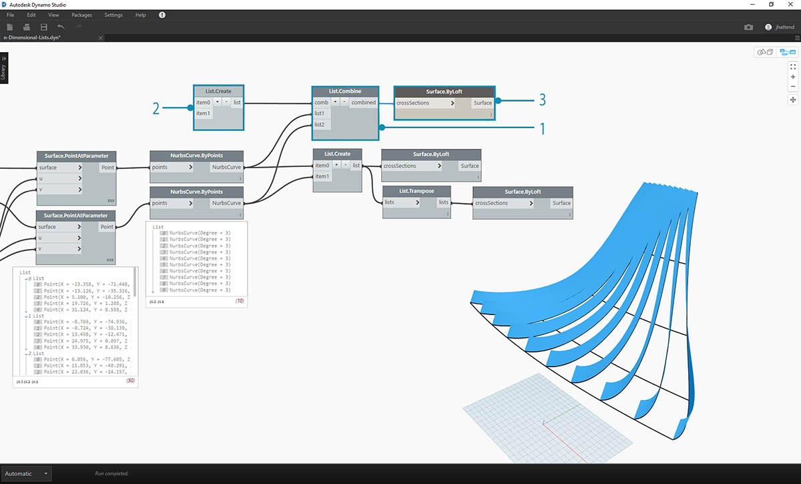
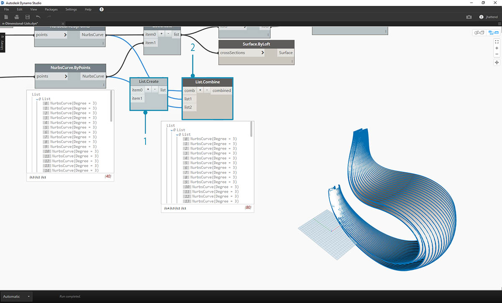
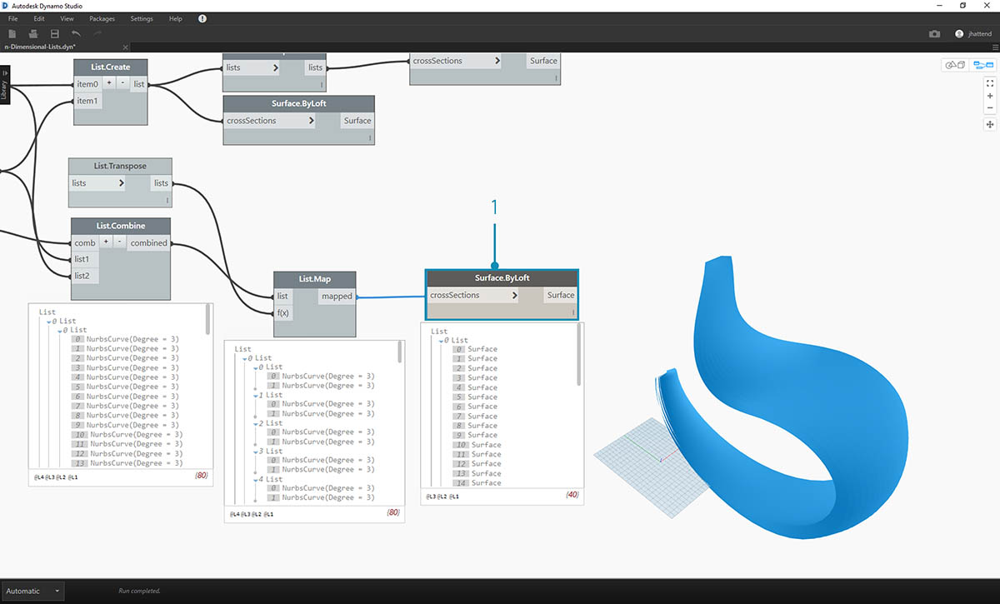
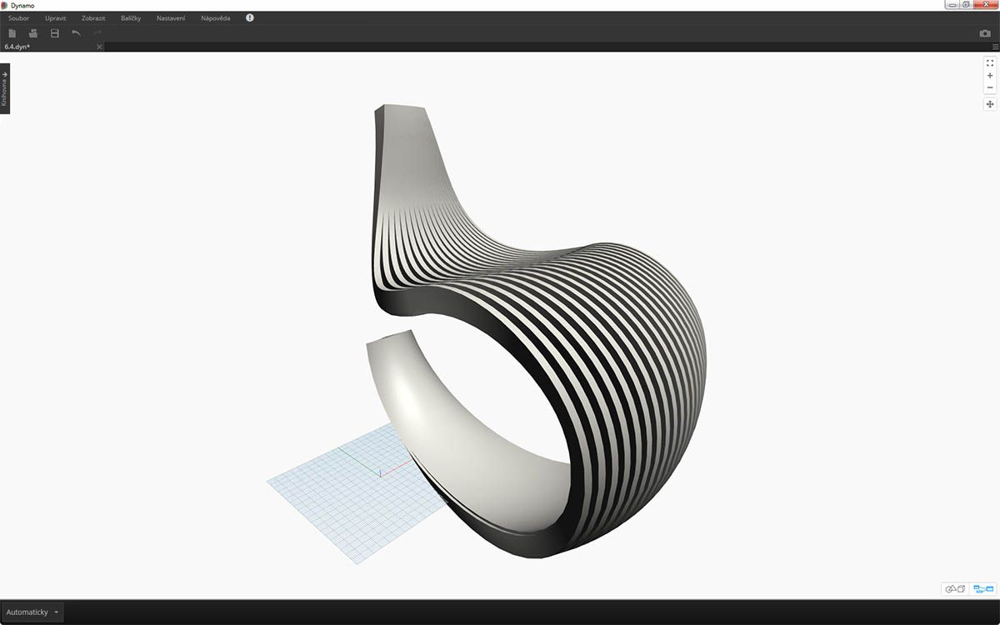
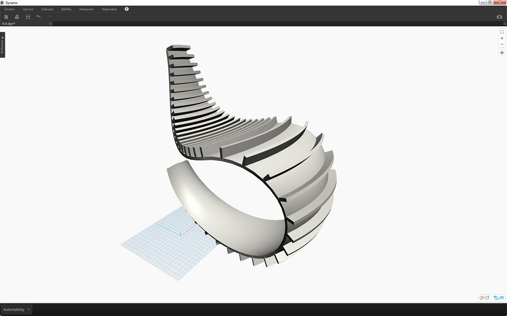

## N-rozměrné seznamy

Postoupíme dále ve složitosti a přidáme do hierarchie ještě více vrstev. Datovou strukturu je možné rozšířit daleko za hranice dvourozměrného seznamu seznamů. Vzhledem k tomu, že seznamy jsou v aplikaci Dynamo položky v nich samotných a jich samotných, je možné vytvořit data s tolika rozměry kolik je jen možné.

Analogie, se kterou budeme pracovat, je založena na ruských matrjoškách. Každý seznam je možné chápat jako kontejner obsahující více položek. Každý seznam má své vlastnosti a také je chápán jako svůj vlastní objekt.


> Sada ruských matrjošek (autor fotografie: [Zeta](https://www.flickr.com/photos/beppezizzi/145493363)) je analogií pro n-rozměrné seznamy. Každá vrstva představuje seznam a každý seznam obsahuje položky. V případě aplikace Dynamo může mít každý kontejner uvnitř více kontejnerů (představujících položky každého seznamu).

N-rozměrné seznamy se těžko vysvětlují vizuálně, v této kapitole jsme však připravili několik cvičení, která se zaměřují na práci se seznamy přesahujícími dva rozměry.

## Mapování a kombinace

Mapování je pravděpodobně nejsložitější součástí správy dat v aplikaci Dynamo a je obzvláště důležité při práci se složitými hierarchiemi seznamů. Pomocí řady cvičení níže znázorníme, kdy je třeba použít mapování a kombinace s vícerozměrnými daty.

Předběžná představení uzlů List.Map a List.Combine se nacházejí v předchozí části. V posledním cvičení níže použijeme tyto uzly na složitou datovou strukturu.

### Cvičení – 2D seznamy – základní

> Stáhněte si vzorové soubory, který je přiložen k tomuto cvičení (klikněte pravým tlačítkem a vyberte příkaz „Uložit odkaz jako...“). Úplný seznam vzorových souborů naleznete v dodatku. 
1.[n-Dimensional-Lists.dyn](datasets/6-4/n-Dimensional-Lists.dyn) 
2.[n-Dimensional-Lists.sat](datasets/6-4/n-Dimensional-Lists.sat)

Toto cvičení je první v řadě tří, které se zaměřuje na členění importované geometrie. Každá část této řady cvičení zvýší složitost datové struktury.


> 1. Začněte souborem .sat ve složce souborů cvičení. Tento soubor můžete načíst pomocí uzlu *File Path*.
2. Pomocí uzlu *Geometry.ImportFromSAT* se geometrie importuje do náhledu aplikace Dynamo jako dva povrchy.


> V tomto cvičení se pracuje z důvodu zjednodušení pouze s jedním povrchem.

> 1. Výběrem indexu *1 * uchopte povrch. Index vyberete pomocí uzlu *List.GetItemAtIndex*.


> Dalším krokem je rozdělení povrchu na osnovu bodů.

> 1. Pomocí *bloku kódu* vložte tyto dva řádky kódu:
```
0..1..#10;
0..1..#5;
```

2. Pomocí uzlu *Surface.PointAtParameter* připojte hodnoty dvou bloků kódů k hodnotám *u* a *v*. Změňte *vázání* tohoto uzlu na *„Vektorový součin“*.
3. Výstup odhalí datovou strukturu, která je viditelná také v náhledu aplikace Dynamo.


> 1. Chcete-li se podívat, jak je datová struktura uspořádána, připojte objekt *NurbsCurve.ByPoints* k výstupu uzlu *Surface.PointAtParameter*.
2. Všimněte si, že podél povrchu se vertikálně táhne deset křivek.


> 1. Základní uzel *List.Transpose* převrátí sloupce a řádky seznamu seznamů.
2. Pokud se výstup uzlu *List.Transpose* připojí k uzlu *NurbsCurve.ByPoints*, přes povrch bude nyní horizontálně umístěno pět křivek.

### Cvičení – 2D seznamy – rozšířené

Zvýšíme složitost. Řekněme, že chcete provést operaci s křivkami vytvořenými v předchozím cvičení. Možná bude užitečné tyto křivky spojit s jiným povrchem a šablonovat mezi nimi. Toto vyžaduje věnování větší pozornosti datové struktuře, ale příslušná logika je stejná.


> 1. Začněte krokem z předchozího cvičení, který izoluje horní povrch importované geometrie pomocí uzlu *List.GetItemAtIndex*.


> 1. Pomocí uzlu *Surface.Offset* odsaďte povrch o hodnotu *10*.


> 1. Stejným způsobem jako v předchozím cvičení definujte *blok kódu* s těmito dvěma řádky kódu:
```
0..1..#10;
0..1..#5;
```

2. Tyto výstupy připojte ke dvěma uzlům *Surface.PointAtParameter*, z nichž každý má *vázání* nastaveno na *„Vektorový součin“*. Jeden z těchto uzlů je připojen k původnímu povrchu, zatímco druhý je připojen k odsazenému povrchu.


> 1. Stejně jako v předchozím cvičení připojte výstupy ke dvěma uzlům *NurbsCurve.ByPoints*.
2. Náhled aplikace Dynamo zobrazuje dvě křivky odpovídající dvěma povrchům.


> 1. Pomocí uzlu *List.Create* je možné kombinovat dvě sady křivek do jednoho seznamu seznamů.
2. Všimněte si, že z výstupu máme dva seznamy každý po deseti položkách, přičemž každý z nich představuje připojenou sadu křivek nurbs.
3. Provedením operace uzlu *Surface.ByLoft* je možné vizuálně pochopit tuto datovou strukturu. Uzel šablonuje všechny křivky v každém dílčím seznamu.


> 1. Pokud použijete uzel *List.Transpose*, nezapomeňte, že se překlopí všechny sloupce a řádky. Tento uzel převede dva seznamy deseti křivek do deseti seznamů dvou křivek. Nyní je každá křivka nurbs vztažena k sousedící křivce na druhém povrchu.
2. Pomocí uzlu *Surface.ByLoft* jste vytvořili žebrovanou konstrukci.



> 1. Alternativou uzlu *List.Transpose* je *List.Combine*. Tento uzel ovládá *„kombinátor“* v každém dílčím seznamu.
2. V tomto případě uzel *List.Create *použije jako *„kombinátor“*, který vytvoří seznam jednotlivých položek v dílčích seznamech.
3. Pomocí uzlu *Surface.ByLoft* získáte stejné povrchy jako v předchozím kroku. Transpozice je v tomto případě jednodušší, pokud však bude datová struktura ještě složitější, uzel *List.Combine* je spolehlivější.


> 1. Pokud bychom v jednom z předchozích kroků chtěli přepnout orientaci křivek žebrované konstrukce, před připojením k uzlu *NurbsCurve.ByPoints* bychom použili uzel List.Transpose. Ten převrátí sloupce a řádky a vytvoří 5 vodorovných žeber.

### Cvičení – 3D seznamy

Je čas postoupit o krok dál. V tomto cvičení budete pracovat s oběma importovanými povrchy a vytvoříte složitou datovou hierarchii. Stále je však naším cílem dokončení této operace pomocí stejné příslušné logiky.


> 1. Začněte u importovaného souboru z předchozího cvičení.


> 1. Stejně jako v předchozím cvičení přidejte pomocí uzlu *Surface.Offset* odsazení o hodnotu *10*.
2. Všimněte si, že na výstupu se vytvořily dva povrchy s odsazeným uzlem.


> 1. Stejným způsobem jako v předchozím cvičení definujte blok kódu s těmito dvěma řádky kódu:
```
0..1..#20;
0..1..#10;
```

2. Tyto výstupy připojte ke dvěma uzlům *Surface.PointAtParameter*, z nichž každý má vázání nastaveno na *„Vektorový součin“*. Jeden z těchto uzlů je připojen k původním povrchům, zatímco druhý je připojen k odsazeným povrchům.


> 1. Stejně jako v předchozím cvičení připojte výstupy ke dvěma uzlům *NurbsCurve.ByPoints*.
2. Při pohledu na výstup uzlu *NurbsCurve.ByPoints* si všimněte, že se jedná o seznam dvou seznamů, což je složitější struktura než v předchozím cvičení. Data jsou kategorizována podle základních povrchů, čili do strukturovaných dat byla přidána další vrstva.
3. Všimněte si, že v uzlu *Surface.PointAtParameter* se již situace stane složitější. V tomto případě máme seznam seznamů seznamů.


> 1. Pomocí uzlu *List.Create* slučte křivky nurbs do jedné datové struktury, čímž vytvoříte seznam seznamů seznamů.
2. Připojením uzlu *Surface.ByLoft* získáte verzi původních povrchů, protože každý zůstane ve svém vlastním seznamu vytvořeném z původní datové struktury.


> 1. V předchozím cvičení bylo možné vytvořit žebrovanou konstrukci pomocí uzlu *List.Transpose*. Toto zde nebude fungovat. Transpozice by měla být použita na dvourozměrný seznam a vzhledem k tomu, že máme trojrozměrný seznam, operace „převrácení sloupců a řádků“ nebude fungovat tak snadno. Nezapomeňte, že seznamy jsou objekty, čili uzel *List.Transpose* převrátí naše seznamy bez dílčích seznamů, ale nepřevrátí křivky nurbs o jeden seznam níže v hierarchii.



> 1. Zde bude lépe fungovat uzel *List.Combine*. Když se dojde na složitější datové struktury, chceme použít uzly *List.Map* a *List.Combine*.
2. Pokud použijeme uzel *List.Create *jako *„kombinátor“*, vytvoříme datovou strukturu, která nám bude lépe fungovat.


> 1. Datovou strukturu o jeden krok níže v hierarchii je stále třeba transponovat. Toto provedete pomocí uzlu *List.Map*. Funguje jako uzel *List.Combine*, jen má jeden vstupní seznam místo dvou a více.
2. Funkce použitá na uzel *List.Map* je *List.Transpose*, která převrátí sloupce a řádky dílčích seznamů v hlavním seznamu.



> 1. Nakonec můžete šablonovat křivky nurbs společně s vhodnou hierarchií dat. Tím vznikne žebrovaná konstrukce.


> 1. Pomocí uzlu *Surface.Thicken* můžete přidat geometrii určitou hloubku.


> 1. Je dobré přidat do této konstrukce podložení povrchu, čili pomocí uzlu *List.GetItemAtIndex* vyberte zadní povrch z šablonovaných povrchů z předchozích kroků.


> 1. A zesílením těchto vybraných povrchů je dokončeno i členění.



> Nejedná se zrovna o nejpohodlnější houpací křeslo, ale pracuje se u něj s mnoha daty.


> V posledním kroku obrátíme směr žlábkovaných členů. V předchozím kroku se použila transpozice, zde bude provedeno něco podobného.

> 1. Vzhledem k tomu, že hierarchie má ještě další vrstvu, je třeba pomocí uzlu *List.Map* a funkce *List.Tranpose* změnit směr křivek nurbs.


> 1. Možná bude užitečné zvýšit počet stupňů, abychom mohli následovně změnit blok kódu:
```
0..1..#20;
0..1..#10;
```



> První verze houpacího křesla byla štíhlá, čili druhý model nabízí robustní off-roadovou verzi usazení.

