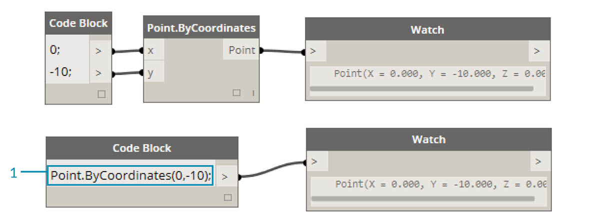
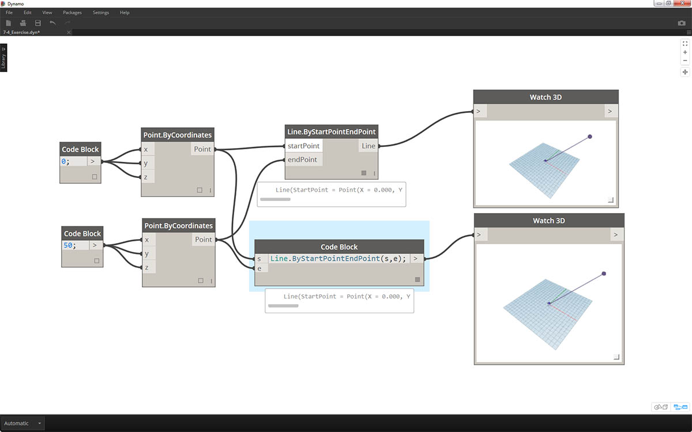
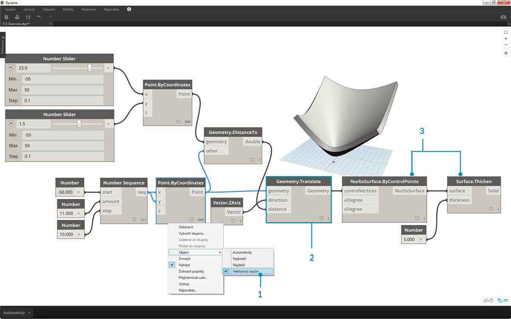
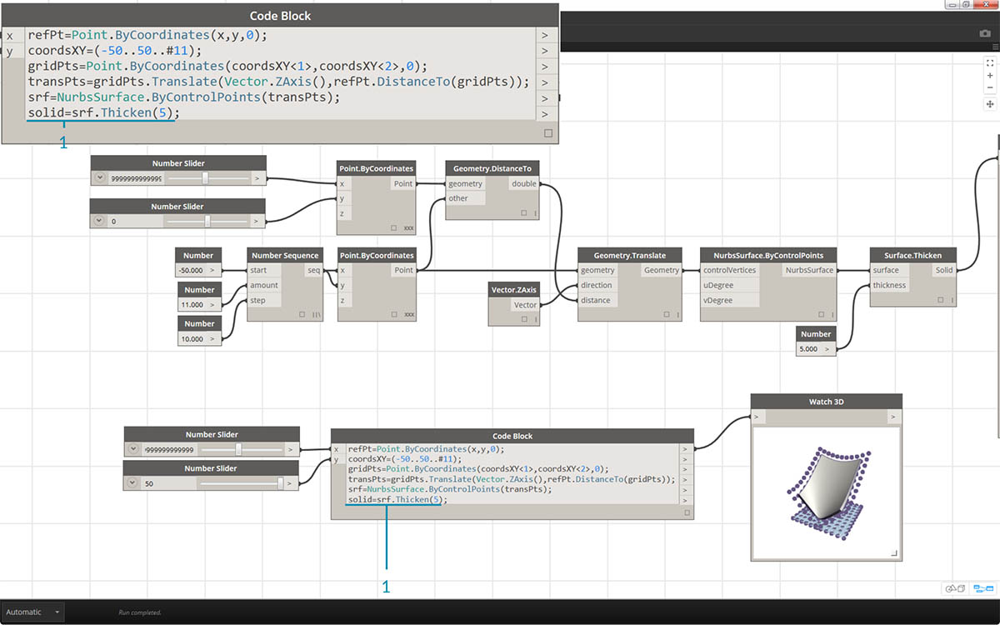
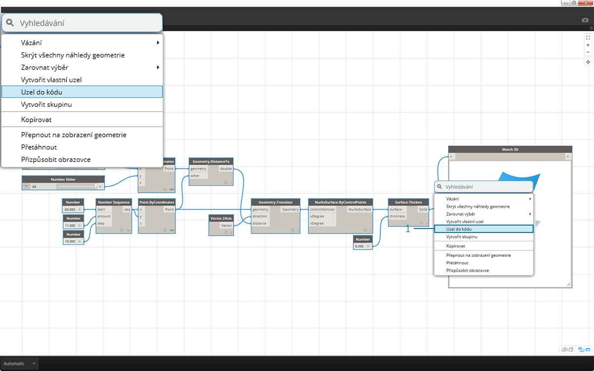

## Syntaxe DesignScript

Možná jste si všimli běžného tématu v názvech uzlů v aplikaci Dynamo: Každý uzel používá syntax se znakem *"."* bez mezer. Je tomu tak proto, že text v horní části každého uzlu představuje skutečnou syntaxi pro skriptování a znak *„.“* (nebo *tečková notace*) oddělí prvek od možných metod, které je možné volat. Toto umožňuje snadný přesun od vizuálního skriptování k textovému.


Jak v rámci obecné analogie tečkové notace postupovat u parametrického jablka v aplikaci Dynamo? Níže je uvedeno několik metod, které použijeme na jablko než se rozhodneme, zda je sníst. (Poznámka: Nejedná se o skutečné metody aplikace Dynamo):

|Člověkem čitelný zápis|Zadání s tečkami|Výstup|
| -- | -- | -- |
|Jakou barvu má jablko?|Jablko.barva|červená|
|Je jablko zralé?|Jablko.jeZrale|ano|
|Kolik jablko váží?|Jablko.vaha|6 oz.|
|Z čeho jablko pochází?|Jablko.rodic|strom|
|Co to jablko vytváří?|Jablko.produkty|semena|
|Bylo toto jablko vypěstováno zde?|Jablko.vzdalenostOdSadu|60 mi.|

Nevím, jak ty, ale soudě podle výstupů v tabulce výše, to vypadá, že jablko je chutné. Myslím, že provedu operaci *Jablko.snist()*.

### Tečková notace v bloku kódu

S ohledem na analogii jablka se podívejte na uzel *Point.ByCoordinates* a určete, jak můžeme vytvořit bod pomocí bloku kódu:



> Syntaxe *bloku kódu* ```Point.ByCoordinates(0,10);``` předává stejný výsledek jako uzel *Point.ByCoordinates* v aplikaci Dynamo, s výjimkou toho, že je možné vytvořit bod pomocí jednoho uzlu. Je to mnohem efektivnější než připojení dvou samostatných uzlů k hodnotám *„X“* a *„Y“*.

> 1. Pokud použijete uzel *Point.ByCoordinates* v bloku kódu, určíte vstupy ve stejném pořadí jako uzel ve výchozím natavení *(X,Y)*.

### Volání uzlů

Jakýkoliv běžný uzel v knihovně je možné volat prostřednictvím bloku kódu, pokud uzel není speciálním *„uzlem uživatelského rozhraní“*: uzly se speciální funkcí uživatelského rozhraní. Můžete například volat uzel *Circle.ByCenterPointRadius*, ale nemělo by smysl volat uzel *Watch 3D*.

Běžné uzly (většina knihovny) jsou obvykle tří typů:

* **Tvorba** – něco se vytvoří (nebo zkonstruuje)
* **Akce** – provede u položky nějakou akci
* **Dotaz** – získá vlastnost položky, která již existuje

Můžete vidět, že knihovna je organizována s ohledem na tyto kategorie. Metody nebo uzly těchto tří typů jsou při volání v bloku kódu zpracovávány odlišně.


#### Definuj

Kategorie „Tvorba“ vytvoří geometrii od začátku. V bloku kódu se zadají vstupní hodnoty zleva doprava. Tyto vstupy jsou ve stejném pořadí jako vstupy uzlu shora dolů: 

> Pokud použijete uzel *Line.ByStartPointEndPoint* a porovnáte výsledek s odpovídající syntaxí v bloku kódu, zjistíte, že výsledky jsou stejné.

#### Akce

Akce je něco, co se provede u objektu daného typu. Aplikace Dynamo používá k provedení akce u určité položky *tečkovou notaci*, která je běžná v mnoha jazycích kódů. Jakmile zadáte název položky, zadejte tečku a poté název akce. Vstup metody typu Akce je umístěn v závorkách stejně jako u metody typu Tvorba, jen není třeba určovat první vstup, který uvidíte na odpovídajícím uzlu. Místo toho určíte, u kterého prvku se akce provede:


> 1. Uzel *Point.Add* je uzel typu Akce, takže syntaxe funguje trochu jinak.
2. Vstupy jsou (1) *bod* a (2) *vektor*, které se mají přidat. V *bloku kódu* jme bod (položku) pojmenovali výrazem *„pt“*. Chcete-li přidat vektor s názvem *„polozka“* do bodu *"pt"*, zadejte výraz *pt.Add(polozka)* nebo položka, tečka, akce. Akce Add má pouze jeden vstup nebo všechny vstupy z uzlu *Point.Add* kromě prvního. První vstup uzlu *Point.Add* je samotný bod.

#### Dotaz

Metody typu Dotaz získají vlastnost objektu. Vzhledem k tomu, že objekt samotný je vstupem, není třeba určovat žádné vstupy. Nejsou třeba žádné závorky.


### Jak je to s vázáním?

Vázání na uzly se poněkud liší od vázání na blok kódu. U uzlů klikne uživatel pravým tlačítkem na uzel a vybere možnost vázání, kterou chce provést. Díky bloku kódu má uživatel mnohem větší kontrolu nad tím, jak jsou data strukturována. Metoda zkratky bloku kódu používá *vodítka replikací* k nastavení způsobu, jakým by mělo být párováno několik jednorozměrných seznamů. Čísla v ostrých závorkách „<>“ definují hierarchii výsledného vnořeného seznamu: <1>,<2>,<3> atd. 


> 1. V tomto příkladu definujeme dva rozsahy pomocí zkratky (více o zkratkách naleznete v následující části této kapitoly). Ve zkratce výraz ```0..1;``` je ekvivalentní k hodnotě ```{0,1}``` a výraz ```-3..-7``` je ekvivalentní k hodnotě ```{-3,-4,-5,-6,-7}```. Výsledkem je seznam 2 hodnot X a 5 hodnot Y. Pokud se nepoužijí vodítka replikací společně s těmito neshodujícími se seznamy, vznikne seznam dvou bodů, který má délku nejkratšího seznamu. Pomocí vodítek replikací je možné najít všechny možné kombinace 2 a 5 souřadnic (neboli **vektorový součin**).
2. Pomocí syntaxe ```Point.ByCoordinates(x_vals<1>,y_vals<2>);``` získáte **dva** seznamy s **pěti** položkami v každém seznamu.
3. Pomocí syntaxe ```Point.ByCoordinates(x_vals<2>,y_vals<1>);``` získáte **pět** seznamů s **dvěma** položkami v každém seznamu.

Pomocí této notace můžeme také určit, který seznam bude dominantní: 2 seznamy 5 položek nebo 5 seznamů 2 položek. V tomto příkladu změna pořadí vodítek replikací vytvoří seznam řádků bodů v osnově nebo seznam sloupců bodů v osnově.

### Uzel na kód

Zatímco na výše uvedené metody bloku kódu si možná budete chvíli zvykat, v aplikace Dynamo existuje i funkce s názvem „Uzel na blok“ která celý proces usnadní. Chcete-li tuto funkci použít, vyberte pole uzlů v grafu aplikace Dynamo, klikněte pravým tlačítkem na kreslicí plochu a vyberte položku „Uzel na kód“. Aplikace Dynamo tyto uzly zhustí do bloku kódu včetně všech vstupů a výstupů. Nejenže se jedná o skvělý nástroj k výuce práce s blokem kódu, ale tato funkce také umožňuje práci s efektivnějším a parametrickým grafem aplikace Dynamo. Cvičení je zakončeno využitím funkce „Uzel na kód“, nepropásněte tuto část.


### Cvičení

> Stáhněte si vzorový soubor, který je přiložen k tomuto cvičení (klikněte pravým tlačítkem a vyberte příkaz Uložit odkaz jako...). Úplný seznam vzorových souborů naleznete v dodatku. [Dynamo-Syntax_Attractor-Surface.dyn](datasets/7-2/Dynamo-Syntax_Attractor-Surface.dyn)

Nyní demonstrujeme sílu bloku kódu převedením existující definice pole atraktoru do tvaru bloku kódu. Práce s existující definicí ukazuje, jak blok kódu souvisí s vizuálním skriptem, a je užitečná k seznámení se se syntaxí jazyka DesignScript. 

> Začněte znovuvytvořením definice na obrázku výše (nebo otevřením vzorového souboru).

> 1. Všimněte si, že vázání uzlu *Point.ByCoordinates* bylo nastaveno na hodnotu *Vektorový součin*.
2. Každý bod v osnově se posune nahoru ve směru Z podle jeho vzdálenosti od referenčního bodu.
3. Povrch je znovu vytvořen a zesílen, čímž se vytvoří vyboulení v geometrii relativně ke vzdálenosti od referenčního bodu.


> 1. Ze všeho nejdříve definujte referenční bod: ```Point.ByCoordinates(x,y,0);```. Použije se stejná syntax uzlu *Point.ByCoordinates*, jaká je určena v horní části uzlu referenčního bodu.
2. Proměnné *x* a *y* se vloží do bloku kódu, aby bylo možné je dynamicky aktualizovat pomocí posuvníků.
3. Přidejte *posuvníky* ke vstupům *bloku kódu*, které se pohybují v rozsahu od *-50* do *50*. Tímto zajistíme dosah přes celou výchozí osnovu aplikace Dynamo.


> 1. Na druhém řádku *bloku kódu* definujte zkratku, která nahradí uzel posloupnosti čísel: ```coordsXY = (-50..50..#11);``` . Toto je více rozebráno v další části. V tuto chvíli si všimněte, že tato zkratka odpovídá uzlu *Number Sequence* ve vizuálním skriptu.


> 1. Nyní chceme vytvořit osnovu z bodů v posloupnosti položek *coordsXY*. Za tímto účelem je vhodné použít syntaxi *Point.ByCoordinates*, ale také je nutné spustit *Vektorový součin* seznamu stejným způsobem, jako to bylo provedeno ve vizuálním skriptu. Toto provedete zadáním následujícího řádku kódu: ```gridPts = Point.ByCoordinates(coordsXY<1>,coordsXY<2>,0);```. Ostré závorky označují referenci vektorového součinu.
2. Všimněte si, že v uzlu *Watch3D* se nachází osnova bodů přes celou osnovu aplikace Dynamo.


> 1. Nyní nastává ta náročná část: Je třeba přesunout osnovu bodů nahoru podle vzdáleností bodů od referenčního bodu. Nejprve pojmenujte tuto novou sadu bodů *transPts*. A vzhledem k tomu, že převod je akce na existujícím prvku, použijte místo výrazu ```Geometry.Translate...``` výraz ```gridPts.Translate```.
2. Při čtení ze skutečného uzlu na kreslicí ploše je vidět, že obsahuje tři vstupy. Geometrie, kterou chcete převést, je již deklarována, protože na tomto prvku provádíme akci (pomocí metody *gridPts.Translate*). Zbývající dva vstupy budou vloženy do závorek funkce: *směr* a *vzdálenost*.
3. Směr je dostatečně jednoduchý vstup a k jeho vertikálnímu posunutí se použije metoda ```Vector.ZAxis()```.
4. Stále je třeba vypočítat vzdálenost mezi referenčním bodem a každým bodem osnovy, čili toto proveďte jako akci u referenčního bodu stejným způsobem: ```refPt.DistanceTo(gridPts)```
5. Poslední řádek kódu předá převedené body: ```transPts = gridPts.Translate(Vector.ZAxis(),refPt.DistanceTo(gridPts));```


> 1. Nyní máme osnovu bodů s vhodnou datovou strukturou k vytvoření povrchu Nurbs. Povrch vytvoříme pomocí výrazu ```srf = NurbsSurface.ByControlPoints(transPts);```



> 1. Nakonec, aby bylo možné přidat k povrchu určitou hloubku, vytvořte těleso pomocí výrazu ```solid = srf.Thicken(5);```. V tomto případě došlo k zesílení povrchu v rámci kódu o 5 jednotek, toto však vždy můžete deklarovat jako proměnnou (kterou můžete nazvat například *tloustka*) a poté řídit její hodnotu pomocí posuvníku.

### Zjednodušení grafu pomocí možnosti „Uzel na kód“

Funkce „Uzel na kód“ automatizuje celé toto právě dokončené cvičení pomocí kliknutí na tlačítko. Nejenže se jedná o výkonné řešení tvorby vlastních definic a opakovaně použitelných bloků kódu, ale také je to velmi užitečný nástroj k výuce skriptování v aplikaci Dynamo:



> 1. Začněte existujícím vizuálním skriptem z kroku 1 tohoto cvičení. Vyberte všechny uzly, klikněte pravým tlačítkem na kreslicí plochu a vyberte možnost *„Uzle na kód“*. Až tak jednoduché to je.


> Aplikace Dynamo má automatizovanou textovou verzi vizuálního grafu, vázání a dalších. Vyzkoušejte si tuto funkci u vašich vizuálních skriptů a využijte výkon bloku kódu.

