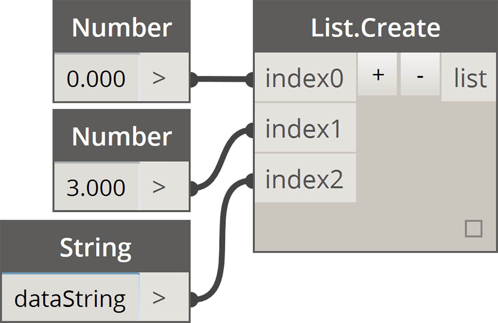
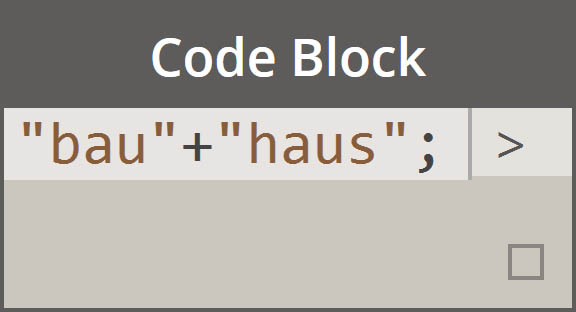
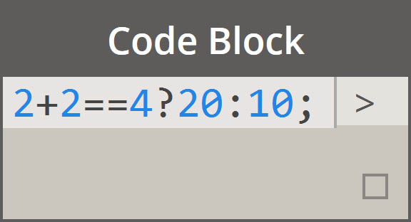
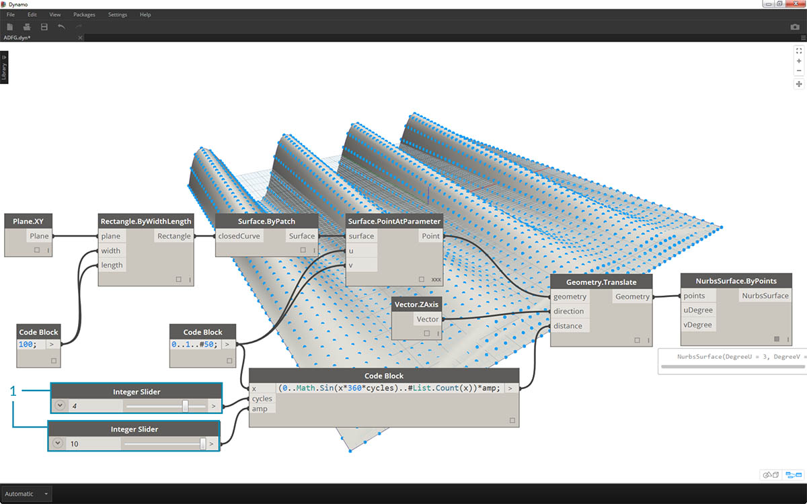

<style>
table{box-shadow: 2px 2px 2px #BBBBBB;max-width:75%;display:block;margin-left: auto;   margin-right: auto }
img{display:block;margin-left: auto;   margin-right: auto }
</style>

## Zkratka

V bloku kódu je několik základních metod zkratky, které umožňují správu dat *velice* usnadnit. Rozdělíme si základy níže a prodiskutujeme, jak lze tuto zkratku použít k vytváření a zadávání dotazů na data.

<table>
    <tr>
    <td width="50%"><b>Typ dat</b></td>
    <td width="25%"><b>Standardní aplikace Dynamo</b> </td>
    <td width="25%"><b>Ekvivalent bloku kódu</b></td>
  </tr>
  <tr>
    <td> Čísla</td>
    <td></img> </td>
    <td></img></td>
  </tr>
  <tr>
    <td>Řetězce</td>
    <td></img> </td>
    <td></img></td>
  </tr>
  <tr>
    <td>Posloupnosti</td>
    <td></img> </td>
    <td></img></td>
  </tr>
  <tr>
    <td>Rozsahy</td>
    <td></img> </td>
    <td></img></td>
  </tr>
  <tr>
    <td>Získat položku na indexu</td>
    <td></img> </td>
    <td></img></td>
  </tr>
  <tr>
    <td>Vytvořit seznam</td>
    <td></img> </td>
    <td></img></td>
  </tr>
  <tr>
    <td>Zřetězit řetězce</td>
    <td></img> </td>
    <td></img></td>
  </tr>
  <tr>
    <td>Podmíněné výrazy</td>
    <td></img> </td>
    <td></img></td>
  </tr>
</table>

### Další syntaxe

|Uzly|Ekvivalent bloku kódu|Poznámka|
| -- | -- | -- |
|Libovolný operátor (+, &&, >=, Not, atd.)|+, &&, >=, !, atd.|Všimněte si, že z „Not“ se stane „!“, ale uzel se nazývá Not, aby se odlišil od uzlu Factorial|
|Booleovská hodnota True|true;|Poznámka: malá písmena|
|Booleovská hodnota False|false;|Poznámka: malá písmena|

### Rozsahy

Metodu definování rozsahů a posloupností lze redukovat na základní zkratku. Použijte obrázek níže jako vodítko pro syntaxi „..“ pro definování seznamu číselných dat s blokem kódu. Po nacvičení této notace je vytvoření číselných dat skutečně efektivní proces: 

> 1. V tomto příkladu je číselný rozsah nahrazen základní syntaxí bloku kódu definující ```beginning..end..step-size;```. Reprezentujeme číselně, takže získáte: ```0..10..1;```
2. Všimněte si, že syntaxe ```0..10.1;``` je ekvivalentní hodnotě ```0..10;```. Velikost kroku 1 je výchozí hodnotou pro notaci zkratky. Proto ```0..10;``` přidělí posloupnost od 0 do 10 s velikostí kroku 1.
3. Příklad *posloupnosti čísel* je podobný, ale k určení, že chceme v seznamu zadat 15 hodnot, místo seznamu, který pokračuje do 15, použijeme *„#“*. V tomto případě definujeme: ```beginning..#ofSteps..step-size:```. Aktuální syntaxe posloupnosti je ```0..#15..2```
4. Pomocí *„#“* z předchozího kroku nyní ji nyní umístíme do části *step-size* syntaxe. Nyní máme *číselný rozsah*, který prochází od *beginning* do *end* notace *step-size* rovnoměrně rozloží počet hodnot mezi: ```beginning..end..#ofSteps```

### Pokročilé rozsahy

Vytváření pokročilých rozsahů umožňuje jednoduše pracovat se seznamem seznamů. V příkladech níže izolujeme proměnnou od uzlu primárního rozsahu a vytvoříme další rozsah tohoto seznamu. 

> 1. Vytvořte vnořené rozsahy a porovnejte notaci s *„#“* a bez ní. Stejná logika se používá v základních rozsazích, ale je trochu složitější.
2. Můžeme definovat podrozsah na libovolném místě v primárním rozsahu a všimněte si, že můžeme mít také dva podrozsahy.
3. Řízením hodnoty *„end“* v rozsahu vytvoříme více rozsahů různých délek.


> V rámci logického cvičení porovnejte dvě výše uvedené zkratky a zkuste analyzovat, jak notace *podrozsahů* a *„#“* určují výsledný výstup.

### Tvorba seznamů a získání položek ze seznamu

Kromě vytváření seznamů pomocí zkratky můžeme také vytvořit seznamy v průběhu provádění. Tento seznam může obsahovat širokou škálu typů prvků a lze jej také dotazovat (nezapomeňte, že seznamy jsou samy o sobě objekty). Pomocí bloku kódu můžete vytvořit seznamy se závorkami (složené závorky) a dotazovat položky ze seznamu se závorkami (čtvercové závorky):


> 1. Seznamy můžete rychle vytvářet pomocí řetězců a dotazovat je pomocí položek indexů.
2. Pomocí notace zkratky můžete vytvářet seznamy s proměnnými a dotazy.

A správa s vnořenými seznamy je podobný proces. Při použití více sad hranatých závorek si dávejte pozor na pořadí seznamu:


> 1. Definujte seznam seznamů.
2. Dotažte se na seznam s notací jedné závorky.
3. Dotažte se na položku s notací dvojité závorky.

### Cvičení

> Stáhněte si vzorový soubor, který je přiložen k tomuto cvičení (klikněte pravým tlačítkem a vyberte příkaz Uložit odkaz jako...). Úplný seznam vzorových souborů naleznete v dodatku. [Obsolete-Nodes_Sine-Surface.dyn](datasets/7-3/Obsolete-Nodes_Sine-Surface.dyn)

V tomto cvičení vyzkoušíme naše nové dovednosti zápisu a vytvoříme zábavný povrch skořápky vejce definovaný rozsahy a vzorci. Během tohoto cvičení si všimněte, jak se používá blok kódu a existující uzly aplikace Dynamo společně: K oddělení práce s daty použijeme blok kódu, zatímco uzly aplikace Dynamo jsou vizuálně rozvrženy pro čitelnost definice.


> Začněte vytvořením povrchu spojením výše uvedených uzlů. Místo použití číselného uzlu k definování šířky a délky dvakrát klikněte na kreslicí plochu a do bloku kódu zadejte hodnotu ```100;```.


> 1. Definujte rozsah mezi 0 a 1 s 50 děleními zadáním hodnoty ```0..1..#50``` do bloku kódu.
2. Spojte rozsah s hodnotami *Surface.PointAtParameter*, které přebírají hodnoty *u* a *v* mezi 0 a 1 napříč povrchem. Nezapomeňte změnit hodnotu *Vázání* na *Kartézský součin* kliknutím pravým tlačítkem na uzel *Surface.PointAtParameter*.


> V tomto kroku použijeme první funkci k přesunutí rastru bodů nahoru v ose Z. Tento rastr bude řídit generovaný povrch podle základní funkce.

> 1. Přidejte vizuální uzly na kreslicí plochu, jak je znázorněno na obrázku výše.
2. Místo použití uzlu vzorce používáme blok kódu s řádkem: ```(0..Math.Sin(x*360)..#50)*5;```. Jednoduše řečeno, definujeme rozsah se vzorcem uvnitř něj. Tento vzorec je funkce Sinus. Funkce sinus získá v aplikaci Dynamo vstupy ve stupních, takže abychom získali plnou sinusovou vlnu, je nutné násobit hodnoty *x* (toto je vstup rozsahu od 0 do 1) hodnotou *360*. Dále chceme stejný počet dělení jako řídicí body rastru pro každý řádek, takže definujeme padesát oddílů pomocí *#50*. Nakonec násobitel hodnoty 5 jednoduše zvýší amplitudu převodu, abychom viděli účinek v náhledu aplikace Dynamo.


> 1. I když předchozí blok kódu fungoval dobře, nebyl zcela parametrický. Chceme dynamicky řídit jeho parametry, takže nahradíme řádek z předchozího kroku řetězcem ```(0..Math.Sin(x*360*cyklů)..#List.Count(x))*amp;```. Díky tomu můžeme definovat tyto hodnoty podle vstupů.



> 1. Změnou posuvníků (v rozmezí od 0 do 10) získáme zajímavé výsledky.


> 1. Provedením převodu na číselný rozsah obrátíme směr vlny obvodového pláště: ```transposeList = List.Transpose(sineList);```


> 1. Pokud přidáme seznam sineList a tranposeList: ```eggShellList = sineList+transposeList;```, dojde k vytvoření zkresleného povrchu skořápky vejce


> 1. Další změnou posuvníků uklidníme vody tohoto algoritmu.


> 1. Nakonec se budeme dotazovat na izolované součásti dat pomocí bloku kódu. Chcete-li regenerovat povrch s určitým rozsahem bodů, přidejte blok kódu nad uzel *Geometry.Translate* a *NurbsSurface.ByPoints*. Tento řádek obsahuje text: ```sineStrips[0..15..1];```. Tím se vybere prvních 16 řádků bodů (z 50). Při dalším vytvoření povrchu vidíme, že jsme vytvořili izolovanou část rastru bodů.


> 1. V posledním kroku, abychom tento blok kódu vytvořili více parametrický, budeme dotaz řídit pomocí posuvníku v rozsahu od 0 do 1. Provedeme to pomocí tohoto řádku kódu: ```sineStrips[0..((List.Count(sineStrips)-1)*u)];```. Může se to zdát matoucí, ale řádek kódu nám umožňuje rychle změnit měřítko délky seznamu na násobitel mezi 0 a 1.


> 1. Hodnota *0,53* na posuvníku vytvoří povrch těsně za středem rastru.


> 1. Posuvník *1* podle očekávání vytvoří povrch z plného rastru bodů.


> Když se podíváme na výsledný vizuální graf, můžeme zvýraznit bloky kódu a vidět každou z jejich funkcí.

> 1. První blok kódu nahradí uzel *Number*.
2. Druhý blok kódu nahradí uzel *Number Range*.
3. Třetí blok kódu nahrazuje uzel *Formula* (a také *List.Transpose*, *List.Count* a *Number Range*).
4. Čtvrtý blok kódu dotazuje seznam seznamů, přičemž nahrazuje uzel *List.GetItemAtIndex*.

