## Výběr

Aplikace Revit je prostředí obsahující velké množství dat. Díky tomu máte k dispozici celou řadu možností, které obnášejí více než jen najetí kurzorem a kliknutí. Při provádění parametrických operací můžete zadat dotaz do databáze aplikace Revit a dynamicky propojit prvky aplikace Revit s geometrií aplikace Dynamo.


> Knihovna aplikace Revit v uživatelském rozhraní nabízí kategorii „Výběr“, která umožňuje výběr geometrie několika způsoby.

Chcete-li prvky aplikace Revit správně vybírat, je důležité plně pochopit hierarchii prvků aplikace Revit. Chcete vybrat všechny stěny v projektu? Vyberte je podle kategorie. Chcete vybrat každou židli Eames v moderní hale z poloviny století? Vyberte podle rodiny. Ještě před zahájením cvičení je zde uveden rychlý přehled hierarchie aplikace Revit.

#### Hierarchie aplikace Revit

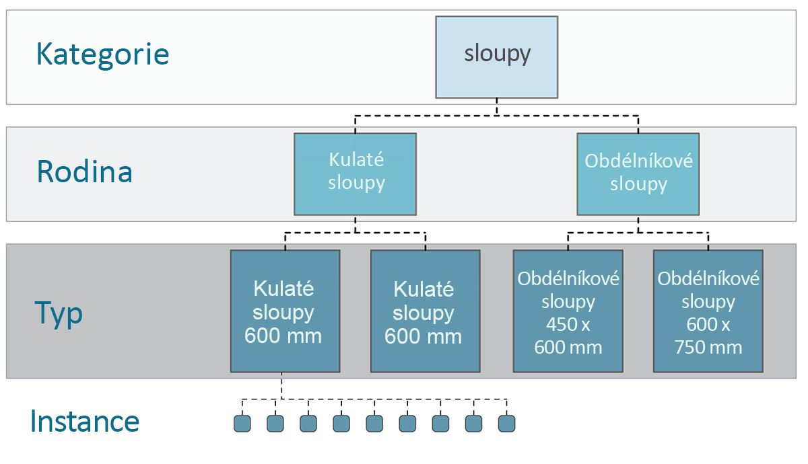

Pamatujete si taxonomii z biologie? Říše, kmen, třída, řád, čeleď, rod, druh? Prvky aplikace Revit jsou uspořádány do kategorií podobným způsobem. Na základní úrovni je možné hierarchii aplikace Revit rozdělit na kategorie, rodiny, typy* a instance. Instance je samostatný prvek modelu (s jedinečným ID), zatímco kategorie definuje obecnou skupinu (například „stěny“ nebo „podlahy“). Pokud je databáze aplikace Revit tímto způsobem uspořádána, můžete vybrat jeden prvek a vybrat všechny podobné prvky podle určené úrovně hierarchie.

**Poznámka – typy v aplikaci Revit jsou definovány jinak než typy u programování. Typ v aplikaci Revit odkazuje na větev hierarchie, nikoli na „datový typ“.*

#### Navigace v databázi pomocí uzlů aplikace Dynamo

Tři níže uvedené obrázky rozebírají hlavní kategorie výběru prvků aplikace Revit v aplikaci Dynamo. Jsou to skvělé nástroje použitelné v kombinaci, a některé z nich budou rozebrány během následujících cvičení.


> *Najetí kurzorem a kliknutí* je nejjednodušší způsob, jak přímo vybrat prvek aplikace Revit. Můžete vybrat prvek úplného modelu nebo součásti jeho topologie (jako je plocha nebo hrana). Prvek zůstane dynamicky propojené s objektem aplikace Revit, čili jakmile u souboru aplikace Revit dojde k aktualizaci umístění nebo parametrů, odkazovaný prvek aplikace Dynamo se v grafu aktualizuje.


> *Rozevírací nabídky* slouží k tvorbě seznamu všech dostupných prvků v projektu aplikace Revit. Pomocí tohoto nástroje můžete odkazovat na prvky aplikace Revit, které nemusí být v pohledu viditelné. Jedná se o skvělý nástroj k dotazování existujících prvků nebo tvorbě nových v projektu aplikace Revit nebo v editoru rodin.


> Prvek aplikace Revit můžete také vybrat podle konkrétních vrstev v *hierarchii aplikace Revit*. Toto je účinná možnost přizpůsobení velkých polí dat při přípravě dokumentace nebo generativních instancí a přizpůsobení.

Se třemi výše zmíněnými obrázky stále na paměti se pusťte do cvičení, které vybere prvky ze základního projektu aplikace Revit při přípravě pro parametrickou aplikaci, kterou vytvoříte ve zbývajících částech této kapitoly.

### Cvičení

> Stáhněte si ukázkové soubory, které jsou přiloženy k tomuto cvičení (klikněte pravým tlačítkem a vyberte příkaz Uložit odkaz jako...). Úplný seznam vzorových souborů naleznete v dodatku.

> 1. [Selecting.dyn](datasets/8-2/Selecting.dyn)
2. [ARCH-Selecing-BaseFile.rvt](datasets/8-2/ARCH-Selecting-BaseFile.rvt)

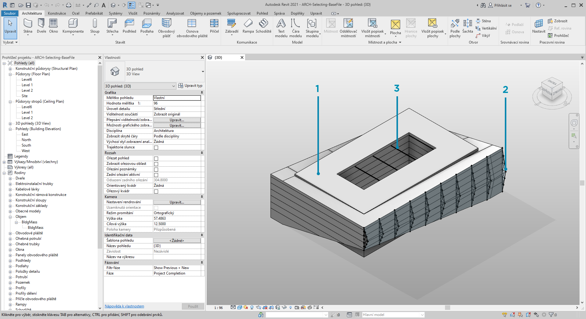

> V tomto vzorovém souboru aplikace Revit jsou k dispozici tři typy prvků jednoduché budovy. Tento soubor bude sloužit jako příklad výběru prvků aplikace Revit v rámci kontextu hierarchie aplikace Revit:

> 1. Objem budovy
2. Příhradové nosníky (adaptivní komponenty)
3. Nosníky (rámová konstrukce)

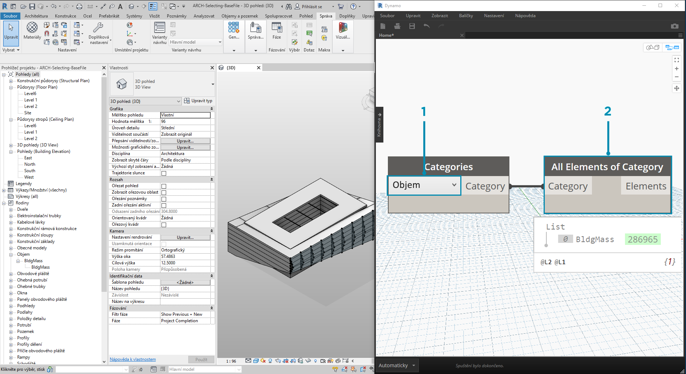

> Jaké závěry je možné vyvodit z prvků aktuálně zobrazených v pohledu projektu aplikace Revit? A jak hluboko do hierarchie bude třeba jít, aby bylo možné vybrat vhodné prvky? Tyto problémy se samozřejmě stanou mnohem složitějšími, pokud pracujete na velkých projektech. K dispozici je mnoho možností: prvky je možné vybrat podle kategorií, úrovní, rodin, instancí atd.

> 1. Vzhledem k tomu, že nyní pracujete se základním nastavením, vyberte objem budovy kliknutím na položku *„Objem“* v rozevíracím uzlu Kategorie. Tyto položky naleznete na kartě Revit > Výběr.
2. Výstup kategorie Objem je pouze samotná kategorie. Je třeba vybrat prvky. K tomuto účelu použijte uzel *„Všechny prvky kategorie“*.

V tuto chvíli si všimněte, že v aplikaci Dynamo není zobrazena žádná geometrie. Vybrali jste prvek aplikace Revit, ale nepřevedli jste jej na geometrii aplikace Dynamo. Toto rozdělení je důležité. Pokud byste chtěli vybrat velký počet prvků, určitě byste nechtěli zobrazit všechny jejich náhledy v aplikaci Dynamo, protože tím by se vše zpomalilo. Aplikace Dynamo je nástroj ke správě projektu aplikace Revit bez nutnosti provádění operací geometrie, tomuto je věnována následující část této kapitoly.

V tomto případě pracujete s jednoduchou geometrií, čili je užitečné zobrazit v náhledu aplikace Dynamo geometrii. Položka „BldgMass“ ve výše zobrazeném uzlu Watch má vedle sebe zelené číslo*. To představuje ID prvku a sděluje, že se zabýváme prvkem aplikace Revit, nikoli geometrií aplikace Dynamo. Dalším krokem je převedení tohoto prvku aplikace Revit na geometrii v aplikaci Dynamo.

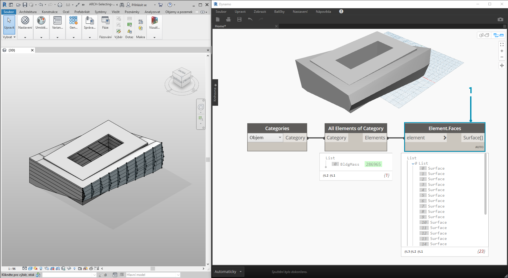

> 1. Pomocí uzlu *Element. Faces*, zobrazte seznam povrchů představujících každou plochu objemu aplikace Revit. Nyní je geometrie zobrazena ve výřezu aplikace Dynamo a je možné začít s odkazováním plochy pro parametrické operace.

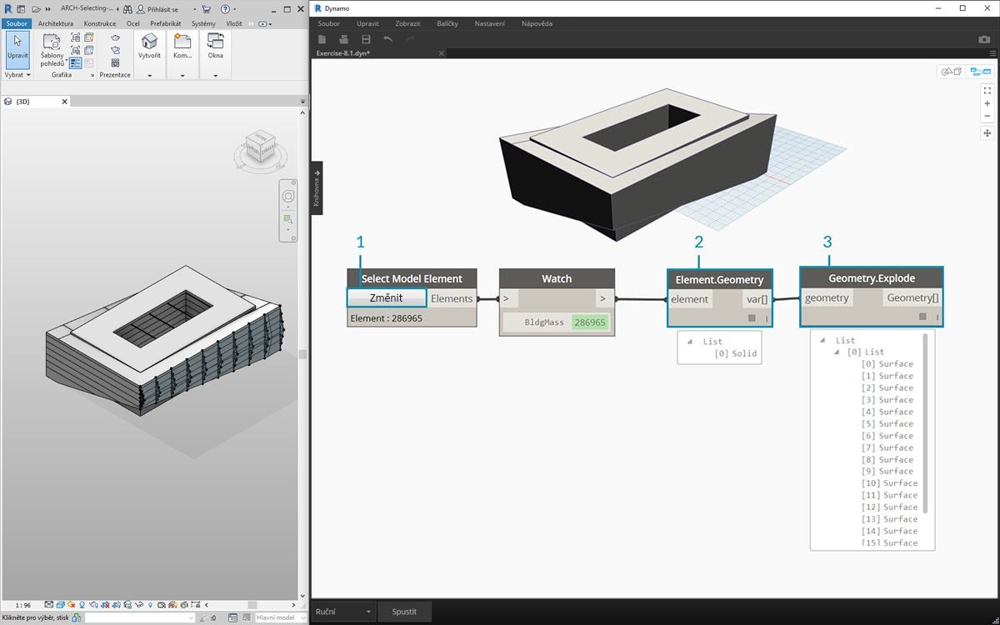

> Zde je alternativní metoda. Tentokrát se vyhneme výběru přes hierarchii aplikace Revit *(„Všechny prvky kategorie“)* a budeme vybírat, aby byla explicitně vybrána geometrie v aplikaci Revit.

> 1. Pomocí uzlu *„Select Model Element“* klikněte na tlačítko *„Vybrat" *(nebo *„Změnit“*). Ve výřezu aplikace Revit vyberte požadovaný prvek. V tomto případě vybíráme objem budovy.
2. Místo uzlu *Element.Faces* můžete k výběru plného objemu jako jedné geometrie tělesa použít uzel *Element.Geometry*. Tím vyberete veškerou geometrii obsaženou v daném objemu.
3. Pomocí uzlu *Geometry.Explode* můžete zase získat zpět seznam povrchů. Tyto dva uzly fungují stejně jako uzel *Element.Faces*, ale nabízejí alternativní možnosti zabřednutí do geometrie prvku aplikace Revit.

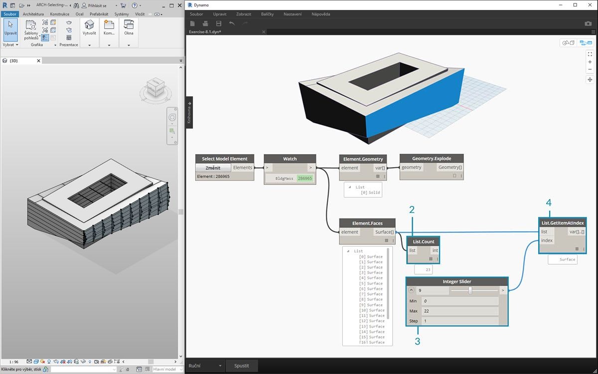

> 1. Pomocí některých základních operací se seznamem se můžete dotazovat na určitou plochu.
2. Nejprve uzel *List.Count* zobrazí, že pracujete s 23 povrchy v objemu.
3. Odkažte se na toto číslo a změňte hodnotu Maximum u *celočíselného posuvníku *na *„22“*.
4. Pomocí uzlu *List.GetItemAtIndex* zadejte seznamy a *celočíselný posuvník*pro *index*. Při procházení vybraných prvků se zastavte na *indexu 9* a izolujte hlavní fasádu od příhradových nosníků.

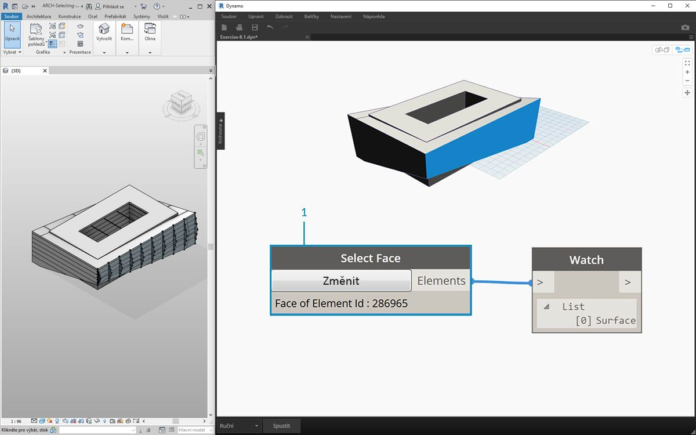

> 1. Předchozí krok byl trochu těžkopádný. Činnost tohoto kroku je možné provést mnohem rychleji pomocí uzlu *„Select Face“*. Toto umožňuje izolovat plochu, která není samotným prvkem v projektu aplikace Revit. Stejná interakce platí i pro uzel *„Select Model Element“*, s rozdílem, že se vybírá povrch, nikoli celý prvek.


> Řekněme, že chcete izolovat stěny hlavní fasády budovy. Toho můžete dosáhnout pomocí uzlu *„Select Faces“*. Klikněte na tlačítko „Vybrat“ a poté v aplikaci Revit vyberte čtyři hlavní fasády.

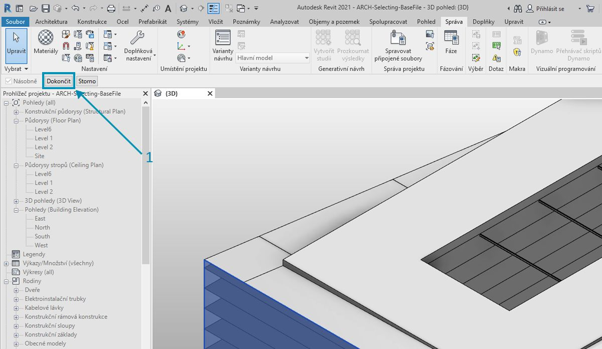

> 1. Po výběru čtyř stěn se ujistěte, že jste v aplikaci Revit kliknuli na tlačítko *„Dokončit“*.

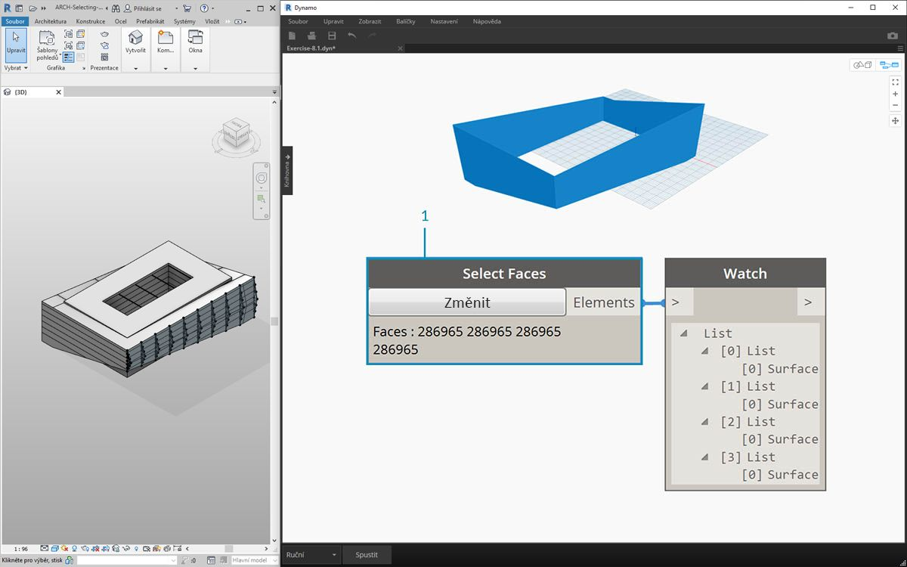

> 1. Plochy se nyní importují do aplikace Dynamo jako povrchy.

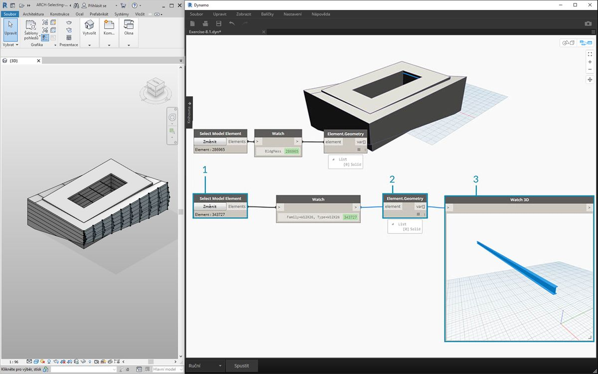

> 1. Nyní rozebereme nosníky nad atriem. Pomocí uzlu *„Select Model Element“* vyberte jeden z nosníků.
2. Připojte prvek nosníku k uzlu *Element.Geometry* a nosník se zobrazí ve výřezu aplikace Dynamo.
3. Geometrii můžete přiblížit pomocí uzlu *Watch3D* (pokud nosník není v uzlu Watch 3D zobrazen, klikněte pravým tlačítkem a klikněte na položku „Přizpůsobit oknu“).

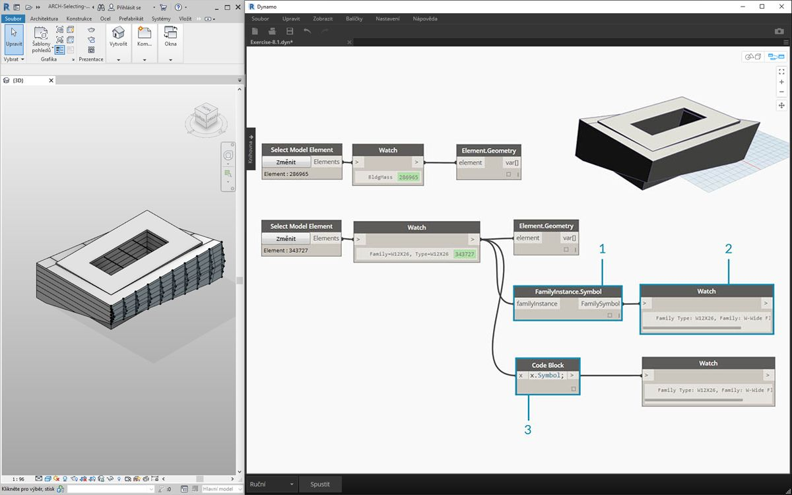

> Otázka, která se může často vyskytovat u pracovních postupů aplikace Revit/Dynamo: Jak mohu vybrat jeden prvek a získat všechny podobné prvky? Vzhledem k tomu, že vybraný prvek aplikace Revit obsahuje všechny hierarchické informace, můžete zadat dotaz na typ rodiny a vybrat všechny prvky tohoto typu.

> 1. Připojte prvek nosníku k uzlu *FamilyInstance.Symbol**.
2. Uzel *Watch* ukazuje, že výstupem je nyní symbol rodiny, nikoli prvek aplikace Revit.
3. *FamilyInstance.Symbol* je jednoduchý dotaz, čili je možné jej provést stejně snadno i v bloku kódu pomocí výrazu ```x.Symbol;``` a získat tak stejné výsledky.

**Poznámka – symbol rodiny náleží do terminologie rozhraní API aplikace Revit pro typ rodiny. Vzhledem k tomu, že zde může docházet ke zmatkům, v následujících verzích dojde k aktualizaci terminologie.*

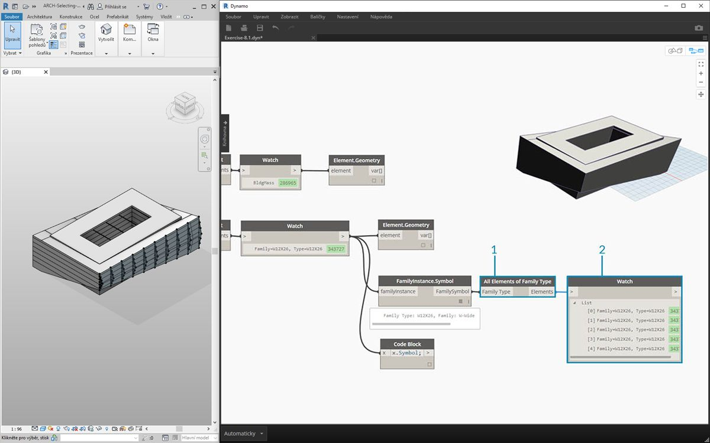

> 1. K výběru zbývajících nosníků se použije uzel *„All Elements of Family Type“*.
2. Uzel Watch zobrazuje, že je vybráno pět prvků aplikace Revit.

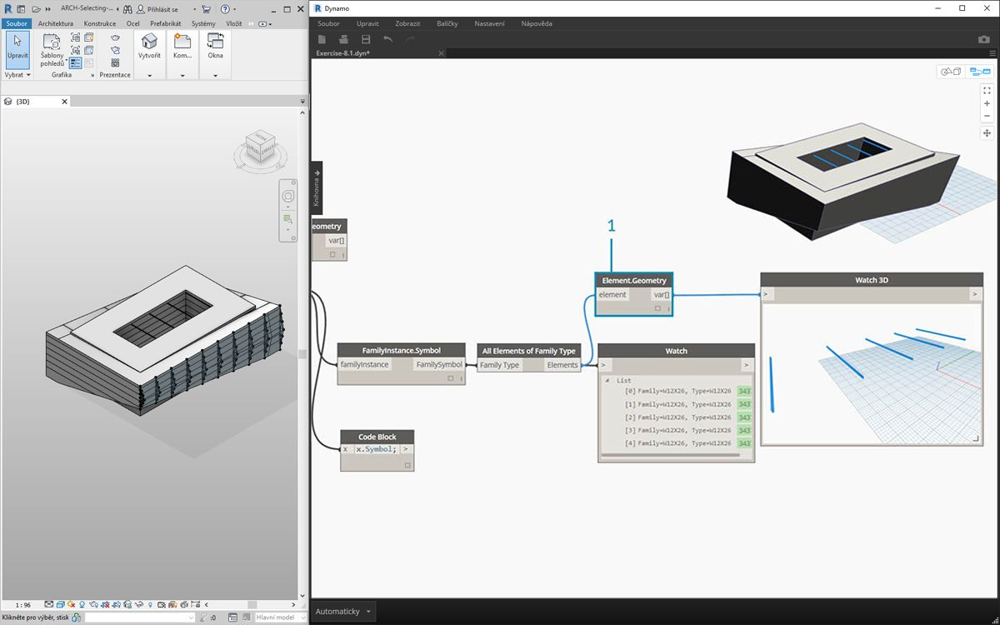

> 1. Všech pět prvků je také možné převést na geometrii aplikace Dynamo.

Co kdybyste pracovali s 500 nosníky? Převod všech těchto prvků na geometrii aplikace Dynamo by byl velmi pomalý. Pokud aplikaci Dynamo trvá výpočet uzlů dlouho, bude možná užitečné využít funkce uzlu „freeze“, která pozastaví provádění operací aplikace Revit, zatímco vyvíjíte graf. Další informace o zmrazení uzlů naleznete v části „Zmrazení“ v [kapitole Tělesa](../05_Geometry-for-Computational-Design/5-6_solids.md#freezing).

V každém případě, pokud chcete importovat 500 nosníků, potřebujete k provedení požadované parametrické operace všechny povrchy? Nebo je možné extrahovat z nosníků základní informace a provést generativní úlohy u základní geometrie? Tuto otázku mějte během procházení této kapitoly na paměti. Podívejme se například na systém příhradových nosníků:

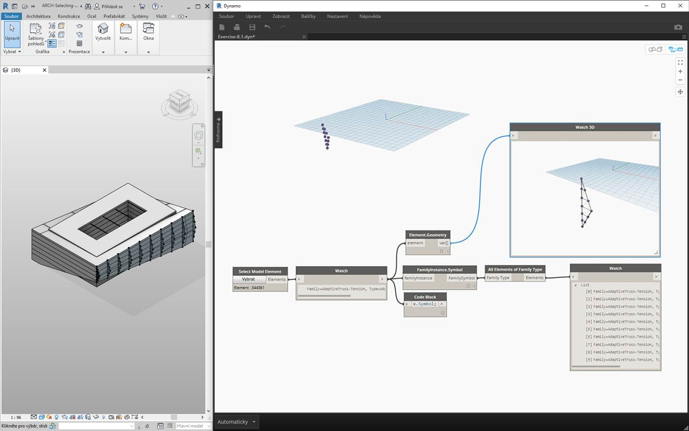

> Pomocí stejného grafu uzlů vyberte prvek příhradového nosníku místo prvku nosníku. Ještě než to uděláte, odstraňte uzel Element.Geometry z předchozího kroku.

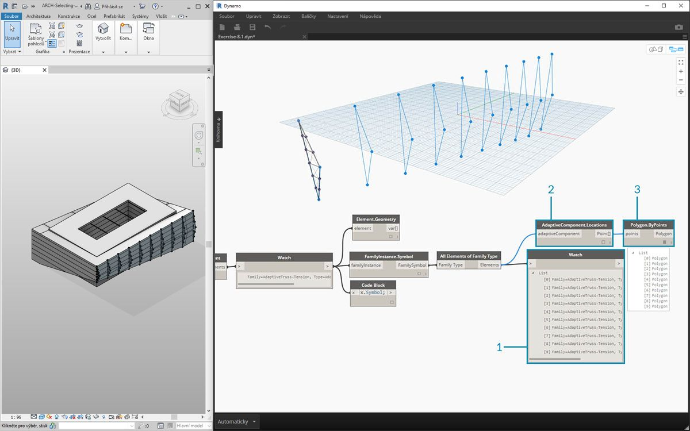

> 1. V uzlu *Watch* je vidět, že výstupem je seznam adaptivních komponent vybraných v aplikaci Revit. Pokud chcete extrahovat základní informace, začněte adaptivními body.
2. Připojte uzel *„All Elements of Family Type“* k uzlu *„AdaptiveComponent.Location“*. Tím se zobrazí seznam seznamů, z nichž každý má tři body představující umístění adaptivních bodů.
3. Připojením uzlu *„Polygon.ByPoints“* pak vrátíte objekt PolyCurve. Ve výřezu aplikace Dynamo je to vidět. Touto metodou jste vizualizovali geometrii jednoho prvku a abstrahovali geometrii zbývajícího pole prvků (které mohlo být početně větší než v tomto příkladu).

**Tip: Pokud v aplikaci Dynamo kliknete na zelené číslo u prvku aplikace Revit, výřez aplikace Revit se na tento prvek přiblíží.*

