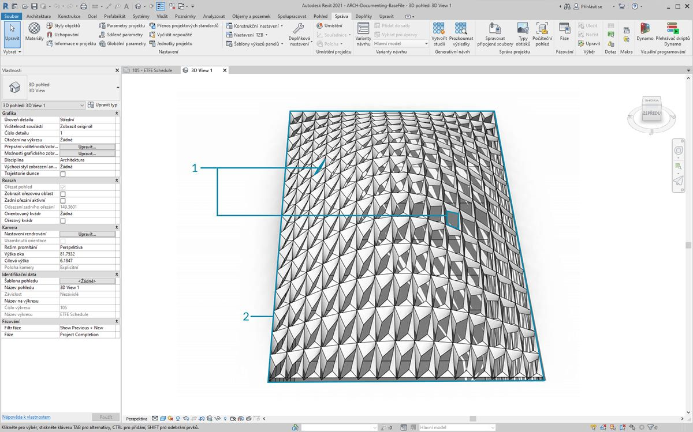
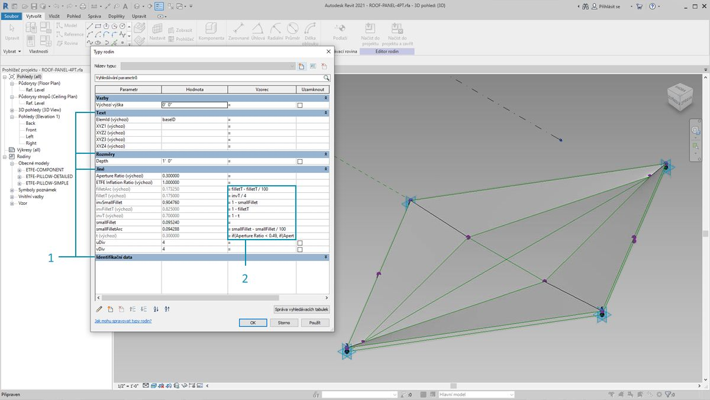
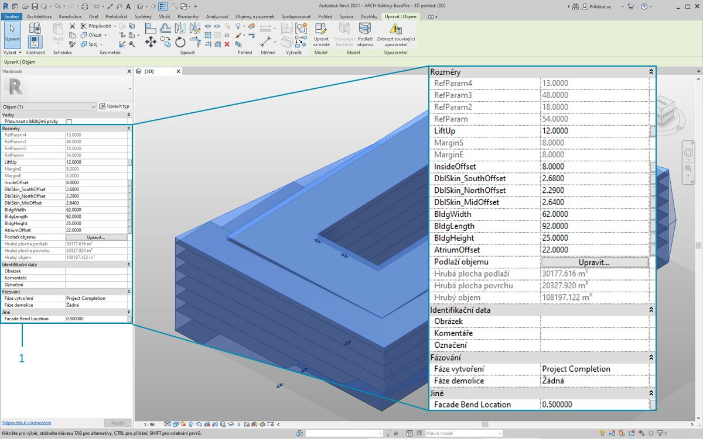
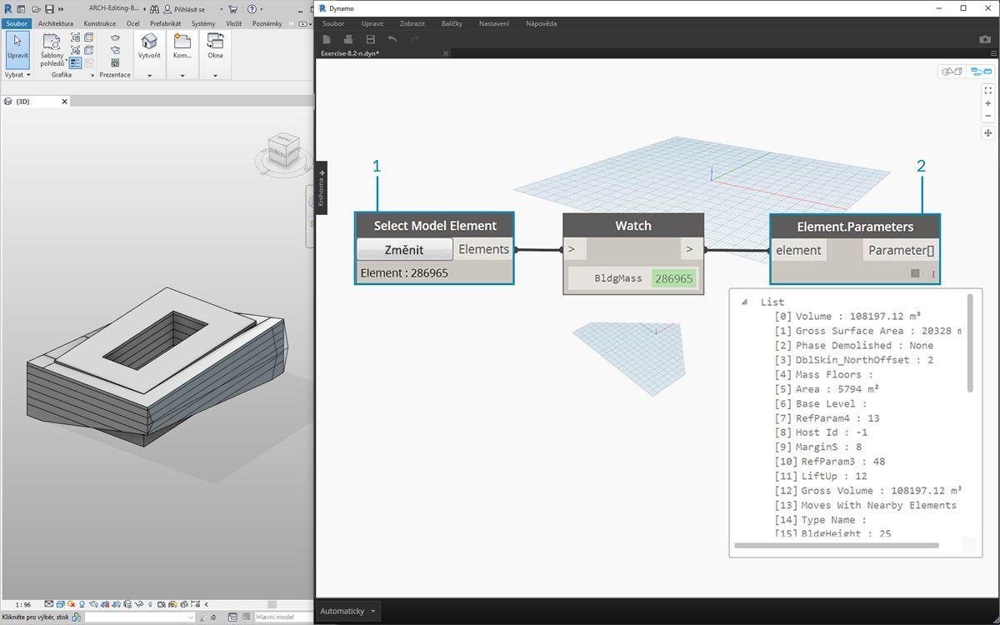
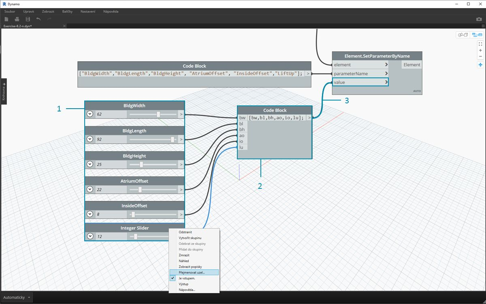
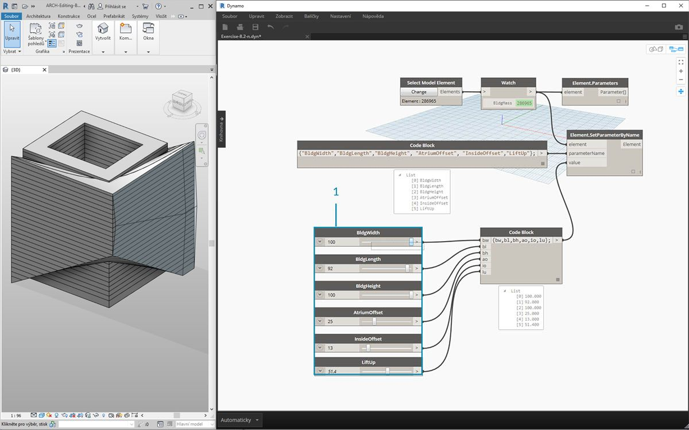
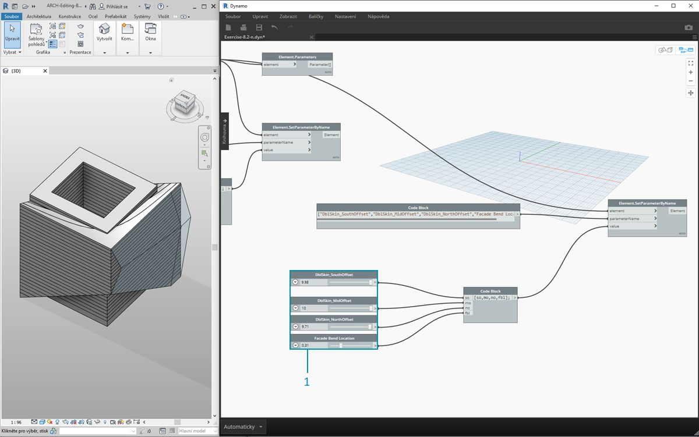

## Úpravy

Výkonnou funkcí aplikace Dynamo je, že můžete upravovat parametry na parametrické úrovni. Například generativní algoritmus nebo výsledky simulace lze použít k řízení parametrů pole prvků. Tímto způsobem může sada instancí ze stejné rodiny obsahovat uživatelské vlastnosti v projektu aplikace Revit.

### Parametry typu a instance



> 1. Parametry instance definují otvor panelů na povrchu střechy v rozsahu Poměr otvoru od 0.1 do 0.4.
2. Parametry založené na typu jsou použity u každého prvku na povrchu, protože se jedná o stejný typ rodiny. Materiál každého panelu může být například řízen parametrem založeným na typu.



> 1. Pokud jste již vytvořili rodinu aplikace Revit, nezapomeňte, že je nutné přiřadit typ parametru (řetězec, číslo, kóta atd.) Při přiřazování parametrů z aplikace Dynamo zkontrolujte, zda používáte správný typ dat.
2. Aplikaci Dynamo můžete použít také v kombinaci s parametrickými vazbami definovanými ve vlastnostech rodiny aplikace Revit.

Jako rychlý přehled parametrů v aplikaci Revit si ukážeme, že existují parametry typu a parametry instance. Oba lze upravovat pomocí aplikace Dynamo, ale v níže uvedeném cvičení budeme pracovat s parametry instance.

Poznámka: Když objevíte rozsáhlé použití parametrů úprav, můžete chtít v aplikaci Revit pomocí aplikace Dynamo upravit velké množství prvků. Může to být *výpočetně nákladná* operace, což znamená, že může být pomalá. Pokud upravujete velký počet prvků, můžete použít funkci „zmrazit“ uzlu, aby bylo možné pozastavit provádění operací aplikace Revit při vytváření grafu. Další informace o zmrazení uzlů najdete v části „Zmrazení“ v kapitole [Tělesa](../05_Geometry-for-Computational-Design/5-6_solids.md#freezing).

#### Jednotky

Od verze 0.8 je aplikace Dynamo v zásadě bez jednotek. Díky tomu může aplikace Dynamo zůstat abstraktním vizuálním programovacím prostředím. Uzly aplikace Dynamo, které spolupůsobí s kótami aplikace Revit, budou odkazovat na jednotky projektu aplikace Revit. Pokud například nastavujete parametr délky v aplikaci Revit z aplikace Dynamo, číslo v aplikaci Dynamo pro danou hodnotu bude odpovídat výchozím jednotkám v projektu aplikace Revit. Níže uvedené cvičení funguje v metrech.


> K rychlému převodu jednotek použijte uzel *Convert Between Units*. Jedná se o užitečný nástroj pro konverzi délkových, plošných a objemových jednotek za pochodu.

### Cvičení

> Stáhněte si ukázkové soubory, které jsou přiloženy k tomuto cvičení (klikněte pravým tlačítkem a vyberte příkaz Uložit odkaz jako...). Úplný seznam vzorových souborů naleznete v dodatku.

> 1. [Editing.dyn](datasets/8-3/Editing.dyn)
2. [ARCH-Editing-BaseFile.rvt](datasets/8-3/ARCH-Editing-BaseFile.rvt)

Toto cvičení je zaměřeno na úpravy prvků aplikace Revit bez provedení geometrické operace v aplikaci Dynamo. Zde neimportujeme geometrii aplikace Dynamo, pouze upravujeme parametry v projektu aplikace Revit. Toto cvičení je základní, pokročilejší uživatelé aplikace Revit si mohou všimnout, že se jedná o parametry instance objemu, ale stejnou logiku lze použít na pole prvků, které chcete přizpůsobit ve velkém měřítku. To je vše s uzlem Element.SetParameterByName.



> Začněte s ukázkovým souborem aplikace Revit pro tuto část. Z předchozího řezu jsme odstranili konstrukční prvky a adaptivní příhradové nosníky. V tomto cvičení se zaměříme na parametrický nýt v aplikaci Revit a v aplikaci Dynamo provedeme manipulaci.

> 1. Po výběru budovy v položce Objem v aplikaci Revit se na panelu vlastností zobrazí pole parametrů instance.



> 1. Vyberte objem budovy pomocí uzlu *Select Model Element*.
2. Všechny parametry tohoto objemu lze dotazovat pomocí uzlu *Element.Parameters*. To zahrnuje parametry typu a instance.


> 1. Pomocí odkazu na uzel *Element.Parameters* vyhledejte cílové parametry. Nebo si můžeme v předchozím kroku prohlédnout panel vlastností a vybrat si názvy parametrů, které chcete upravit. V tomto případě hledáme parametry, které ovlivňují velké geometrické pohyby na objemu budovy.
2. Provedeme změny prvku aplikace Revit pomocí uzlu *Element.SetParameterByName*.
3. Pomocí *bloku kódu* definujeme seznam těchto parametrů s uvozovkami, které označují řetězec, kolem každé položky. Také můžeme použít uzel List.Create s řadou uzlů *string* připojených k více vstupům. Blok kódu je jednoduše rychlejší a jednodušší. Jen se ujistěte, že řetězec odpovídá přesnému názvu v aplikaci Revit, specifickému pro jednotlivé případy: ```{BldgWidth, BldgLength, BldgHeight, AtriumOffset, InsideOffset, LiftUp};```



> 1. Také chceme určit hodnoty pro každý parametr. Přidejte na kreslicí plochu šest *„posuvníků celých čísel“* a přejmenujte jej na odpovídající parametr v seznamu. Dále nastavte hodnoty každého posuvníku na výše uvedený obrázek. V pořadí shora dolů: ```62,92,25,22,8,12```
2. Definujte další *blok kódu* se seznamem stejné délky jako názvy parametrů. V tomto případě pojmenujeme proměnné (bez uvozovek), které vytvářejí vstupy pro blok kódu *.* *Posuvníky* lze přidat do každého z nich: ```{bw,bl,bh,ao,io,lu};```
3. Připojte *blok kódu* k uzlu *Element.SetParameterByName*. Po automatické kontrole spuštění se výsledky automaticky zobrazí.

**Poznámka – tato ukázka funguje s parametry instance, ale ne s parametry typu.*

 Stejně jako v aplikaci Revit je mnoho z těchto parametrů závislých na sobě navzájem. Samozřejmě existují kombinace, ve kterých se může geometrie přerušit. Tento problém můžeme vyřešit definovanými vzorci ve vlastnostech parametru nebo můžeme nastavit podobnou logiku pomocí matematických operací v aplikaci Dynamo (pokud si chcete cvičení rozšířit, je to další výzva).

> 1. Tato kombinace poskytuje nový návrh objemu budovy: ```100,92,100,25,13,51.4```


> 1. Zkopírujme graf a zaměřme se na fasádové zasklení, které bude obsahovat systém příhradových nosníků. V tomto případě izolujeme čtyři parametry: ```{DblSkin_SouthOffset,DblSkin_MidOffset,DblSkin_NorthOffset,Facade Bend Location};```
2. Dále vytvoříme *posuvníky čísel* a přejmenujeme je na příslušné parametry. První tři posuvníky shora dolů by měly být přemapovány na doménu s obsahem [0,10], zatímco poslední posuvník *Facade Bend Location* by měl být přemapován na doménu s obsahem [0,1]. Tyto hodnoty by měly odshora dolů vycházet z těchto hodnot (i když jsou libovolné): ```2,68,2.64,2.29,0.5```
3. Definujte nový *blok kódu* a připojte posuvníky: ```{so,mo,no,fbl};```



> 1. Změnou *posuvníků* v této části grafu můžeme udělat fasádové zasklení mnohem větší: ```9.98,10.0,9.71,0.31```

