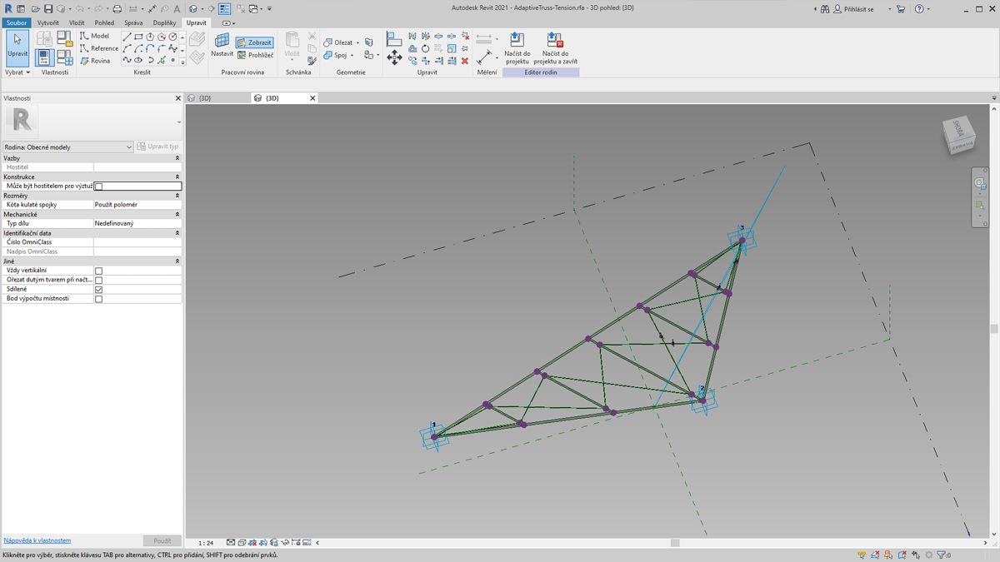
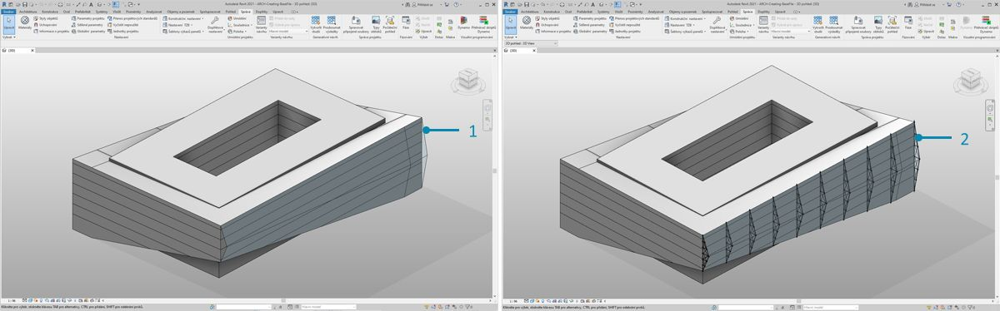
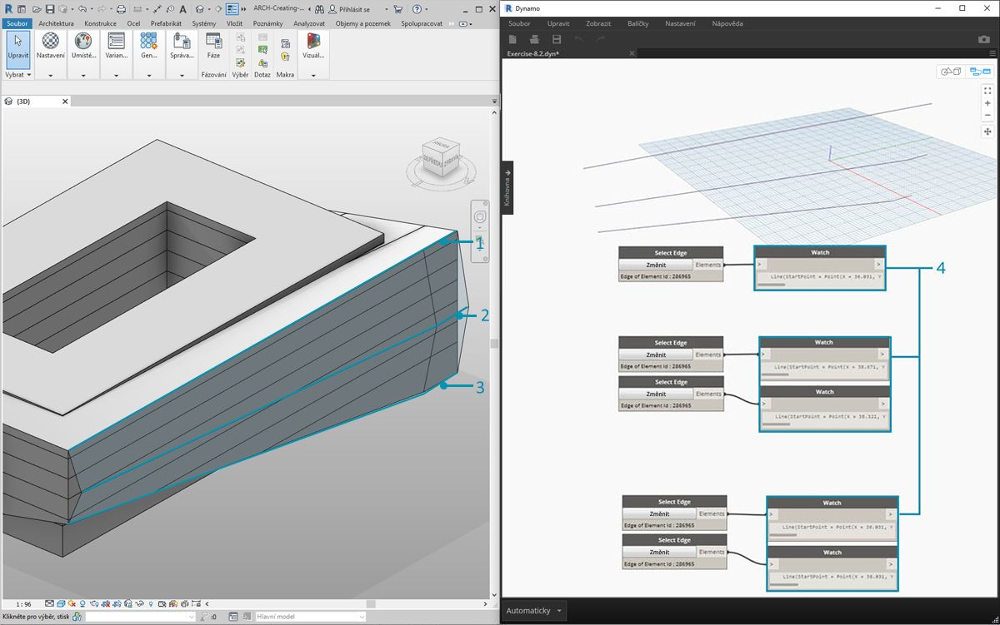
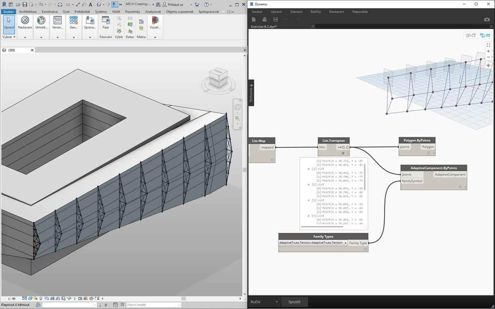
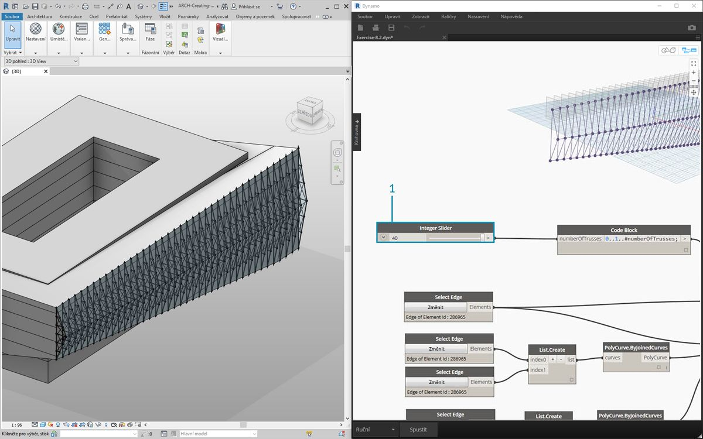
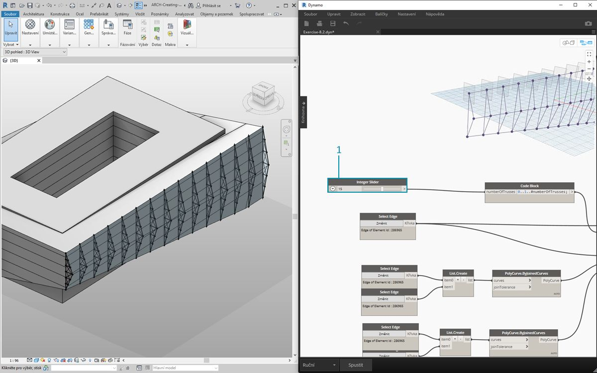
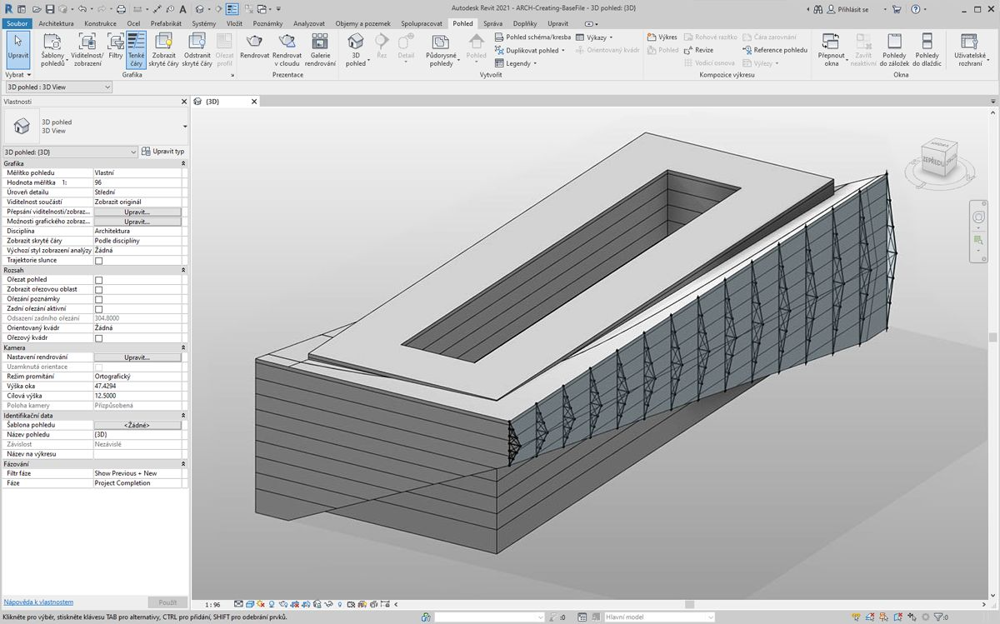
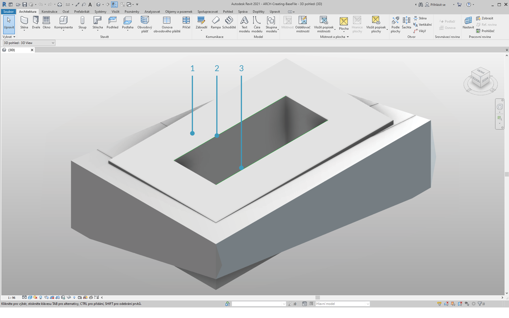
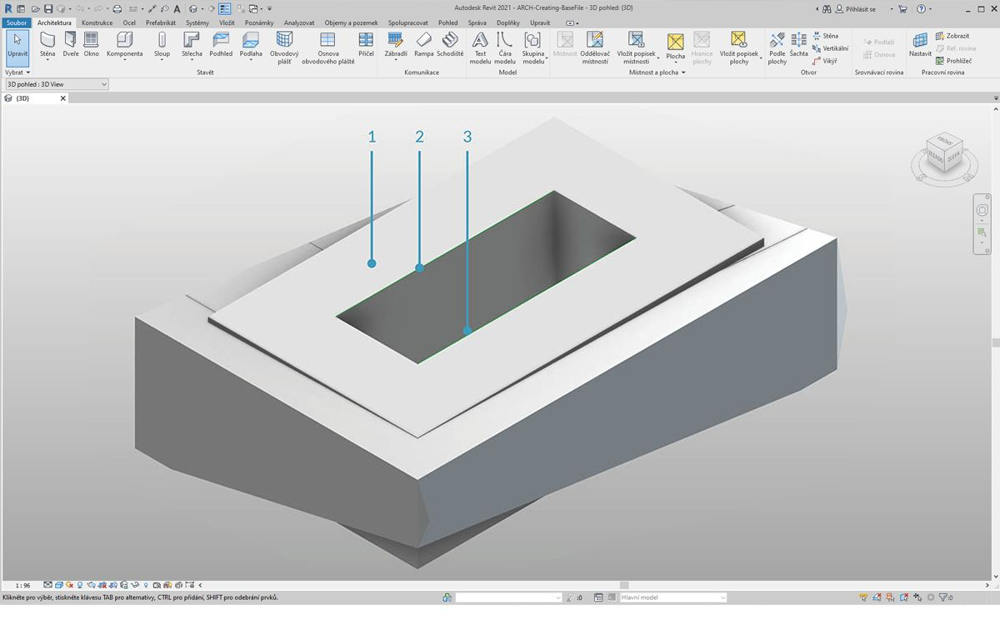
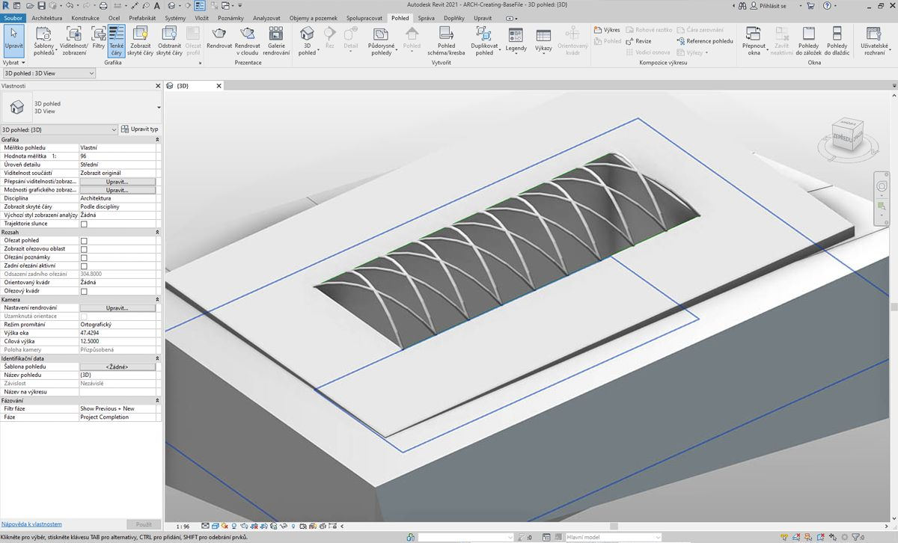

## Tvorba

V aplikaci Dynamo můžete pomocí plně parametrického ovládání vytvořit pole prvků aplikace Revit. Uzly aplikace Revit v aplikaci Dynamo nabízí možnost importovat prvky z obecných geometrií do určitých typů kategorií (například stěny a podlaží). V této části se zaměříme na import parametricky flexibilních prvků s adaptivními komponentami.


### Adaptivní komponenty

Adaptivní komponenta je flexibilní kategorie rodiny, která se dobře hodí ke generativním aplikacím. Po vytvoření instance můžete vytvořit složitý geometrický prvek, který je řízen základním umístěním adaptivních bodů.



> Příklad tříbodové adaptivní komponenty v Editoru rodin. Tím se vytvoří příhradový nosník, který je definován pozicí každého adaptivního bodu. V níže uvedeném cvičení vygenerujeme pomocí této komponenty sérii příhradových nosníků přes celé průčelí.

#### Principy interoperability

Adaptivní komponenta je dobrým příkladem doporučených postupů interoperability. Pole adaptivních komponent je možné vytvořit definováním základních adaptivních bodů. A při přenosu těchto dat do jiných programů existuje možnost zredukovat geometrii na jednoduchá data. Import a export pomocí programu, jako je například aplikace Excel, se řídí podobnou logikou.

Řekněme, že konzultant průčelí chce znát umístění prvků příhradových nosníků, aniž by bylo třeba počítat s plně kloubovou geometrií. Při přípravě výroby se může konzultant odkazovat na umístění adaptivních bodů a regenerovat geometrii v programech, jako je Inventor.

Pracovní postup použitý v níže uvedeném cvičení umožňuje přístup ke všem těmto datům při tvorbě definice pro tvorbu prvků aplikace Revit. Tímto procesem sjednotíme konceptualizaci, dokumentaci a výrobu do jednoho plynulého pracovního postupu. Tímto se vytvoří inteligentnější a efektivnější proces pro interoperabilitu.

#### Více prvků a seznamů


Níže uvedené cvičení znázorňuje, jak aplikace Dynamo odkazuje na data pro tvorbu prvků aplikace Revit. Chcete-li vytvořit více adaptivních komponent, definujte seznam seznamů, kde každý seznam obsahuje tři body představující každý bod adaptivní komponenty. Toto mějte na paměti při správě datových struktur v aplikaci Dynamo.

### Cvičení

> Stáhněte si ukázkové soubory, které jsou přiloženy k tomuto cvičení (klikněte pravým tlačítkem a vyberte příkaz Uložit odkaz jako...). Úplný seznam vzorových souborů naleznete v dodatku.

> 1. [Creating.dyn](datasets/8-4/Creating.dyn)
2. [ARCH-Creating-BaseFile.rvt](datasets/8-4/ARCH-Creating-BaseFile.rvt)



> Počínaje tímto souborem příkladu z této části (případně pokračováním v práci se souborem aplikace Revit v předchozí relaci) se zobrazuje stejný objem aplikace Revit.

> 1. Takto soubor vypadá po otevření.
2. Toto je systém příhradových nosníků vytvořený pomocí aplikace Dynamo, který je inteligentně propojen s objemem aplikace Revit.



> Byly použity uzly *„Vybrat prvek modelu“* a *„Vybrat plochu“* a nyní pokračujeme o jeden krok v hierarchii geometrie níže a použijeme příkaz *„Vybrat hranu“*. Pokud je spouštění výpočetního modulu aplikace Dynamo nastaveno na hodnotu *Automaticky“*, graf se bude průběžně aktualizovat podle změn v souboru aplikace Revit. Vybraná hrana je dynamicky svázána s topologií prvků aplikace Revit. Dokud se topologie* nezmění, připojení mezi aplikacemi Revit a Dynamo zůstane aktivní.

> 1. Vyberte nejhornější křivku proskleného průčelí. Tato křivka se táhne přes celou délku budovy. Pokud máte s výběrem hrany potíže, nezapomeňte, že můžete vybrat výběr v aplikaci Revit přesunutím kurzoru nad hranu a opakovaným stisknutím klávesy *„Tab“*, dokud se nezvýrazní požadovaná hrana.
2. Pomocí dvou uzlů *„Vybrat hranu“* vyberte každou hranu představující náklon uprostřed průčelí.
3. Totéž proveďte u dolních hran průčelí v aplikaci Revit.
4. Uzly *Watch* zobrazují, že se nyní v aplikaci Dynamo nacházejí čáry. Toto se automaticky převede na geometrii aplikace Dynamo, protože hrany samy nejsou prvky aplikace Revit. Tyto křivky jsou reference, pomocí kterých se vytvoří instance adaptivních příhradových nosníků na průčelí.

**Poznámka – Abychom zachovali konzistentní topologii, odkazujeme se na model, který nemá přidána další průčelí ani hrany. Zatímco parametry mohou změnit její tvar, způsob, jakým je vytvořena, zůstává konzistentní.*


> Nejprve je potřeba spojit křivky a sloučit je do jednoho seznamu. Tímto způsobem je možné *„seskupit“* křivky za účelem provedení operací geometrie.

> 1. Vytvořte seznam pro dvě křivky uprostřed průčelí.
2. Spojte tyto dvě křivky do objektu Polycurve připojením komponenty *List.Create* do uzlu *Polycurve.ByJoinedCurves*.
3. Vytvořte seznam pro dvě křivky v dolní části průčelí.
4. Spojte tyto dvě křivky do objektu Polycurve připojením komponenty *List.Create* do uzlu *Polycurve.ByJoinedCurves*.
5. Nakonec spojte tři hlavní křivky (jednu úsečku a dva objekty polycurve) do jednoho seznamu.


> Chceme využít horní křivku, což je čára představující plný rozsah průčelí. Vytvoříme roviny podél této čáry protínající se se sadou křivek, které byly seskupeny v seznam.

> 1. V *bloku kódu* definujte rozsah pomocí syntaxe: ```0..1..#numberOfTrusses;```
2. Do vstupu bloku kódu přidejte *celočíselný posuvník *. Jak jste už možná uhodli, toto bude představovat počet příhradových nosníků. Všimněte si, že posuvník ovládá počet položek v rozsahu definovaném od *0* do *1*.
3. Připojte *blok kódu* zapište ke vstupu *param* uzlu *„Curve.PlaneAtParameter“* a připojte horní hranu ke vstupu *curve*. Tímto získáte deset rovin rovnoměrně rozložených po celém rozsahu průčelí.


> Rovina je abstraktní část geometrie, která představuje dvourozměrný prostor, který je nekonečný. Roviny jsou skvělé k tvorbě obrysů a protínání, což provedeme i v tomto kroku.

> 1. Pomocí uzlu *Geometry.Intersect* (všimněte si vázání kartézského součinu) připojte uzel *Curve.PlaneAtParameter* do vstupu *entity* uzlu *Geometry.Intersect*. Připojte hlavní uzel *List.Create* ke vstupu *geometry*. Nyní jsou ve výřezu aplikace Dynamo zobrazeny body, které představují průsečík každé křivky s definovanými rovinami.


> Všimněte si, že výstup je seznam seznamů. Příliš mnoho seznamů pro tento účel. Je třeba zde provést částečné vyrovnání. Je také třeba postoupit o krok níže v seznamu a vyrovnat výsledek. K tomuto účelu použijte operaci *List.Map*, jak je popsáno v kapitole o seznamech.

> 1. Připojte uzel *Geometry.Intersect* ke vstupu seznamu uzlu *List.Map*.
2. Připojte uzel *Flatten* ke vstupu f(x) uzlu *List.Map*. Výsledkem jsou 3 seznamy a každý z nich obsahuje stejný počet příhradových nosníků.
3. Tato data je třeba změnit. Pokud chceme vytvořit instanci příhradového nosníku, je nutné použít stejný počet adaptivních bodů, jaký je definován v rodině. Jedná se o tříbodovou adaptivní komponentu, takže místo tří seznamů o 10 položkách (numberOfTrusses) chceme 10 seznamů o 3 položkách. Tímto způsobem je možné vytvořit 10 adaptivních komponent.
4. Připojte uzel *List.Map* k uzlu *List.Transpose*. Nyní máme požadovaný výstup dat.
5. Chcete-li potvrdit správnost dat, přidejte na kreslicí plochu uzel *Polygon.ByPoints* a zkontrolujte náhled v aplikaci Dynamo.


> Stejným způsobem jako jste vytvořili polygony, uspořádejte do pole i adaptivní komponenty.

> 1. Přidejte na kreslicí plochu uzel *AdaptiveComponent.ByPoints* a připojte uzel *List.Transpose* ke vstupu *points*.
2. Pomocí uzlu *Family Types* vyberte rodinu *„AdaptiveTruss“* a připojte ji ke vstupu *familySymbol* uzlu *AdaptiveComponent.ByPoints*.



> Při kontrole v aplikaci Revit zjistíme, že nyní máme deset příhradových nosníků rovnoměrně rozložených po průčelí.



> 1. Při kontrole grafu zvyšte hodnotu *numberOfTrusses* na *40* pomocí *posuvníku*. Mnohé příhradové nosníky nejsou příliš realistické, ale parametrické propojení funguje.



> 1. V rámci úprav systému příhradových nosníků zadejte kompromisnější počet *15* u hodnoty *numberOfTrusses*.



> A v rámci posledního testu můžeme výběrem objemu v aplikaci Revit a úpravou parametrů instance změnit tvar budovy a sledovat chování příhradových nosníků. Nezapomeňte, že abyste tyto aktualizace mohli vidět, graf aplikace Dynamo musí být otevřený, a propojení bude přerušeno ihned, jakmile bude graf zavřen.

### Prvky přímých tvarů

Další metodou importu parametrické geometrie aplikace Dynamo do aplikace Revit je DirectShape. V souhrnu prvek DirectShape a související třídy podporují možnost externě ukládat vytvořené geometrické tvary do dokumentu aplikace Revit. Geometrie může obsahovat uzavřená tělesa nebo sítě. Prvek DirectShape je primárně určen k importu tvarů z jiných datových formátů, například IFC nebo STEP, kde není k dispozici dostatek informací k vytvoření „skutečného“ prvku aplikace Revit. Prvek DirectShape, podobně jako u pracovního postupu formátů IFC a STEP, funguje dobře při importu geometrií vytvořených v aplikaci Dynamo do projektů aplikace Revit jako skutečných prvků.

Nyní následuje rozbor a cvičení týkající se importu geometrie aplikace Dynamo jako prvku DirectShape do projektu aplikace Revit. Pomocí této metody můžeme přiřadit importované geometrii kategorii, materiál a název – to vše při zachování parametrického propojení s grafem aplikace Dynamo.

### Cvičení

> Stáhněte si ukázkové soubory, které jsou přiloženy k tomuto cvičení (klikněte pravým tlačítkem a vyberte příkaz Uložit odkaz jako...). Úplný seznam vzorových souborů naleznete v dodatku.

> 1. [DirectShape.dyn](datasets/8-4/DirectShape.dyn)
2. [ARCH-DirectShape-BaseFile.rvt](datasets/8-4/ARCH-DirectShape-BaseFile.rvt)



> Začněte otevřením vzorového souboru této lekce – ARCH-DirectShape-BaseFile.rvt.

> 1. Ve 3D pohledu uvidíte objem budovy z předchozí lekce.
2. Podél hrany atria vede jedna referenční křivka, na kterou se poté v aplikaci Dynamo odkážeme.
3. Podél protilehlé hrany atria je další referenční křivka, na kterou se v aplikaci Dynamo odkážeme také.


> 1. Pokud se chcete odkázat na geometrii, použijte možnost *Vybrat prvek modelu* v aplikaci Revit u každého členu. Vyberte objem v aplikaci Revit a importujte geometrii do aplikace Dynamo pomocí metody *Element.Faces* – objem by měl být nyní viditelný v náhledu aplikace Dynamo.
2. Pomocí možnosti *Vybrat prvek modelu* a uzlu *CurveElement.Curve* importujte do aplikace Dynamo jednu referenční křivku.
3. Pomocí možnosti *Vybrat prvek modelu* a uzlu *CurveElement.Curve* importujte do aplikace Dynamo tu druhou referenční křivku.


> 1. Po oddálení a posunu pohledu doprava ve vzorovém grafu je vidět velká skupina uzlů – jedná se o geometrické operace, které generují konstrukci mřížkované střechy viditelnou v náhledu aplikace Dynamo. Tyto uzly se generují pomocí funkce *Uzel na kód*, jak je popsáno v [části bloku kódu](../07_Code-Block/7-2_Design-Script-syntax.md#Node) této příručky.
2. Konstrukce je řízena třemi hlavními parametry – diagonální posun, nadvýšení a poloměr.


> Zde je vidět podrobné přiblížení parametrů tohoto grafu. Tyto parametry je možné upravit, tak aby bylo možné dosáhnout jiných výstupních geometrií.



> 1. Jakmile přetáhnete uzel *DirectShape.ByGeometry* na kreslicí plochu, uvidíte, že obsahuje čtyři vstupy: **geometry, category, material** a **name**.
2. Vstup geometry bude těleso vytvořené v části tvorby geometrie grafu.
3. Vstup category je možné vybrat pomocí rozevíracího seznamu *Kategorie*. V tomto případě se použije možnost „Rámová konstrukce“.
4. Vstup material se vybere pomocí výše uvedeného pole uzlů – v tomto případě je však možné jej snadno definovat jako „Výchozí“.



> Po spuštění aplikace Dynamo se bude v aplikaci Revit uvnitř projektu na střeše nacházet importovaná geometrie. Jedná se spíš o prvek rámové konstrukce než o obecný model. Parametrické propojení s aplikací Dynamo zůstane neporušené.


