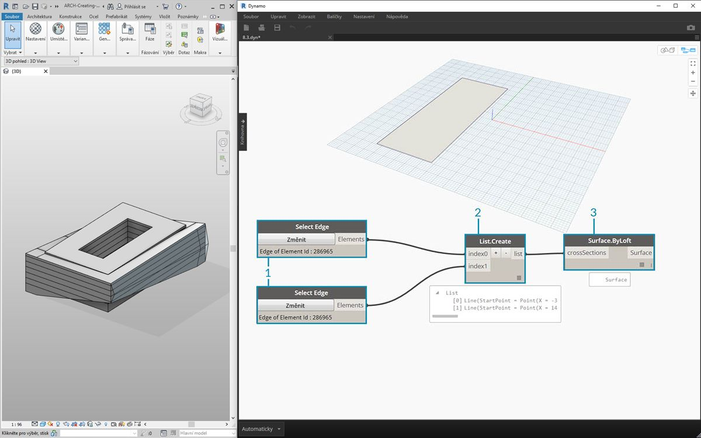
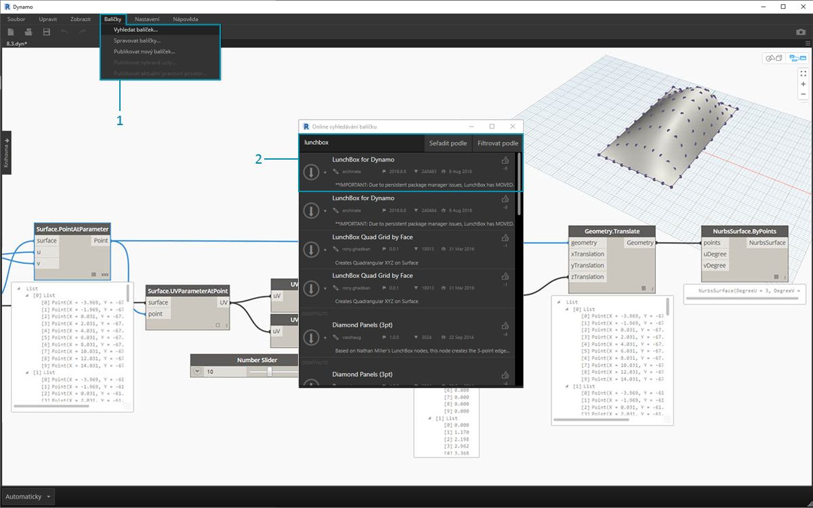
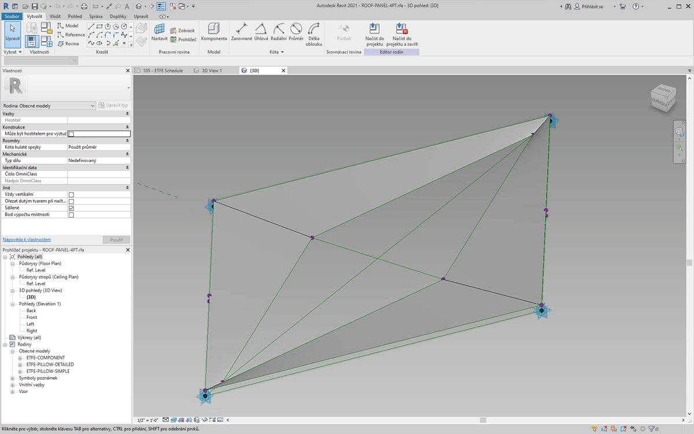
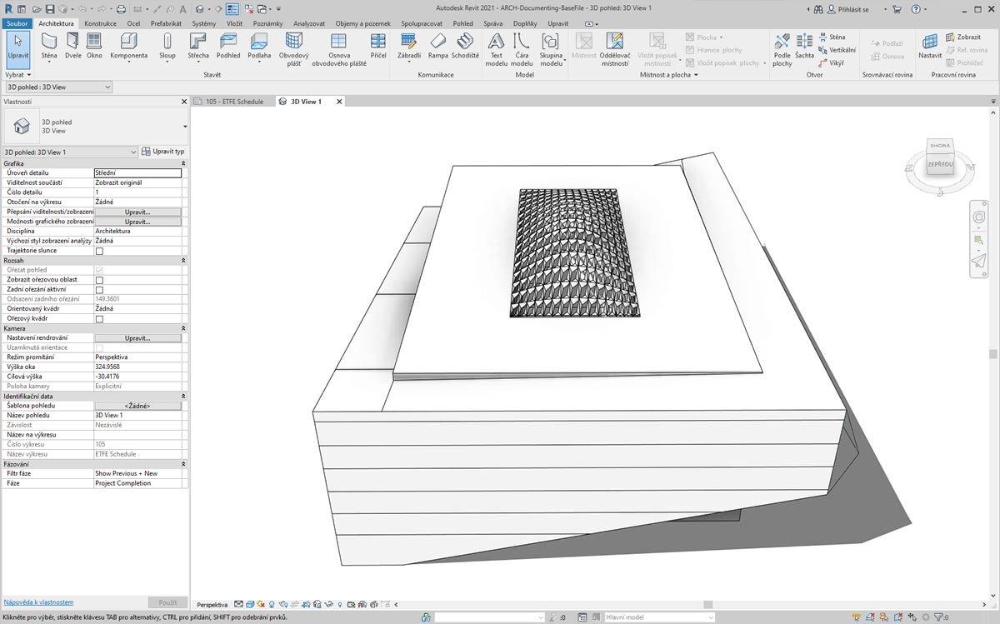
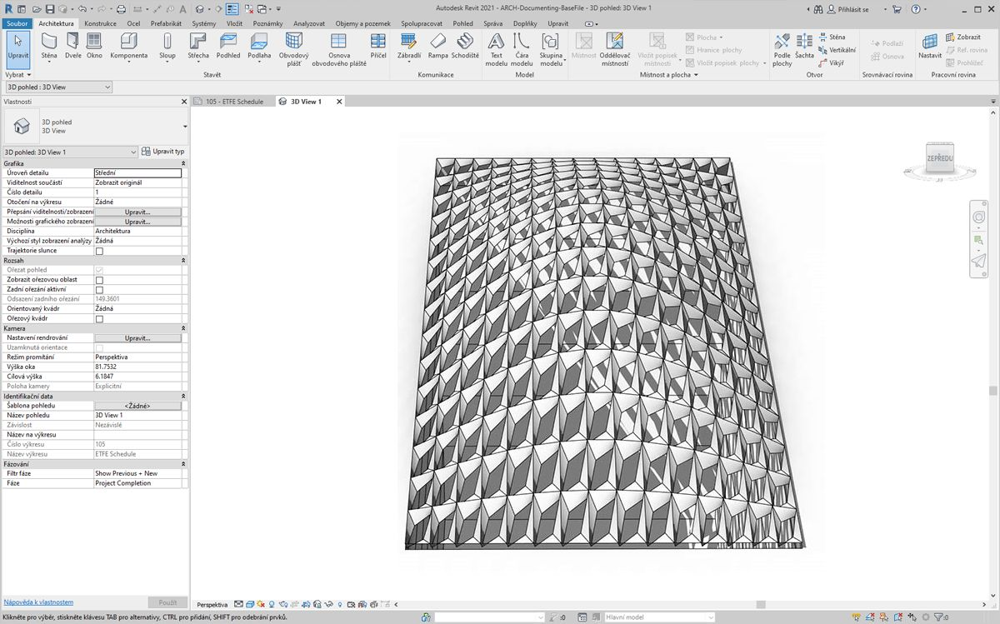
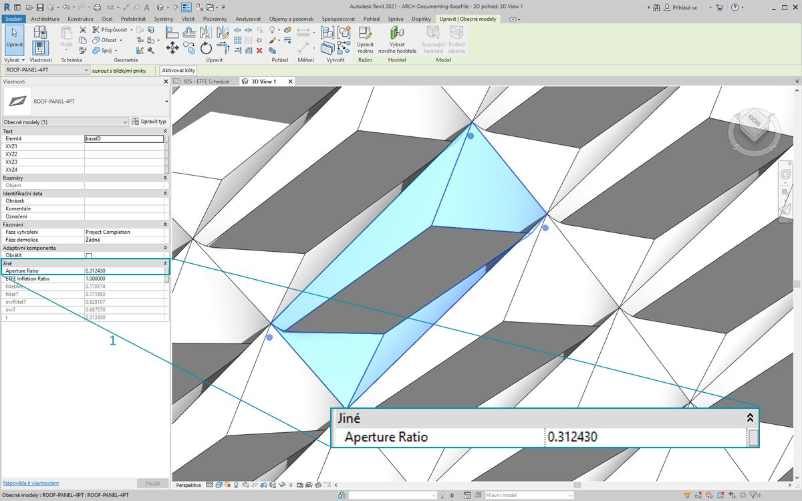
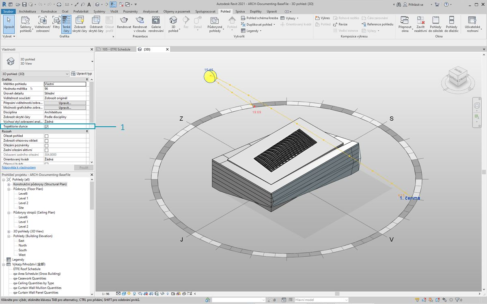
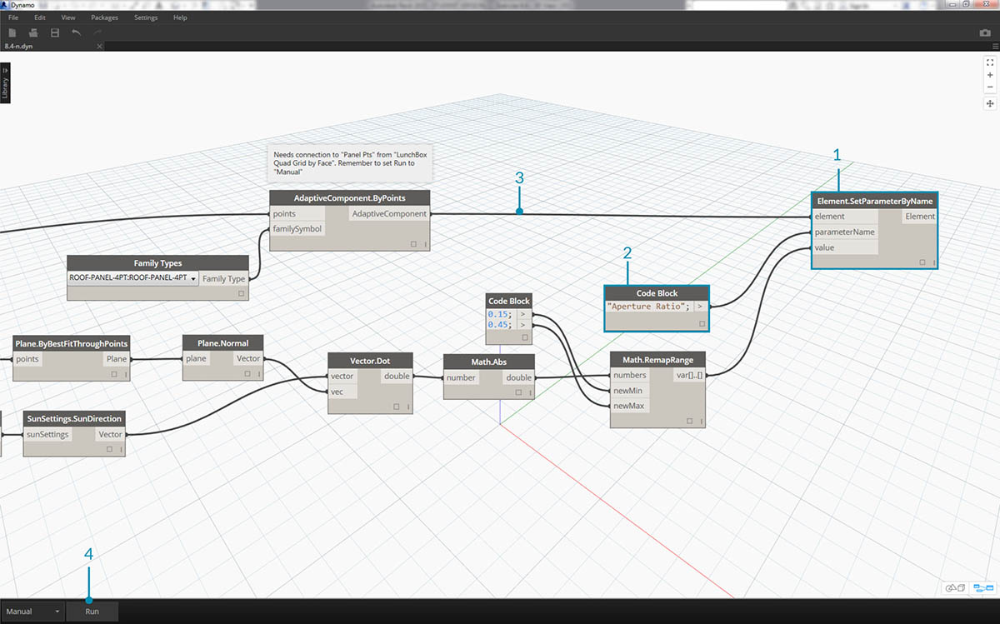
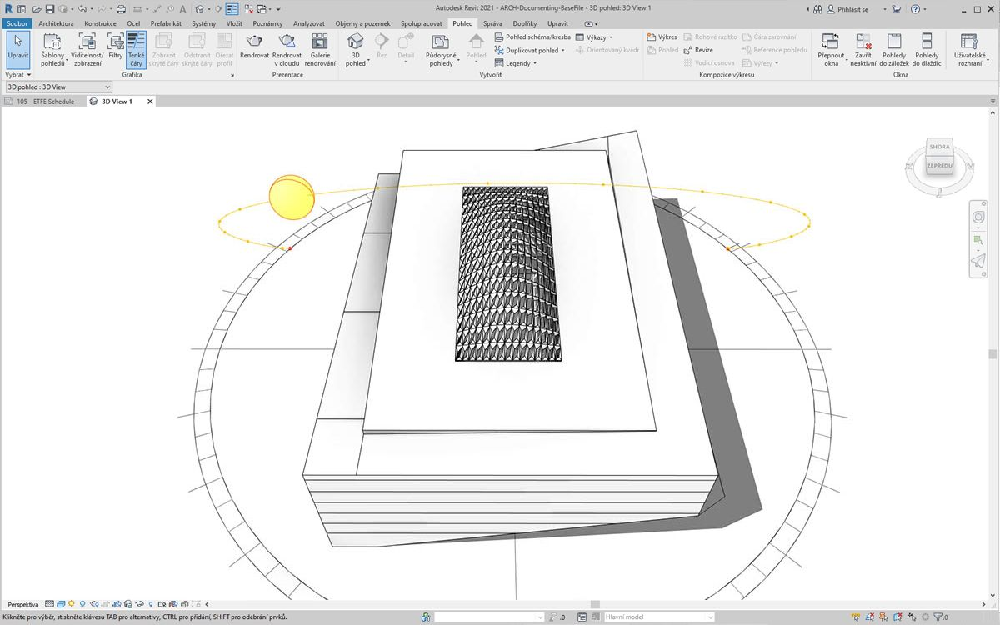

## Přizpůsobení

Zatímco v předchozích částech byl kladen důraz na úpravu základního objemu budovy, tato část se zabývá více propojením aplikací Dynamo a Revit, konkrétně úpravou velkého počtu prvků najednou. Přizpůsobení ve velkém měřítku je čím dál složitější během toho, jak datové struktury vyžadují pokročilejší operace seznamů. Základní principy za jejich prováděním však zůstávají v podstatě stejné. Následuje popis několika příležitostí k analýze v sadě adaptivních komponent.

#### Umístění bodu

Řekněme, že byl vytvořen určitý počet adaptivních komponent a vy chcete upravit parametry podle jejich umístění bodů. Body by mohly například řídit parametr tloušťky, který souvisí s plochou prvku. Nebo by mohly řídit parametr průhlednosti, který souvisí s vystavením slunečnímu záření po celý rok. Aplikace Dynamo umožňuje analýzu parametrů v několika snadných krocích, přičemž základní verze analýzy je popsána ve cvičení níže.


> Zadejte dotaz na adaptivní body vybrané adaptivní komponenty pomocí uzlu *AdaptiveComponent.Locations*. Toto vám umožní pracovat během analýzy s abstrahovanou verzí prvku aplikace Revit.

Extrahování umístění bodu adaptivních komponent vám umožní spustit celou řadu analýz pro daný prvek. Například čtyřbodová adaptivní komponenta umožní studovat odchylku od roviny u daného panelu.

#### Analýza orientace slunečního záření


> Pomocí přemapování můžete namapovat sadu dat na rozsah parametru. Jedná se o základní nástroj používaný v parametrických modelech a je znázorněn v níže uvedeném cvičení.

V aplikaci Dynamo je možné pomocí umístění bodů adaptivních komponent vytvořit nejlépe přizpůsobenou rovinu pro každý prvek. Také můžete zadat dotaz na pozici slunce v souboru aplikace Revit a studovat orientaci roviny vzhledem ke slunci v porovnání s jinými adaptivními komponentami. V níže uvedeném cvičení toto nastavíme vytvořením algoritmických střech.

### Cvičení

> Stáhněte si ukázkové soubory, které jsou přiloženy k tomuto cvičení (klikněte pravým tlačítkem a vyberte příkaz Uložit odkaz jako...). Úplný seznam vzorových souborů naleznete v dodatku.

> 1. [Customizing.dyn](datasets/8-5/Customizing.dyn)
2. [ARCH-Customizing-BaseFile.rvt](datasets/8-5/ARCH-Customizing-BaseFile.rvt)

Toto cvičení rozšiřuje techniky znázorněné v předchozí části. V tomto případě definujeme parametrický povrch z prvků aplikace Revit, dále vytvoříme instance čtyřbodových adaptivních komponent a poté je upravíme podle orientace vzhledem ke slunci.



> 1. Začněte výběrem dvou hran pomocí uzlu *„Select Edge“*. Tyto dvě hrany jsou dvě dlouhá rozpětí atria.
2. Spojte dvě hrany do jednoho seznamu pomocí uzlu *List.Create*.
3. Vytvořte mezi dvěma hranami povrch pomocí uzlu *Surface.ByLoft*.


> 1. Pomocí *bloku kódu* definujte rozsah od 0 do 1 s 10 rovnoměrně rozmístěnými hodnotami: ```0..1..#10;```
2. Připojte *blok kódu* ke vstupům *u* a *v* uzlu *Surface.PointAtParameter* a připojte uzel *Surface.ByLoft* ke vstupu *surface*. Klikněte pravým tlačítkem na uzel a změňte *vázání* na *Vektorový součin*. Tím se vytvoří osnova bodů na povrchu.

Tato osnova bodů slouží jako řídicí body parametricky definovaného povrchu. Je třeba extrahovat pozice u a v každého z těchto bodů, aby bylo možné je připojit k parametrickému vzorci a zachovat stejnou datovou strukturu. Toho dosáhnete zadáním dotazu na umístění parametrů bodů, které jste právě vytvořili.


> 1. Přidejte na kreslicí plochu uzel *Surface.ParameterAtPoint* a připojte vstupy, jak je znázorněno výše.
2. Zadejte dotaz na hodnoty *u* těchto parametrů pomocí uzlu *UV.U*.
3. Zadejte dotaz na hodnoty *v* těchto parametrů pomocí uzlu *UV.V*.
4. Výstup zobrazuje odpovídající hodnoty *u* a *v* pro každý bod povrchu. Nyní existuje rozsah od *0* do *1* pro každou hodnotu ve správné datové struktuře, čili je vše připraveno k použití parametrického algoritmu.


> 1. Přidejte na kreslicí plochu *blok kódu* a zadejte tento kód: ```Math.Sin(u*180)*Math.Sin(v*180)*w;``` Jedná se o parametrickou funkci, která z plochého povrchu vytvoří sinusový oblouk.
2. Vstup *u* se připojí k uzlu *UV.U*.
3. Vstup *v* se připojí k uzlu *UV.V*.
4. Vstup *w* představuje *amplitudu* tvaru, takže k němu připojíme *posuvník čísel*.


> 1. Nyní máme seznam hodnot definovaných algoritmem. Pomocí tohoto seznamu hodnot přesuňte body nahoru ve směru *+Z*. Pomocí uzlu *Geometry.Translate* připojte *blok kódu* ke vstupu *zTranslation* a uzel *Surface.PointAtParameter* připojte ke vstupu *geometry*. Nyní by se v náhledu aplikace Dynamo měly zobrazit nové body.
2. Nakonec vytvořte povrch pomocí uzlu *NurbsSurface.ByPoints* tím, že ke vstupu bodů připojíte uzel z předchozího kroku. Nyní máme parametrický povrch. Můžete volně přetahovat posuvník a pozorovat, jak se oblouk zmenšuje a zvětšuje.

U parametrického povrchu nyní chceme definovat způsob, jak z něj vytvořit panely a umístit tak čtyřbodové adaptivní komponenty do pole. Aplikace Dynamo nemá ve výchozím stavu funkci k vytvoření panelů z povrchu, čili je třeba prozkoumat komunitu a najít užitečné balíčky pro aplikaci Dynamo.


> 1. Přejděte do umístění *Balíčky > Vyhledat balíček...*
2. Hledejte řetězec *„LunchBox“* a stáhněte si balíček *„LunchBox for Dynamo“*. Jedná se o skutečně užitečnou sadu nástrojů pro operace geometrií, jako je právě tato.


> 1. Po stažení máte nyní plný přístup k sadě LunchBox. hledejte řetězec *„Quad Grid“* a vyberte položku *„LunchBox Quad Grid By Face“*. Připojte parametrický povrch ke vstupu *surface* a nastavte podíly *U* a *V* na hodnotu *15*. Nyní byste v náhledu aplikace Dynamo měli vidět povrch se čtyřmi panely.


> Pokud vás zajímá nastavení tohoto balíčku, klikněte dvakrát na uzel *Lunch Box* a zjistěte, jak funguje.


> Opět v aplikaci Revit se v rychlosti podíváme na adaptivní komponentu, kterou používáme. Není třeba ji stále sledovat, ale toto je o panel střechy, od kterého vytvoříme instanci. Jedná se o čtyřbodovou adaptivní komponentu, která je jednoduchou reprezentací systému ETFE. Otvor středového vybrání je u parametru s názvem *„ApertureRatio“*.


> 1. Chystáte se vytvořit instanci geometrie v aplikaci Revit, proto se ujistěte, že je řešič aplikace Dynamo nastaven na možnost *„Ruční“*.
2. Přidejte na kreslicí plochu uzel *Family Types* a vyberte položku *„ROOF-PANEL-4PT“*.
3. Přidejte na kreslicí plochu uzel *AdaptiveComponent.ByPoints* a připojte *body panelů* z výstupu balíčku *„LunchBox Quad Grid by Face“* ke vstupu *points*. Připojte uzel *Family Types* ke vstupu *familySymbol*.
4. Klikněte na možnost *Spustit*. Během tvorby geometrie bude aplikace Revit chvíli *přemýšlet*. Pokud to trvá příliš dlouho, snižte hodnotu *bloku kódu '15'* na nižší hodnotu. Tím se sníží počet panelů na střeše.

*Poznámka: Pokud aplikaci Dynamo trvá výpočet uzlů dlouho, bude možná užitečné využít funkce uzlu „freeze“, která pozastaví provádění operací aplikace Revit, zatímco vyvíjíte graf. Další informace o zmrazení uzlů naleznete v části „Zmrazení“ v [kapitole Tělesa](../05_Geometry-for-Computational-Design/5-6_solids.md#freezing).*


> Opět v aplikaci Revit je k dispozici pole panelů na střeše.



> Po přiblížení se můžete blíže podívat na kvality jejich povrchů.

### Analýza



> 1. V rámci pokračování z předchozího kroku nastavte otvor každého panelu podle jeho vystavení slunci. Pokud přiblížíte pohled v aplikaci Revit a vyberete jeden panel, uvidíte na panelu vlastností, že je zde parametr s názvem *Poměr otvoru*. Rodina je nastavena, tak aby měl otvor rozsah zhruba od *0,05* do *0,45*.


> 1. Pokud zapnete dráhu slunce, uvidíte aktuální umístění slunce v aplikaci Revit.


> 1. Na tuto polohu slunce se můžete odkázat pomocí uzlu *SunSettings.Current*.
2. Připojením nastavení slunce k uzlu *Sunsetting.SunDirection* získejte vektor slunečního záření.
3. U *bodů panelů* použitých k vytvoření adaptivních komponent aproximujte rovinu pro komponentu pomocí uzlu *Plane.ByBestFitThroughPoints*.
4. Zadejte dotaz na *normálu* této roviny.
5. K výpočtu orientace slunečního záření použijte *skalární součin*. Skalární součin je vzorec, který určuje, jak mohou dva vektory být rovnoběžné nebo nerovnoběžné. Čili vezmete normálu roviny každé adaptivní komponenty a porovnáte ji s vektorem slunečního záření, čímž zhruba nasimulujete orientaci slunečního záření.
6. Použijte *absolutní hodnotu* výsledku. Tím zajistíte, že bude skalární součin přesný, pokud je normála roviny otočena opačným směrem.
7. Klikněte na možnost *Spustit*.


> 1. Při pohledu na *skalární součin* je vidět, že máme k dispozici velký rozsah čísel. Chceme použít jejich relativní rozložení, ale je potřeba zhustit čísla do vhodného rozsahu parametru *„Poměr otvoru“*, který chceme upravit.
2. K tomuto účelu se skvěle hodí uzel *Math.RemapRange*. Ten vezme vstupní seznam a přemapuje jeho hranice na dvě cílové hodnoty.
3. Definujte cílové hodnoty *0.15* a *0.45* v *bloku kódu*.
4. Klikněte na možnost *Spustit*.



> 1. Připojte přemapované hodnoty k uzlu *Element.SetParameterByName*.
2. Připojte řetězec *„Poměr otvoru“* ke vstupu *parameterName*.
3. Připojte *adaptivní komponenty* ke vstupu *prvku*.
4. Klikněte na možnost *Spustit*.



> Zpět v aplikaci Revit je možné ze vzdálenosti dát dohromady účinek orientace slunečního záření na otvor v panelech ETFE.


> Pokud přiblížíte pohled, zjistíte, že panely ETFE jsou více uzavřené, pokud směřují ke slunci. Cílem je snížit míru přehřátí při vystavení slunečnímu záření. Pokud chcete vpustit dovnitř více světla podle vystavení slunečnímu záření, prostě jen přepněte doménu v uzlu *Math.RemapRange*.

