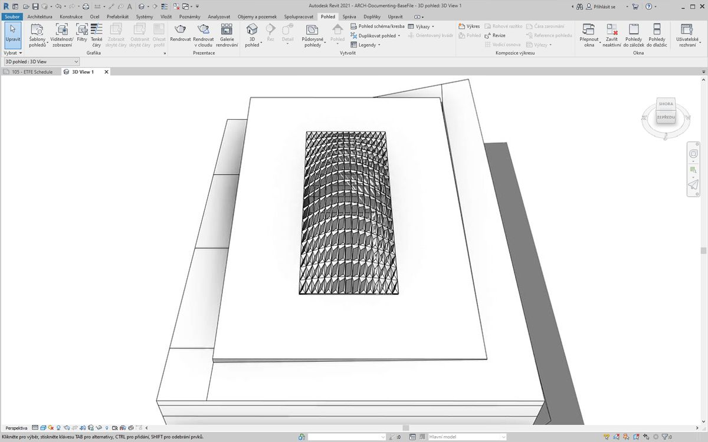
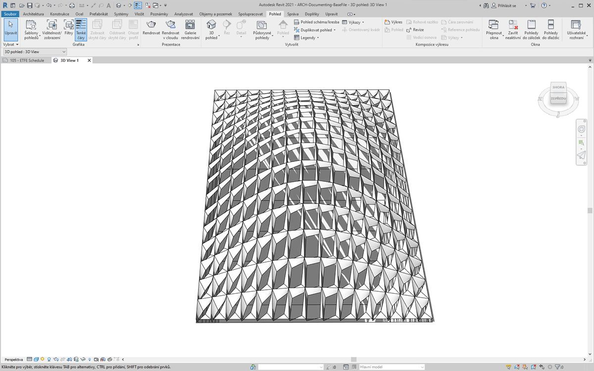
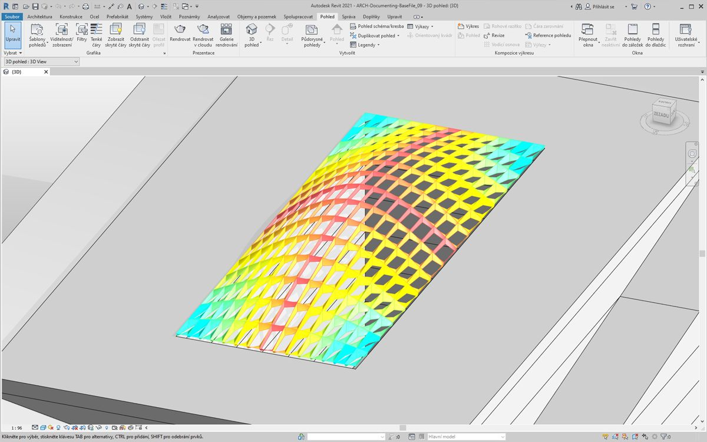
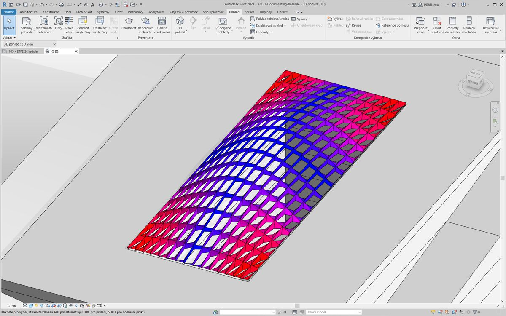
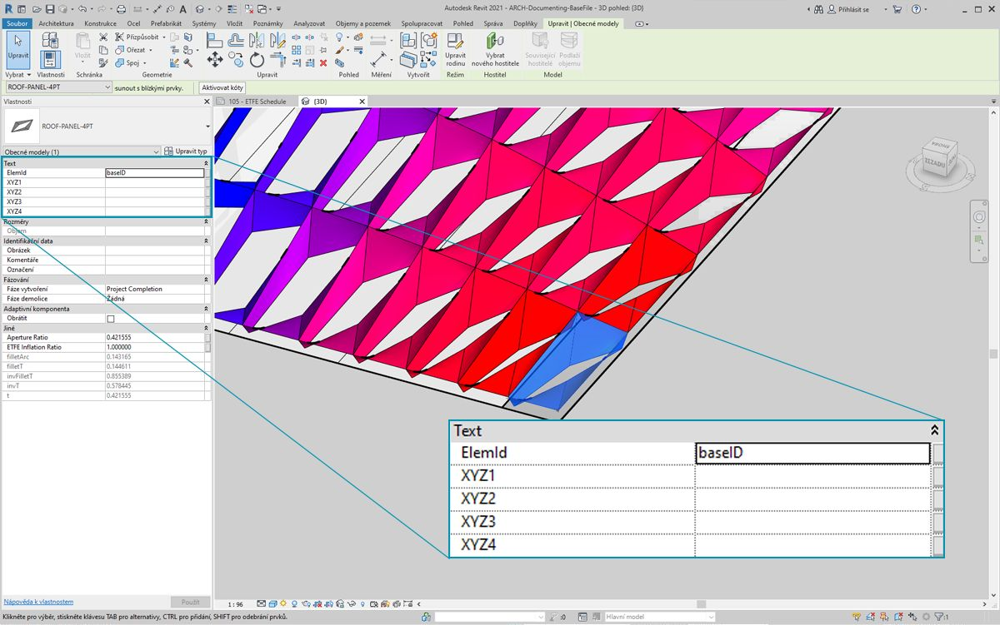
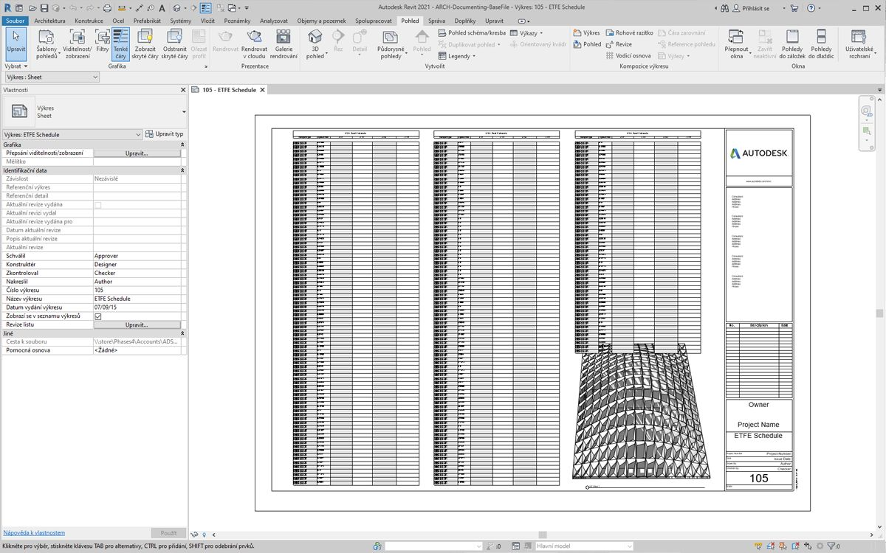
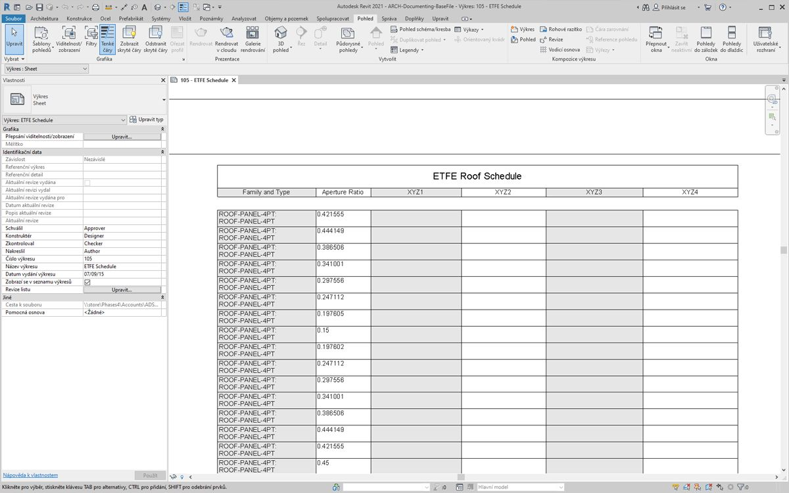
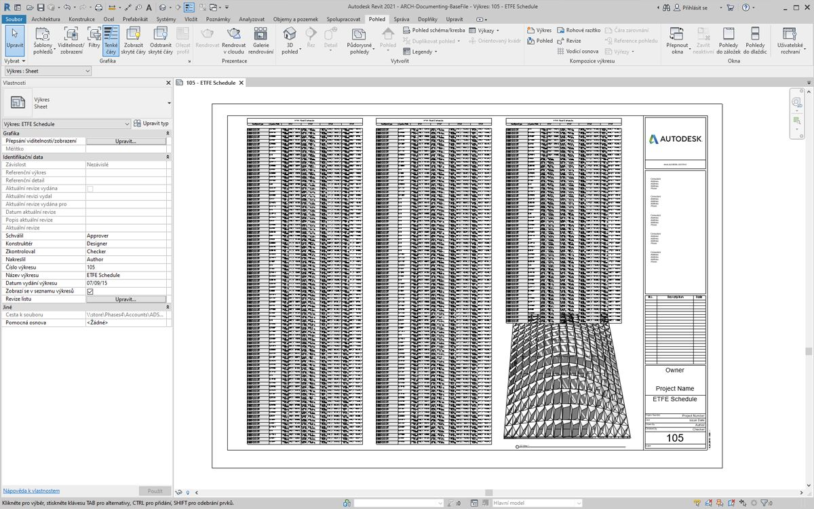
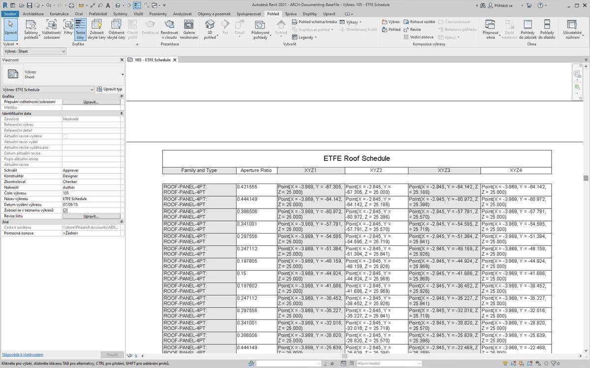

## Dokumentace

Úpravy parametrů dokumentace probíhají podle toho, jak je vysvětleno v předchozích částech. V této části se podíváme na parametry úprav, které nemají vliv na geometrické vlastnosti prvků, ale místo toho si připravíme soubor aplikace Revit pro dokumentaci.

#### Odchylka

V níže uvedeném cvičení použijeme základní odchylku od uzlu roviny k vytvoření výkresu aplikace Revit pro dokumentaci. Každý panel na parametricky definované střešní konstrukci má jinou hodnotu odchylky a chceme vyřadit rozsah hodnot pomocí barvy a naplánováním adaptivních bodů, které předáme konzultantovi fasád, inženýrovi nebo dodavateli.


> Odchylka od uzlu roviny vypočítá vzdálenost, o kterou se sada čtyř bodů liší od roviny optimálního proložení mezi nimi. Je to rychlý a snadný způsob, jak studovat proveditelnost stavby.

### Cvičení

> Stáhněte si ukázkové soubory, které jsou přiloženy k tomuto cvičení (klikněte pravým tlačítkem a vyberte příkaz Uložit odkaz jako...). Úplný seznam vzorových souborů naleznete v dodatku.

> 1. [Documenting.dyn](datasets/8-6/Documenting.dyn)
2. [ARCH-Documenting-BaseFile.rvt](datasets/8-6/ARCH-Documenting-BaseFile.rvt)

Začněte se souborem aplikace Revit pro tuto část (nebo pokračujte od předchozí části). Tento soubor má pole panelů ETFE na střeše. Na tyto panely se budeme odkazovat v tomto cvičení.


> 1. Přidejte na kreslicí plochu uzel *Family Types* a vyberte položku *ROOF-PANEL-4PT*.
2. Tento uzel připojte k uzlu Select *All Elements of Family Type*, abyste do aplikace Dynamo načetli všechny prvky z aplikace Revit.


> 1. Pomocí uzlu *AdaptiveComponent.Locations* můžete dotazovat umístění adaptivních bodů pro každý prvek.
2. Vytvořte polygon z těchto čtyř bodů pomocí uzlu *Polygon.ByPoints*. Všimněte si, že nyní máme abstraktní verzi systému v aplikaci Dynamo, aniž by bylo nutné importovat úplnou geometrii prvku aplikace Revit.
3. Vypočtěte rovinnou odchylku pomocí uzlu *Polygon.PlaneDeviation*.


> Stejně jako v předchozím cvičení, nastavíme *poměr otvoru *každého panelu podle jeho rovinné odchylky.

> 1. Přidejte na kreslicí plochu uzel *Element.SetParameterByName* a připojte adaptivní komponenty ke vstupu *prvku*. Připojte *blok kódu*, který načte hodnotu *Aperture Ratio* do vstupu *parameterName*.
2. Výsledky odchylek nelze přímo připojit ke vstupu hodnoty, protože je potřeba hodnoty přemapovat na rozsah parametrů.


> 1. Pomocí uzlu *Math.RemapRange* přemapujte hodnoty odchylek na doménu mezi *.15 *a *.45*.
2. Tyto výsledky zapište do hodnoty vstupu pro *Element.SetParameterByName*.



> V aplikaci Revit můžeme *trochu* pochopit změny otevření napříč povrchem.



> Po přiblížení je zřejmé, že uzavřené panely jsou zatíženy vůči rohům povrchu. Otevřené rohy jsou směrem k horní části. Rohy představují oblasti větší odchylky, zatímco vyboulení má minimální zakřivení, což dává smysl.

### Barva a dokumentace

Nastavení Aperture Ratio jasně nedemonstruje odchylku panelů na střeše a také měníme geometrii skutečného prvku. Předpokládejme, že chceme pouze prozkoumat odchylku z hlediska proveditelnosti výroby. Bylo by užitečné vybarvit panely podle rozsahu odchylky pro naši dokumentaci. To můžeme provést pomocí řady kroků uvedených níže a velmi podobným postupem jako výše uvedené kroky.


> 1. Odeberte uzly *Element.SetParameterByName* a přidejte položku *Element.OverrideColorInView*.
2. Přidejte na kreslicí plochu uzel *Color Range* a zadejte do vstupu barvy *Element.OverrideColorInView*. Aby bylo možné vytvořit gradient, je nutné propojit hodnoty odchylek s barevným rozsahem.
3. Pozastavením ukazatele myši nad vstupem *hodnoty* lze vidět, že hodnoty pro vstup musí být mezi hodnotami *0* a *1*, aby bylo možné mapovat barvu na každou hodnotu. Hodnoty odchylek je nutné přemapovat do tohoto rozsahu.


> 1. Pomocí uzlu *Math.RemapRange* přemapujte hodnoty odchylky roviny do rozsahu od *0* do *1* (poznámka: Pomocí uzlu *MapTo* můžete také definovat zdrojovou doménu).
2. Zadejte výsledky do uzlu *Color Range*.
3. Všimněte si, že náš výstup je rozsah barev místo rozsahu čísel.
4. Pokud máte nastavenou možnost Ruční, klikněte na tlačítko *Spustit*. Od této chvíle si vystačíte s nastavením Automaticky.



> V aplikaci Revit vidíme mnohem čitelnější gradient, který je reprezentativní pro rovinnou odchylku podle našeho rozsahu barev. Ale co když chceme přizpůsobit barvy? Minimální hodnoty odchylek jsou znázorněny červeně, což se zdá být opak toho, co bychom očekávali. Chceme mít maximální odchylku červenou a minimální odchylkou reprezentovanou klidnější barvou. Pojďme zpátky do aplikace Dynamo a opravíme to.


> 1. Pomocí *bloku kódu* přidejte dvě čísla na dva různé řádky: ```0;``` a ```255;```.
2. Vytvořte červenou a modrou barvu zadáním příslušných hodnot do dvou uzlů *Color.ByARGB*.
3. Vytvořte seznam z těchto dvou barev.
4. Tento seznam zadejte do vstupu *colors* uzlu *Color Range* a sledujte, jak se aktualizuje vlastní rozsah barev.



> V aplikaci Revit nyní můžeme lépe rozpoznat oblasti maximální odchylky v rozích. Tento uzel slouží k přepsání barvy v pohledu, takže může být skutečně užitečné, pokud máme konkrétní výkres v sadě výkresů, které se soustředí na konkrétní typ analýzy.

### Vytvoření výkazů



> 1. Po výběru jednoho panelu ETFE v aplikaci Revit se zobrazí čtyři parametry instance: *XYZ1, XYZ2, XYZ3,* a *XYZ4*. Po vytvoření jsou všechny prázdné. Jedná se o textově orientované parametry a potřebují hodnoty. Pomocí aplikace Dynamo zapíšeme umístění adaptivních bodů do každého parametru. To napomáhá interoperabilitě, pokud je nutné geometrii poslat inženýrovi nebo konzultantovi fasády.



> Ve vzorovém výkresu máme velký prázdný výkaz. Parametry XYZ jsou sdílené parametry v souboru aplikace Revit, které nám umožňují přidat je do výkazu.



> Po přiblížení nejsou parametry XYZ vyplněny. Aplikace Revit spravuje první dva parametry.


> K zápisu do těchto hodnot provedeme složitou operaci seznamu. Samotný graf je jednoduchý, ale koncepty vychází z mapování seznamu, jak je popsáno v kapitole o seznamech.

> 1. Vyberte všechny adaptivní komponenty se dvěma uzly.
2. Extrahujte umístění každého bodu pomocí uzlu *AdaptiveComponent.Locations*.
3. Převeďte tyto body na řetězce. Nezapomeňte, že parametr je textový, takže je potřeba zadat správný typ dat.
4. Vytvořte seznam čtyř řetězců definujících parametry, které chcete změnit: *XYZ1, XYZ2, XYZ3* a *XYZ4*.
5. Tento seznam vložte do vstupu *parameterName* pro uzel *Element.SetParameterByName*.
6. Spojte uzel *Element.SetParameterByName* se vstupem *combinator* položky *List.Combine.*
7. Připojte *adaptivní komponenty* do seznamu *list1*.
8. Spojte položku *String* z objektu do seznamu *list2*.
9. Zde mapujeme seznam, protože zapisujeme čtyři hodnoty pro každý prvek, který vytvoří složitou datovou strukturu. Uzel *List.Combine* definuje operaci o jeden krok níže v hierarchii dat. Proto jsou vstupy prvků a hodnot ponechány prázdné. Metoda *List.Combine* spojuje podseznamy svých vstupů do prázdných vstupů položky *List.SetParameterByName* podle pořadí jejich připojení.


> Po výběru panelu v aplikaci Revit nyní vidíme, že pro každý parametr máme hodnoty řetězce. Ve skutečnosti vytvoříme jednodušší formát pro zápis bodu (X,Y,Z). To lze provést pomocí řetězcových operací v aplikaci Dynamo, ale to nyní obejdeme, abychom nevybočovali od tématu.



> Pohled ukázkového výkazu s vyplněnými parametry.



> Každý panel ETFE nyní obsahuje souřadnice XYZ zapsané pro každý adaptivní bod, což představuje rohy jednotlivých panelů pro výrobu.

