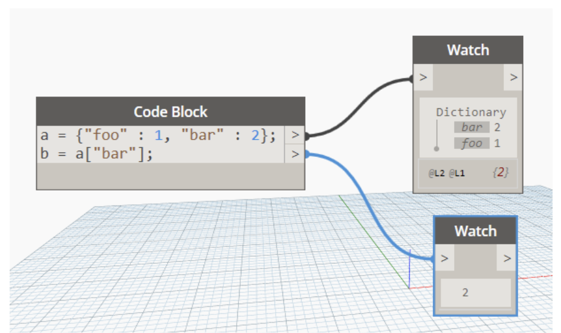

# Slovníky
Aplikace Dynamo 2.0 rozdělila datový typ slovník od datového typu seznam. Tato změna může výrazně změnit způsob, jakým pracujete s daty. Před verzí 2.0 byly slovníky a seznamy spojeny v jediný datový typ. Stručně řečeno, seznamy byly ve skutečnosti slovníky s celočíselnými klíči.

* #### Co je to slovník?
Slovník je datový typ, který se skládá z kolekce dvojic klíč-hodnota, kde klíč je v rámci kolekce jedinečný. Slovník nemá žádné pořadí a umožňuje vyhledávat hodnoty pomocí klíčů (a nikoliv pomocí hodnot indexů jako u seznamů). *V aplikaci 2.0 mohou být jako klíče použity pouze řetězce.*

* #### Co je to seznam?
Seznam je datový list, který se skládá z kolekce hodnot v určitém pořadí. V aplikaci Dynamo seznamy používají celočíselné hodnoty indexů.

* #### Proč k této změně došlo a proč je důležitá?
Díky oddělení slovníků od seznamů můžete slovníky používat k rychlému a snadnému ukládání a vyhledávání hodnot, aniž by bylo nutné pamatovat si hodnoty indexů nebo uchovávat data ve striktní struktuře seznamu. Během uživatelského testování jsme zjistili, že nahrazením uzlů ```GetItemAtIndex``` slovníky došlo k výraznému zmenšení velikosti grafu.

* #### K jakým změnám došlo?
  * Došlo ke změnám *syntaxe*, která souvisí s inicializací a prací se slovníky a seznamy v blocích kódu.
    * Slovníky používají následující syntaxi ```{klíč:hodnota}```
    * Seznamy používají následující syntaxi ```[hodnota,hodnota,hodnota]```
  * Do knihovny byly přidány *nové uzly*, které vám pomohou vytvářet, upravovat a dotazovat slovníky.
  * Seznamy vytvořené v blocích kódu verze 1.x budou po načtení skriptu automaticky převedeny do nové syntaxe seznamu, která používá hranaté závorky ```[ ]``` místo složených závorek ```{ }``` 

* #### Proč je to důležité? K čemu se to používá?
V počítačových vědách jsou slovníky, podobně jako seznamy, kolekcemi objektů. Zatímco seznamy mají položky v určitém pořadí, slovníky jsou *neuspořádané* kolekce. Nejsou závislé na číslech posloupnosti (indexy), používají místo nich *klíče*.

Na obrázku níže je znázorněno potenciální využití slovníků. Slovníky se často používají ke spojení dvou různých položek, které spolu nemusí souviset. V našem případě propojujeme španělské slovo s anglickým pro později vyhledání. 

