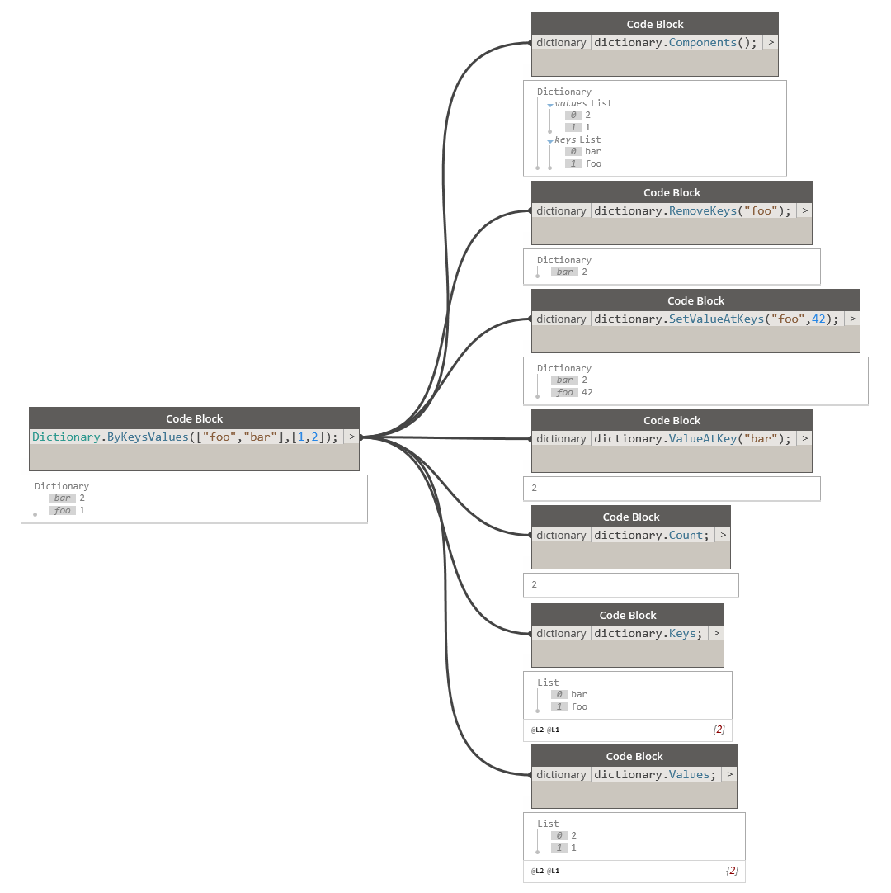

# Slovníky v blocích kódu

Kromě uzlů pro slovníky zavádí aplikace Dynamo 2.0 také nové funkce pro slovníky v blocích kódu.

Je možné použít syntaxi podle obrázku níže nebo reprezentaci uzlů v jazyce DesignScript.

Protože je slovník typem objektu, je možné s ním v aplikaci Dynamo provádět následující akce.

Tyto interakce jsou užitečné zejména při spojování dat aplikace Revit s řetězci. Pojďme se podívat na případy užití v aplikaci Revit.

