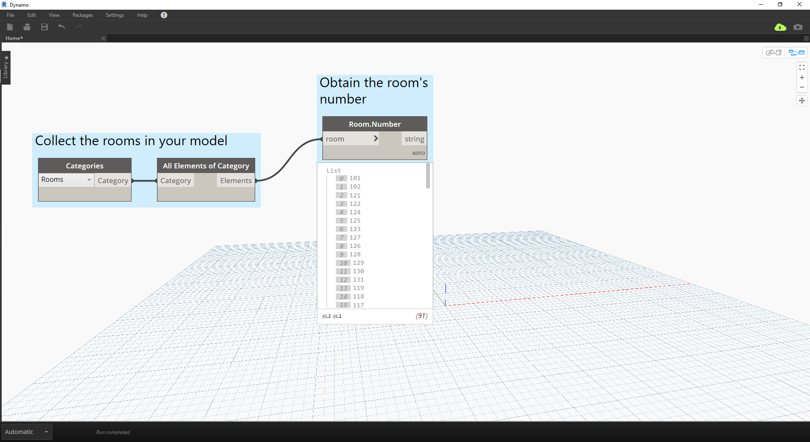

# Slovníky – případy užití v aplikaci Revit

Chtěli jste někdy v aplikaci Revit vyhledávat položky podle jejich dat?

#### Pravděpodobně jste postupovali podobně jako na tomto obrázku:


> Na obrázku výše první získáme všechny místnosti v modelu aplikace Revit, získáme index požadované místnosti (podle čísla místnosti) a nakonec získáme místnost na zadaném indexu.

### Pojďme udělat totéž pomocí slovníků.

> Stáhněte si vzorový soubor, který je přiložen k tomuto cvičení (klikněte pravým tlačítkem a vyberte příkaz Uložit odkaz jako...): [RoomDictionary.dyn](datasets/9-4_roomDictionary.dyn). Úplný seznam vzorových souborů naleznete v příloze.

 Nejdříve je nutné získat všechny místnosti v modelu aplikace Revit.

> * Vybereme kategorii aplikace Revit, se kterou chceme pracovat (v tomto případě místnosti).
* Přikážeme aplikaci Dynamo, aby získala všechny prvky

 Dále je nutné rozhodnout, podle kterých klíčů se budou data vyhledávat. (Informace o klíčích naleznete v části [9-1 Co je slovník?](9-1_What-is-a-dictionary,md)).

> * Data, která použijeme, jsou čísla místností.

 Nyní vytvoříme slovník s danými klíči a prvky.

> * Uzel ```Dictionary.ByKeysValues``` vytvoří slovník podle odpovídajících vstupů.
* ```Klíče``` musí být řetězce, zatímco ```hodnoty``` mohou být různé typy objektů.

 Nyní můžeme načíst místnost ze slovníku pomocí čísla místnosti.

> * Uzel ```String``` bude klíč, který použijeme k vyhledání objektu ze slovníku.
* Uzel ```Dictionary.ValueAtKey``` načte objekt ze slovníku.

---

### Stejným způsobem lze vytvářet slovníky seskupených objektů. Pokud bychom chtěli vyhledat všechny místnosti na daném podlaží, můžeme upravit graf následovně.


> * Místo čísla místnosti použijeme jako klíč hodnotu parametru (v tomto případě podlaží).


> * Nyní můžete místnosti seskupit podle podlaží, na kterém se nacházejí.


> * Po seskupení místností podle podlaží, můžeme použít sdílené (jedinečné) klíče jako klíče pro slovník a seznamy místností jako prvky.


> * Nakonec můžeme pomocí podlaží v modelu aplikace Revit a pomocí slovníku vyhledat, které místnosti se na daném podlaží nacházejí. Uzel ```Dictionary.ValueAtKey``` načte jako vstup název podlaží a vrátí místností na daném podlaží.

Možnosti slovníků jsou opravdu nekonečné. Možnost propojit BIM data v aplikaci Revit s prvkem samotným nabízí mnohá využití.

