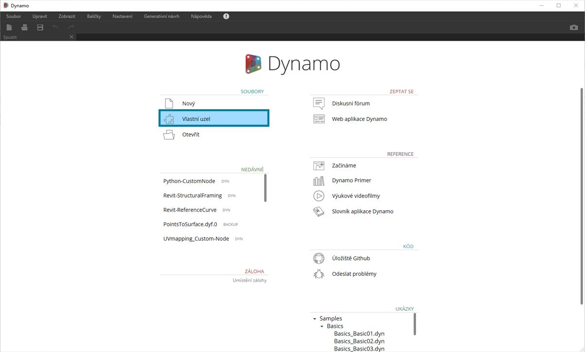
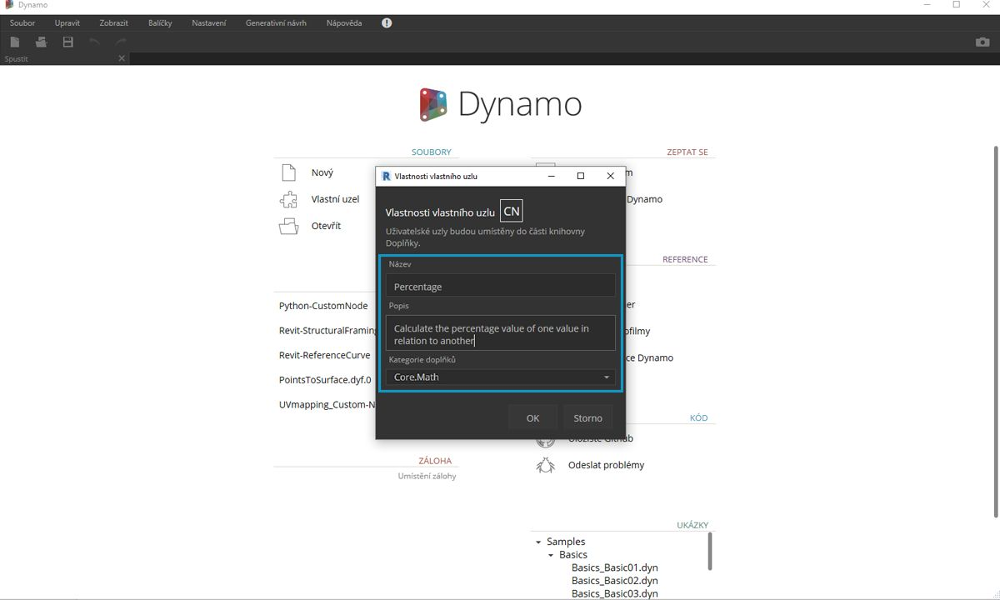
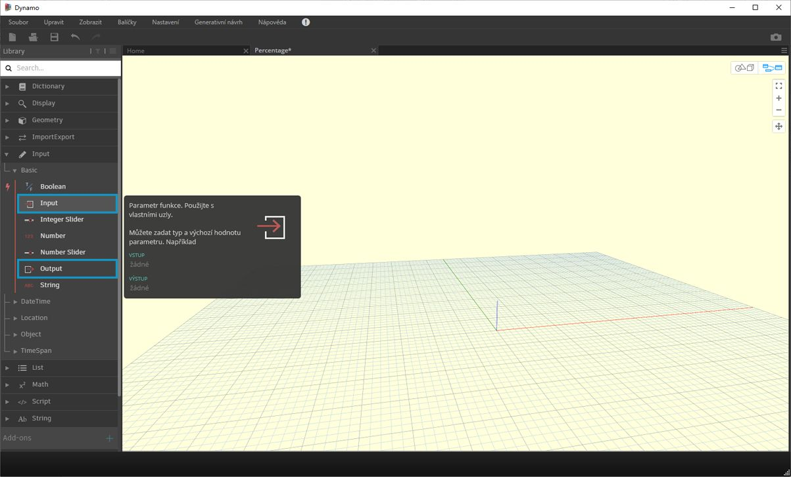

## Vlastní uzly

Aplikace Dynamo nabízí širokou škálu uzlů pro úkony vizuálního programování. Někdy však může být rychlejší a elegantnější vytvořit si uzly vlastní. Tyto uzly pak můžete používat v různých projektech, dosáhnout díky nim přehlednějšího grafu a odeslat je do správce balíků a sdílet s komunitou aplikace Dynamo.

### Přehlednější graf

Vlastní uzly vznikají tak, že se do nich zahrnou ostatní uzly (i další vlastní uzly), proto o nich lze přemýšlet jako o kontejnerech. Pokud tento kontejnerový uzel v grafu spustíte, spustí se všechny uzly v něm – pomocí vlastních uzlů tak můžete opakovaně používat a sdílet užitečné posloupnosti uzlů.

### Přizpůsobování změnám

Pokud v grafu existuje více kopií vlastního uzlu, po úpravě základního vlastního uzlu se všechny tyto kopie aktualizují. Díky tomu můžete graf snadno aktualizovat a přizpůsobit jej změnám v pracovním postupu nebo návrhu.

### Sdílení práce

Velmi užitečnou funkcí vlastních uzlů je snadné sdílení práce. Pokud zručný uživatel vytvoří složitý graf aplikace Dynamo a předá jej konstruktérovi, který je v aplikaci Dynamo nový, může tento graf zjednodušit do základní podoby. Vlastní uzel je možné otevřít a upravit jeho vnitřní graf, může však vypadat i jako jednoduchý „kontejner“. Pomocí vlastních uzlů mohou uživatelé aplikace Dynamo uchovat svůj graf v přehledné a intuitivní podobě.

### Různé způsoby tvorby uzlu

Vlastní uzly je možné v aplikaci Dynamo vytvářet mnoha způsoby. V příkladech této kapitoly vytvoříme vlastní uzly přímo v uživatelském rozhraní aplikace Dynamo. Pokud jste programátor a zajímá vás formátování C# nebo Zero-Touch, podrobnější informace naleznete na [této stránce](https://github.com/DynamoDS/Dynamo/wiki/How-To-Create-Your-Own-Nodes) na Wiki aplikace Dynamo.

### Prostředí vlastního uzlu

V této části přejdeme do prostředí vlastního uzlu a vytvoříme jednoduchý uzel pro výpočet procent. Prostředí vlastního uzlu se od prostředí grafu aplikace Dynamo liší, ale práce v něm je prakticky stejná. Pojďme tedy vytvořit první vlastní uzel.

> Chcete-li vytvořit nový vlastní uzel, spusťte aplikaci Dynamo a vyberte možnost Vlastní uzel, případně na pracovní ploše stiskněte kombinaci kláves Ctrl+Shift+N.

> V dialogu Vlastnosti vlastního uzlu zadejte název, popis a kategorii.

> 1. **Název:** Percentage
2. **Popis:** Vypočítá procentuální podíl jedné hodnoty vůči druhé hodnotě.
3. **Kategorie:** Core.Math

> Tím se otevře pracovní plocha se žlutým pozadím, která naznačuje, že pracujete ve vlastním uzlu. Na této pracovní ploše máte přístup ke všem uzlům aplikace Dynamo a také k uzlům v kategoriích **Input** a **Output**, které slouží k nastavení vstupu a výstupu dat u vlastních uzlů. Tyto uzly se nacházejí v části *Core>Input*.

> 1. **Input:** Vstupní uzly na vlastních uzlech vytvářejí vstupní porty. Syntaxe pro vstupní port je *název_vstupu : datovýtyp = výchozí_hodnota(volitelná).*

2. **Output:** Podobně jako u vstupních uzlů, tyto vstupy na vlastních uzlech vytvářejí výstupní porty. Ke vstupním a výstupním portům je možné přidat **vlastní komentář** s informacemi o vstupech a výstupech. Vlastní komentáře jsou podrobněji popsány podrobněji v části [Tvorba vlastních uzlů](10-2_Creating.md).

Tento vlastní uzel je možné uložit jako soubor .dyf (a nikoliv standardní .dyn). To způsobí, že bude automaticky přidán do relace a všech budoucích relací. Vlastní uzel naleznete v knihovně v kategorii určené ve vlastnostech vlastního uzlu.

> Vlevo: kategorie Core > Math ve výchozí knihovně, 
Vpravo: kategorie Core > Math s novým vlastním uzlem

### Pokračování

Nyní, když jsme vytvořili první vlastní uzel, se v dalších částech podrobněji podíváme na funkce vlastních uzlů a na to, jak publikovat obecné pracovní postupy. V další části vyvineme vlastní uzel, který přenese geometrii z jedné plochy na druhou.

