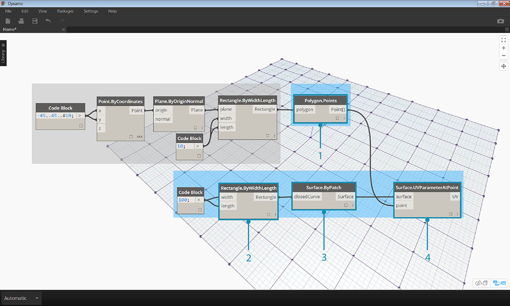
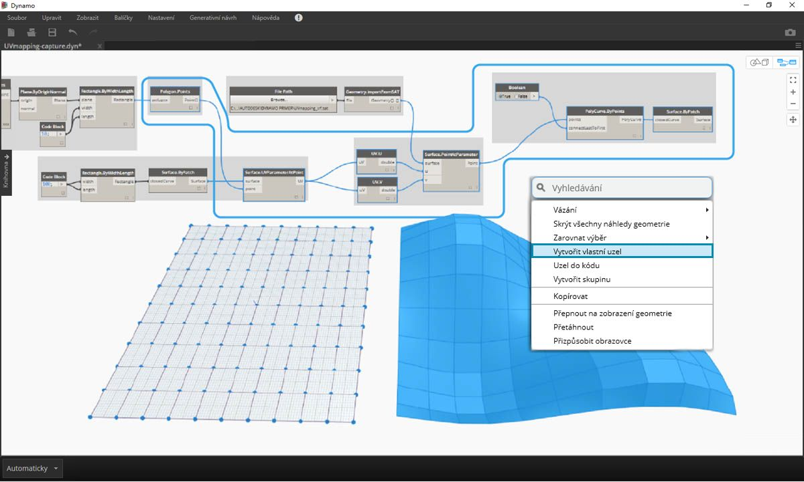
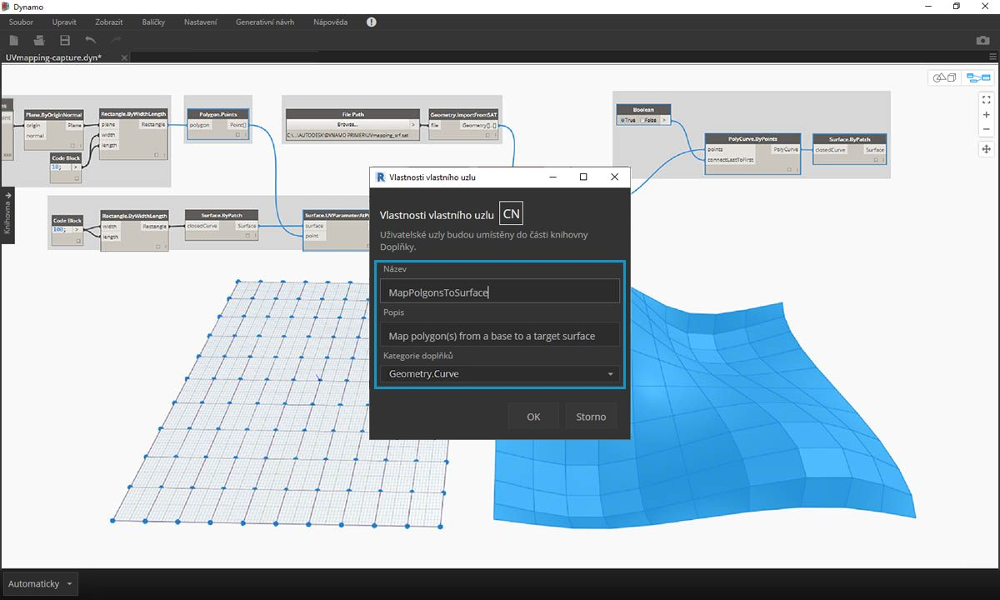

## Vytvoření vlastního uzlu

Aplikace Dynamo nabízí několik různých metod vytváření vlastních uzlů. Vlastní uzly můžete vytvořit zcela od začátku, z existujícího grafu nebo explicitně v jazyce C#. V této části se budeme zabývat vytvořením vlastního uzlu v uživatelském rozhraní aplikace Dynamo z existujícího grafu. Tato metoda je ideální k začištění pracovního prostoru a zabalení sekvence uzlů k opakovanému použití na jiném místě.

### Vlastní uzly pro mapování UV

Na obrázku níže namapujeme bod z jednoho povrchu na jiný pomocí souřadnic UV. Pomocí tohoto konceptu vytvoříme panelizovaný povrch, který odkazuje na křivky v rovině XY. Zde vytvoříme čtyřhranné panely pro naši panelizaci, ale pomocí stejné logiky můžeme vytvořit širokou řadu panelů s mapováním UV. Jedná se o skvělou příležitost k vývoji vlastního uzlu, protože v tomto grafu nebo v jiných pracovních postupech aplikace Dynamo budeme moci snadněji opakovat podobný proces.

### Vytvoření vlastního uzlu z existujícího grafu

> Stáhněte a rozbalte ukázkové soubory pro toto cvičení (klikněte pravým tlačítkem a vyberte příkaz Uložit odkaz jako...). Úplný seznam vzorových souborů naleznete v dodatku. [UV-CustomNode.zip](datasets/10-2/UV-CustomNode.zip)

Začneme vytvořením grafu, který chceme vnořit do vlastního uzlu. V tomto příkladu vytvoříme graf, který mapuje polygony ze základního povrchu na cílový povrch pomocí souřadnic UV. Tento proces mapování UV často používáme, proto je vhodným kandidátem pro vlastní uzel. Další informace o površích a prostoru UV naleznete v části 5.5. Úplný graf je *UVmapping_Custom-Node.dyn* ze souboru .zip staženého výše.

> 1. **Blok kódu:** Pomocí bloku kódu vytvořte rozsah 10 čísel v rozmezí 45 až mínus 45.
2. **Point.ByCoordinates:** Připojte výstup bloku kódu k vstupům „x“ a „y“ a nastavte vázání na křížovou referenci. Nyní byste měli mít rastr bodů.
3. **Plane.ByOriginNormal:** Spojením výstupu *Point* se vstupem *origin* vytvořte rovinu v každém z bodů. Bude použit výchozí normálový vektor (0,0,1).
4. **Rectangle.ByWidthLength:** Spojte roviny z předchozího kroku do vstupu *plane* a pomocí bloku kódu s hodnotou *10* určete šířku a délku.

Nyní byste měli vidět mřížku obdélníků. Tyto obdélníky namapujeme na cílový povrch pomocí souřadnic UV.

> 1. **Polygon.Points:** Spojením výstupu obdélníku z předchozího kroku se vstupem *polygon* lze extrahovat rohové body každého obdélníku. Jedná se o body, které namapujeme na cílový povrch.
2. **Rectangle.ByWidthLength:** Pomocí bloku kódu s hodnotou *100* určete šířku a délku obdélníku. Toto bude hranice našeho základního povrchu.
3. **Surface.ByPatch:** Připojte obdélník z předchozího kroku k vstupu *closedCurve* a vytvořte tak základní povrch.
4. **Surface.UVParameterAtPoint:** Připojte výstup *Point* uzlu *Polygon.Points* a výstupu *Surface* uzlu *Surface.ByPatch* k vrácení parametru UV v každém bodu.

Nyní, když máme základní povrch a sadu souřadnic UV, můžete importovat cílový povrch a mapovat body mezi povrchy.

> 1. **Cesta k souboru:** Vyberte cestu k souboru povrchu, který chcete importovat. Typ souboru by měl být .SAT. Klikněte na tlačítko *Procházet...* a přejděte k souboru *UVmapping_srf.sat* ze souboru .zip staženého výše.
2. **Geometry.ImportFromSAT:** Připojte cestu k souboru a importujte povrch. Importovaný povrch uvidíte v náhledu geometrie.
3. **UV:** Připojte výstup parametru UV k uzlu *UV.U* a *UV.V*.
4. **Surface.PointAtParameter:** Připojte importovaný povrch a také souřadnice U a V. Nyní byste měli na cílovém povrchu vidět rastr 3D bodů.

Posledním krokem je použití 3D bodů k vytvoření pravoúhlých záplat povrchů.

> 1. **PolyCurve.ByPoints:** Spojením bodů na povrchu se vytvoří objekt polycurve procházející body.
2. **Boolean:** Do pracovního prostoru přidejte hodnotu boolean, připojte ji ke vstupu *connectLastToFirst* a přepnutím na hodnotu True uzavřete objekt polycurve. Nyní byste měli vidět obdélníky namapované na povrch.
3. **Surface.ByPatch:** Propojte objekty polycurve se vstupem *closedCurve* a vytvořte tak záplaty povrchů.

Nyní vybereme uzly, které chceme vnořit do vlastního uzlu, a zvážíme, co chceme použít jako vstupy a výstupy našeho uzlu. Chceme, aby byl vlastní uzel co nejflexibilnější, a proto by měl být schopen mapovat libovolné polygony, nikoli pouze obdélníky.

> Vyberte výše uvedené uzly (počínaje *Polygon.Points*), klikněte pravým tlačítkem na pracovní plochu a vyberte položku *Uzel z výběru*.

> V dialogu Vlastnosti vlastního uzlu přiřaďte k vlastnímu uzlu název, popis a kategorii.

> Vlastní uzel výrazně začistil pracovní prostor. Vstupy a výstupy byly pojmenovány na základě původních uzlů. Upravte vlastní uzel, aby byly názvy popisnější.

> Dvakrát klikněte na vlastní uzel, který chcete upravit. Tím se otevře pracovní prostor se žlutým pozadím, které představuje vnitřek uzlu.

> 1. **Vstupy:** Změňte vstupní názvy na *baseSurface* a *targetSurface*.
2. **Výstupy:** Přidejte další výstup pro mapované polygony.
> Uložte vlastní uzel a vraťte se do domovského pracovního prostoru.

> Uzel **MapPolygononsToSurface** odráží změny, které jsme právě provedli.

Robustnost vlastního uzlu lze také zvýšit přidáním hodnot **Vlastní komentáře**. Komentáře mohou pomoci u typů vstupů a výstupů nebo vysvětlovat funkci uzlu. Komentáře se zobrazí, když uživatel umístí kurzor nad vstup, nebo výstup vlastního uzlu.

> Dvakrát klikněte na vlastní uzel, který chcete upravit. Tím se znovu otevře pracovní prostor se žlutým pozadím.

> 1. Začněte upravovat blok vstupního kódu. Chcete-li vytvořit komentář, zadejte výraz "//" následovaný textem komentáře. Zadejte vše, co může pomoci objasnit uzel – zde budeme popisovat položku *targetSurface*.
2. Také nastavíme výchozí hodnotu *inputSurface* nastavením typu vstupu rovnajícího se hodnotě. Zde nastavíme výchozí hodnotu na původní nastavení Surface.ByPatch.

> Komentáře lze použít také na výstupy. Začněte upravovat text v Bloku výstupního kódu. Chcete-li vytvořit komentář, zadejte výraz "//" následovaný textem komentáře. Zde vyjasníme výstupy *Polygons* a *surfacePatches* přidáním podrobnějšího popisu.

 >

1. Přesunutím kurzoru nad vstupy uživatelského uzlu zobrazíte komentáře.
2. S výchozí hodnotou nastavenou pro položku *inputSurface* můžeme také spustit definici bez zadání povrchu.

