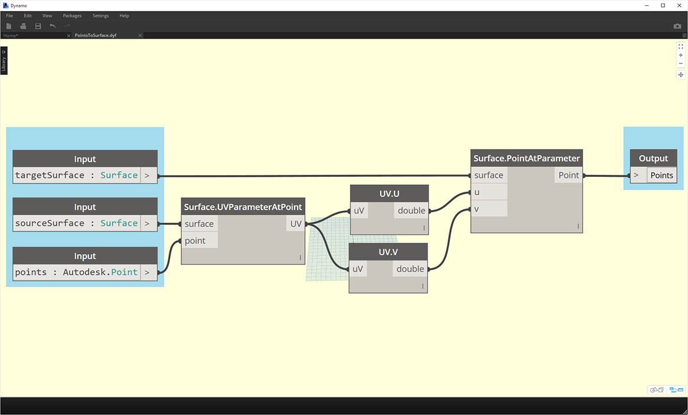
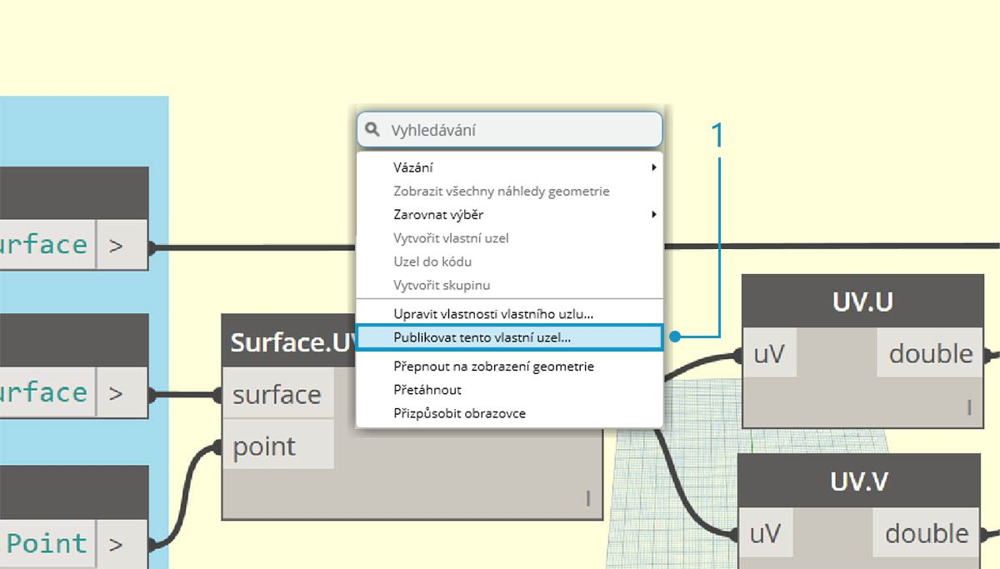
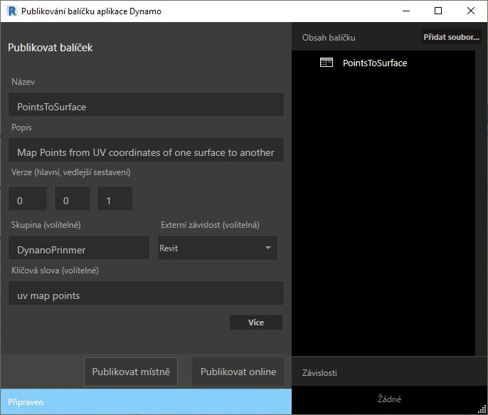
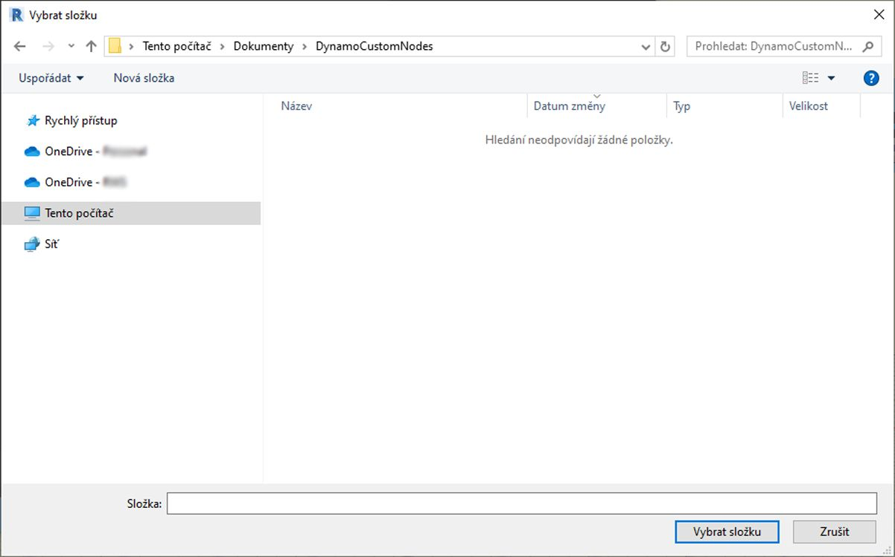
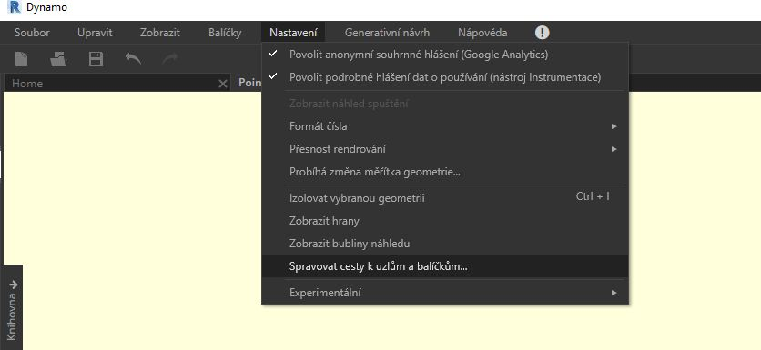
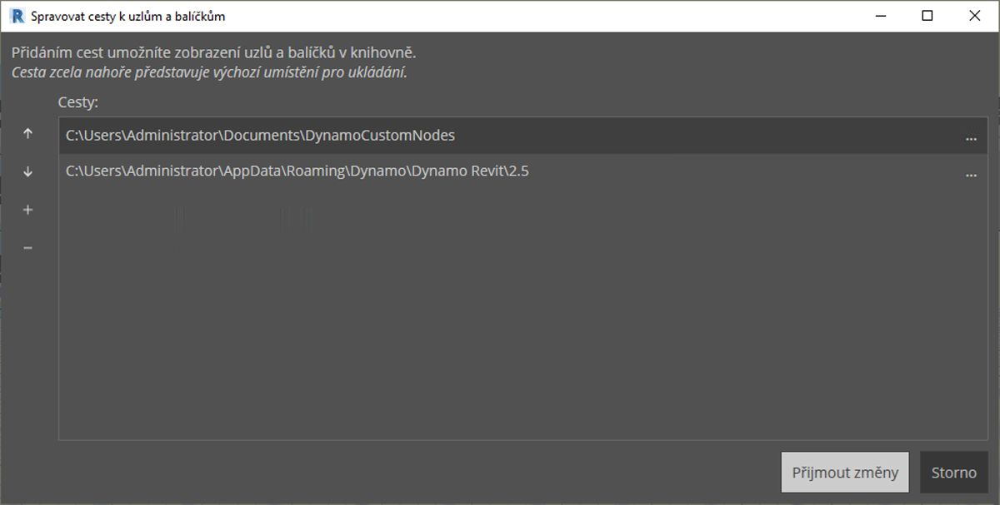
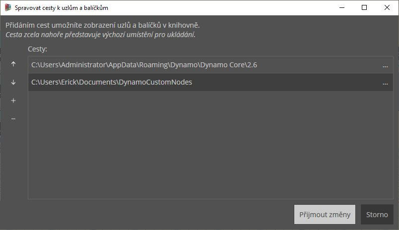

## Přidání do knihovny

Vytvořili jsme vlastní uzel a použili jej na proces v grafu aplikace Dynamo. Nyní tento uzel chceme zachovat v knihovně aplikace Dynamo pro později použití v dalších grafech. Z tohoto důvodu provedeme místní publikování uzlu. Tento postup je podobný jako publikování balíčku, další informace budou uvedeny v další kapitole.

### Místní publikování vlastního uzlu

V této části budeme pokračovat v práci s vlastním uzlem vytvořeným dříve. Po místním publikování uzlu bude uzel dostupný v knihovně aplikace Dynamo po otevřené nové relace. Pokud by uzel publikován nebyl, graf aplikace Dynamo odkazující na vlastní uzel by musel tento uzel obsahovat ve své složce (další možností je uzel importovat do aplikace Dynamo pomocí možnosti *Soubor > Importovat knihovnu*).

> Stáhněte si vzorový soubor, který je přiložen k tomuto cvičení (klikněte pravým tlačítkem a vyberte příkaz „Uložit odkaz jako...“). Úplný seznam vzorových souborů naleznete v příloze. [PointsToSurface.dyf](datasets/10-3/PointsToSurface.dyf)

> Po otevření vlastního uzlu PointsToSurface se v Editoru vlastních uzlů aplikace Dynamo zobrazí graf znázorněný výše. Vlastní uzel je možné otevřít také dvojitým kliknutím v Editoru grafu aplikace Dynamo.

> 1. Chcete-li provést místní publikování vlastního uzlu, klikněte pravým tlačítkem myši na pracovní plochu a vyberte možnost *Publikovat tento vlastní uzel...*

> Vyplňte informace podle obrázku výše a stiskněte tlačítko *Publikovat místně.*. Všimněte si, že pole Skupina určuje místo v nabídce aplikace Dynamo, kde bude uzel dostupný.

> Vyberte složku, ve které se budou nacházet všechny místně publikované vlastní uzly. Aplikace Dynamo bude tuto složku kontrolovat při každém spuštění, proto by se mělo jednat o trvalé umístění. Přejděte do této složky a stiskněte tlačítko *„Vybrat složku“.* Uzel aplikace Dynamo je nyní místně publikován a bude k dispozici na panelu nástrojů po každém spuštění aplikace.

> 1. Chcete-li zjistit umístění složky vlastních uzlů, vyberte možnost *Nastavení > Spravovat cesty uzlů a balíčků...*

> V tomto okně se zobrazují dvě cesty: *AppData\Roaming\Dynamo...* odkazuje na výchozí umístění balíčků aplikace Dynamo nainstalovaných online. *Dokumenty\DynamoCustomNodes...* odkazuje na umístění místně publikovaných vlastních uzlů. *

> 1. Cestu k vaší místní složce v seznamu výše je užitečné přesunout dolů (výběrem cesty ke složce a kliknutím na šipku dolů). Složka uvedená nejvýše se používá jako výchozí složka pro instalace balíčků. Pokud jako výchozí složku nastavíte výchozí cestu pro instalaci balíků aplikace Dynamo, online balíky budou odděleny od místně publikovaných uzlů.*

> Změnili jsme pořadí cest, aby se pro instalaci balíčků použila výchozí cesta aplikace Dynamo.

> Pokud přejdete do této místní složky, ve složce *„.dyf“* (což je přípona pro soubor vlastního uzlu aplikace Dynamo) naleznete původní vlastní uzel. Po úpravě souborů v této složce se uzly aktualizují v uživatelském rozhraní. Do složky *DynamoCustomNode* je možné přidat další uzly a aplikace Dynamo je přidá do knihovny po restartování.

> Aplikace Dynamo se nyní pokaždé načte s uzlem *PointsToSurface* ve skupině *DynamoPrimer* v knihovně.

