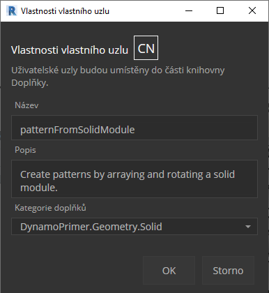

## Python

 Python je běžně používaný programovací jazyk, jehož popularita souvisí se stylem syntaxe. Je velmi čitelný, a to usnadňuje učení se více než mnoho jiných jazyků. Python podporuje moduly a balíčky a může být začleněn do existujících aplikací. Při práci s příklady uvedenými v této části se předpokládají základní znalosti s jazykem Python. Dobrým zdrojem informací o tom, jak začít pracovat s jazykem Python, je část [„Getting Started“](https://www.python.org/about/gettingstarted/) na stránce [Python.org](https://www.python.org/).

### Vizuální vs. textové programování

Proč byste používali textové programování ve vizuálním programovacím prostředí aplikace Dynamo? Jak jsme zmínili v kapitole 1.1, vizuální programování má mnoho výhod. Umožňuje vytvářet programy bez použití speciální syntaxe v intuitivním vizuálním rozhraní. Vizuální program však může být nepřehledný a v některých případech může mít menší funkčnost. Například jazyk Python nabízí mnohem jednodušší metody pro zápis podmínek (if/then) a cyklů. Python je výkonný nástroj, který umožňuje rozšířit možnosti aplikace Dynamo a umožňuje nahradit mnoho uzlů několika stručnými řádky kódů.

**Vizuální program:** 

**Textový program:**

```
import clr
clr.AddReference('ProtoGeometry')
from Autodesk.DesignScript.Geometry import *

solid = IN[0]
seed = IN[1]
xCount = IN[2]
yCount = IN[3]

solids = []

yDist = solid.BoundingBox.MaxPoint.Y-solid.BoundingBox.MinPoint.Y
xDist = solid.BoundingBox.MaxPoint.X-solid.BoundingBox.MinPoint.X

for i in xRange:
for j in yRange:
fromCoord = solid.ContextCoordinateSystem
toCoord = fromCoord.Rotate(solid.ContextCoordinateSystem.Origin,Vector.ByCoordinates(0,0,1),(90*(i+j%val)))
vec = Vector.ByCoordinates((xDist*i),(yDist*j),0)
toCoord = toCoord.Translate(vec)
solids.append(solid.Transform(fromCoord,toCoord))

OUT = solids
```

### Uzel Python

Stejně jako bloky kódu jsou uzly Python skriptovacím rozhraním v prostředí vizuálního programování. Uzel Python naleznete v části *Core>Scripting* v knihovně. Dvojitým kliknutím na uzel otevřete editor skriptů jazyka Python (můžete také kliknout pravým tlačítkem na uzel a vybrat možnost *Upravit...*).


> Všimněte si, že se v horní části nachází výchozí text, který vám má pomoci odkazovat na knihovny, které budete potřebovat. Vstupy jsou uloženy v poli IN. Hodnoty se vrátí do aplikace Dynamo jejich přiřazením k proměnné OUT.

Knihovna Autodesk.DesignScript.Geometry umožňuje použití tečkové notace podobné blokům kódů. Další informace o syntaxi aplikace Dynamo naleznete v kapitole 7.2 a v příručce [DesignScript Guide](http://dynamobim.org/wp-content/links/DesignScriptGuide.pdf). Zadání typu geometrie, například „Point.“ zobrazí seznam metod vytváření a dotazování bodů.


> Metody zahrnují konstruktory, například *ByCoordinates*, akce, například *Add* a dotazy, například souřadnice *X*, *Y* a *Z*.

### Cvičení

> Stáhněte si vzorový soubor, který je přiložen k tomuto cvičení (klikněte pravým tlačítkem a vyberte příkaz Uložit odkaz jako...). Úplný seznam vzorových souborů naleznete v dodatku. [Python_Custom-Node.dyn](datasets/10-4/Python-CustomNode.dyn)

V tomto příkladu napíšeme skript jazyka Python, který vytvoří vzory z modulu tělesa a převede je na vlastní uzel. Nejprve vytvoříme náš modul tělesa pomocí uzlů aplikace Dynamo.


> 1. **Rectangle.ByWidthLength:** Vytvořte obdélník, který bude základem našeho tělesa.
2. **Surface.ByPatch:** Spojte obdélník se vstupem *closedCurve* a vytvořte tak dolní povrch.


> 1. **Geometry.Translate:** Připojte obdélník k vstupu *geometrie*, aby se posunul nahoru pomocí bloku kódu k určení tloušťky základny našeho tělesa.
2. **Polygon.Points:** Pomocí dotazu na převedený obdélník lze extrahovat rohové body.
3. **Geometry.Translate:** Pomocí bloku kódu vytvořte seznam čtyř hodnot odpovídajících čtyřem bodům. Tím posunete jeden roh tělesa nahoru.
4. **Polygon.ByPoints:** Pomocí převedených bodů lze rekonstruovat horní polygon.
5. **Surface.ByPatch:** Připojením polygonu vytvořte horní povrch.

Nyní, když máme horní a dolní povrch, vytvoříme boky tělesa šablonováním mezi dvěma profily.


> 1. **List.Create:** Spojte dolní obdélník a horní polygon se vstupy indexu.
2. **Surface.ByLoft:** Šablonováním dvou profilů vytvořte strany tělesa.
3. **List.Create:** Připojte horní, boční a dolní povrchy ke vstupům indexu a vytvořte tak seznam povrchů.
4. **Solid.ByConnectedSurfaces:** Spojením povrchů vytvořte modul tělesa.

Nyní, když máme naše těleso, přetáhneme do pracovního prostoru uzel skriptu jazyka Python.


> Chcete-li do uzlu přidat další vstupy, zavřete editor a klikněte na ikonu + v uzlu. Vstupy jsou pojmenovány IN[0], IN[1] atd. Představují položky v seznamu.

Začneme definováním našich vstupů a výstupu. Dvojitým kliknutím na uzel otevřete editor jazyka Python.


```
# Enable Python support and load DesignScript library
import clr
clr.AddReference('ProtoGeometry')
from Autodesk.DesignScript.Geometry import *

# The inputs to this node will be stored as a list in the IN variables.
#The solid module to be arrayed
solid = IN[0]
#A number that determines which rotation pattern to use
seed = IN[1]
#The number of solids to array in the X and Y axes
xCount = IN[2]
yCount = IN[3]

#Create an empty list for the arrayed solids
solids = []

# Place your code below this line

# Assign your output to the OUT variable.
OUT = solids
```

Tento kód bude dávat větší smysl, když budeme postupovat v rámci cvičení. Dále musíme přemýšlet o tom, jaké informace jsou potřeba k vytvoření pole našeho modulu tělesa. Nejprve je nutné znát rozměry tělesa, abychom mohli určit vzdálenost posunutí. Kvůli chybě ohraničujícího kvádru bude nutné k jeho vytvoření použít geometrii křivky hrany.


> Pohled na uzel Python v aplikaci Dynamo. Všimněte si, že používáme stejnou syntaxi, jakou vidíme v názvech uzlů v aplikaci Dynamo. Komentovaný kód je níže.

```
# Enable Python support and load DesignScript library
import clr
clr.AddReference('ProtoGeometry')
from Autodesk.DesignScript.Geometry import *

# The inputs to this node will be stored as a list in the IN variables.
#The solid module to be arrayed
solid = IN[0]
#A number that determines which rotation pattern to use
seed = IN[1]
#The number of solids to array in the X and Y axes
xCount = IN[2]
yCount = IN[3]

#Create an empty list for the arrayed solids
solids = []
# Create an empty list for the edge curves
crvs = []

# Place your code below this line
#Loop through edges and append corresponding curve geometry to the list
for edge in solid.Edges:
crvs.append(edge.CurveGeometry)
#Get the bounding box of the curves
bbox = BoundingBox.ByGeometry(crvs)

#Get the X and Y translation distance based on the bounding box
yDist = bbox.MaxPoint.Y-bbox.MinPoint.Y
xDist = bbox.MaxPoint.X-bbox.MinPoint.X

# Assign your output to the OUT variable.
OUT = solids
```

Protože budeme převádět i otáčet moduly těles, použijeme operaci Geometry.Transform. Při pohledu na uzel Geometry.Transform zjistíme, že k transformaci tělesa budeme potřebovat zdrojový souřadnicový systém a cílový souřadnicový systém. Zdroj je kontextový souřadnicový systém našeho tělesa, zatímco cíl bude odlišný souřadnicový systém pro každý modul v poli. To znamená, že bude nutné projít hodnoty X a Y a transformovat souřadnicový systém pokaždé jinak.


> Pohled na uzel Python v aplikaci Dynamo. Komentovaný kód je níže.

```
# Enable Python support and load DesignScript library
import clr
clr.AddReference('ProtoGeometry')
from Autodesk.DesignScript.Geometry import *

# The inputs to this node will be stored as a list in the IN variables.
#The solid module to be arrayed
solid = IN[0]
#A number that determines which rotation pattern to use
seed = IN[1]
#The number of solids to array in the X and Y axes
xCount = IN[2]
yCount = IN[3]

#Create an empty list for the arrayed solids
solids = []
# Create an empty list for the edge curves
crvs = []

# Place your code below this line
#Loop through edges and append corresponding curve geometry to the list
for edge in solid.Edges:
crvs.append(edge.CurveGeometry)
#Get the bounding box of the curves
bbox = BoundingBox.ByGeometry(crvs)

#Get the X and Y translation distance based on the bounding box
yDist = bbox.MaxPoint.Y-bbox.MinPoint.Y
xDist = bbox.MaxPoint.X-bbox.MinPoint.X
#get the source coordinate system
fromCoord = solid.ContextCoordinateSystem

#Loop through X and Y
for i in range(xCount):
for j in range(yCount):
#Rotate and translate the coordinate system
toCoord = fromCoord.Rotate(solid.ContextCoordinateSystem.Origin,Vector.ByCoordinates(0,0,1),(90*(i+j%seed)))
vec = Vector.ByCoordinates((xDist*i),(yDist*j),0)
toCoord = toCoord.Translate(vec)
#Transform the solid from the source coord system to the target coord system and append to the list
solids.append(solid.Transform(fromCoord,toCoord))

# Assign your output to the OUT variable.
OUT = solids
```


> Kliknutím na tlačítko spustit na uzlu jazyka Python umožníte spuštění kódu.


> Zkuste změnit výchozí hodnotu a vytvořte jiné vzory. Můžete také změnit parametry samotného modulu tělesa pro různé efekty. V aplikaci Dynamo 2.0 můžete jednoduše změnit výchozí hodnotu a kliknout na tlačítko spustit, aniž byste zavřeli okno Python.

Nyní, když jsme vytvořili užitečný skript jazyka Python, uložte jej jako uživatelský uzel. Vyberte uzel skriptu jazyka Python, klikněte pravým tlačítkem a vyberte položku Nový uzel z výběru.



> Přiřaďte název, popis a kategorii.

Tím se otevře nový pracovní prostor, ve kterém se má upravit uživatelský uzel.


> 1. **Vstupy:** Změňte vstupní názvy tak, aby byly popisnější, a přidejte typy dat a výchozí hodnoty.
2. **Výstup:** Změňte název výstupu Uložit uzel jako soubor .dyf.


> Uživatelský uzel odráží změny, které jsme právě provedli.

