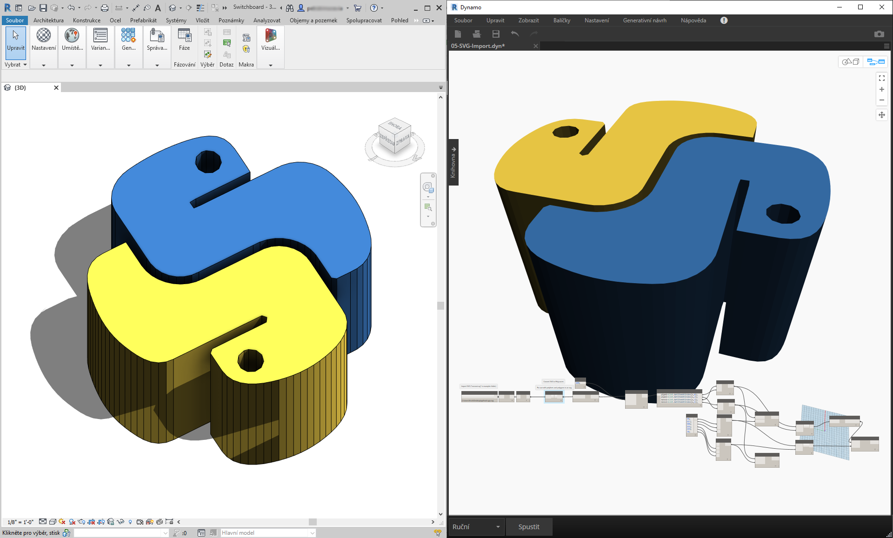
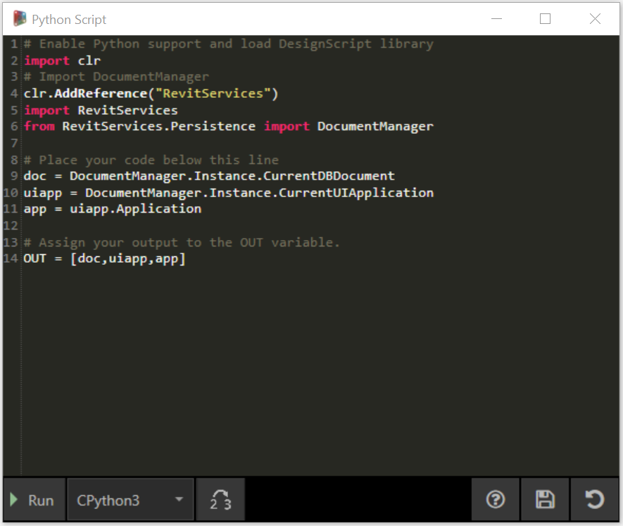
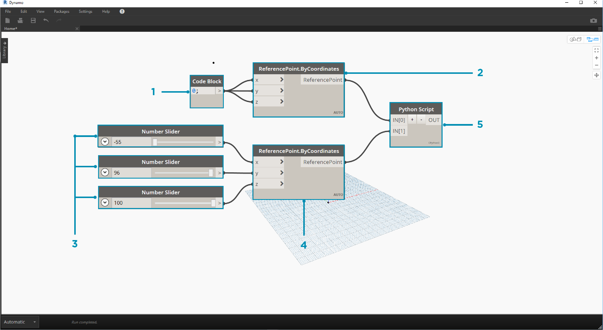
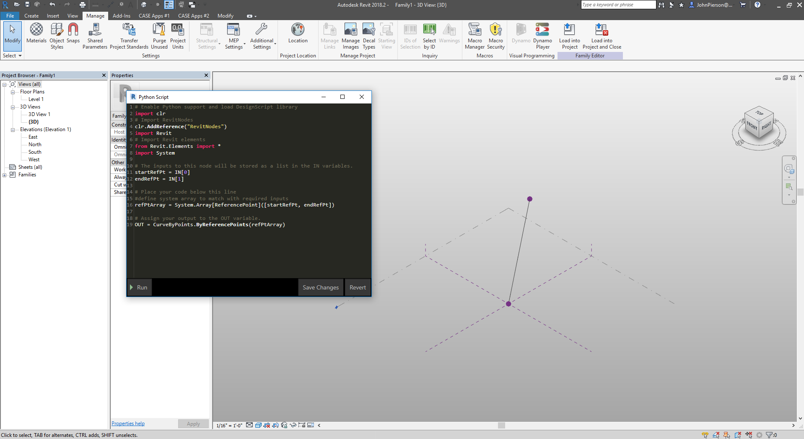
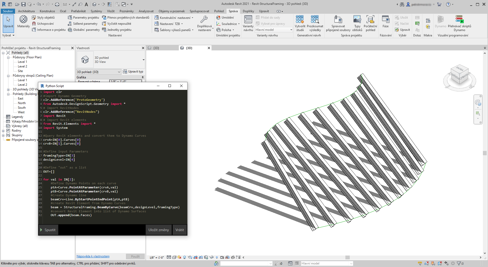
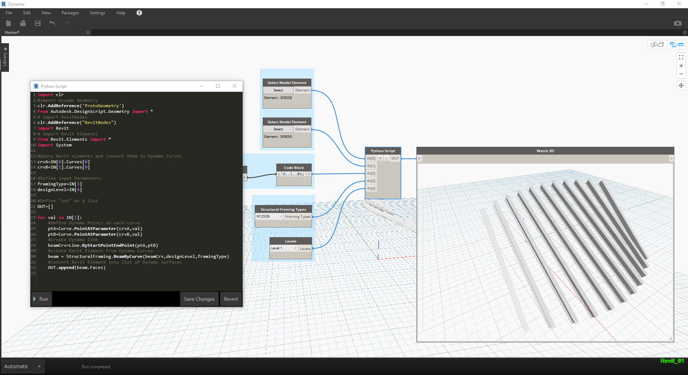

## Python a Revit

Nyní, když jsme ukázali, jak používat skripty jazyka Python v aplikaci Dynamo, podívejme se na připojení knihoven aplikace Revit do prostředí skriptování. Pamatujte, importovali jsme hlavní uzly aplikace Dynamo s prvními třemi řádky v níže uvedeném bloku kódu. Chcete-li importovat uzly aplikace Revit, prvky aplikace Revit a správce dokumentů aplikace Revit, stačí přidat pouze několik dalších řádků:

```
import clr
clr.AddReference('ProtoGeometry')
from Autodesk.DesignScript.Geometry import *

# Import RevitNodes
clr.AddReference("RevitNodes")
import Revit

# Import Revit elements
from Revit.Elements import *

# Import DocumentManager
clr.AddReference("RevitServices")
import RevitServices
from RevitServices.Persistence import DocumentManager

import System
```

To nám poskytuje přístup k rozhraní API aplikace Revit a nabízí vlastní skriptování pro libovolnou úlohu aplikace Revit. Díky kombinaci procesu vizuálního programování se skriptováním rozhraní API aplikace Revit se spolupráce a vývoj nástrojů výrazně zlepšují. Například správce BIM i konstruktér schémat mohou spolupracovat na stejném grafu. Při této spolupráci mohou zlepšit návrh a provedení modelu.



### Rozhraní API pro konkrétní platformu

Plán projektu aplikace Dynamo spočívá v rozšíření rozsahu implementace platformy. Protože aplikace Dynamo přidává další programy do objektu docket, uživatelé budou mít přístup k programům API specifickým pro platformu z prostředí skriptování v jazyce Python. Zatímco v aplikaci Revit se jedná o případovou studii, můžeme předvídat další kapitoly v budoucnosti, které nabízejí komplexní výukové programy zaměřené na skriptování v jiných platformách. Navíc je nyní k dispozici mnoho knihoven [IronPython](http://ironpython.net/), které lze importovat do aplikace Dynamo.

Níže uvedené příklady ukazují způsoby implementace operací specifických pro aplikaci Revit z aplikace Dynamo pomocí jazyka Python. Podrobnější informace o vztahu jazyka Python s aplikacemi Dynamo a Revit naleznete na [stránce Wiki k aplikaci Dynamo](https://github.com/DynamoDS/Dynamo/wiki/Python-0.6.3-to-0.7.x-Migration). Dalším užitečným zdrojem pro aplikace Python a Revit je projekt [prostředí Python Shell ](https://github.com/architecture-building-systems/revitpythonshell) aplikace Revit.

### Cvičení 1

> Vytvořte nový projekt aplikace Revit. Stáhněte si vzorový soubor, který je přiložen k tomuto cvičení (klikněte pravým tlačítkem a vyberte příkaz Uložit odkaz jako...). Úplný seznam vzorových souborů naleznete v dodatku. [Revit-Doc.dyn](datasets/10-5/Revit-Doc.dyn)

V těchto cvičeních prozkoumáme základní skripty jazyka Python v rozhraní Dynamo pro aplikaci Revit. Toto cvičení se zaměří na práci se soubory a prvky aplikace Revit a také na komunikaci mezi aplikacemi Revit a Dynamo.


> Jedná se o jednoduchou metodu získávání souborů *doc*, *uiapp* a *app* aplikace Revit připojených k vaší relaci Dynamo. Programátoři, kteří předtím pracovali v rozhraní API aplikace Revit, si mohou všimnout položek v seznamu sledovaných položek. Pokud se vám to nezdá povědomé, tak to nevadí. Použijeme další příklady ve cvičeních níže.

Zde je způsob importu služeb aplikace Revit a získání dat dokumentu v aplikaci Dynamo: 

> Pohled na uzel Python v aplikaci Dynamo. Komentovaný kód je níže.

```
# Enable Python support and load DesignScript library
import clr
# Import DocumentManager
clr.AddReference("RevitServices")
import RevitServices
from RevitServices.Persistence import DocumentManager

# Place your code below this line
doc = DocumentManager.Instance.CurrentDBDocument
uiapp = DocumentManager.Instance.CurrentUIApplication
app = uiapp.Application

# Assign your output to the OUT variable.
OUT = [doc,uiapp,app]
```

### Cvičení 2

> Stáhněte si ukázkové soubory, které jsou přiloženy k tomuto cvičení (klikněte pravým tlačítkem a vyberte příkaz Uložit odkaz jako...). Úplný seznam vzorových souborů naleznete v dodatku. [Revit-ReferenceCurve.dyn](datasets/10-5/Revit-ReferenceCurve.dyn)

V tomto cvičení vytvoříme pomocí uzlu Python aplikace Dynamo jednoduchou křivku modelu v aplikaci Revit.



> Začněte množinou uzlů na obrázku výše. Nejprve vytvoříme dva referenční body v aplikaci Revit z uzlů aplikace Dynamo.

> Začněte vytvořením nové rodiny Conceptual Mass v aplikaci Revit. Spusťte aplikaci Dynamo a vytvořte sadu uzlů na obrázku výše. Nejprve vytvoříme v aplikaci Revit dva referenční body z uzlů aplikace Dynamo.

> 1. Vytvořte blok kódu a zadejte hodnotu „0;“.
2. Tuto hodnotu zadejte do uzlu ReferencePoint.ByCoordinates pro vstupy X, Y a Z.
3. Vytvořte tři posuvníky v rozsahu od -100 do 100 s velikostí kroku 1.
4. Připojte každý posuvník k uzlu ReferencePoint.ByCoordinates.
5. Přidejte do pracovního prostoru uzel Python, klikněte na tlačítko „+“ u uzlu, přidejte další vstup a vložte dva referenční body do každého vstupu. Otevřete uzel Python.


> Pohled na uzel Python v aplikaci Dynamo. Komentovaný kód je níže.

> 1. **System.Array:** Aplikace Revit vyžaduje jako vstup systémové pole (místo seznamu jazyka Python). Jedná se pouze o jeden další řádek kódu, ale zohlednění typů argumentů usnadní programování v aplikaci Revit v jazyce Python.

```
import clr

# Import RevitNodes
clr.AddReference("RevitNodes")
import Revit
# Import Revit elements
from Revit.Elements import *
import System

#define inputs
startRefPt = IN[0]
endRefPt = IN[1]

#define system array to match with required inputs
refPtArray = System.Array[ReferencePoint]([startRefPt, endRefPt])
#create curve by reference points in Revit
OUT = CurveByPoints.ByReferencePoints(refPtArray)
```



> V aplikaci Dynamo jsme vytvořili dva referenční body s čárou, která je spojuje pomocí aplikace Python. V dalším cvičení zkusíme něco složitějšího.

### Cvičení 3

> Stáhněte a rozbalte ukázkové soubory, které jsou součástí tohoto cvičení (klikněte pravým tlačítkem a vyberte příkaz Uložit odkaz jako...). Úplný seznam vzorových souborů naleznete v dodatku. [Revit-StructuralFraming.zip](datasets/10-5/Revit-StructuralFraming.zip)

> Toto cvičení vysvětluje témata připojení dat a geometrie z aplikace Revit do aplikace Dynamo a zpět. Začneme otevřením souboru Revit-StructuralFraming.rvt. Po otevření načtěte aplikaci Dynamo a otevřete soubor Revit-StructuralFraming.dyn.


> Tento soubor aplikace Revit je jeden z nejzákladnějších. Dva referenční oblouky: jeden nakreslený na Podlaží 1 a druhý na Podlaží 2. Chceme tyto křivky dostat do aplikace Dynamo a zachovat živé propojení.


> V tomto souboru máme sadu uzlů zapojených do pěti vstupů uzlu Python.

> 1. **Vybrat uzly prvků modelu:** Klikněte na tlačítko Vybrat pro každý prvek a vyberte odpovídající oblouk v aplikaci Revit.
2. **Blok kódu:** pomocí syntaxe *„0..1..#x;“* spojte celé číslo posuvníku v rozsahu od 0 do 20 do vstupu *x*. Označuje počet nosníků, které se mají kreslit mezi dvěma oblouky.
3. **Typy rámových konstrukcí:** Zde vybereme v rozevírací nabídce výchozí nosník W12x26.
4. **Podlaží:** vyberte možnost Podlaží 1.


> Tento kód v jazyce Python je trochu hustší, ale komentáře v kódu popisují, co se v procesu děje:

```
import clr
#import Dynamo Geometry
clr.AddReference('ProtoGeometry')
from Autodesk.DesignScript.Geometry import *
# Import RevitNodes
clr.AddReference("RevitNodes")
import Revit
# Import Revit elements
from Revit.Elements import *
import System

#Query Revit elements and convert them to Dynamo Curves
crvA=IN[0].Curves[0]
crvB=IN[1].Curves[0]

#Define input Parameters
framingType=IN[3]
designLevel=IN[4]

#Define "out" as a list
OUT=[]

for val in IN[2]:
#Define Dynamo Points on each curve
ptA=Curve.PointAtParameter(crvA,val)
ptB=Curve.PointAtParameter(crvB,val)
#Create Dynamo line
beamCrv=Line.ByStartPointEndPoint(ptA,ptB)
#create Revit Element from Dynamo Curves
beam = StructuralFraming.BeamByCurve(beamCrv,designLevel,framingType)
#convert Revit Element into list of Dynamo Surfaces
OUT.append(beam.Faces)
```



> V aplikaci Revit je k dispozici pole nosníků, které pokrývají dva oblouky jako konstrukční prvky. Poznámka: Toto není realistický příklad... Konstrukční prvky se používají jako příklad pro nativní instance aplikace Revit vytvořené z aplikace Dynamo.  Výsledky jsou v aplikaci Dynamo zobrazeny také. Nosníky v uzlu Watch3D odkazují na geometrii dotazovanou z prvků aplikace Revit.

Všimněte si, že máme nepřetržitý proces převodu dat z prostředí aplikace Revit do prostředí aplikace Dynamo. Toto je souhrn průběhu procesu:

1. Vybrat prvek aplikace Revit
2. Převést prvek aplikace Revit na oblouk aplikace Dynamo
3. Rozdělit oblouk aplikace Dynamo na řadu bodů aplikace Dynamo
4. Pomocí bodů aplikace Dynamo mezi dvěma oblouky vytvořit čáry aplikace Dynamo
5. Vytvořit nosníky aplikace Revit pomocí odkazů na čáry aplikace Dynamo
6. Vytvořit výstup povrchů aplikace Dynamo pomocí dotazů na geometrii nosníků aplikace Revit

Může to znít složitě, ale skript to zjednodušuje na úpravy oblouku v aplikaci Revit a opakované spuštění řešiče (ale může být nutné předchozí nosníky odstranit). *Důvodem je skutečnost, že nosníky umísťujeme do jazyka Python, a tím porušujeme asociaci uzlů OOTB.*



> Pomocí aktualizace referenčních křivek v aplikaci Revit získáte nové pole nosníků.

