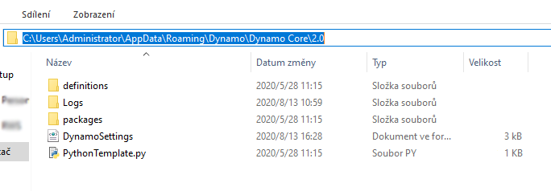
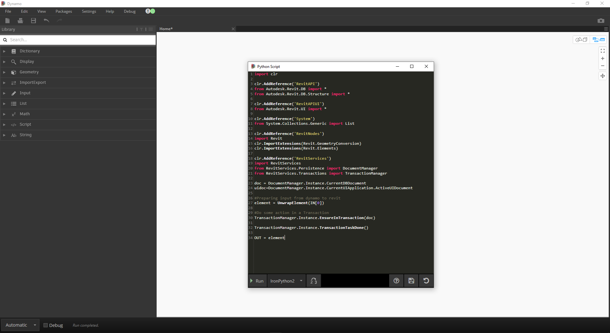

## Šablony jazyka Python

V aplikaci Dynamo 2.0 je možné určit výchozí šablonu ```(přípona .py)```, která se použije při prvním otevření okna jazyka Python. Tato funkce byla dlouho požadována, protože urychluje používání jazyka Python v aplikaci Dynamo. Díky šabloně je možné při vývoji vlastního skriptu v jazyce Python mít připraveny veškeré importy.

Šablona se nachází v umístění ```APPDATA``` instalace aplikace Dynamo.

Obvykle se jedná o následující cestu ```( %appdata%\Dynamo\Dynamo Core\{verze}\ )```.



### Nastavení šablony

Aby bylo možné tuto funkci používat, je nutné přidat do souboru ```DynamoSettings.xml``` následující řádek. *(Upravte v poznámkovém bloku)*


Řetězec ```<PythonTemplateFilePath />``` je možné jednoduše nahradit následujícím řetězcem:

```
<PythonTemplateFilePath>
<string>C:\Users\CURRENTUSER\AppData\Roaming\Dynamo\Dynamo Core\2.0\PythonTemplate.py</string>
</PythonTemplateFilePath>
```

*Poznámka: část CURRENTUSER nahraďte svým uživatelským jménem*

Dále je nutné vytvořit šablonu s funkcemi, které má obsahovat. V tomto případě do ní zahrneme importy související s aplikací Revit a další položky, které se s aplikací Revit obvykle používají.

Otevřete prázdný dokument v poznámkovém bloku a vložte do něj následující kód:

```
import clr

clr.AddReference('RevitAPI')
from Autodesk.Revit.DB import *
from Autodesk.Revit.DB.Structure import *

clr.AddReference('RevitAPIUI')
from Autodesk.Revit.UI import *

clr.AddReference('System')
from System.Collections.Generic import List

clr.AddReference('RevitNodes')
import Revit
clr.ImportExtensions(Revit.GeometryConversion)
clr.ImportExtensions(Revit.Elements)

clr.AddReference('RevitServices')
import RevitServices
from RevitServices.Persistence import DocumentManager
from RevitServices.Transactions import TransactionManager

doc = DocumentManager.Instance.CurrentDBDocument
uidoc=DocumentManager.Instance.CurrentUIApplication.ActiveUIDocument

#Preparing input from dynamo to revit
element = UnwrapElement(IN[0])

#Do some action in a Transaction
TransactionManager.Instance.EnsureInTransaction(doc)

TransactionManager.Instance.TransactionTaskDone()

OUT = element
```

Poté tento soubor uložte pod názvem ```PythonTemplate.py``` do umístění ```APPDATA```.

### Chování skriptu jazyka Python

Po definování šablony jazyka Python aplikace Dynamo tuto šablonu vyhledá při každém vložení uzlu jazyka Python. Pokud ji nenajde, okno jazyka Python bude vypadat jako ve výchozím nastavení.


Pokud se podaří šablonu jazyka Python nalézt (například náš skript pro aplikaci Revit), zobrazí se všechny položky, které obsahuje.



Další informace o této nové funkci (autor: Radu Gidei) naleznete zde. [https://github.com/DynamoDS/Dynamo/pull/8122](https://github.com/DynamoDS/Dynamo/pull/8122)

