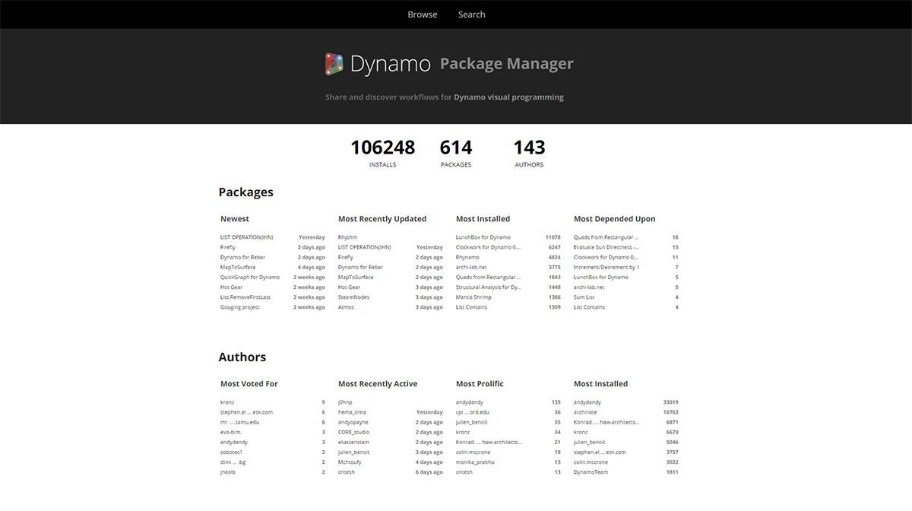
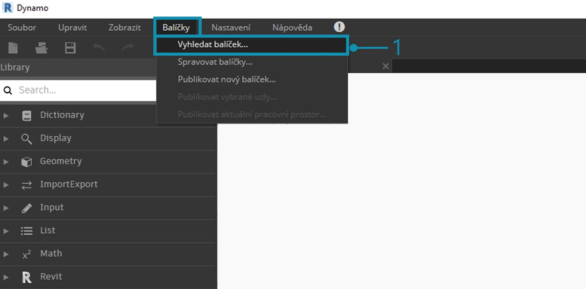
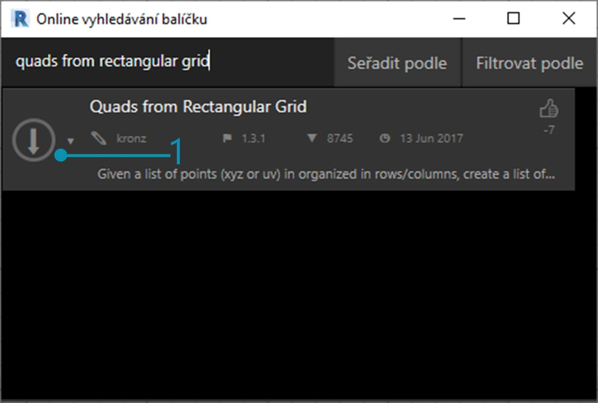
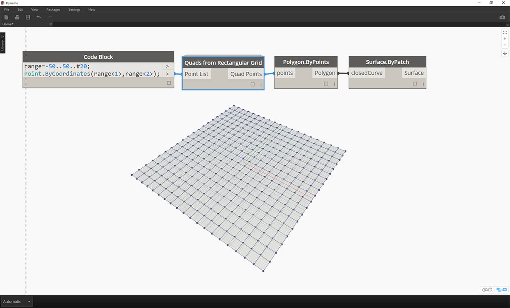
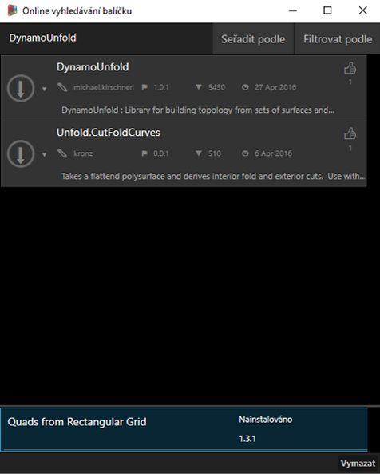
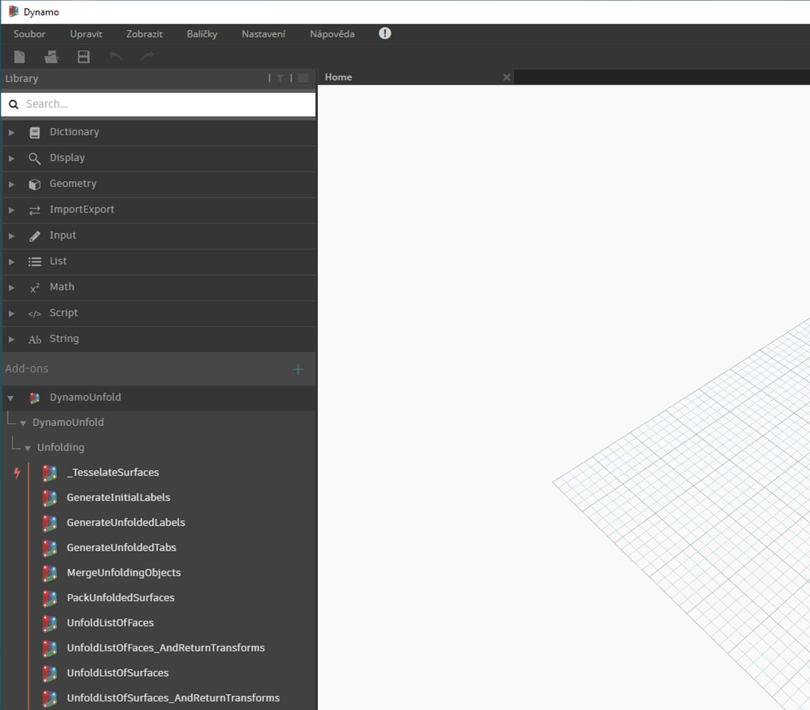
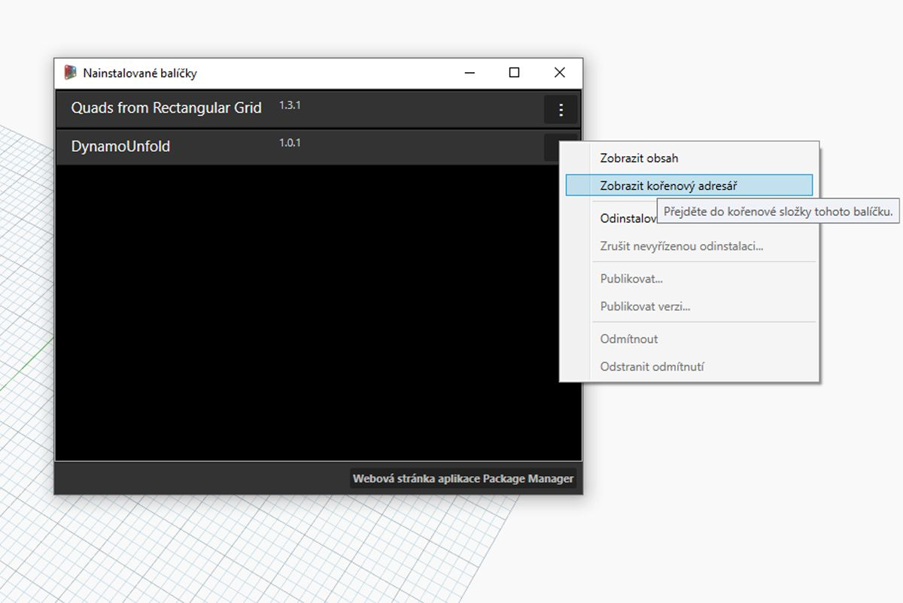
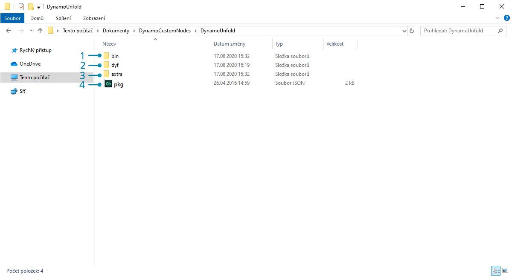
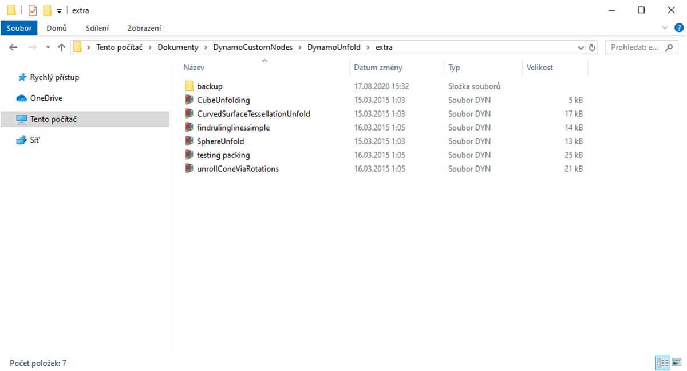
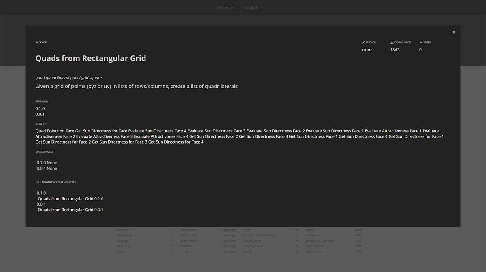

## Balíčky

Stručně řečeno, balíček je kolekce uživatelských uzlů. Nástroj Dynamo Package Manager je portál pro komunitu, kde lze stáhnout všechny balíčky, které byly publikovány online. Tyto sady nástrojů jsou vyvinuty třetími stranami, aby bylo možné rozšířit základní funkce aplikace Dynamo, jsou přístupné všem a připraveny ke stažení kliknutím na tlačítko.

Projektu s otevřeným zdrojovým kódem, jako je Dynamo, tento druh zapojení komunity prospívá. Díky specializovaným vývojářům třetích stran je aplikace Dynamo schopna rozšířit svůj dosah na pracovní postupy napříč různými odvětvími. Z tohoto důvodu tým aplikace Dynamo vyvinul společné úsilí, aby zefektivnil vývoj a zveřejňování balíčků (které budou podrobněji popsány v následujících částech).

### Instalace balíčku

Nejjednodušším způsobem instalace balíčku je použití panelu nástrojů Balíčky v rozhraní aplikace Dynamo. Pojďme se do toho hned pustit a nainstalovat ho. V tomto rychlém příkladu nainstalujeme oblíbený balíček k vytvoření čtyřúhelníkových panelů v rastru. 

> 1. V aplikaci Dynamo přejděte na kartu *Balíčky > Vyhledat balíček...*

> Na panelu hledání vyhledejte „čtyřúhelníky z obdélníkové mřížky“(quads from rectangular grid). Za chvíli by se měly zobrazit všechny balíčky, které odpovídají tomuto vyhledávacímu dotazu. Chceme vybrat první balíček s odpovídajícím názvem.

> 1. Klikněte na šipku stažení vlevo od názvu balíčku a balíček se nainstaluje. Hotovo!

> 1. Všimněte si, že v knihovně aplikace Dynamo je nyní k dispozici další skupina s názvem *"buildz"*. Tento název odkazuje na [vývojáře](http://buildz.blogspot.com/) balíčku a uživatelský uzel je umístěn do této skupiny. Můžete ji začít ihned používat.

> Pomocí operace rychlého bloku kódu definujte pravoúhlou mřížku a vytvořte seznam obdélníkových panelů.

### Složky balíčků

Výše uvedený příklad se zaměřuje na balíček s jedním uživatelským uzlem, ale stejný postup se používá ke stahování balíčků s několika uživatelskými uzly a podpůrnými datovými soubory. Nyní si předvedeme složitější balíček: Dynamo Unfold.

> Stejně jako ve výše uvedeném příkladu začněte výběrem položek *Balíčky>Vyhledat balíček...*. Tentokrát vyhledáme výraz *"DynamoUnfold"*, jedno slovo, pozor na velikost písmen. Když se balíčky zobrazí, stáhněte je kliknutím na šipku vlevo od názvu balíčku. Balíček Dynamo Unfold bude nyní nainstalován do knihovny aplikace Dynamo.

> V knihovně aplikace Dynamo je k dispozici skupina aplikace *DynamoUnfold* s více kategoriemi a s vlastními uzly.

> Nyní se podíváme na strukturu souborů balíčku. Vyberte možnost *Balíčky>Spravovat balíčky...* v aplikaci Dynamo. Zobrazí se výše uvedené okno se dvěma nainstalovanými knihovnami. Klikněte na tlačítko vpravo od položky *DynamoUnfold* a vyberte možnost *Zobrazit kořenový adresář*.

> Tak se dostaneme do kořenového adresáře balíčku. Všimněte si, že máme tři složky a soubor.

> 1. Složka *bin* slouží k ukládání souborů .dll. Tento balíček Dynamo byl vyvinut pomocí možnosti Zero-Touch, proto jsou uživatelské uzly uloženy v této složce.
2. Složka *dyf* slouží k umístění uživatelských uzlů. Tento balíček nebyl vytvořen pomocí vlastních uzlů aplikace Dynamo, proto je tato složka pro tento balíček prázdná.
3. Složka extra obsahuje všechny další soubory včetně vzorových souborů.
4. Soubor pkg je základní textový soubor, který definuje nastavení balíčku. Můžeme ho zatím ignorovat.

> Při otevření složky *extra* se zobrazí několik vzorových souborů, které byly staženy spolu s instalací. Ne všechny balíčky mají vzorové soubory, ale zde je můžete najít, pokud jsou součástí balíčku. Otevřeme položku *SphereUnfold*.

> Po otevření souboru a stisknutí tlačítka *Spustit* na řešiči máme rozvinutou kouli. Ukázkové soubory, jako jsou tyto, jsou užitečné při studiu práce s novým balíčkem Dynamo.

### Nástroj Dynamo Package Manager

Další způsob, jak objevovat balíčky aplikace Dynamo, je prozkoumat online nástroj [Dynamo Package Manager](http://dynamopackages.com/). To je dobrý způsob, jak procházet balíčky, protože úložiště třídí balíčky podle počtu stažení a popularity. Také je snadné získat informace o nejnovějších aktualizacích pro balíčky, protože některé balíčky aplikace Dynamo mají více verzí závislých na sestavě aplikace Dynamo.

> Kliknutím na možnost *Čtyřhranné prvky z pravoúhlé mřížky* ve Správci balíčků Dynamo můžete zobrazit jejich popisy, verze, vývojáře a možné závislosti.

Soubory balíčku můžete také stáhnout z aplikace Dynamo Package Manager, ale přímo z aplikace Dynamo je proces jednodušší.

### Kde jsou soubory uloženy místně?

Pokud stahujete soubory ze Správce balíčků Dynamo nebo pokud chcete zjistit, kde jsou uloženy všechny soubory balíčku, klikněte na možnost *Nastavení>Spravovat cesty uzlů a balíčků*. Kliknutím na tři tečky vedle adresáře složky můžete zkopírovat kořenovou složku a otevřít balíček v okně prohlížeče. Ve výchozím nastavení jsou balíčky nainstalovány do umístění podobného této cestě: *C:/Users/[uživatelské jméno]/AppData/Roaming/Dynamo/[verze aplikace Dynamo]*.

### Další práce s balíčky

Komunita aplikace Dynamo neustále roste a vyvíjí se. Průběžně prohlížením aplikace Dynamo Package Manager najdete nové zajímavé informace. V následujících částech se podrobněji podíváme na balíčky, z pohledu koncového uživatele na tvorbu vlastního balíčku aplikace Dynamo.

