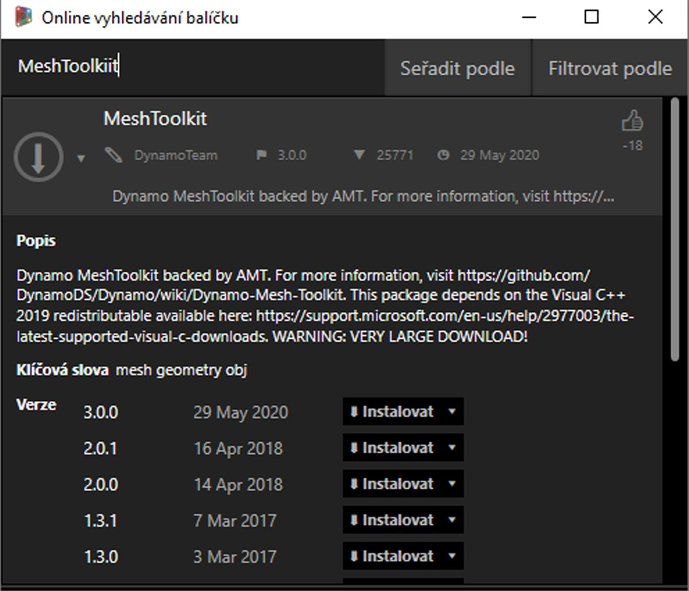
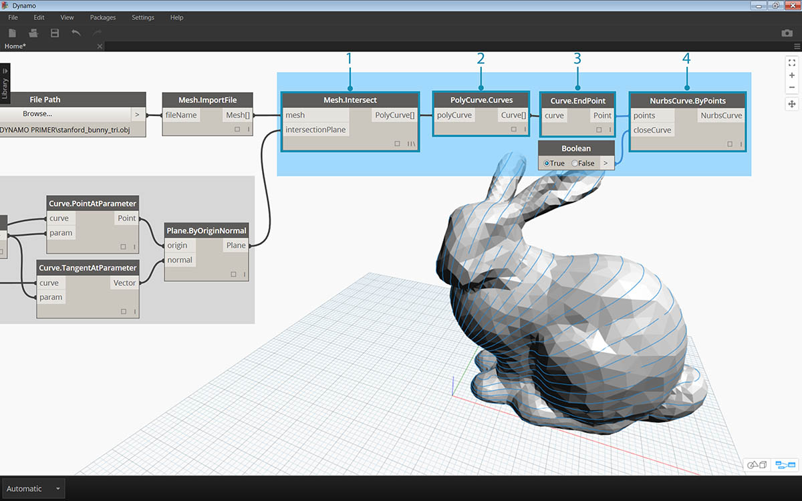
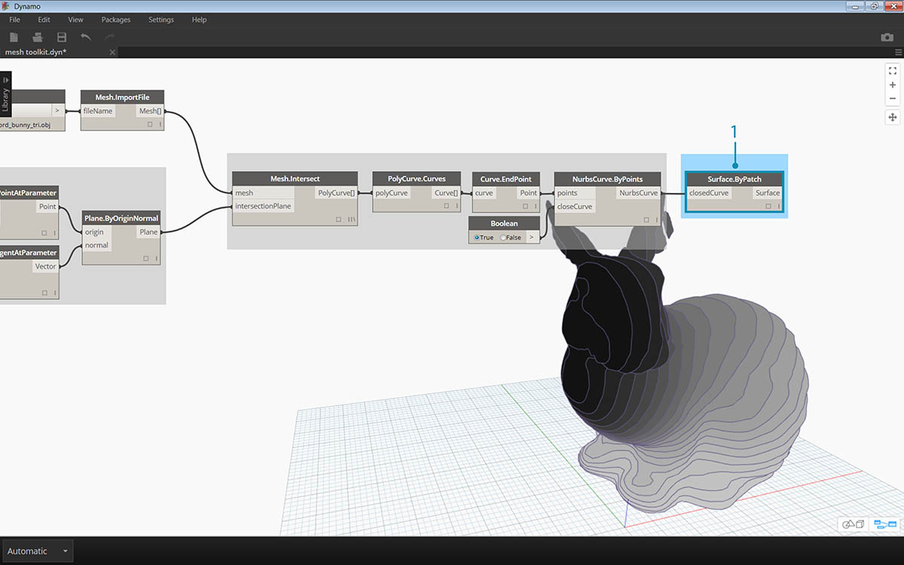

## Příklad balíčku – sada nástrojů pro sítě

Sada nástrojů pro sítě obsahuje nástroje pro import sítí ze souborů různých formátů, tvorbu sítě z objektů geometrií aplikace Dynamo a ruční tvorbu sítí z bodů a indexů. Knihovna také obsahuje nástroje pro úpravy sítí a extrahování vodorovných řezů pro použití ve výrobě.

Sada nástrojů pro sítě aplikace Dynamo je součástí výzkumu společnosti Autodesk a v budoucnu budou její funkce přibývat. Do sady budou často přidávány nové metody, tým aplikace Dynamo ocení jakékoliv komentáře, hlášení chyb nebo nápady na nové funkce.

### Sítě vs. tělesa

V následujícím cvičení budou demonstrovány základní operace pomocí sady nástrojů pro sítě. V tomto cvičení protneme síť řadou rovin, což by u těles bylo výpočetně náročné. Na rozdíl od tělesa má síť „rozlišení“, které není definováno matematicky, ale topologicky, a je možné ho definovat podle aktuální úlohy. Další podrobnosti o vztahu mezi sítí a tělesem naleznete v kapitole [Geometrie pro návrh výpočtu](../05_Geometry-for-Computational-Design/5_geometry-for-computational-design.md) v této příručce Primer. Další informace o sadě nástrojů pro sítě naleznete na[wiki stránce aplikace Dynamo.](https://github.com/DynamoDS/Dynamo/wiki/Dynamo-Mesh-Toolkit) Cvičení níže demonstruje práci s tímto balíčkem.

### Instalace sady nástrojů pro sítě

> V horní nabídce aplikace Dynamo vyberte možnost *Balíčky > Hledat balíčky...*. Do pole pro hledání zadejte slovo *„MeshToolkit“*, dbejte na velikost písmen. Klikněte na šipku ke stažení u požadovaného balíku pro danou verzi aplikace Dynamo. Je to tak jednoduché.

### Cvičení

> Stáhněte a rozbalte ukázkové soubory pro toto cvičení (klikněte pravým tlačítkem a vyberte možnost „Uložit odkaz jako...“). Úplný seznam vzorových souborů naleznete v příloze. [MeshToolkit.zip](datasets/11-2/MeshToolkit.zip)

Začněte otevřením souboru *Mesh-Toolkit_Intersect-Mesh.dyn v aplikaci Dynamo.* V tomto příkladu se podíváme na uzel průniku v sadě nástrojů pro sítě. Provedeme import sítě a protneme ji řadou vstupních rovin, čímž vytvoříme řezy. Tím začne příprava modelu na výrobu, řezání laserovým nebo vodním paprskem či CNC frézování.

> 1. **File Path:** Vyhledejte soubor sítě k importu (*stanford_bunny_tri.obj*). Podporované typy souborů jsou .mix a .obj
2. **Mesh.ImportFile:** Připojte cestu k souboru, aby došlo k importu sítě

> 1. **Point.ByCoordinates:** Vytvořte bod, ten bude středem oblouku.
2. **Arc.ByCenterPointRadiusAngle:** Vytvořte oblouk kolem bodu. Tato křivka se použije k umístění řady rovin.

> 1. Code Block: Vytvořte řadu čísel mezi nulou a jedničkou.
2. **Curve.PointAtParameter:** Připojte oblouk na vstup *„curve“* a výstup bloku s kódem na vstup *„param“*, čímž získáte řadu bodů na křivce.
3. **Curve.TangentAtParameter:** Připojte stejné vstupy jako u předchozího uzlu.
4. **Plane.ByOriginNormal:** Připojte body na vstup *„origin“* a vektory na vstup *„normal“*, čímž v jednotlivých bodech vytvoříte řadu rovin.

Nyní byste měli vidět řadu rovin orientovaných podél oblouku. Nyní tyto roviny použijeme k protnutí sítě.

> 1. **Mesh.Intersect:** Vytvořte průnik rovin s importovanou sítí, čímž vznikne řada polykřivkových kontur.
2. **PolyCurve.Curves:** Rozdělte polykřivky na jejich křivkové fragmenty.
3. **Curve.EndPoint:** Extrahujte koncové body jednotlivých křivek.
4. **NurbsCurve.ByPoints:** Pomocí bodů vytvořte křivku nurbs. K uzavření křivek použijte uzel Boolean nastavený na *True*.

> 1. **Surface.ByPatch:** Vytvořte záplaty ploch pro každou konturu, čímž vytvoříte „řezy“ sítě.

> Přidejte druhou řadu řezů, čímž vznikne efekt podobný vaflím.

Možná jste si všimli, že operace průniku se u sítí počítají rychleji než u těles. Pracovní postupy podobné těm jako v tomto cvičení fungují se sítěmi velmi dobře.

