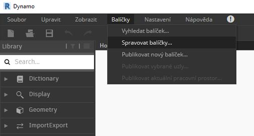
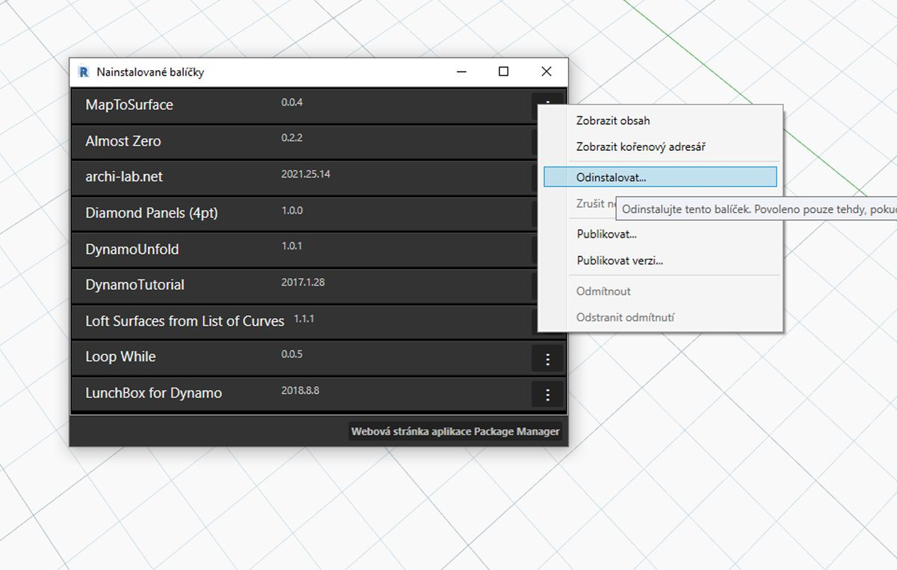
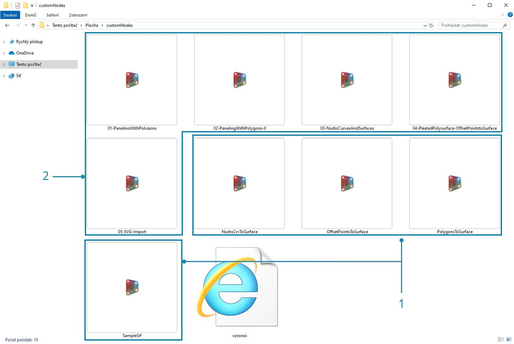
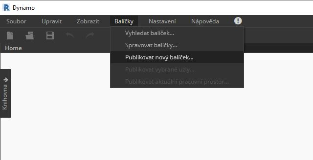
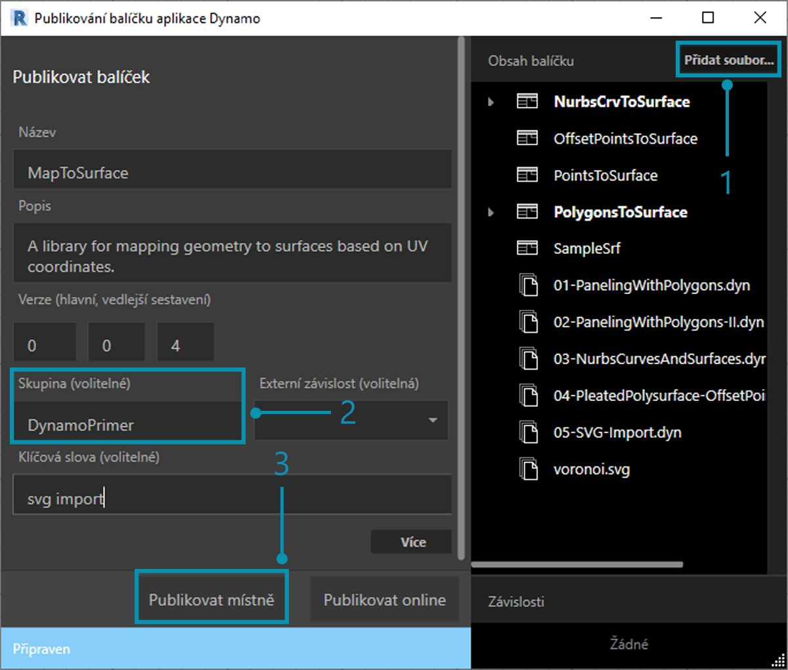
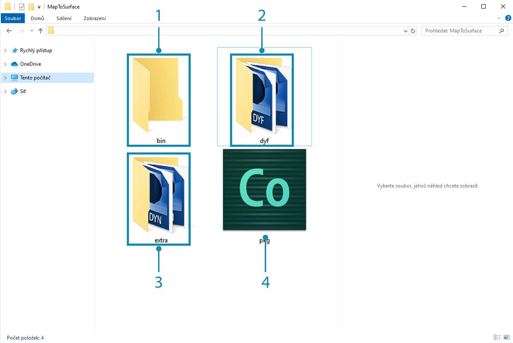
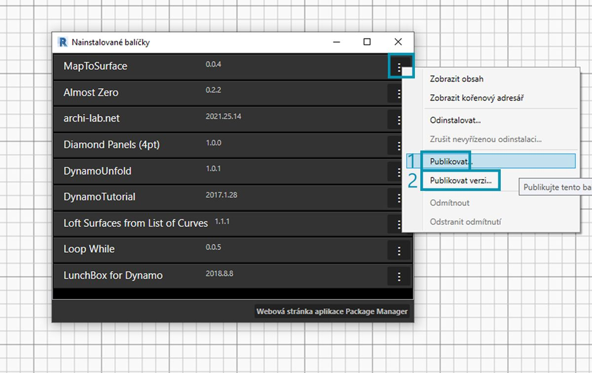

## Publikování balíčku

V předchozích částech jsme se zabývali podrobnostmi o tom, jak je balíček *MapToSurface* nastaven pomocí vlastních uzlů a vzorových souborů. Ale jak publikujeme balíček, který byl vyvinut místně? Tato případová studie ukazuje, jak publikovat balíček ze sady souborů v místní složce.  Balíček lze publikovat mnoha způsoby. Níže je popsán proces, který doporučujeme:** publikovat místně, vyvíjet místně a poté publikovat online**. Začneme složkou obsahující všechny soubory v balíčku.

### Odinstalace balíčku

Před přechodem k publikování balíčku MapToSurface nejprve odinstalujte balíček z předchozí lekce, abyste nepracovali se stejnými balíčky.

> Začněte tím, že přejdete do části *Balíčky>Správa balíčků...*

> Vyberte tlačítko odpovídající položce *MapToSurface* a vyberte možnost *Odinstalovat...*. Poté restartujte aplikaci Dynamo. Při opakovaném otevření by se v okně *Správa balíčků* již neměla nacházet položka *MapToSurface*. Teď jsme připraveni začít od začátku.

### Místní publikování balíčku

*Poznámka: V době psaní je publikování balíčku aplikace Dynamo povoleno pouze v aplikaci Dynamo Studio nebo Dynamo pro aplikaci Revit. Aplikace Dynamo Sandbox nemá funkce pro publikování.*

> Stáhněte a rozbalte ukázkové soubory, které jsou připojeny k této případové studii balíčku (klikněte pravým tlačítkem a vyberte příkaz Uložit odkaz jako...). Úplný seznam vzorových souborů najdete v dodatku. [MapToSurface.zip](datasets/11-4/MapToSurface.zip)

> Toto je první odeslání pro náš balíček a všechny ukázkové soubory a vlastní uzly souborů jsme umístili do jedné složky. Když je tato složka připravena, jsme připraveni k odeslání do správce Dynamo Package Manager.

> 1. Tato složka obsahuje pět vlastních uzlů (.dyf).
2. Tato složka také obsahuje pět vzorových souborů (.dyn) a jeden importovaný vektorový soubor (.svg). Tyto soubory budou sloužit jako úvodní cvičení, která uživateli ukážou, jak pracovat s vlastními uzly.

> V aplikaci Dynamo začněte kliknutím na položku *Balíčky>Publikovat nový balíček...*

> V okně *Publikovat balíček aplikace Dynamo* jsme vyplnili příslušné formuláře na levé straně okna.

> 1. Kliknutím na tlačítko *Přidat soubor* jsme také přidali soubory ze struktury složek na pravé straně obrazovky (pro přidání souborů, které nejsou soubory .dyf, změňte typ souboru v okně prohlížeče na **„Všechny soubory(*.*)"**. Všimněte si, že jsme přidali každý soubor, vlastní uzel (.dyf) nebo ukázkový soubor (.dyn), bez rozdílu. Aplikace Dynamo tyto položky kategorizuje při publikování balíčku.
2. Pole Skupina definuje, ve které skupině budou v uživatelském rozhraní aplikace Dynamo vyhledány vlastní uzly.
3. Publikujte kliknutím na tlačítko Publikovat místně. Pokud pracujete s námi, klikněte na tlačítko *Publikovat místně* a **ne** *Publikovat online*. V nástroji Package Manager nechceme duplicitní balíčky.

> 1. Po publikování by měly být vlastní uzly dostupné ve skupině DynamoPrimer nebo v knihovně aplikace Dynamo.

> Nyní se podívejme na kořenový adresář a uvidíme, jak aplikace Dynamo formátovala balíček, který jsme právě vytvořili. Proveďte to kliknutím na možnosti *Balíčky>Spravovat balíčky...*

> V okně správy balíčků klikněte na tři svislé tečky vpravo od položky *MapToSurface* a vyberte možnost *Zobrazit kořenový adresář.*

> Všimněte si, že kořenový adresář se nachází v místním umístění balíčku (balíček jsme publikovali „místně“). Aplikace Dynamo aktuálně odkazuje na tuto složku pro čtení vlastních uzlů. Proto je důležité místně publikovat adresář do trvalého umístění složky (například ne na plochu). Zde je rozpis složky balíčku Dynamo:

> 1. Složka *bin* obsahuje soubory .dll vytvořené pomocí knihoven C# nebo funkce Zero-Touch. Pro tento balíček žádné nemáme, proto je tato složka v tomto příkladu prázdná.
2. Složka *dyf* slouží k umístění vlastních uzlů. Otevřením tohoto okna se zobrazí všechny vlastní uzly (soubory .dyf) pro tento balíček.
3. Složka navíc obsahuje všechny další soubory. Tyto soubory budou pravděpodobně soubory aplikace Dynamo (.dyn) nebo jakékoli další požadované soubory (.svg, .xls, .jpeg, .sat atd.).
4. Soubor pkg je základní textový soubor, který definuje nastavení balíčku. To je v aplikaci Dynamo automatické, ale pokud se chcete dostat do detailů, můžete je upravit.

### Publikování balíčku online

> **Poznámka: Nepracujte s námi, pokud skutečně nepublikujete vlastní balíček.**

> 1. Až budete připraveni k publikování, v okně Správa balíčků vyberte tlačítko vpravo od položky MapToSurface a vyberte možnost *Publikovat...*
2. Pokud aktualizujete balíček, který již byl publikován, klikněte na tlačítko Publikovat verzi a aplikace Dynamo aktualizuje balíček online podle nových souborů v kořenovém adresáři daného balíčku. Je to tak jednoduché.

### Publikovat verzi...

Při aktualizaci souborů v kořenové složce publikovaného balíčku můžete publikovat novou verzi balíčku výběrem možnosti *Publikovat verzi...* v okně *Správa balíčků*. Jedná se o snadný způsob, jak provést nezbytné aktualizace vašeho obsahu a sdílet jej s komunitou. Možnost *Publikovat verzi* bude fungovat pouze v případě, že udržujete balíček.

