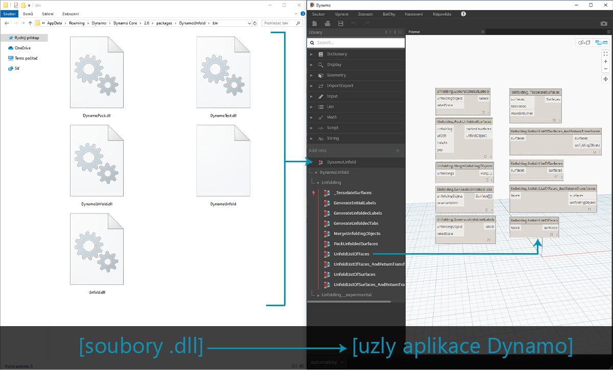
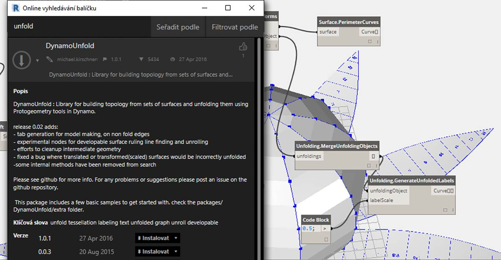
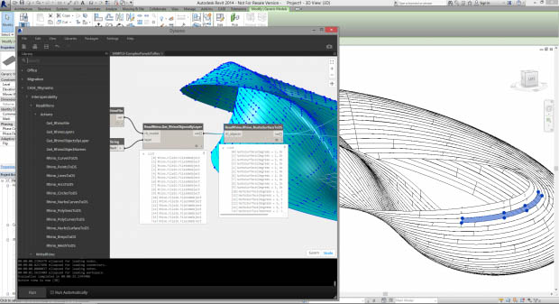
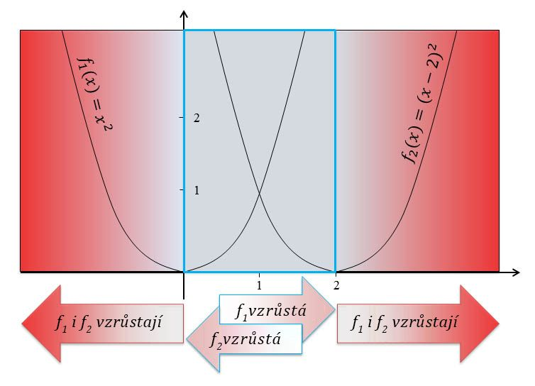
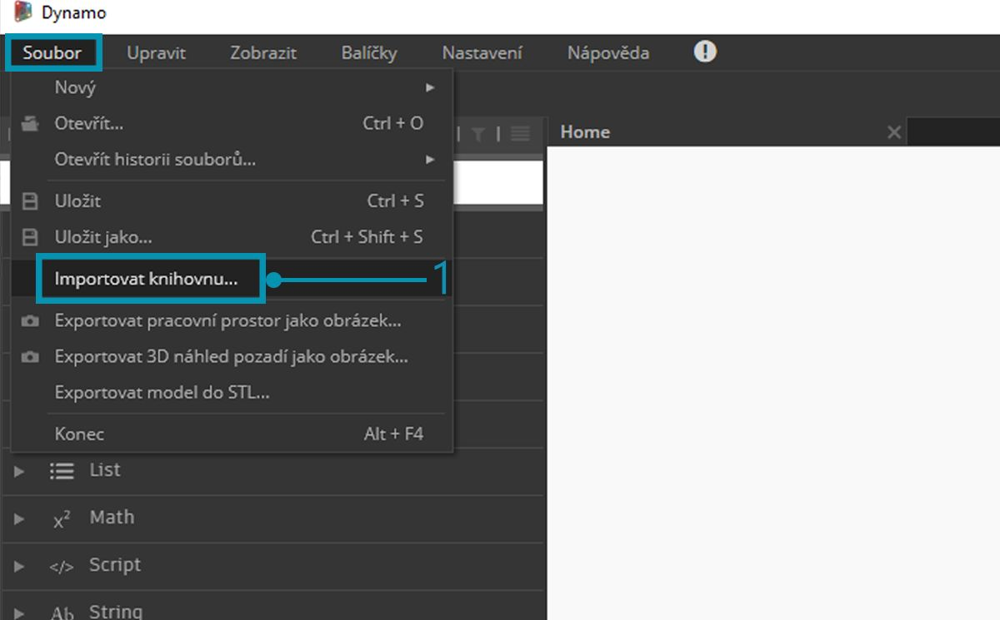
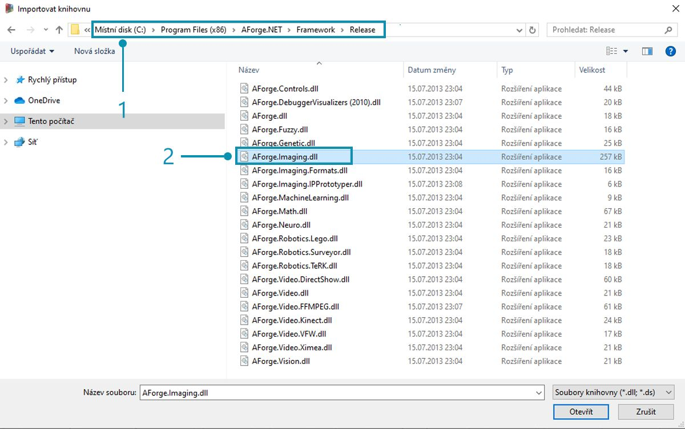
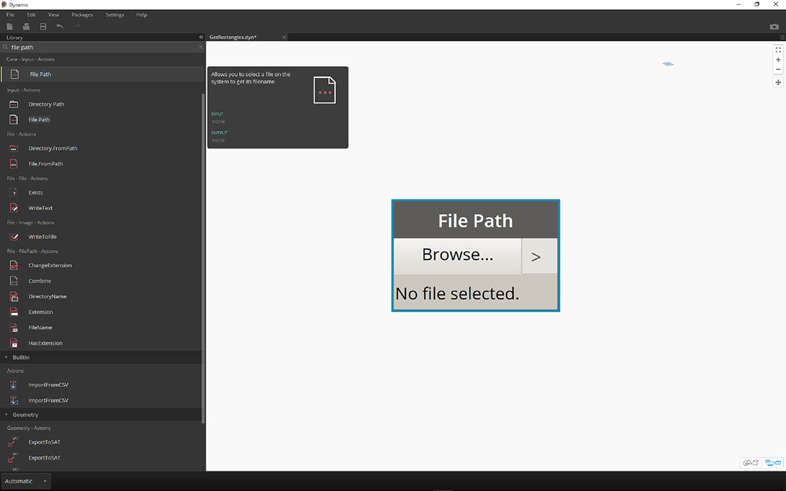
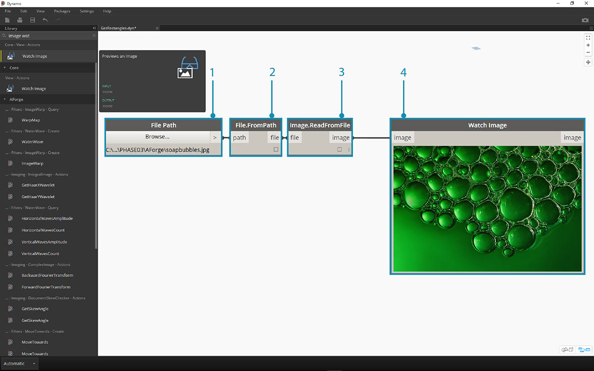
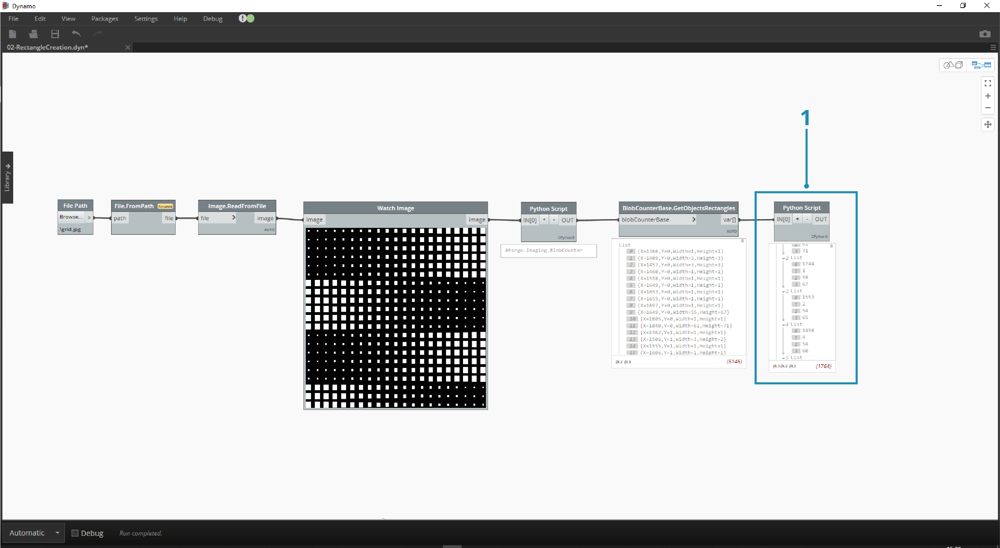

## Co je funkce Zero-Touch?

Import pomocí funkce Zero-Touch odkazuje na metodu jednoduchého importu knihoven C# pomocí najetí kurzoru a kliknutí. Aplikace Dynamo přečte veřejné metody souboru *.dll* a převede je na uzly aplikace Dynamo. Pomocí funkce Zero-Touch můžete vyvinout vlastní uzly a balíčky a importovat externí knihovny do prostředí aplikace Dynamo.



Pomocí funkce Zero-Touch můžete skutečně importovat knihovnu, která nebyla nezbytně vyvinuta pro aplikaci Dynamo, a vytvořit sady nových uzlů. Aktuální funkce Zero-Touch znázorňuje multiplatformní povahu projektu aplikace Dynamo.

Tato část předvádí, jak pomocí funkce Zero-Touch importovat knihovnu třetích stran. Informace o vývoji vlastní knihovny funkce Zero-Touch naleznete na [stránce Wiki k aplikaci Dynamo](https://github.com/DynamoDS/Dynamo/wiki/Zero-Touch-Plugin-Development).

### Balíčky funkce Zero-Touch

Balíčky funkce Zero-Touch jsou dobrým doplňkem k uživatelským vlastním uzlům. V tabulce níže je uvedeno několik balíčků, které používají knihovny C#. Podrobnější informace o balíčcích naleznete v [části Balíčky ](../Appendix/A-3_packages.md)v dodatku.

|Logo/obrázek|Název|
| -- | -- |
||[Sada nástrojů sítí](https://github.com/DynamoDS/Dynamo/wiki/Dynamo-Mesh-Toolkit)|
||[Dynamo Unfold](http://dynamobim.com/dynamounfold/)|
||[Rhynamo](http://www.case-inc.com/blog/what-is-rhynamo)|
||[Optimo](https://github.com/BPOpt/Optimo)|

### Případová studie – import položek AForge

Tato případová studie popisuje, jak importovat [AForge](http://www.aforgenet.com/) – externí *.dll* knihovnu. AForge je robustní knihovna, která nabízí celou řadu funkcí od zpracování obrázků po umělou inteligenci. Níže rozebereme několik cvičení týkající se zpracování obrázků, a přitom se budeme odkazovat na třídu k práci s obrázky v knihovně AForge.

> Stáhněte a rozbalte ukázkové soubory, které jsou připojeny k této případové studii balíčku (klikněte pravým tlačítkem a vyberte příkaz „Uložit odkaz jako...“). Úplný seznam vzorových souborů naleznete v dodatku. [Zero-Touch-Examples.zip](datasets/11-5/Zero-Touch-Examples.zip).

> 1. Začněte stažením knihovny AForge. Na [stránce stažení knihovny AForge](http://www.aforgenet.com/framework/downloads.html) vyberte položku *[Stáhnout instalační program]* a po dokončení stahování proveďte instalaci knihovny.



> 1. V aplikaci Dynamo vytvořte nový soubor a vyberte možnost *Soubor > Importovat knihovnu...*



> 1. V místním okně přejděte do složky Release instalačního programu AForge. Pravděpodobně se bude jednat o složku podobnou této: *C:\Program Files (x86)\AForge.NET\Framework\Release*.
2. **AForge.Imaging.dll:** Pro tuto případovou studii chceme použít pouze tento soubor z knihovny AForge. Vyberte tento soubor *.dll* a klikněte na možnost *„Otevřít“*.


> 1. V aplikaci Dynamo byste měli vidět skupinu uzlů *„AForge“* přidanou na panelu nástrojů Knihovna. Nyní máme přístup ke knihovně práce s obrázky AForge z našeho vizuálního programu.

### Cvičení 1 – Detekce hran

Jakmile bude knihovna importovaná, začněte jednoduše tímto prvním cvičením. V něm provedeme základní zpracování obrázků s ukázkovým obrázkem a ukážeme si, jak fungují filtry obrázků AForge. Pomocí uzlu *„Watch Image“* zobrazíme výsledky a v aplikaci Dynamo použijeme filtry podobné těm, které jsou v aplikaci Photoshop.

> Stáhněte a rozbalte ukázkové soubory, které jsou připojeny k této případové studii balíčku (klikněte pravým tlačítkem a vyberte příkaz „Uložit odkaz jako...“). Úplný seznam vzorových souborů naleznete v dodatku. [ZeroTouchImages.zip](datasets/11-5/ZeroTouchImages.zip)

Jakmile bude knihovna importovaná, začněte jednoduše tímto prvním cvičením (*01-EdgeDetection.dyn*). V něm provedeme základní zpracování obrázků s ukázkovým obrázkem a ukážeme si, jak fungují filtry obrázků AForge. Pomocí uzlu *„Watch Image“* zobrazíme výsledky a v aplikaci Dynamo použijeme filtry podobné těm, které jsou v aplikaci Photoshop.



> Nejprve je potřeba importovat obrázek, se kterým chcete pracovat. Přidejte na kreslicí plochu uzel *File Path* a ve složce staženého cvičení vyberte soubor „soapbubble.jpg“ (autor fotografie: [flickr](https://www.flickr.com/photos/wwworks/667298782)).



> 1. Uzel File Path jednoduše předá řetězec s cestou k vybranému obrázku. Tuto cestu k souboru je třeba převést na obrázek v prostředí aplikace Dynamo.
2. Připojte uzel File Path k uzlu File.FromPath.
3. K převodu tohoto souboru na obrázek použijte uzel Image.ReadFromFile.
4. Nakonec zobrazte výsledek. Přetáhněte uzel Watch Image na kreslicí plochu a připojte jej k uzlu Image.ReadFromFile. Ještě jsme nepoužili příkaz AForge, ale úspěšně jsme importovali obrázek do aplikace Dynamo.


> Pod uzlem AForge.Imaging.AForge.Filters (v navigační nabídce) si všimněte, že je k dispozici celá řada filtrů. Nyní pomocí jednoho z těchto filtrů odbarvíme obrázek podle hodnot prahů.

> 1. Umístěte tři posuvníky na kreslicí plochu, změňte jejich rozsahy na 0 až 1 a jejich hodnoty kroku na 0,01.
2. Přidejte na kreslicí plochu uzel Grayscale.Grayscale. Jedná se o filtr AForge, který na obrázek použije filtr odstínů šedé. Spojte tři posuvníky z kroku 1 ke vstupům cr, cg a cb. Změňte horní a dolní posuvník, tak aby měly hodnotu 1, a střední posuvník, tak aby měl hodnotu 0.
3. Aby bylo možné použít filtr odstínů šedi, je nutné provést s obrázkem určitou akci. K tomuto účelu použijeme příkaz IFilter.Apply. Připojte obrázek ke vstupu obrázku a uzel Grayscale.Grayscale ke vstupu uzlu iFilter.
4. Připojením k uzlu Watch Image získáte odbarvený obrázek.


> Kontrola nad odbarvením obrázku se odvíjí od hodnot prahů pro červenou, zelenou a modrou. Tyto hodnoty jsou definovány vstupem uzlu Grayscale.Grayscale. Všimněte si, že obrázek vypadá značně ztlumeně – je to kvůli tomu, že hodnota zelené barvy je posuvníkem nastavena na 0.

> 1. Změňte horní a dolní posuvník, tak aby měly hodnotu 0, a střední posuvník, tak aby měl hodnotu 1. Tímto získáte čitelnější odbarvený obrázek.


> Nyní na odbarvený obrázek použijeme další filtr. Odbarvený obrázek má určitý kontrast, čili nyní otestujeme detekci hran.

> 1. Přidejte na kreslicí plochu uzel SobelEdgeDetector.SobelEdgeDetector. Připojte jej jako IFilter k novému uzlu IFilter a připojte upravený obrázek ke vstupu obrázku uzlu IFilter.
2. Detektor hran Sobel zvýraznil hrany v novém obrázku.


> Při přiblížení detektor hran zvýraznil obrysy bublin pomocí pixelů. Knihovna AForge obsahuje nástroje, které umožňují vytvořit pomocí těchto výsledků geometrii aplikace Dynamo. Tato funkce je rozebrána v následujícím cvičení.

### Cvičení 2 – Tvorba obdélníku

> Stáhněte a rozbalte ukázkové soubory, které jsou připojeny k této případové studii balíčku (klikněte pravým tlačítkem a vyberte příkaz „Uložit odkaz jako...“). Úplný seznam vzorových souborů naleznete v dodatku. [ZeroTouchImages.zip](datasets/11-5/ZeroTouchImages.zip)

Nyní, když jste se seznámili s určitým základním zpracováním obrázků, můžete pomocí obrázku řídit geometrii aplikace Dynamo. Na základní úrovni se v tomto cvičení snažíme provést *„Aktivní trasování“* obrázku pomocí příkazů AForge a Dynamo. Budeme se držet jednoduchého postupu a extrahujeme obdélníky z referenčního obrázku, v knihovně AForge jsou však k dispozici i nástroje pro složitější operace. Budeme pracovat se souborem *02-RectangleCreation.dyn* ze stažených souborů cvičení.


> 1. Pomocí uzlu File Path přejděte do složky cvičení a k souboru grid.jpg.
2. Propojte zbývající řadu uzlů výše, tak abyste odhalili parametrickou osnovu.

V následujícím kroku je potřeba se odkázat na bílé čtverce v obrázku, které se poté převedou ve skutečnou geometrii aplikace Dynamo. Knihovna AForge má mnoho výkonných nástrojů počítačového vidění, přičemž zde se použije zvlášť důležitý nástroj zvaný [BlobCounter](http://www.aforgenet.com/framework/docs/html/d7d5c028-7a23-e27d-ffd0-5df57cbd31a6.htm).


> 1. Po přidání objektu BlobCounter na kreslicí plochu je třeba zpracovat obrázek (podobně jako u nástroje IFilter v předchozím cvičení). Uzel „Process Image“ však bohužel není ihned viditelný v knihovně aplikace Dynamo. Je tomu tak proto, že funkce nemusí být ve zdrojovém kódu AForge viditelná. Tento problém vyřešíte prostřednictvím náhradního řešení.


> 1. Přidejte na kreslicí plochu uzel Python.

```
import clr
clr.AddReference('AForge.Imaging')
from AForge.Imaging import *

bc= BlobCounter()
bc.ProcessImage(IN[0])
OUT=bc
```

> Do uzlu Python přidejte výše uvedený kód. Tento kód importuje knihovnu AForge a poté zpracuje importovaný obrázek.


> Pokud připojíte výstup obrázku ke vstupu uzlu Python, získáte z uzlu Python výsledek AForge.Imaging.BlobCounter.

Následující postup ukáže několik triků, které znázorní provázanost s [rozhraním API AForge Imaging](http://www.aforgenet.com/framework/docs/html/d087503e-77da-dc47-0e33-788275035a90.htm). K práci v aplikaci Dynamo není nutné se naučit úplně vše. Jedná se spíše o demonstraci práce s externími knihovnami v rámci flexibility prostředí aplikace Dynamo.


> 1. Připojte výstup skriptu v jazyce Python k uzlu BlobCounterBase.GetObjectRectangles. Tímto se načtou objekty v obrázku podle hodnoty prahu a extrahují se kvantifikované obdélníky z pixelového prostoru.



> 1. Přidáním dalšího uzlu Python připojte objekt GetObjectRectangles a zadejte níže uvedený kód. Tím se vytvoří uspořádaný seznam objektů Dynamo.

```
OUT = []
for rec in IN[0]:
subOUT=[]
subOUT.append(rec.X)
subOUT.append(rec.Y)
subOUT.append(rec.Width)
subOUT.append(rec.Height)
OUT.append(subOUT)
```


> 1. Transponujte výstup uzlu Python z předchozího kroku. Tím vzniknou 4 seznamy, přičemž každý z nich představuje hodnoty X, Y, šířky a výšky každého obdélníku.
2. Pomocí bloku kódu uspořádejte data do struktury, která odpovídá uzlu Rectangle.ByCornerPoints (kód níže).

```
recData;
x0=List.GetItemAtIndex(recData,0);
y0=List.GetItemAtIndex(recData,1);
width=List.GetItemAtIndex(recData,2);
height=List.GetItemAtIndex(recData,3);
x1=x0+width;
y1=y0+height;
p0=Autodesk.Point.ByCoordinates(x0,y0);
p1=Autodesk.Point.ByCoordinates(x0,y1);
p2=Autodesk.Point.ByCoordinates(x1,y1);
p3=Autodesk.Point.ByCoordinates(x1,y0);
```


> Po oddálení pohledu je vidět pole obdélníků představujících bílé čtverce v obrázku. Pomocí programování jsme právě provedli (zhruba) podobnou věc jako aktivní sledování v aplikaci Illustrator.


> Stále však je potřeba provést začištění. Po přiblížení je vidět určité množství malých nežádoucích obdélníků.


> 1. Nežádoucích obdélníků se můžete zbavit vložením uzlu Python mezi uzel GetObjectRectangles a jiný uzel Python. Kód uzlu je uveden níže a odstraní všechny obdélníky, které jsou menší než daná velikost.

```
rectangles=IN[0]
OUT=[]
for rec in rectangles:
if rec.Width>8 and rec.Height>8:
OUT.append(rec)
```


> Jakmile budou přebytečné obdélníky pryč, zkusíme jen tak pro radost vytvořit z těchto obdélníků jeden povrch a vysunout je o určitou vzdálenost podle jejich ploch.


> 1. Nakonec změňte vstup both_sides na hodnotu false. Tím získáte vysunutí v jednom směru. Použijte trochu pryskyřice a máte perfektní stůl.

Toto jsou základní příklady, zde popsané koncepty však je možné přetvořit ve skvělé reálné projekty. Počítačové vidění je možné použít v celé řadě procesů. Mezi tyto patří například: čtečky čárových kódů, spojování perspektivy, [mapování promítání](https://www.youtube.com/watch?v=XSR0Xady02o) a [rozšířená realita](http://aforgenet.com/aforge/articles/gratf_ar/). Další rozšířená témata s funkcí AForge související s tímto cvičením naleznete v [tomto článku](http://aforgenet.com/articles/shape_checker/).

