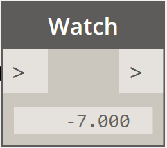

# Vektorová matematika

Objekty ve výpočetních návrzích se výjimečně vytvářejí přímo v jejich konečných pozicích a tvarech, většinou jsou přesouvány, otáčeny a jinak transformovány. Vektorová matematika slouží jako geometrická pomůcka, která dává geometrii směr a orientaci, a také slouží ke konceptualizaci pohybů ve 3D prostoru bez vizuální reprezentace.

Na nejzákladnější úrovni představuje vektor pozici ve 3D prostoru a často je reprezentován jako bod s šipkou od pozice (0, 0, 0) do jiné pozice. Vektory je možné vytvořit pomocí konstruktoru *ByCoordinates*, který jako vstup přijímá souřadnice X, Y a Z nově vytvořeného vektoru. Vektory nejsou geometrickými objekty a nezobrazují se v okně aplikace Dynamo. Informace o nově vytvořeném nebo upraveném vektoru je možné vypsat do konzolového okna:


```js
// construct a Vector object
v = Vector.ByCoordinates(1, 2, 3);

s = v.X + " " + v.Y + " " + v.Z;
```

U vektorových objektů je definována sada matematických operací, které umožňují přičítat, odečítat, násobit a jinak přesouvat objekty ve 3D prostoru, podobně jako lze tyto operace provádět v 1D prostoru na číselné ose.

Součet vektorů je definován jako součet komponent dvou vektorů a lze si jej představit tak, že na špičku jednoho vektoru umístíme druhý vektor. Součet vektorů lze provést metodou *Add* a je znázorněn na diagramu vlevo.


```js
a = Vector.ByCoordinates(5, 5, 0);
b = Vector.ByCoordinates(4, 1, 0);

// c has value x = 9, y = 6, z = 0
c = a.Add(b);
```

Podobně lze metodou *Subtract* od sebe dva vektorové objekty odečíst. Odečtení vektoru si lze představit tak, že se jedná o vektor směřující od prvního vektoru k druhému vektoru.


```js
a = Vector.ByCoordinates(5, 5, 0);
b = Vector.ByCoordinates(4, 1, 0);

// c has value x = 1, y = 4, z = 0
c = a.Subtract(b);
```

Násobení vektoru si lze představit jako přesun koncového bodu vektoru v jeho směru o určený faktor měřítka.


```js
a = Vector.ByCoordinates(4, 4, 0);

// c has value x = 20, y = 20, z = 0
c = a.Scale(5);
```

Při změně měřítka vektoru je často potřeba, aby výsledná délka odpovídala hodnotě měřítka. Toho lze snadno dosáhnout normalizací vektoru, jinými slovy nastavením jeho délky na 1.


```js
a = Vector.ByCoordinates(1, 2, 3);
a_len = a.Length;

// set the a's length equal to 1.0
b = a.Normalized();
c = b.Scale(5);

// len is equal to 5
len = c.Length;
```

Vektor c má stejný směr jako vektor a (1, 2, 3), ale jeho délka je nyní přesně 5.

Ve vektorové matematice existují dvě další metody, pro které v 1D matematice neexistují podobné operace, jedná se o vektorový a skalární součin. Vektorový součin vytváří vektor, který je kolmý (90 stupňů) ke dvěma existujícím vektorům. Například vektorový součin os X a Y je osa Z, ale vstupní vektory na sebe nemusí být nutně kolmé. Vektorový součin lze vypočítat metodou *Cross*.


```js
a = Vector.ByCoordinates(1, 0, 1);
b = Vector.ByCoordinates(0, 1, 1);

// c has value x = -1, y = -1, z = 1
c = a.Cross(b);
```

Další pokročilejší funkcí vektorové matematiky je skalární součin. Skalární součin mezi dvěma vektory je reálné číslo (a nikoliv vektor), které souvisí s úhlem mezi dvěma vektory (ale nejedná se přímo o úhel). Jednou z užitečných vlastností skalárního součinu je, že skalární součin je nulový pouze v případě, kdy jsou na sebe vektory kolmé. Skalární součin lze vypočítat metodou *Dot*.



```js
a = Vector.ByCoordinates(1, 2, 1);
b = Vector.ByCoordinates(5, -8, 4);

// d has value -7
d = a.Dot(b);
```

