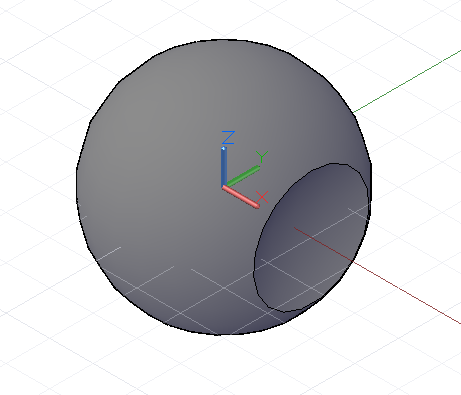

# Booleovské operace geometrií

Metody *Intersect*, *Trim* a *SelectTrim* se používají zejména u méněrozměrných geometrií, například u bodů, křivek a ploch. Geometrie těles obsahují další sadu metod, které umožňují upravovat jejich tvar, například odebráním materiálu podobně jako u metody *Trim*, nebo prvky kombinovat a vytvářet tak větší celky.

Metoda *Union* přijímá dvě tělesa a z prostoru, který tyto objekty zaujímají, vytváří jedno těleso. Překrývající se prostor mezi objekty se zkombinuje do konečného tvaru. Tento příklad kombinuje kouli a kvádr do jednoho tvaru:


```
s1 = Sphere.ByCenterPointRadius(
CoordinateSystem.Identity().Origin, 6);

s2 = Sphere.ByCenterPointRadius(
CoordinateSystem.Identity().Origin.Translate(4, 0,
0), 6);

combined = s1.Union(s2);
```

Metoda *Difference* funguje podobně jako metoda *Trim*, odečítá obsah vstupního tělesa od základního tělesa. V tomto příkladu odřízneme od koule malý kus:



```
s = Sphere.ByCenterPointRadius(
CoordinateSystem.Identity().Origin, 6);

tool = Sphere.ByCenterPointRadius(
CoordinateSystem.Identity().Origin.Translate(10, 0,
0), 6);

result = s.Difference(tool);
```

Metoda *Intersect* vrací těleso tvořené překrývajícím se prostorem dvou vstupních těles. V následujícím příkladu je metoda *Difference* změněna na *Intersect*, výsledným tělesem je kus, který byl v předchozím příkladu odříznut:


```
s = Sphere.ByCenterPointRadius(
CoordinateSystem.Identity().Origin, 6);

tool = Sphere.ByCenterPointRadius(
CoordinateSystem.Identity().Origin.Translate(10, 0,
0), 6);

result = s.Intersect(tool);
```

