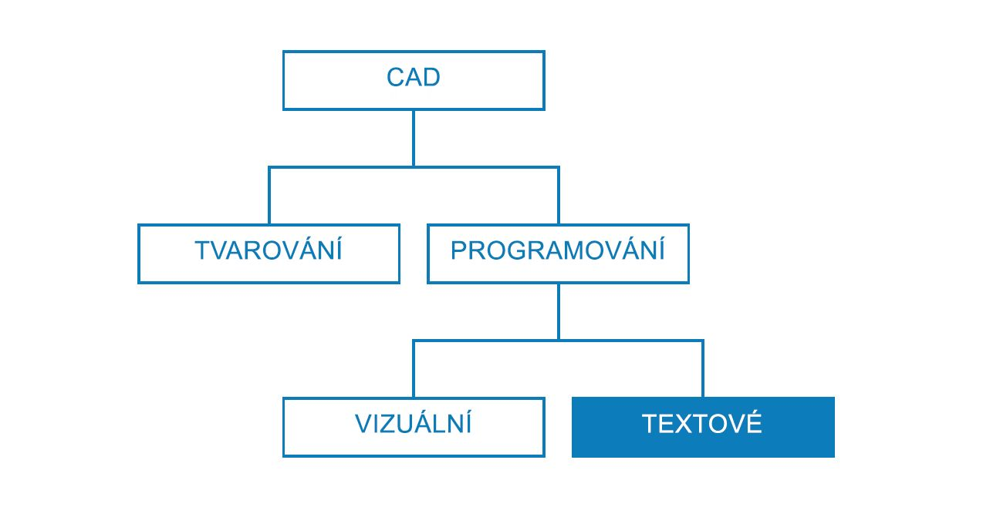
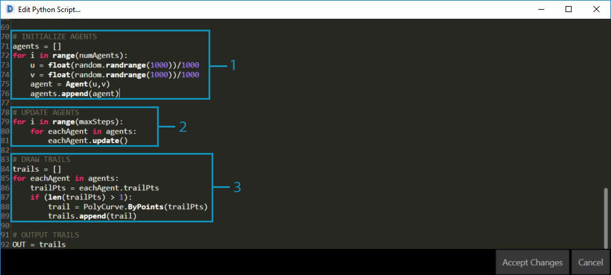

## Strategie skriptování

Textové skriptování v prostředí vizuálního skriptování umožňuje tvorbu výkonných a vizuálních vztahů pomocí jazyků DesignScript, Python a ZeroTouch (C#). Uživatel může odhalovat prvky, například posuvníky vstupů, zhustit rozsáhlé operace do aplikace DesignScript a umožnit přístup k výkonným nástrojům a knihovnám prostřednictvím jazyka Python nebo C#, a to ve stejném pracovním prostoru. Pokud jsou strategie efektivně spravovány, mohou díky jejich kombinaci do celého programu zavést značné množství možností, přizpůsobení, ale také přehlednosti a efektivity. Následuje sada pokynů, které vám pomohou vylepšit vizuální skript pomocí textového skriptu.



### Kdy používat skripty

Textové skriptování může vytvořit vztahy vyšší složitosti než vizuální programování, ale jejich možnosti se také značně překrývají. Toto dává smysl, protože uzly jsou efektivně předem zabalený kód a pravděpodobně bychom mohli napsat celý program aplikace Dynamo v aplikaci DesignScript nebo v jazyce Python. Vizuální skriptování však používáme kvůli tomu, že rozhraní uzlů a drátů vytváří intuitivní tok grafických informací. Pokud víte, kde možnosti textového skriptování jdou nad rámec vizuálního skriptování, budete mít k dispozici hlavní vodítka pro případy, kdy by se mělo textové skriptování použít, aniž by bylo nutné předvídat intuitivní povahu uzlů a vodičů. Níže jsou uvedeny pokyny, kdy se má skriptovat a jaký jazyk k tomu použít.

**Použití textového skriptování pro:**

* Smyčky

* Rekurze

* Přístup k externím knihovnám

**Vyberte jazyk:**

||Smyčky|Rekurze|Zhuštění uzlů|Ext. Knihovny|Zkrácení|
| -- | -- | 
|**DesignScript**|Ano|Ano|Ano|Ne|Ano|
|**Python**|Ano|Ano|Částečně|Ano|No|
|**ZeroTouch (C#)**|Ne|Ne|Ne|Ano|No|

> Seznam, ke kterému vám každá knihovna aplikace Dynamo poskytuje přístup, naleznete v části [Reference skriptování](http://primer.dynamobim.org/en/12_Best-Practice/12-3_Scripting-Reference.html).

### Uvažujte parametricky

Při skriptování v aplikaci Dynamo, což je nezbytně parametrické prostředí, je moudré strukturovat kód podle systému uzlů a vodičů, ve kterých bude kód existovat. Uzel obsahující textový skript je třeba považovat za uzel jako každý jiný v programu s několika specifickými vstupy, funkcí a předpokládaným výstupem. Kód uvnitř uzlu díky tomu ihned obdrží malou sadu proměnných, se kterými se bude pracovat, což je klíč k čistě parametrickému systému. Zde jsou některé pokyny pro lepší integraci kódu do vizuálního programu.

**Určení externích proměnných:**

* Zkuste určit dané parametry v problému návrhu, tak aby bylo možné vytvořit model, který je přímo sestaven mimo tato data.

* Před psaním kódu identifikujte proměnné:

  * Minimální sadu vstupů

  * Zamýšlený výstup

  * Konstanty


> Před zapsáním kódu bylo vytvořeno několik proměnných.

> 1. Povrch, na kterém bude probíhat simulace dešťové srážky.
2. Požadovaný počet dešťových kapek (agentů).
3. Jak velkou vzdálenost mají dešťové kapky urazit.
4. Přepínač mezi sestupem po nejstrmější cestě a přechodem po povrchu.
5. Uzel jazyka Python s příslušným počtem vstupů.
6. Blok kódu pro nastavení vrácených oblouků na modrou barvu.

**Návrh vnitřních vztahů:**

* Parametrismus umožňuje úpravu určitých parametrů nebo proměnných, aby bylo možné manipulovat s koncovým výsledkem rovnice nebo systému, případně tento výsledek změnit.

* Kdykoli spolu entity ve skriptu logicky souvisí, je třeba je definovat jako vzájemné funkce. Tímto způsobem se při úpravě jedné funkce může proporcionálně aktualizovat druhá funkce.

* Minimalizujte počet vstupů tím, že zobrazíte pouze klíčové parametry:

  * Pokud je možné sadu parametrů odvodit z více nadřazených parametrů, zobrazte pouze nadřazené parametry jako vstupy skriptu. Tím se zvýší použitelnost skriptu, protože se sníží složitost jeho rozhraní.


> Kód „modules“ z příkladu v [uzlu jazyka Python](http://primer.dynamobim.org/en/09_Custom-Nodes/9-4_Python.html).

> 1. Vstupy.
2. Interní proměnné skriptu.
3. Smyčka, která pomocí těchto vstupů a proměnných provádí svou funkci.
> Tip: Na proces klaďte tak velký důraz, jaký kladete na řešení.

**Neopakujte se (princip DRY):**

* Pokud máte ve skriptu více způsobů vyjádření stejné věci, duplicitní reprezentace v určitém bodě vypadnou ze synchronizace, což může vést k velkým potížím s údržbou, slabému faktorování a vnitřním rozporům.

* Princip DRY zní takto: „Veškeré vědomosti musí mít v systému jedinou jednoznačnou, autoritativní reprezentaci“:

  * Pokud je tento princip úspěšně použit, všechny související prvky ve skriptu se mění předvídatelně a jednotně a nesouvisející prvky nezpůsobí u sebe navzájem logické následky.

```
### BAD
for i in range(4):
for j in range(4):
point = Point.ByCoordinates(3*i, 3*j, 0)
points.append(point)
```

```
### GOOD
count = IN[0]
pDist = IN[1]

for i in range(count):
for j in range(count):
point = Point.ByCoordinates(pDist*i, pDist*j, 0)
points.append(point)
```

> Tip: Před duplikováním entit ve skriptu (například konstanty ve výše uvedeném příkladu) si můžete položit dotaz, zda se místo toho můžete připojit ke zdroji.

### Strukturu tvořte modulárně

Během toho, jak se kód rozrůstá a zesložiťuje, „hlavní myšlenka“ neboli zastřešující algoritmus se postupně stává méně čitelným. Je také obtížnější sledovat, co (a kde) se konkrétně děje, hledat chyby v případě, že skript funguje chybně, integrovat jiný kód a přiřadit vývojové úkoly. Aby se těmto problémům zabránilo, je moudré psát kód v modulech, což je organizační strategie rozdělující kód na části podle úlohy jakou jednotlivé části vykonávají. Zde je několik tipů, které vám usnadní správu skriptů pomocí modularizace.

**Zápis kódu v modulech:**

* „module“ je skupina kódu, která provádí určitou úlohu, podobně jako uzel aplikace Dynamo v pracovním prostoru.

* Může to být cokoli, co by mělo být vizuálně odděleno od přilehlého kódu (funkce, třída, skupina vstupů nebo importované knihovny).

* Vývoj kódu v modulech prováže vizuální, intuitivní kvalitu uzlů a také složité vztahy, kterých je možné dosáhnout pouze pomocí textového skriptování.



> Tyto smyčky volají třídu s názvem „agent“, která bude vytvořena v tomto cvičení.

> 1. Modul kódu, který definuje počáteční bod každého agenta.
2. Modul kódu, který aktualizuje agenta.
3. Modul kódu, který kreslí stopu pro cestu agenta.

**Využití opakovaného použití kódu:**

* Pokud zjistíte, že kód dělá stejnou (nebo velmi podobnou) věc více než jednou, najděte způsoby, jak tuto věc sloučit do jedné funkce, kterou je možné volat.

* „Správcovské“ funkce řídí tok programu a primárně obsahují volání „pracovních“ funkcí, které zpracovávají detaily na nízké úrovni, například přesouvání dat mezi strukturami.


> Tento příklad vytvoří koule s poloměry a barvou podle hodnoty Z středů.

> 1. Dvě „pracovní“ nadřazené funkce: jedna, která vytváří koule s poloměry, a jedna, která zobrazí barvy, obojí podle hodnoty Z středu.
2. „Správcovská“ nadřazená funkce, která kombinuje dvě pracovní funkce. Zavoláním této funkce zavoláte i funkce uvnitř ní.

**Zobrazujte pouze to, co je potřeba vidět:**

* Rozhraní modulu vyjadřuje prvky, které jsou nabízené a vyžadované modulem.

* Jakmile jsou definována rozhraní mezi jednotkami, podrobný návrh každé jednotky může probíhat samostatně.

**Oddělitelnost/Nahraditelnost:**

* Moduly o sobě vzájemně neví a vzájemně se o sebe nestarají.

**Obecné formy modularizace:**

* Seskupení kódů:

```
# IMPORT LIBRARIES
import random
import math
import clr
clr.AddReference('ProtoGeometry')
from Autodesk.DesignScript.Geometry import *

# DEFINE PARAMETER INPUTS
surfIn = IN[0]
maxSteps = IN[1]
```

* Funkce:

```
def get_step_size():
area = surfIn.Area
stepSize = math.sqrt(area)/100
return stepSize

stepSize = get_step_size()
```

* Třídy:

```
class MyClass:
i = 12345

def f(self):
return 'hello world'

numbers = MyClass.i
greeting = MyClass.f
```

### Neustále kontrolujte data

Při vývoji textových skriptů v aplikaci Dynamo je moudré neustále kontrolovat, že to, co se vytváří, je v souladu s tím, co očekáváte. Tím se zajistí, že nepředvídané události – syntaktické chyby, logické nesrovnalosti, nepřesnosti hodnot, nepředvídané výstupy atd.– jsou rychle objeveny a řeší se ihned, jak vyjdou najevo, nikoli všechny najednou na konci. Vzhledem k tomu, že jsou textové skripty uloženy uvnitř uzlů na kreslicí ploše, jsou již integrovány do datového toku vašeho vizuálního programu. Díky tomu můžete snadno sledovat skript, přičemž budete přiřazovat data, která budou na výstupu, spouštět program a vyhodnocovat vytvořený výstup skriptu pomocí uzlu Watch. Následují několik tipů pro průběžnou kontrolu skriptů při jejich tvorbě.

**Během tvorby provádějte testy:**

* Kdykoli dokončíte určitý celek funkcionality:

  * Vracejte se zpět a přitom kontrolujte kód.

  * Buďte kritičtí. Mohl by spolupracovník pochopit, co tento kód dělá? Je třeba toto dělat? Je možné tuto funkci provést efektivněji? Vytvářím nepotřebné duplicitní položky nebo závislosti?

  * Rychle proveďte test, abyste se ujistili, že skript vrací data, která „dávají smysl“.

* Přiřaďte jako výstup nejaktuálnější data, se kterými budete ve skriptu pracovat, aby uzel při aktualizaci skriptu vždy prováděl výstup relevantních dat:


> Kontrola dat u vzorového kódu z [uzlu jazyka Python](http://primer.dynamobim.org/en/09_Custom-Nodes/9-4_Python.html).

> 1. Zkontrolujte, zda jsou všechny hrany tělesa, kolem kterého se má vytvořit hraniční obdélník, vráceny jako křivky.
2. Zkontrolujte, zda jsou vstupní hodnoty počtu úspěšně převedeny na rozsahy.
3. Zkontrolujte, zda byly souřadnicové systémy v této smyčce správně převedeny a otočeny.

**Předvídání „případů hran“:**

* Při skriptování změňte vstupní parametry na minimální a maximální hodnoty jejich přidělené domény, aby bylo možné zkontrolovat, zda program stále funguje i za extrémních podmínek.

* I v případě, že program pracuje v krajních hodnotách, zkontrolujte, zda vrací neúmyslné hodnoty null, prázdné hodnoty nebo nulové hodnoty.

* Chyby, které odhalí některé základní problémy se skriptem, se někdy projeví pouze v těchto okrajových případech.

  * Zjistěte, co způsobuje chybu, a poté se rozhodněte, zda je nutné ji opravit interně nebo zda je nutné doménu parametrů předefinovat, aby se tomuto problému zabránilo.

> Tip: Vždy předpokládejte, že uživatel použije každou kombinaci každé vstupní hodnoty, která mu je známa. Tímto můžete zabránit nežádoucím překvapením.

### Laďte efektivně

Ladění je proces, při kterém se ze skriptu odstraňují chyby. Mezi chyby patří chybová hlášení, neefektivity, nepřesnosti nebo neočekávané výsledky. Řešení chyby může být velmi jednoduché, protože může spočívat třeba jen v nesprávně napsaném názvu proměnné, který při opravě může vyřešit rozšířené, konstrukční problémy skriptu. V ideálním případě může kontrola skriptu během jeho tvorby pomoci ke včasnému zachycení potenciálních problémů, nezaručí však absolutní bezchybnost. Následuje přehled několika osvědčených postupů, které vám pomohou systematicky řešit chyby.

**Využijte sledovací bublinu:**

* Kontrolujte data vrácená na různých místech kódu přiřazením do proměnné OUT, podobně jako při kontrole dat programu.

**Pište smysluplné komentáře:**

* Pokud je požadovaný výstup jasně popsán, modul kódu tohoto výstupu bude možné ladit o dost snadněji.

```
# Loop through X and Y
for i in range(xCount):
for j in range(yCount):

# Rotate and translate the coordinate system
toCoord = fromCoord.Rotate(solid.ContextCoordinateSystem.Origin,Vector.ByCoordinates(0,0,1),(90*(i+j%seed)))
vec = Vector.ByCoordinates((xDist*i),(yDist*j),0)
toCoord = toCoord.Translate(vec)

# Transform the solid from the source coord system to the target coord system and append to the list
solids.append(solid.Transform(fromCoord,toCoord))
```

> Normálně by se jednalo o příliš rozsáhlé komentování a mnoho prázdných řádků, u ladění však tento postup může být užitečný k rozebrání problému na spravovatelné celky.

**Využijte modularitu kódu:**

* Zdroj problému může být izolován v určitých modulech.

* Po zjištění chybného modulu je řešení problému značně jednodušší.

* Pokud je nutné program upravit, kód, který byl vyvinut v modulech, bude mnohem snadnější změnit:

  * Do existujícího programu můžete vložit nové nebo vyladěné moduly a přitom se spolehnout na to, že se zbytek programu nezmění.


> Ladění vzorového souboru z [uzlu jazyka Python](http://primer.dynamobim.org/en/09_Custom-Nodes/9-4_Python.html).

> 1. Vstupní geometrie vrací hraniční obdélník, který je větší než její vlastní velikost, což je vidět po přiřazení proměnných xDist a yDist do proměnné OUT.
2. Křivky hran vstupní geometrie vrátí odpovídající hraniční obdélník se správnými vzdálenostmi v proměnných XDist a YDist.
3. Byl vložen „modul“ kódu, abychom vyřešili problém s hodnotou xDist a yDist.

### Cvičení – nejstrmější cesta

> Stáhněte si vzorový soubor, který je přiložen k tomuto cvičení (klikněte pravým tlačítkem a vyberte příkaz „Uložit odkaz jako...“). Úplný seznam vzorových souborů naleznete v dodatku. [SteepestPath.dyn](datasets/13-1/SteepestPath.dyn)

Pojďme napsat skript simulace deště a přitom se budeme řídit našimi nejlepšími postupy textového skriptování. I když bylo možné použít nejlepší metody na neorganizovaný vizuální program ve strategiích grafů, je mnohem obtížnější to provést pomocí textového skriptování. Logické vztahy zavedené v textovém skriptování jsou méně viditelné a v neuspořádaném kódu může být téměř nemožné je rozluštit. S textovým skriptováním přichází i větší zodpovědnost v organizaci. Projdeme si nyní každý krok a během toho budeme používat ty nejlepší postupy.


> Skript byl použit na povrch deformovaný atraktorem.

Nejprve je nutné importovat nezbytné knihovny aplikace Dynamo. Pokud tento krok provedete jako první, získáte globální přístup k funkcím aplikace Dynamo v jazyce Python.


> Všechny knihovny, které chceme použít, je nutné importovat zde.

Dále je potřeba definovat vstupy a výstup skriptu, které se zobrazí jako vstupní porty u uzlu. Tyto externí vstupy jsou základem pro náš skript a klíčem k vytvoření parametrického prostředí.


> Je třeba definovat vstupy, které odpovídají proměnným ve skriptu jazyka Python, a určit požadovaný výstup:

> 1. Povrch, který chceme projít.
2. Počet agentů, které chceme projít.
3. Maximální počet kroků, které mohou agenti provést.
4. Možnost jít nejkratší cestou po povrchu, nebo jej přejít.
5. Uzel jazyka Python se vstupními identifikátory, které odpovídají vstupům ve skriptu (IN[0], IN[1]).
6. Výstupní křivky, které je možné zobrazit jinou barvou.

Nyní pomocí praktiky modularity vytvoříme tělo skriptu. Simulace nejkratší cesty dolů po povrchu pro více počátečních bodů je důležitým úkolem, který bude vyžadovat několik funkcí. Místo toho, abychom volali různé funkce v celém skriptu, můžeme upravit kód shromážděním funkcí do jedné třídy, což bude agent. Různé funkce této třídy nebo „modulu“ je možné volat s různými proměnnými nebo je dokonce znovu použít v jiném skriptu.


> Je potřeba definovat pro agenta třídu (nebo modrotisk) s úmyslem pohybu dolů po povrchu, a to výběrem varianty pohybu směrem s největší strmostí při každém kroku:

> 1. Název.
2. Globální atributy, které sdílejí všichni agenti.
3. Atributy instance, které jsou jedinečné pro každého agenta.
4. Funkce pro vykonání kroku.
5. Funkce pro katalogizaci pozice každého kroku do seznamu trajektorií.

Inicializujeme agenty definováním jejich počátečního umístění. Toto je dobrá příležitost pro kontrolu skriptu a ujištění se, že třída agentů funguje.


> Bude nutné vytvořit instance všech agentů, u kterých chceme sledovat jejich průchod po povrchu, a definovat jejich počáteční atributy:

> 1. Nový prázdný seznam trajektorií.
2. Kde začnou svou cestu po povrchu.
3. Jako výstup jsme přiřadili seznam agentů, abychom zkontrolovali, co zde skript vrací. Vrací se správný počet agentů, později však bude potřeba zkontrolovat data skriptu znovu, aby se ověřila geometrie, kterou vrátí.

V každém kroku aktualizujte každého agenta.


> Poté bude nutné u každého agenta v každém kroku vstoupit do vnořené smyčky, ve které se aktualizuje a zaznamená pozice do jejich seznamu trajektorií. V každém kroku se také ujistíme, že agent nedosáhl bodu na povrchu, kde nemůže provést další krok, který by mu umožnil sestup. Pokud bude tato podmínka splněna, cesta tohoto agenta bude ukončena.

Nyní, když jsou agenti plně aktualizováni, vrátíme geometrii, která je reprezentuje.


> Jakmile všichni agenti dosáhnou svého meze sestupu nebo maximálního počtu kroků, vytvoříme křivku PolyCurve pomocí bodů v jejich seznamu trajektorií a vypíšeme trajektorie PolyCurve.

Náš skript sloužící k nalezení nejstrmějších cest.


> 1. Předvolba, která simuluje déšť na základním povrchu.
2. Místo hledání nejstrmější cesty mohou být agenti přepnuti, tak aby mohli procházet přes základní povrch.


> Úplný skript v jazyce Python.

