

# REJSTŘÍK UZLŮ

##### Tento rejstřík nabízí dodatečné informace o všech uzlech použitých v této příručce a také dalších komponentách, které mohou být užitečné. Jedná se pouze o představení některých z 500 uzlů dostupných v aplikaci Dynamo.

## Vestavěné funkce

||||
| -- | -- | -- |
||**Počet** Vrací počet položek v určeném seznamu.|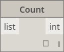|
||**Vyrovnat** Vrací vyrovnaný jednorozměrný seznam vytvořený z vícerozměrného vstupního seznamu.||
|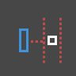|**Mapa** Mapuje hodnotu do vstupního rozsahu.||

## Tvárník

#### Core.Color

||||
| -- | -- | -- |
||VYTVOŘIT||
||**Color.ByARGB** Umožňuje vytvořit barvu pomocí alfa, červené, zelené a modré složky.||
||**Rozsah barev** Vrací barvu z barevného gradientu mezi počáteční a koncovou barvou.||
||AKCE||
||**Color.Brightness** Vrací hodnotu jasu této barvy.||
||**Color.Components** Zobrazí seznam složek barvy v pořadí: alfa, červená, zelená a modrá.||
||**Color.Saturation** Vrací hodnotu sytosti této barvy.||
||**Color.Hue** Vrací hodnotu odstínu této barvy.||
||DOTAZ||
||**Color.Alpha** Umožňuje najít alfa složku barvy, 0 až 255.|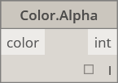|
||**Color.Blue** Umožňuje najít modrou složku barvy, 0 až 255.||
||**Color.Green** Umožňuje zjistit zelenou složku barvy, 0 až 255.||
||**Color.Red** Umožňuje najít červenou složku barvy, 0 až 255.||

#### Core.Display

||||
| -- | -- | -- |
||VYTVOŘIT||
||**Display.ByGeometryColor** Zobrazit geometrii v barvě.||

#### Core.Input

||||
| -- | -- | -- |
||AKCE||
||**Booleovský** Výběr mezi hodnotami true a false.||
||**Blok kódu** Umožňuje přímou tvorbu kódu DesignScript.||
||**Directory Path** Umožňuje vybrat adresář v systému a načíst jeho cestu.||
||**Cesta souboru** Umožňuje vybrat soubor v systému, jehož název chcete získat.||
||**Integer Slider** Posuvník, který vytváří celočíselné hodnoty.||
||**Počet** Vytvoří číslo.||
||**Number Slider** Posuvník, který vytváří číselné hodnoty.||
||**Řetězec** Vytvoří řetězec.||

#### Core.List

||||
| -- | -- | -- |
||VYTVOŘIT||
||**List.Create** Vytvoří nový seznam ze zadaných vstupů.||
||**List.Combine** Použije kombinátor na každý prvek ve dvou posloupnostech.||
||**Rozsah čísel** Vytvoří posloupnost čísel v zadaném rozsahu.||
||**Posloupnost čísel** Vytvoří posloupnost čísel.||
||AKCE||
||**List.Chop** Rozdělí seznam do sady seznamů, z nichž každý obsahuje dané množství položek.||
||**List.Count** Vrací počet položek uložených v daném seznamu.||
|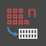|**List.Flatten** Vyrovná vnořený seznam seznamů o určitou hodnotu.||
||**List.FilterByBoolMask** Filtruje posloupnost na základě vyhledávání příslušných indexů v samostatném seznamu logických hodnot.||
||**List.GetItemAtIndex** Vrací položku z daného seznamu, která se nachází na určeném indexu.||
||**List.Map** Použije funkci na všechny prvky v seznamu, čím z výsledků vytvoří nový seznam.||
||**List.Reverse** Vytvoří nový seznam obsahující položky daného seznamu, ale v obráceném pořadí.||
||**List.ReplaceItemAtIndex** Nahradí položku z daného seznamu, která se nachází na daném indexu.||
||**List.ShiftIndices** Posune indexy v seznamu doprava o zadané množství.||
|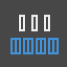|**List.TakeEveryNthItem** Načte položky ze zadaného seznamu na indexech, které jsou násobky dané hodnoty s daným odsazením.||
||**List.Transpose** Prohodí řádky a sloupce v seznamu seznamů. Pokud jsou některé řádky kratší než jiné, budou jako zástupné znaky do výsledného pole vloženy hodnoty null, tak aby pole stále bylo pravoúhlé.||

#### Core.Logic

||||
| -- | -- | -- |
||AKCE||
||**Podmínka** Podmíněný výraz. Zkontroluje booleovskou hodnotu testovacího vstupu. Pokud má testovací vstup hodnotu true, výsledný výstup bude mít hodnotu true, v opačném případě bude mít hodnotu false.||

#### Core.Math

||||
| -- | -- | -- |
||AKCE||
||**Math.Cos** Vrací kosinus úhlu.||
||**Math.DegreesToRadians** Převede úhel ve stupních na úhel v radiánech.||
||**Math.Pow** Umocní číslo na danou mocninu.||
||**Math.RadiansToDegrees** Převede úhel v radiánech na úhel ve stupních.||
||**Math.RemapRange** Upraví rozsah seznamu čísel při zachování poměru rozložení.||
||**Math.Sin** Najde sinus úhlu.||

#### Core.Object

||||
| -- | -- | -- |
||AKCE||
||**Object.IsNull** Určuje, zda má zadaný objekt hodnotu null.|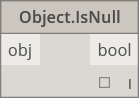|

#### Core.Scripting

||||
| -- | -- | -- |
||AKCE||
||**Vzorec** Vyhodnocuje matematické vzorce. K vyhodnocení používá NCalc. Viz web [http://ncalc.codeplex.com](http://ncalc.codeplex.com)||

#### Core.String

||||
| -- | -- | -- |
||AKCE||
||**String.Concat** Zřetězí více řetězců do jediného řetězce.||
||**String.Contains** Určuje, zda zadaný řetězec obsahuje daný dílčí řetězec.||
||**String.Join** Zřetězí více řetězců do jediného řetězce, přičemž vloží daný oddělovač mezi každý spojený řetězec.||
||**String.Split** Rozdělí jeden řetězec na seznam řetězců, s dělením určeným podle daných oddělovacích řetězců.||
||**String.ToNumber** Převádí řetězec na celé číslo nebo hodnotu typu double.|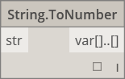|

#### Core.View

||||
| -- | -- | -- |
||AKCE||
||**View.Watch** Vizualizuje výstup uzlu.||
|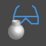|**View.Watch 3D** Zobrazí dynamický náhled geometrie.||

## Geometrie

#### Geometry.Circle

||||
| -- | -- | -- |
||VYTVOŘIT||
||**Circle.ByCenterPointRadius** Vytvoří kružnici se zadaným středem a poloměrem v globální rovině XY, s rovinou Z jako normálou.||
||**Circle.ByPlaneRadius** Vytvoří kružnici vystředěnou na počátku vstupní roviny (kořenu), ležící ve vstupní rovině, se zadaným poloměrem.||

#### Geometry.CoordinateSystem

||||
| -- | -- | -- |
||VYTVOŘIT||
||**CoordinateSystem.ByOrigin** Vytvoří systém CoordinateSystem s počátkem ve vstupním bodu, s osami X a Y nastavenými jako osy X a Y v GSS.||
||**CoordinateSystem.ByCyclindricalCoordinates** Vytvoří systém CoordinateSystem v zadaných válcových souřadnicových parametrech s ohledem na zadaný souřadnicový systém.||

#### Geometry.Cuboid

||||
| -- | -- | -- |
||VYTVOŘIT||
||**Cuboid.ByLengths** (origin) Vytvoří kvádr vystředěný na vstupním bodu, s určenou šířkou, délkou a výškou.||

#### Geometry.Curve

||||
| -- | -- | -- |
||AKCE||
||**Curve.Extrude** (distance) Vysune křivku ve směru normálového vektoru.||
||**Curve.PointAtParameter** Získá bod na křivce v určeném parametru mezi objekty StartParameter() a EndParameter().||

#### Geometry.Geometry

||||
| -- | -- | -- |
||AKCE||
||**Geometry.DistanceTo** Získá vzdálenost od této geometrie k jiné.|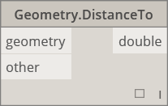|
||**Geometry.Explode** Rozdělí složené nebo neoddělené prvky do součástí jejich komponent.||
||**Geometry.ImportFromSAT** Seznam importovaných geometrií||
|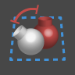|**Geometry.Rotate** (basePlane) Otočí objekt kolem počátku roviny a normály o zadaný počet stupňů.||
||**Geometry.Translate** Posune libovolný typ geometrie o zadanou vzdálenost v daném směru.||

#### Geometry.Line

||||
| -- | -- | -- |
||VYTVOŘIT||
||**Line.ByBestFitThroughPoints** Vytvoří čáru nejlépe aproximující rozptýlené vykreslení bodů.||
||**Line.ByStartPointDirectionLength** Vytvoří přímou čáru od počátečního bodu, která se prodlouží ve směru vektoru o zadanou délku.||
||**Line.ByStartPointEndPoint** Vytvoří rovnou čáru mezi dvěma vstupními body.||
||**Line.ByTangency** Vytvoří tečnu ke vstupní křivce, umístěnou v bodu parametru vstupní křivky.|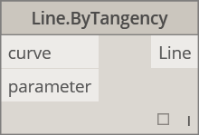|
||DOTAZ||
||**Line.Direction** Směr křivky.||

#### Geometry.NurbsCurve

||||
| -- | -- | -- |
||Definuj||
|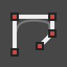|**NurbsCurve.ByControlPoints** Pomocí explicitních řídicích bodů vytvoří objekt BSplineCurve.||
||**NurbsCurve.ByPoints** Vytvoří objekt BSplineCurve pomocí interpolace mezi body.|qcomm|

#### Geometry.NurbsSurface

||||
| -- | -- | -- |
||Definuj||
||**NurbsSurface.ByControlPoints** Vytvoří objekt NurbsSurface pomocí explicitních řídicích bodů se zadanými stupni U a V.||
||**NurbsSurface.ByPoints** Vytvoří objekt NurbsSurface s určenými interpolovanými body a stupni U a V. Výsledný povrch bude procházet všemi body.||

#### Geometry.Plane

||||
| -- | -- | -- |
||VYTVOŘIT||
||**Plane.ByOriginNormal** Vytvoří rovinu vystředěnou na kořenový bod pomocí vstupního normálového vektoru.||
||**Plane.XY** Vytvoří rovinu v prostoru XY.||

#### Geometry.Point

||||
| -- | -- | -- |
||VYTVOŘIT||
||**Point.ByCartesianCoordinates** Vytvoří bod v daném souřadnicovém systému pomocí 3 kartézských souřadnic.||
||**Point.ByCoordinates** (2d)  Vytvoří bod v rovině XY pomocí dvou kartézských souřadnic. Komponenta Z je 0.||
||**Point.ByCoordinates** (3d) Vytvoří bod daný 3 kartézskými souřadnicemi.||
||**Point.Origin** Získá bod počátku (0,0,0).||
||AKCE||
||**Point.Add** Přidá k bodu vektor. Stejné jako Translate (Vector).|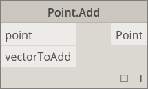|
||DOTAZ||
|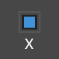|**Point.X** Získá komponentu X bodu.||
||**Point.Y** Získá komponentu Y bodu.||
||**Point.Z** Získá komponentu Z bodu.||

#### Geometry.Polycurve

||||
| -- | -- | -- |
||VYTVOŘIT||
||**Polycurve.ByPoints** Vytvoří objekt PolyCurve z posloupnosti čar propojujících body. U uzavřené křivky by měl poslední bod být ve stejném umístění jako počáteční bod.||

#### Geometry.Rectangle

||||
| -- | -- | -- |
||VYTVOŘIT||
||**Rectangle.ByWidthLength** (Plane) Vytvoří obdélník vystředěný na kořen vstupní roviny se vstupní šířkou (délka osy X roviny) a délkou (délka osy Y roviny).||

#### Geometry.Sphere

||||
| -- | -- | -- |
||VYTVOŘIT||
||**Sphere.ByCenterPointRadius** Vytvoří těleso (kouli) vystředěné na vstupní bod se zadaným poloměrem.||

#### Geometry.Surface

||||
| -- | -- | -- |
||VYTVOŘIT||
||**Surface.ByLoft** Vytvoří povrch pomocí šablonování mezi křivkami vstupního příčného řezu.||
||**Surface.ByPatch** Vytvoří povrch vyplněním vnitřní části uzavřené hranice definované vstupními křivkami.||
||AKCE||
||**Surface.Offset** Odsadí povrch ve směru normály povrchu o zadanou vzdálenost.||
||**Surface.PointAtParameter** Vrátí bod v zadaných parametrech U a V.||
|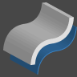|**Surface.Thicken** Zesílí povrch na těleso vysunutím ve směru normál povrchu na obou stranách povrchu.||

#### Geometry.UV

||||
| -- | -- | -- |
||VYTVOŘIT||
||**UV.ByCoordinates** Vytvoří prvek UV ze dvou hodnot typu double.||

#### Geometry.Vector

||||
| -- | -- | -- |
||VYTVOŘIT||
||**Vector.ByCoordinates** Vytvoří vektor pomocí 3 euklidovských souřadnic.||
||**Vector.XAxis** Získá kanonický vektor osy X (1,0,0).||
||**Vector.YAxis** Získá kanonický vektor osy Y (0,1,0).||
||**Vector.ZAxis** Získá kanonický vektor osy Z (0,0,1).||
||AKCE||
||**Vector.Normalized** Získá normalizovanou verzi vektoru.||

## Operátory

||||
| -- | -- | -- |
||**+** Součet||
||**-** Rozdíl||
||***** Součin||
||**/** Podíl||
||**%** Modulární dělení nalezne zbytek prvního vstupu po dělení druhým vstupem.||
||**<** Menší než||
||**>** Větší než||
||**==** Zkoušky rovnosti pro rovnost mezi dvěma hodnotami.||

