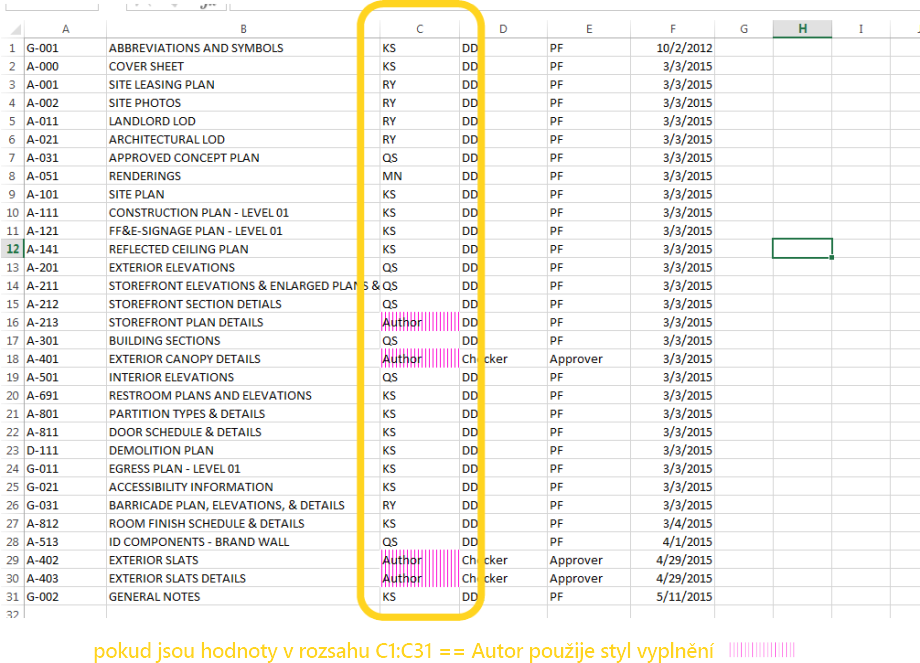
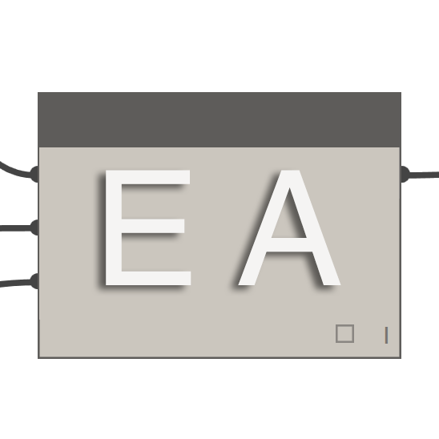
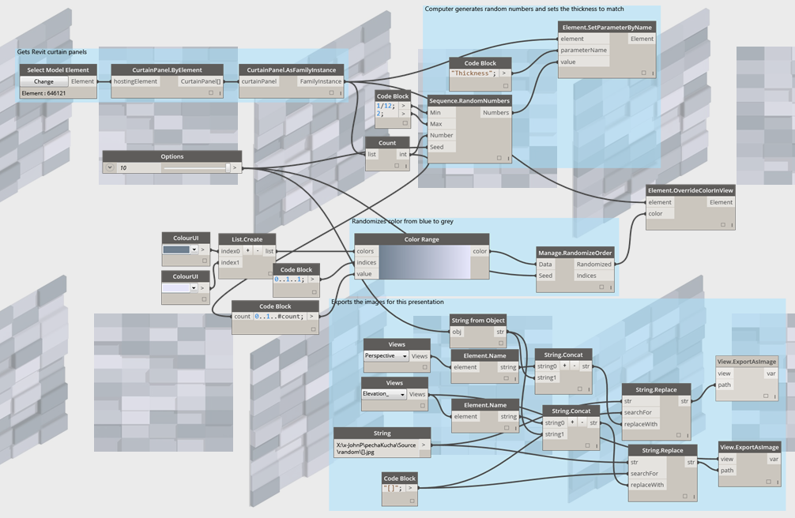

## Balíčky aplikace Dynamo
Zde je seznam některých oblíbenějších balíčků v komunitě Dynamo. Vývojáři, doplňujte tento seznam. Nezapomeňte, že aplikace [Dynamo Primer](https://github.com/DynamoDS/DynamoPrimer ) je open source.

<table>
   <tr>
      <td width="10%">
         </img>
      </td>
      <td width="55%">
         <b>ARCHI-LAB</b>
      </td>
      <td>
         <a href="http://archi-lab.net/">Navštivte oficiální web archi-lab
      </td>
      </a>
   </tr>
   <tr>
      <td colspan="2">archi-lab je sada více než 50+ vlastních balíčků, které výrazně rozšiřují schopnost aplikace Dynamo pracovat s aplikací Revit. Uzly obsažené v balíčku archi-lab se liší od základních operací se seznamem po pokročilé uzly Analysis Visualization Framework pro aplikaci Revit. </td>
      <td>
         </img>
      </td>
   </tr>
</table>

<table>
  <tr>
    <td width="10%"></img></td>
    <td width="55%"><b>BIMORPH NODES</b></td>
    <td><a href="https://bimorph.com/bimorph-nodes/">Navštivte slovník BimorphNodes</td></a>
  </tr>
  <tr>
    <td colspan="2">Uzly BimorphNodes jsou univerzální kolekcí výkonných uzlů inženýrských sítí. Balíček obsahuje vysoce efektivní detekci kolizí a uzly průsečíků geometrie, uzly převodu křivek ImportInstance (CAD) a kolektory propojených prvků, které řeší omezení v rozhraní API aplikace Revit. Chcete-li se dozvědět o celém rozsahu dostupných uzlů, navštivte slovník BimorphNodes.</td>
    <td></img></td>
  </tr>
</table>

<table>
  <tr>
    <td width="10%"></img></td>
    <td width="55%"><b>BUMBLEBEE FOR DYNAMO</b></td>
    <td><a href="http://archi-lab.net/bumblebee-dynamo-and-excel-interop/">Navštivte oficiální web BumbleBee</td></a>
  </tr>
  <tr>
    <td colspan="2">Bumblebee je modul plug-in pro interoperabilitu aplikací Excel a Dynamo, který významně zvyšuje schopnost aplikace Dynamo číst a zapisovat soubory aplikace Excel. </td>
    <td></img></td>
  </tr>
</table>

<table>
  <tr>
    <td width="10%"></img></td>
    <td width="55%"><b>CLOCKWORK FOR DYNAMO</b></td>
    <td><a href="https://github.com/CAAD-RWTH/ClockworkForDynamo">Navštivte GitHub softwaru Clockwork For Dynamo</td></a>
  </tr>
  <tr>
    <td colspan="2">Clockwork je kolekce vlastních uzlů pro prostředí vizuálního programování aplikace Dynamo. Obsahuje mnoho uzlů souvisejících s aplikací Revit, ale také řadu uzlů pro různé účely, například správu seznamu, matematické operace, řetězcové operace, převody jednotek, geometrické operace (zejména ohraničující kvádry, sítě, roviny, body, povrchy, UV a vektory) a obložení. </td>
    <td></img></td>
  </tr>
</table>

<table>
  <tr>
    <td width="10%"></img></td>
    <td width="55%"><b>DATA|SHAPES</b></td>
    <td><a href="https://github.com/MostafaElAyoubi/Data-shapes">Navštivte Github softwaru Data|Shapes</td></a>
  </tr>
  <tr>
    <td colspan="2"> DataShapes je balíček, který má za cíl rozšířit funkčnost vlastních skriptů aplikace Dynamo. Klade velký důraz na přidání větších funkcí do přehrávače skriptů Dynamo. Další informace najdete na adrese https://data-shapes.net/. Chcete vytvořit úžasné pracovní postupy aplikace Dynamo Player? Použijte tento balíček.</td>
    <td></img></td>
  </tr>
</table>

<table>
  <tr>
    <td width="10%"></img></td>
    <td width="55%"><b>DYNAMO SAP</b></td>
    <td><a href="http://core.thorntontomasetti.com/dynamosap-is-now-open-source/">Navštivte projekt aplikace DynamoSAP v aplikaci Core Studio</td></a>
  </tr>
  <tr>
    <td colspan="2">DynamoSAP je parametrické rozhraní pro SAP2000, které je vytvořeno na vrcholu aplikace Dynamo. Projekt umožňuje návrhářům a inženýrům generovat a analyzovat konstrukční systémy v aplikaci SAP pomocí aplikace Dynamo, která umožňuje řídit model SAP. Projekt předepisuje několik běžných pracovních postupů, které jsou popsány v zahrnutých vzorových souborech, a poskytuje řadu možností automatizace typických úloh v rámci programu SAP. </td>
    <td></img></td>
  </tr>
</table>

<table>
  <tr>
    <td width="10%"></img></td>
    <td width="55%"><b>DYNAMO UNFOLD</b></td>
    <td><a href="https://github.com/mjkkirschner/DynamoUnfold">Navštivte GitHub softwaru DynamoUnfold</td></a>
  </tr>
  <tr>
    <td colspan="2">Tato knihovna rozšiřuje funkce aplikace Dynamo/Revit tím, že uživatelům umožňuje rozvinout geometrii povrchu a polypovrchu. Knihovna umožňuje uživatelům nejprve převést povrchy do rovinné mozaikové topologie a potom je rozvinout pomocí nástrojů protogeometrie v aplikaci Dynamo. Tento balíček také obsahuje některé experimentální uzly a několik základních vzorových souborů. </td>
    <td></img></td>
  </tr>
</table>

<table>
  <tr>
    <td width="10%"></img></td>
    <td width="55%"><b>DYNASTRATOR</b></td>
    <td><a href="http://dynamopackages.com/">Stažení aplikace Dynastrator v aplikaci Package Manager</td></a>
  </tr>
  <tr>
    <td colspan="2">Importujte vektorové obrázky z aplikace Illustrator nebo z webu pomocí souboru .svg.  To umožňuje importovat ručně vytvořené výkresy do aplikace Dynamo pro parametrické operace. </td>
    <td></img></td>
  </tr>
</table>

<table>
  <tr>
    <td width="10%"></img></td>
    <td width="55%"><b>ENERGY ANALYSIS FOR DYNAMO</b></td>
    <td><a href="https://github.com/tt-acm/EnergyAnalysisForDynamo">Navštivte GitHub projektu Energy Analysis for Dynamo</td></a>
  </tr>
  <tr>
    <td colspan="2">Aplikace Energy Analysis for Dynamo umožňuje parametrické energetické modelování a pracovní postupy energetické analýzy celé budovy v aplikaci Dynamo 0.8. Energy Analysis for Dynamo umožňuje uživateli konfigurovat energetický model z aplikace Autodesk Revit, odeslat do aplikace Green Building Studio pro energetickou analýzu DOE2 a přejít na výsledky z analýzy. Balíček je vyvinut Thorntonem Tomasettiovým studiem CORE.  </td>
    <td></img></td>
  </tr>
</table>

<table>
  <tr>
    <td width="10%"></img></td>
    <td width="55%"><b>FIREFLY FOR DYNAMO</b></td>
    <td><a href="http://dynamopackages.com/">Stažení programu Firefly v aplikaci Dynamo Package Manager</td></a>
  </tr>
  <tr>
    <td colspan="2">Firefly je kolekce uzlů, které umožňují aplikaci Dynamo komunikovat s vstupními/výstupními zařízeními, jako je například mikrokontrolér Arduino. Protože tok dat probíhá v reálném čase, Firefly otvírá spoustu příležitostí pro interaktivní prototypování mezi digitálním a fyzikálním světem prostřednictvím webových kamer, mobilních telefonů, herních ovladačů, senzorů atd. </td>
    <td></img></td>
  </tr>
</table>

<table>
  <tr>
    <td width="10%"></img></td>
    <td width="55%"><b>LUNCHBOX FOR DYNAMO</b></td>
    <td><a href="http://provingground.io/tools/lunchbox/">Vyzkoušejte aplikaci Lunchbox for Dynamo</td></a>
  </tr>
  <tr>
    <td colspan="2">LunchBox je kolekce opakovaně použitelných uzlů geometrie a správy dat. Nástroje byly testovány pomocí aplikací Dynamo 0.8.1 a Revit 2016. Nástroj obsahuje uzly pro obložení povrchu, geometrii, kolekci dat aplikace Revit a další.</td>
    <td></img></td>
  </tr>
</table>

<table>
  <tr>
    <td width="10%"></img></td>
    <td width="55%"><b>MANTIS SHRIMP</b></td>
    <td><a href="http://archi-lab.net/mantis-shrimp-getting-started/">Navštivte oficiální web projektu Mantis Shrimp.</td></a>
  </tr>
  <tr>
    <td colspan="2">Mantis Shrimp je projekt interoperability, který umožňuje snadný import geometrie Grasshopper a/nebo Rhino do aplikace Dynamo.</td>
    <td></img></td>
  </tr>
</table>

<table>
  <tr>
    <td width="10%"></img></td>
    <td width="55%"><b>SADA NÁSTROJŮ SÍTĚ</b></td>
    <td><a href="https://github.com/DynamoDS/Dynamo/wiki/Dynamo-Mesh-Toolkit">Navštivte GitHub sady nástrojů sítě aplikace Dynamo</td></a>
  </tr>
  <tr>
    <td colspan="2">Sada nástrojů sítě aplikace Dynamo poskytuje mnoho užitečných nástrojů pro práci s geometrií sítě. Funkce tohoto balíčku zahrnuje možnost importovat sítě z externích formátů souborů, generovat sítě z existujících objektů geometrie aplikace Dynamo a ručně vytvořit sítě pomocí vrcholů a informací o konektivitě. Tato sada nástrojů dále obsahuje nástroje pro úpravy a opravy geometrie sítě. </td>
    <td></img></td>
  </tr>
</table>

<table>
  <tr>
    <td width="10%"></img></td>
    <td width="55%"><b>OPTIMO</b></td>
    <td><a href="https://github.com/BPOpt/Optimo/wiki/0_-Home">Navštivte GitHub aplikace Optimo</td></a>
  </tr>
  <tr>
    <td colspan="2">Optimo poskytuje uživatelům aplikace Dynamo možnost optimalizovat problémy návrhu definovaného vlastním nastavením pomocí různých evolučních algoritmů. Uživatelé mohou definovat cíl nebo sadu cílů problému a také specifické funkce vhodnosti. </td>
    <td></img></td>
  </tr>
</table>

<table>
  <tr>
    <td width="10%"></img></td>
    <td width="55%"><b>RHYNAMO</b></td>
    <td><a href="https://bitbucket.org/caseinc/rhynamo">Navštivte Bitbucket aplikace Rhynamo</td></a>
  </tr>
  <tr>
    <td colspan="2">Knihovna uzlů Rhynamo umožňuje uživatelům číst a zapisovat soubory Rhino 3DM z aplikace Dynamo. Nástroj Rhynamo převádí geometrii Rhino na použitelnou geometrii aplikace Dynamo použitím McNeelovy knihovny OpenNURBS, která umožňuje plynulou výměnu geometrie a dat mezi aplikacemi Rhino a Revit. Tento balíček obsahuje také některé experimentální uzly, které umožňují „živý“ přístup k příkazovému řádku Rhino. </td>
    <td></img></td>
  </tr>
</table>

<table>
  <tr>
    <td width="10%"></img></td>
    <td width="55%"><b>RHYTHM</b></td>
    <td><a href="https://github.com/sixtysecondrevit/RhythmForDynamo">Navštivte Github aplikace Rhythm</td></a>
  </tr>
  <tr>
    <td colspan="2"> Na první pohled, aplikace Rhythm není nic zvláštního. Nezahrnuje žádný sofistikovaný kód nebo nic takového. Ale to, co aplikace Rhythm reprezentuje, je výsledkem praktického myšlení a péče. Tento balíček pomáhá uživatelům udržovat rytmus v aplikacích Revit a Dynamo. Aplikace Rhythm se skládá především z výchozích uzlů aplikace Dynamo používaných inteligentními způsoby, jak se používají v prostředí aplikace Revit. </td>
    <td></img></td>
  </tr>
</table>
