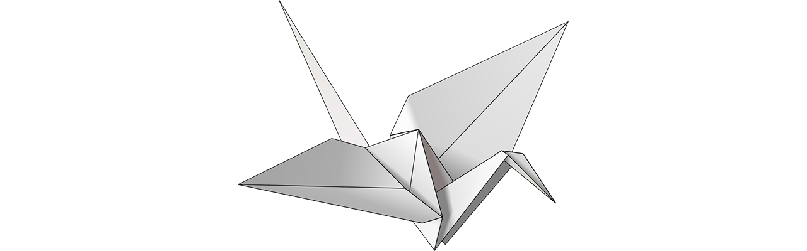
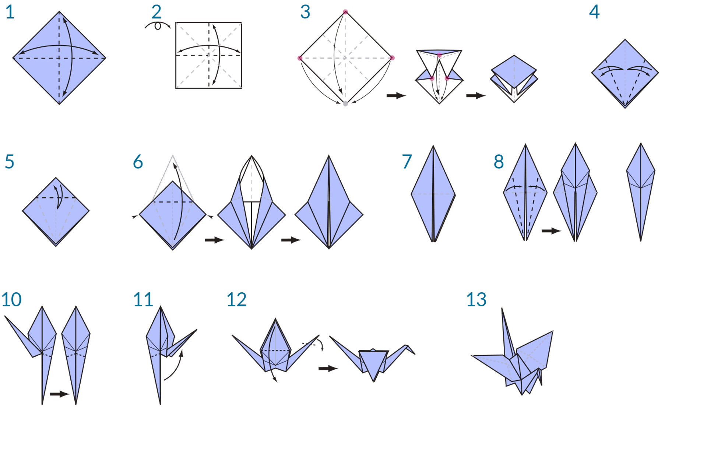

### Was ist visuelle Programmierung?

Beim Entwurfsprozess müssen häufig visuelle, systemrelevante oder geometrische Beziehungen zwischen den Teilen eines Entwurfs eingerichtet werden. In der Mehrzahl der Fälle werden bei der Entwicklung dieser Beziehungen Arbeitsabläufe verwendet, die mithilfe von Regeln vom Konzept zum Endergebnis führen. Dabei setzen Sie, vielleicht ohne es zu wissen, Algorithmen ein: Sie definieren in Einzelschritten nacheinander ablaufende Aktionen, die einer grundlegenden Logik aus Eingabe, Verarbeitung und Ausgabe folgen. Bei der Programmierung können Sie weiterhin auf diese Weise arbeiten, wobei die Algorithmen allerdings formalisiert werden müssen.

### Algorithmen konkret

Algorithmen sind hocheffizient und bieten vielfältige Möglichkeiten; der Begriff **Algorithmus** kann jedoch missverstanden werden. Algorithmen generieren eventuell unerwartete, verrückte oder coole Ergebnisse, mit Zauberei haben sie jedoch nichts zu tun. Sie sind im Gegenteil an sich recht einfach. Dies wird hier an einem konkreten Beispiel erläutert: einem Origami-Kranich. Dabei beginnen Sie mit einem quadratischen Blatt Papier (Eingabe), führen eine Folge von Faltvorgängen aus (Verarbeitungsaktionen) und erhalten einen Kranich (Ausgabe).



Worin besteht hier der Algorithmus? Er ist die abstrakte Abfolge von Schritten, die Sie auf unterschiedliche Weise darstellen können: in Textform oder grafisch.

**Textanweisungen:**

1. Beginnen Sie mit einem quadratischen Blatt Papier, wobei die farbige Seite oben liegt. Falten Sie es auf die Hälfte und entfalten Sie es wieder. Falten Sie es anschließend in der anderen Richtung auf die Hälfte.
2. Wenden Sie das Papier auf die weiße Seite. Falten Sie das Papier auf die Hälfte, falzen Sie es scharf und entfalten Sie es wieder. Falten Sie es auf dieselbe Weise in die andere Richtung.
3. Führen Sie mithilfe der vorhandenen Falten die drei oberen Ecken des Modells nach unten auf die untere Ecke. Drücken Sie das Modell flach.
4. Falten Sie die oben liegenden dreieckigen Klappen zur Mitte und entfalten Sie sie wieder.
5. Falten Sie den oberen Teil des Modells nach unten, falzen Sie ihn scharf und entfalten Sie ihn wieder.
6. Öffnen Sie die zuoberst liegende Klappe des Modells, führen Sie sie nach oben und drücken Sie zugleich die Seiten des Modells nach innen. Drücken Sie das Modell flach und falzen Sie es scharf.
7. Drehen Sie das Modell um und wiederholen Sie die Schritte 4 bis 6 auf der Rückseite.
8. Falten Sie die oberen Klappen zur Mitte.
9. Wiederholen Sie dies auf der anderen Seite.
10. Falten Sie beide "Beine" des Modells nach oben, falzen Sie sie scharf und entfalten Sie sie.
11. Falten Sie mit inneren Gegenfalten die "Beine" entlang den neuen Falzlinien.
12. Formen Sie mit einer inneren Gegenfalte auf einer Seite den Kopf und falten Sie die Flügel nach unten.
13. Damit haben Sie einen Kranich gefaltet.

**Grafische Anleitung:**



### Programmierung – Definition

Mit beiden Anleitungen erhalten Sie einen Kranich. Wenn Sie die Anweisungen ausgeführt haben, haben Sie damit einen Algorithmus angewendet. Der einzige Unterschied besteht in der Art und Weise, in der die formale Darstellung der Anweisungsfolge gelesen wird. Damit gelangen Sie zur **Programmierung**. Programmierung, häufig als Kurzform für *Computerprogrammierung* verwendet, ist die Formalisierung einer Reihe von Aktionen, sodass ein ausführbares Programm entsteht. Wenn Sie die oben stehenden Anweisungen zum Herstellen eines Kranichs in ein Format umwandeln, das ein Computer lesen und ausführen kann, programmieren Sie.

Der entscheidende Schritt und zugleich das erste Hindernis beim Programmieren besteht darin, dass eine effiziente Kommunikation mit dem Computer nur unter Zuhilfenahme von Abstraktion möglich ist. Hierfür kommt eine Vielzahl von Programmiersprachen zum Einsatz, etwa Javascript, Python oder C. Wenn Sie eine reproduzierbare Folge von Anweisungen wie diejenige für den Origami-Kranich verfassen können, muss diese lediglich für den Computer übersetzt werden. Sie ermöglichen dadurch letztlich die Herstellung eines Kranichs oder sogar vieler Kraniche, die sich geringfügig unterscheiden, durch den Computer. Darin liegt die große Stärke der Programmierung: Der Computer führt jede beliebige Aufgabe oder Folge von Aufgaben, die Sie ihm zuweisen, wiederholt ohne Verzögerungen und ohne menschliche Irrtümer aus.

#### Visuelle Programmierung – Definition

> Laden Sie die zu dieser Übungslektion gehörige Beispieldatei herunter (durch Rechtsklicken und Wahl der Option "Save Link As"): [Visual Programming - Circle Through Point.dyn](datasets/1-1/Visual Programming - Circle Through Point.dyn). Eine vollständige Liste der Beispieldateien finden Sie im Anhang.

Angenommen, Sie werden aufgefordert, Anweisungen zum Falten eines Origami-Kranichs zu verfassen: Wie würden Sie vorgehen? Würden Sie Abbildungen, Text oder eine Kombination aus beiden verwenden?

Wenn Sie in Ihrer Antwort Abbildungen nennen, ist die **visuelle Programmierung** definitiv für Sie geeignet. Die visuelle Programmierung folgt im Wesentlichen demselben Ablauf wie die Textprogrammierung. Beiden liegen dieselben Prinzipien der Formalisierung zugrunde. Die Anweisungen und Beziehungen des Programms werden jedoch über eine grafische ("visuelle") Benutzeroberfläche definiert. Sie geben keinen durch eine Syntax geregelten Text ein, sondern verbinden vordefinierte Blöcke miteinander. Vergleichen Sie hier die Programmierung desselben Algorithmus "Zeichne einen Kreis durch einen Punkt" in Form von Blöcken und als Code.

**Visuelles Programm:**


**Textprogramm:**

```
myPoint = Point.ByCoordinates(0.0,0.0,0.0);
x = 5.6;
y = 11.5;
attractorPoint = Point.ByCoordinates(x,y,0.0);
dist = myPoint.DistanceTo(attractorPoint);
myCircle = Circle.ByCenterPointRadius(myPoint,dist);
```

Die Ergebnisse des Algorithmus:


Das Visuelle an dieser Art der Programmierung erleichtert den Einstieg, und Designer fühlen sich häufig davon angesprochen. Dynamo folgt dem Muster der visuellen Programmierung. Sie können jedoch, wie später gezeigt wird, nach wie vor auch die Textprogrammierung in dieser Anwendung verwenden.

