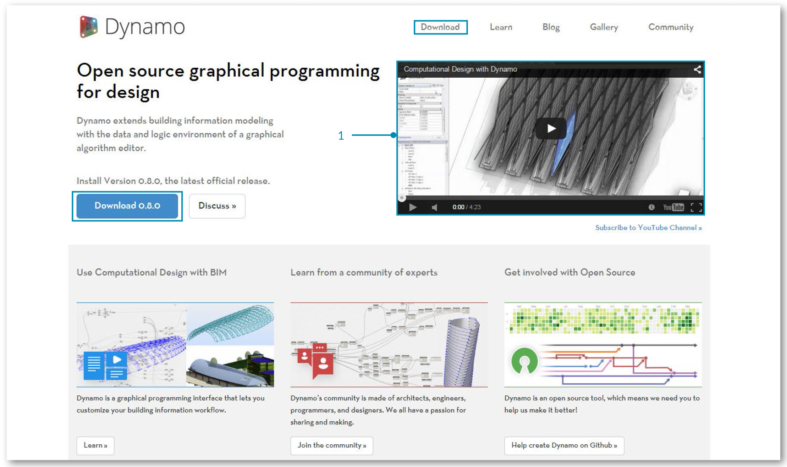

## Was ist Dynamo?

Was Dynamo ist, ist davon abhängig, wie Sie es verwenden. Die Arbeit mit Dynamo kann darin bestehen, die Anwendung zusammen mit anderer Autodesk-Software oder einzeln einzusetzen, einen Prozess aus der visuellen Programmierung zu nutzen oder sich an der großen Community der Benutzer und Beitragenden zu beteiligen.

### Die Anwendung

Die Anwendung Dynamo ist eine Software, die Sie herunterladen und entweder im Standalone-Modus (Sandbox) oder als Zusatzmodul für andere Software wie Revit oder Maya ausführen können. Sie wird wie folgt beschrieben:

> Ein Tool für die visuelle Programmierung, das für Nichtprogrammierer und Programmierer gleichermaßen einsetzbar sein soll. Der Benutzer hat die Möglichkeit, visuell Skripts für das Programmverhalten zu erstellen, benutzerdefinierte Logik zu definieren sowie Skripts in verschiedenen textbasierten Programmiersprachen zu erstellen.



> 1. Demonstration von Dynamo mit Revit
2. Installationsprogramm herunterladen

### Prozess

Nachdem Sie die Anwendung installiert haben, haben Sie in Dynamo die Möglichkeit, in einem visuellen Programmierprozess zu arbeiten, wobei Sie Elemente miteinander verbinden und dadurch die Beziehungen und Abfolgen von Aktionen definieren, aus denen sich benutzerdefinierte Algorithmen zusammensetzen. Ihre Algorithmen können Sie für ein breites Spektrum an Verwendungszwecken von der Verarbeitung von Daten bis zum Generieren von Geometrie einsetzen – in Echtzeit und ohne eine einzige Zeile ```code``` zu schreiben.


> Fügen Sie Elemente hinzu, verbinden Sie sie und schon sind Sie dabei, visuelle Programme zu erstellen

### Community

Ohne seine starke Community engagierter Benutzer und aktiver Beitragender hätte sich Dynamo nie so weit entwickelt. Engagieren auch Sie sich in der Community, indem Sie das Blog lesen, Ihre Arbeiten der Galerie hinzufügen oder an Forumsdiskussionen zu Dynamo teilnehmen.


### Plattform

Dynamo ist als visuelles Programmierungs-Tool für Designer konzipiert. Dies ermöglicht es, Tools zu entwickeln, die externe Bibliotheken oder beliebige Autodesk-Produkte nutzen, in denen eine API zur Verfügung steht. In Dynamo Studio können Sie Programme in einer Sandbox-ähnlichen Anwendung entwickeln, das Dynamo-Ökosystem wächst jedoch nach wie vor weiter.

Da der Quellcode für dieses Projekt als Open Source zur Verfügung steht, können Sie seine Funktionen ganz nach Ihren Vorstellungen erweitern. Besuchen Sie das Projekt auf GitHub und sehen Sie sich die laufenden Projekte der Benutzer an, die Dynamo anpassen.


> Durchsuchen, Verzweigen und Erweitern von Dynamo für Ihre Anforderungen

