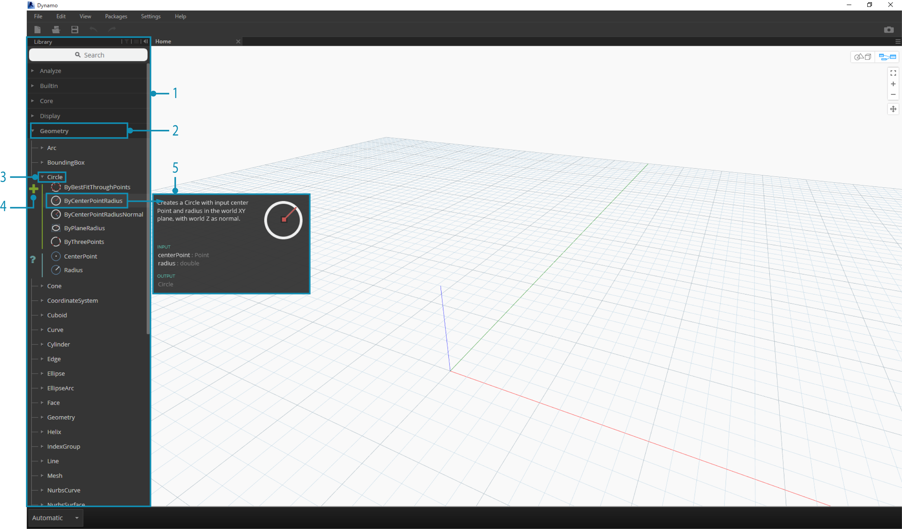
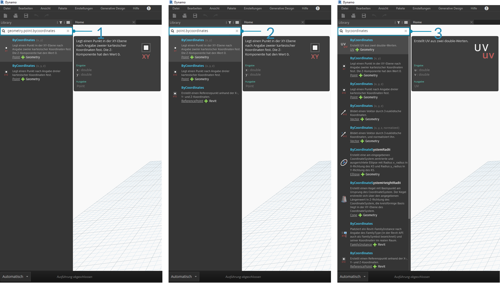
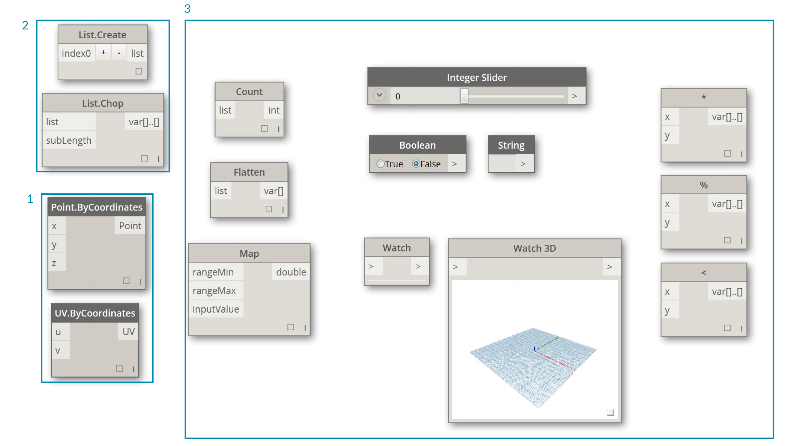
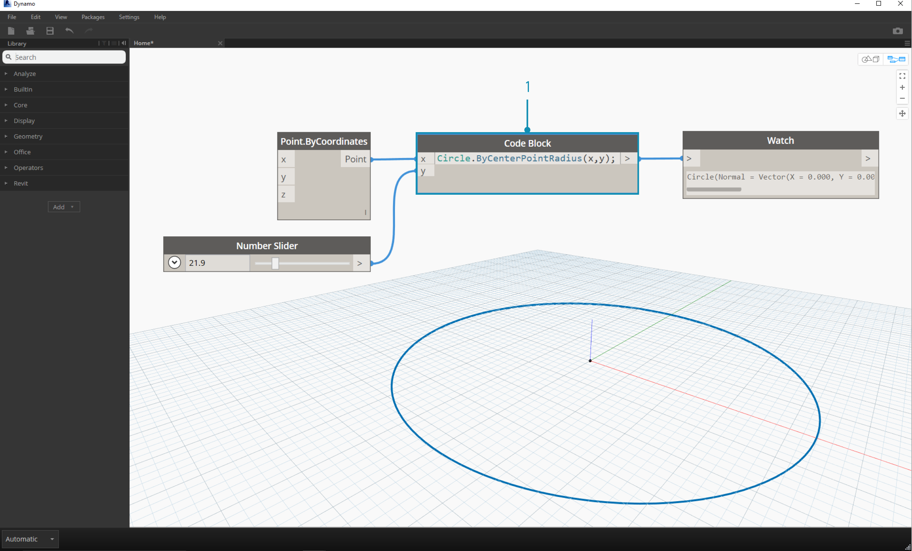

## Dynamo-Bibliothek

Die **Dynamo-Bibliothek** enthält die Blöcke, die Sie zum Arbeitsbereich hinzufügen können, um visuelle Programme zur Ausführung zu definieren. In der Bibliothek können Sie nach Blöcken suchen. Die hier enthaltenen Blöcke – die installierten Basisblöcke, Ihre benutzerdefinierten Blöcke und die von Ihnen zu Dynamo hinzugefügten Blöcke aus Package Manager – sind hierarchisch nach Kategorie organisiert. Im Folgenden werden Sie sich mit dieser Organisation und den wichtigsten Blöcken, die häufig von Ihnen verwendet werden, vertraut machen.

### Bibliothek der Bibliotheken

Die Dynamo-**Bibliothek**, mit der in der Anwendung eine Schnittstelle gebildet wird, entspricht einer Sammlung funktionaler Bibliotheken, die jeweils nach Kategorie gruppierte Blöcke enthalten. Auch wenn dies auf den ersten Blick überflüssig erscheinen mag, handelt es sich dabei um ein flexibles Framework für die Organisation von Blöcken, die zum Lieferumfang der Standardinstallation von Dynamo gehören – und deren Grundfunktionalität Sie noch um benutzerdefinierte Blöcke und zusätzliche Pakete erweitern können.

#### Das Organisationsschema

Der Abschnitt **Bibliothek** der Dynamo-Benutzeroberfläche umfasst hierarchisch organisierte Bibliotheken. Um einen Block in der Bibliothek zu finden, müssen Sie tiefer in die Bibliothek eindringen und nacheinander die Bibliothek, die Kategorien der Bibliothek und die Unterkategorien einer Kategorie durchsuchen.



> 1. Die Bibliothek: Der Bereich der Dynamo-Benutzeroberfläche
2. Eine Bibliothek: Eine Sammlung verwandter Kategorien wie **Geometry**
3. Eine Kategorie: Eine Sammlung verwandter Blöcke wie alles in Verbindung mit **Circle**
4. Eine Unterkategorie: Aufschlüsselung der Blöcke innerhalb einer Kategorie, in der Regel in **Erstellen**, **Aktion** oder **Abfrage**
5. Ein Block: Die Objekte, die zum Arbeitsbereich hinzugefügt werden, um eine Aktion auszuführen

#### Benennungskonventionen

Die Hierarchie der jeweiligen Bibliothek spiegelt sich im Namen der Blöcke wider, die zum Arbeitsbereich hinzugefügt wurden und die Sie auch im Suchfeld oder mit Codeblöcken verwenden können (für die die *textuelle Sprache von Dynamo* verwendet wird). Neben der Verwendung von Schlüsselwörtern für die Suche nach Blöcken können Sie auch die Hierarchie getrennt durch einen Punkt eingeben.

Durch die Eingabe verschiedener Teile der Position des Blocks in der Bibliothekshierarchie im Format ```bibliothek.kategorie.blockname``` werden unterschiedliche Ergebnisse zurückgegeben:



> 1. ```bibliothek.kategorie.blockname```
2. ```kategorie.blockname```
3. ```blockname``` oder ```schlüsselwort```

In der Regel wird der Name eines Blocks im Arbeitsbereich im Format ```kategorie.blockname``` gerendert, wobei einige Ausnahme insbesondere bei der Eingabe- und Ansichtskategorie bestehen. Beachten Sie bei ähnlich benannten Blöcken den Kategorieunterschied:



> 1. ```Point.ByCoordinates``` und ```UV.ByCoordinates``` weisen denselben Namen auf, stammen jedoch aus unterschiedlichen Kategorien
2. Blöcke aus den meisten Bibliotheken schließen das Kategorieformat ein.
3. Zu den wichtigsten Ausnahmen gehören Built-in Functions, Core.Input, Core.View und Operators.

### Häufig verwendete Blöcke

Welche der zahlreichen Blöcke, die zum Lieferumfang der Basisinstallation von Dynamo gehören, sind für die Entwicklung visueller Programme von grundlegender Bedeutung? Konzentrieren Sie sich zunächst auf jene, mit denen Sie die Parameter Ihres Programms definieren (**Input**), die Ergebnisse der Aktion eines Blocks anzeigen (**Watch**) und die Eingaben oder Funktionen mithilfe einer Verknüpfung definieren (**Code Block**).

#### Eingabeblöcke (Input)

Eingabeblöcke stellen das primäre Mittel für die Benutzer eines visuellen Programms – sowohl für Sie selbst als auch für andere Benutzer – zur Verwendung der Schlüsselparameter dar. Im Folgenden sind die Blöcke aufgeführt, die in der Kategorie Input der Core-Bibliothek verfügbar sind:


> 1. Boolean
2. Number
3. String
4. Number Slider
5. Integer Slider
6. Directory Path
7. File Path

#### Beobachtungsblöcke (Watch)

Die Beobachtungsblöcke sind für die Verwaltung der Daten, die ein visuelles Programm durchlaufen, von grundlegender Bedeutung. Während Sie das Ergebnis eines Blocks in der Datenvorschau des Blocks anzeigen können, möchten Sie es möglicherweise in einem **Watch**-Block aufgedeckt lassen oder die Geometrieergebnisse in einem **Watch3D**-Block anzeigen. Beide Blöcke sind in der Kategorie View der Core-Bibliothek enthalten.

> Tipp: Die 3D-Vorschau kann bisweilen unübersichtlich sein, wenn Ihr visuelles Programm viele Blöcke enthält. Ziehen Sie in diesem Fall in Betracht, im Einstellungsmenü die Option zum Anzeigen der Hintergrundvorschau zu deaktivieren und einen Watch3D-Block zu verwenden, um eine Vorschau der Geometrie anzuzeigen.


> 1. Watch: Beachten Sie bei Auswahl eines Elements im Watch-Block, dass das Element im Watch3D-Block und in 3D-Voransichten markiert wird.
2. Watch3D: Ändern Sie die Größe mithilfe des Griffs rechts unten, und navigieren Sie mit der Maus wie in der 3D-Vorschau.

#### Codeblock

**Code Block**-Blöcke können verwendet werden, um einen Codeblock mit Linien durch Semikolons getrennt zu definieren. Dabei kann es sich einfach um ```X/Y``` handeln. Sie können auch Codeblöcke als Abkürzung verwenden, um einen Number Input-Block zu definieren oder eine andere Funktion des Blocks aufzurufen. Die Syntax hierfür entspricht der Benennungskonvention der textuellen Sprache von Dynamo in Abschnitt 3.2.3. Versuchen Sie, mit diesem Tastaturbefehl einen Kreis zu erstellen:



> 1. Zum Erstellen eines **Code Block**-Blocks doppelklicken
2. ```Circle.ByCenterPointRadius(x,y);``` eingeben
3. Durch Klicken in den Arbeitsbereich zum Löschen der Auswahl werden die Eingaben ```x``` und ```y``` automatisch hinzugefügt
4. Blöcke **Point.ByCoordinates** und **Number Slider** erstellen und anschließend mit den Eingaben des Codeblocks verbinden
5. Als Ergebnis der Ausführung des visuellen Programms wird in der 3D-Vorschau ein Kreis ausgegeben.

