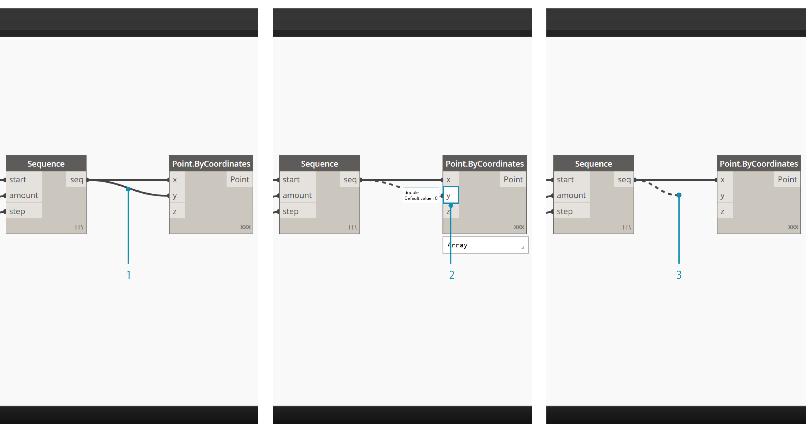
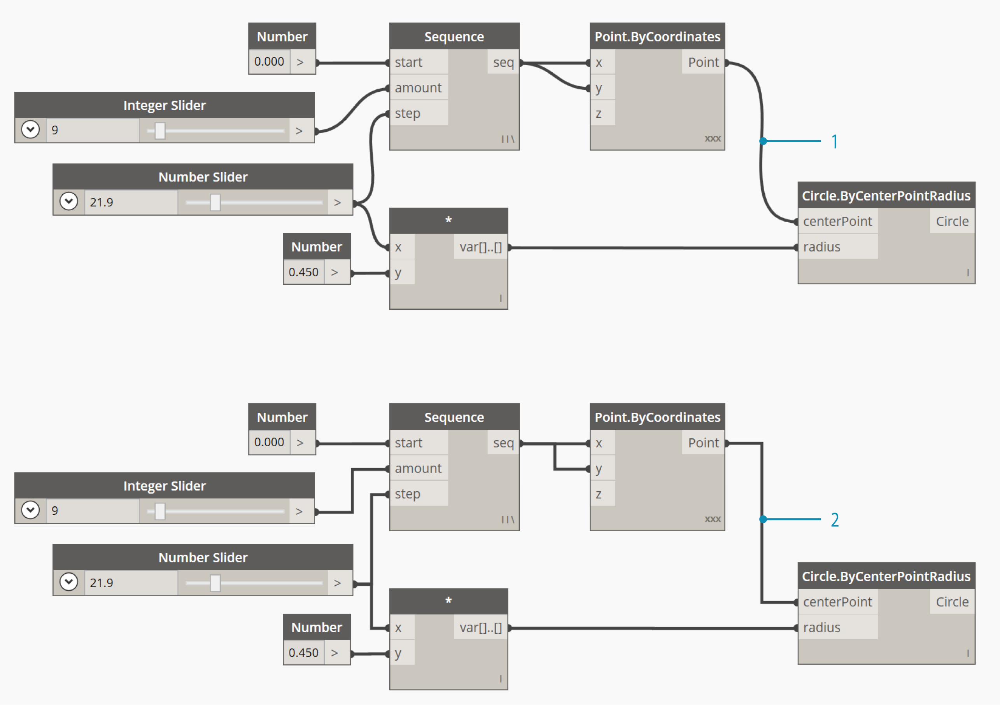

## Drähte

Drähte verbinden Blöcke miteinander, um Beziehungen zu erstellen und den Ablauf eines visuellen Programms festzulegen. Sie können sie sich buchstäblich als elektrische Drähte vorstellen, die Datenimpulse von einem Objekt zum nächsten transportieren.

### Programmablauf

Drähte verbinden den Ausgabeanschluss eines Blocks mit dem Eingabeanschluss eines anderen Blocks. Diese Direktionalität legt den **Datenfluss** im visuellen Programm fest. Sie können die Blöcke zwar wie gewünscht im Arbeitsbereich anordnen, da sich die Ausgabeanschlüsse jedoch auf der rechten Seite der Blöcke und die Eingabeanschlüsse auf der linken Seite befinden, wird der Programmablauf allgemein als von links nach rechts betrachtet.


### Erstellen von Drähten

Sie erstellen einen Draht, indem Sie mit der linken Maustaste auf einen Anschluss und dann erneut mit der linken Maustaste auf den Anschluss eines anderen Blocks klicken, um eine Verbindung festzulegen. Während der Herstellung der Verbindung wird der Draht gestrichelt angezeigt. Nachdem die Verbindung erfolgreich hergestellt wurde, erscheint er als durchgezogene Linie. Die Daten fließen immer von Ausgabe zu Eingabe durch diesen Draht. Sie können den Draht jedoch in beliebiger Richtung erstellen, die dadurch definiert wird, in welcher Reihenfolge Sie auf die Anschlüsse klicken.

> Tipp: Bevor Sie das Herstellen der Verbindung durch das zweite Klicken abschließen, lassen Sie den Draht an einem Anschluss einrasten und bewegen Sie den Cursor darauf, um die zugehörige QuickInfo anzuzeigen.


> 1. Auf den ```seq```-Ausgabeanschluss des Number Sequence-Blocks klicken
2. Beim Verschieben der Maus zu einem anderen Anschluss wird der Draht gestrichelt angezeigt
3. Auf den ```y```-Eingabeanschluss des Point.ByCoordiantes-Blocks klicken, um die Verbindung herzustellen

### Bearbeiten von Drähten

Es kommt häufig vor, dass Sie den Programmablauf in einem visuellen Programm anpassen möchten, indem Sie die durch Drähte dargestellten Verbindungen bearbeiten. Um einen Draht zu bearbeiten, klicken Sie mit der linken Maustaste auf den Eingabeanschluss eines Blocks, der bereits verbunden ist. Daraufhin haben Sie zwei Möglichkeiten:



> 1. Vorhandener Draht
2. Um die Verbindung zu einem Eingabeanschluss zu ändern, mit der linken Maustaste auf einen anderen Eingabeanschluss klicken
3. Um den Draht zu entfernen, den Draht wegziehen und mit der linken Maustaste in den Arbeitsbereich klicken

### Drahtvoransichten

Standardmäßig werden Drähte in der Vorschau mit einem grauen Strich angezeigt. Wenn ein Block ausgewählt wird, werden alle Verbindungsdrähte wie der Block in aquamarinblau hervorgehoben.


> 1. Standarddraht
2. Hervorgehobener Draht

In Dynamo können Sie über das Menü Ansicht > Connectors auch anpassen, wie Drähte im Arbeitsbereich angezeigt werden. Hier können Sie zwischen der Anzeige als Kurve oder Polylinie umschalten oder die Anzeige vollständig deaktivieren.



> 1. Connector-Typ: Kurven
2. Connector-Typ: Polylinien

