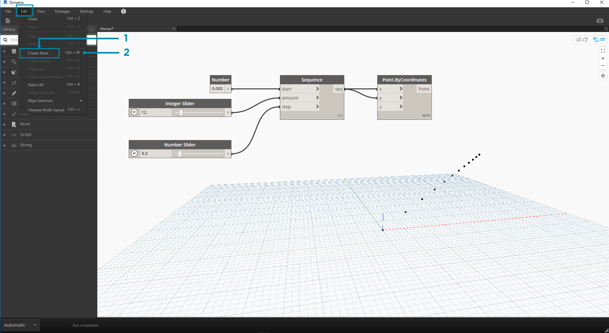
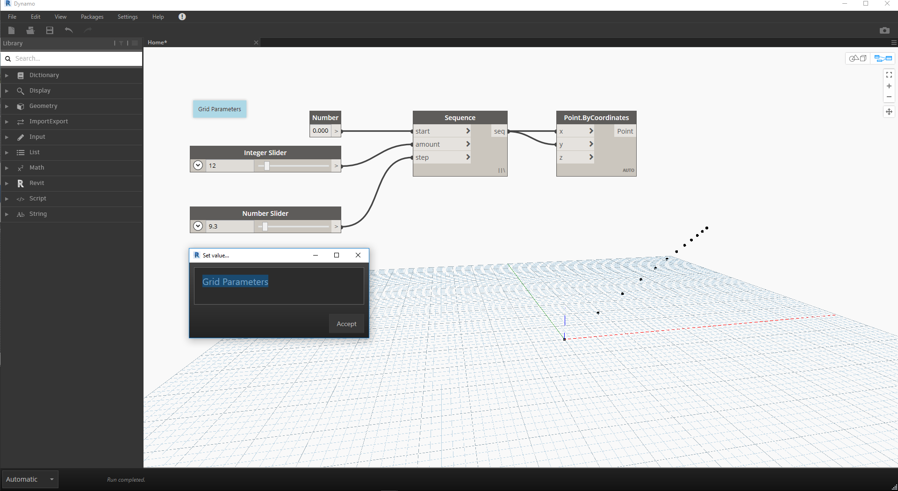
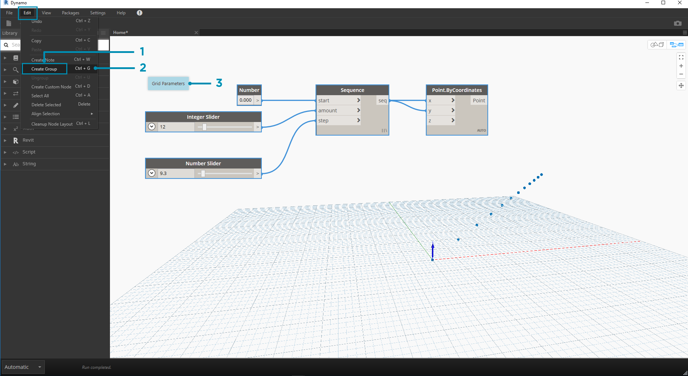
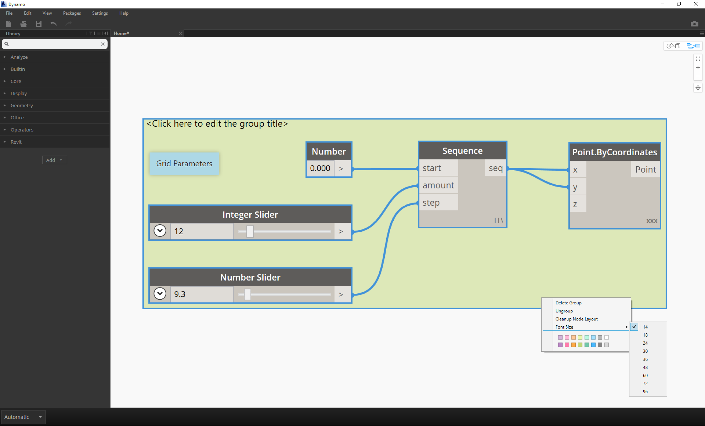
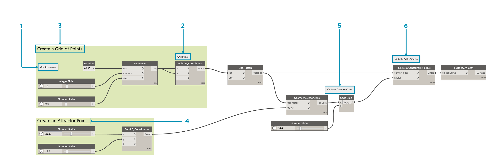

## Programme verwalten

Der visuelle Programmierungsprozesses ist eine äußerst leistungsstarke, kreative Aktivität, wobei der Programmablauf und die wichtigsten Benutzereingaben jedoch schnell durch ihre Komplexität und/oder das Layout des Arbeitsbereichs unübersichtlich werden können. Machen Sie sich im Folgenden mit einigen bewährten Verfahren für die Verwaltung von Programmen vertraut.

### Ausrichtung

Nachdem Sie bereits zahlreiche Blöcke zum Arbeitsbereich hinzugefügt haben, möchten Sie sie möglicherweise neu anordnen, um das Layout übersichtlicher zu gestalten. Indem Sie mehrere Blöcke auswählen und mit der rechten Maustaste in den Arbeitsbereich klicken, wird ein Popup-Fenster mit dem Menü **Auswahl ausrichten** angezeigt, das Optionen zum Ausrichten und Verteilen in X- und Y-Richtung enthält.

> 1. Wählen Sie mehrere Blöcke aus.
2. Klicken Sie mit der rechten Maustaste in den Arbeitsbereich.
3. Verwenden Sie die Optionen von **Auswahl ausrichten**.

### Anmerkungen

Mit etwas Erfahrung werden Sie auch in der Lage sein, visuelle Programme zu "lesen", indem Sie die Blocknamen überprüfen und den Programmablauf verfolgen. Für Benutzer unterschiedlicher Erfahrungsniveaus hat es sich ebenfalls bewährt, aussagekräftige Beschriftungen und Beschreibungen einzufügen. In Dynamo ist hierfür ein **Notes**-Block mit einem bearbeitbaren Textfeld verfügbar. Für das Hinzufügen von Anmerkungen zum Arbeitsbereich bestehen zwei Möglichkeiten:

> 1. Navigieren Sie zum Menü Datei > Anmerkung erstellen.
2. Verwenden Sie die Tastenkombination Strg+W.

Nachdem Sie eine Anmerkung zum Arbeitsbereich hinzugefügt haben, wird ein Popup-Textfeld angezeigt, in dem Sie den Text für die Anmerkung bearbeiten können. Nach der Erstellung einer Anmerkung können Sie sie bearbeiten, indem Sie darauf doppelklicken oder mit der rechten Maustaste auf den Note-Block klicken.

### Gruppieren

Je umfangreicher ein visuelles Programm wird, desto hilfreicher kann es sein, größere Schritte zu identifizieren, die ausgeführt werden. Sie können größere Sammlungen von Blöcken durch ein Rechteck mit farbigem Hintergrund und einen Titel zu einer **Gruppe** zusammenfassen. Für das Erstellen einer Gruppe mit mehreren ausgewählten Blöcken sind drei Möglichkeiten verfügbar:

> 1. Navigieren Sie zum Menü Datei > Gruppe erstellen.
2. Verwenden Sie die Tastenkombination Strg+G.
3. Klicken Sie mit der rechten Maustaste in den Arbeitsbereich und wählen Sie "Gruppe erstellen".

Nachdem Sie eine Gruppe erstellt haben, können Sie deren Einstellungen wie den Titel und die Farbe bearbeiten. 

> Tipp: Verwenden Sie Anmerkungen und Gruppen auf effektive Weise, um Ihre Datei zu beschriften und die Lesbarkeit zu erhöhen.

Hier ist Ihr Programm aus Abschnitt 2.4 mit hinzugefügten Anmerkungen und Gruppen:

> 1. Anmerkung: "Rasterparameter"
2. Anmerkung: "Rasterpunkte"
3. Gruppe: "Raster aus Punkten erstellen"
4. Gruppe: "Attraktorpunkt erstellen"
5. Anmerkung: "Entfernungswerte kalibrieren"
6. Anmerkung: "Variables Raster von Kreisen"

