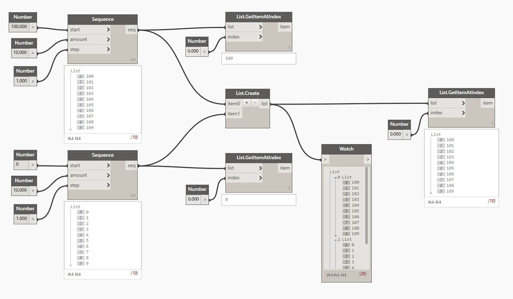
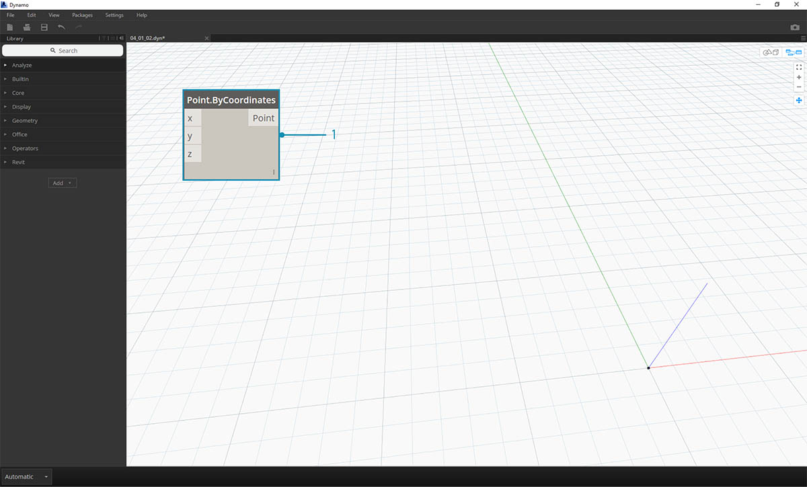
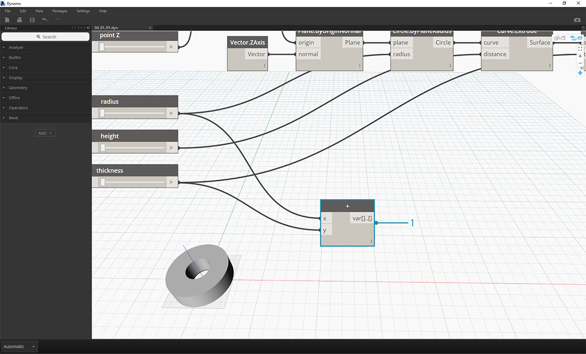

## Daten

Daten sind das Material unserer Programme. Sie fließen als Eingaben durch "Drähte" in Blöcke, wo sie verarbeitet und in eine neue Form von Ausgabedaten umgewandelt werden. Hier sollen zunächst die Definition und Struktur von Daten betrachtet werden, bevor Sie damit beginnen, sie in Dynamo zu verwenden.

### Was sind Daten?

Unter Daten versteht man eine Gruppe von Werten für qualitative oder quantitative Variable. Die einfachste Form von Daten sind Zahlen wie z. B. ```0```, ```3.14``` oder ```17```. Es gibt jedoch eine Reihe unterschiedlicher Datentypen: Variable, die für veränderliche Zahlen stehen (```Höhe```); Zeichen (```meinName```); Geometrie (```Kreis```) oder eine Liste von Datenelementen (```1,2,3,5,8,13,...```). Daten müssen in die Eingabeanschlüsse der Blöcke in Dynamo eingegeben werden: Daten können ohne Aktionen existieren, aber die Aktionen, die durch die Blöcke dargestellt werden, können nur durchgeführt werden, wenn Daten vorhanden sind. Wenn Sie im Arbeitsbereich einen Block hinzufügen, ohne Eingaben bereitzustellen, ist das Ergebnis eine Funktion, nicht das Ergebnis der eigentlichen Aktion.


> 1. Einfache Daten
2. Daten und Aktion (Block): erfolgreiche Ausführung
3. Aktion (Block) ohne Daten gibt eine allgemeine Funktion zurück

### Vermeiden Sie Nullen

Der Typ ```'null'``` steht für das Fehlen von Daten. Dies ist zwar ein abstraktes Konzept, dem Sie jedoch bei der Arbeit mit visueller Programmierung sehr wahrscheinlich begegnen werden. Wenn eine Aktion kein gültiges Ergebnis erstellt, gibt der Block Null zurück. Das Ermitteln und Entfernen von Nullwerten aus Datenstrukturen ist ein entscheidender Schritt zum Erstellen stabiler Programme.

|Symbol|Name/Syntax|Eingaben|Ausgaben|
| -- | -- | -- | -- |
||Object.IsNull|obj|bool|

### Datenstrukturen

Bei der visuellen Programmierung können sehr schnell große Datenmengen generiert werden. Aus diesem Grund benötigen Sie ein Verfahren zur Verwaltung von deren Hierarchie. Dies ist die Funktion der Datenstrukturen, der organisatorischen Schemata, in denen Daten gespeichert werden. Die Charakteristika der Datenstrukturen und ihrer Verwendung sind von Programmiersprache zu Programmiersprache unterschiedlich. in Dynamo werden Daten mithilfe von Listen hierarchisch geordnet. Dies wird in den weiteren Kapiteln ausführlich erläutert. Am Anfang sollen einige einfache Beispiele stehen:

Eine Liste für eine Sammlung von Elementen, die in einer Struktur von Daten abgelegt wurden:

* Sie haben fünf Finger (*Elemente*) an einer Hand (*Liste*).
* Zehn Häuser (*Elemente*) stehen entlang einer Straße (*Liste*).



> 1. Ein **Number Sequence**-Block definiert eine Liste von Zahlen mithilfe der Eingaben *start*, *amount* und *step*. Mithilfe dieser beiden Blöcke wurden zwei separate Listen mit je zehn Zahlen – *100–109* und *0–9* erstellt.
2. Mithilfe des Blocks **List.GetItemAtIndex** wird das Element an einer bestimmten Indexposition ausgewählt. Wenn Sie *0* wählen, wird das erste Element in der Liste (in diesem Fall*100*) abgerufen.
3. In der zweiten Liste erhalten Sie mit demselben Verfahren den Wert *0*, das erste Element in der Liste.
4. Als Nächstes führen Sie die beiden Listen mithilfe eines **List.Create**-Blocks zu einer zusammen. Mit diesem Block wird eine *Liste von Listen erstellt.* Dies verändert die Struktur der Daten.
5. Wenn Sie **List.GetItemAtIndex** erneut mit dem Index *0* verwenden, erhalten Sie die erste der in der übergeordneten Liste enthaltenen Listen. Dieses Beispiel verdeutlicht, wie Listen behandelt werden: Sie gelten – anders als in anderen Skriptsprachen – als Objekte. Listenbearbeitung und Datenstruktur werden in den später folgenden Kapiteln genauer beschrieben.

Als wichtigstes Prinzip zum Verständnis der Datenhierarchie in Dynamo gilt: **Innerhalb der Datenstruktur gelten Listen als Elemente.** In anderen Worten: In Dynamo kommt ein hierarchisch von oben nach unten geordneter Prozess für Datenstrukturen zum Einsatz. Was bedeutet das? Das folgende Beispiel soll dies verdeutlichen:

### Erstellen einer Kette von Zylindern mithilfe von Daten

> Laden Sie die Beispieldatei für diese Übungslektion herunter (durch Rechtsklicken und Wahl von "Save Link As..."): [Building Blocks of Programs - Data.dyn](datasets/4-1/Building Blocks of Programs - Data.dyn). Eine vollständige Liste der Beispieldateien finden Sie im Anhang.

In diesem ersten Beispiel erstellen Sie zur Demonstration der in diesem Abschnitt behandelten Geometriehierarchie einen Zylinder und geben seine Wandstärke an. 

> 1. **Point.ByCoordinates**: Nachdem Sie diesen Block im Ansichtsbereich hinzugefügt haben, wird ein Punkt am Ursprung des Rasters in der Dynamo-Vorschau angezeigt. Die Vorgabewerte der Eingaben für *x, y* und *z* sind *0.0*, wodurch ein Punkt an dieser Position definiert wird.


> 1. **Plane.ByOriginNormal**: Die nächste Stufe in der Geometriehierarchie ist eine Ebene. Es gibt mehrere Möglichkeiten für die Konstruktion einer Ebene: Hier werden ein Ursprung und eine Normale als Eingaben verwendet. Der Ursprung ist der Punkt, den Sie mithilfe des Blocks im vorigen Schritt erstellt haben.
2. **Vector.ZAxis**: Dies ist ein Vektor mit Einheiten in z-Richtung. Hier sind keine Eingaben, sondern nur ein Vektor mit dem Wert [0,0,1] vorhanden. Dieser wird für die *normal*-Eingabe des *Plane.ByOriginNormal*-Blocks verwendet. In der Dynamo-Vorschau wird daraufhin eine rechteckige Ebene angezeigt.


> 1. **Circle.ByPlaneRadius**: Eine Stufe höher in der Hierarchie erstellen Sie aus der Ebene, die Sie im letzten Schritt erstellt haben, eine Kurve. Nachdem Sie den Block verbunden haben, erhalten Sie einen Kreis um den Ursprungspunkt. Als Radius ist in diesem Block der Wert *1* vorgegeben.


> 1. **Curve.Extrude**: In diesem Schritt wandeln Sie dieses Objekt in einen 3D-Körper um. Dieser Block erstellt durch Extrusion eine Oberfläche aus einer Kurve. Der vorgegebene Abstand im Block beträgt *1* und im Ansichtsfenster ist jetzt ein Zylinder zu sehen.


> 1. **Surface.Thicken**: Mit diesem Block erhalten Sie einen geschlossenen Körper, indem die Oberfläche um den angegebenen Wert versetzt und die entstehende Form geschlossen wird. Der Vorgabewert für die Verdickung ist *1*. Im Ansichtsfenster wird ein Zylinder mit der entsprechenden Wandstärke angezeigt.


> 1. **Number Slider**: Anstatt die Vorgabewerte für alle diese Eingaben zu verwenden, können Sie dem Modell auch Funktionen zur parametrischen Steuerung hinzufügen.
2. **Domänenbearbeitung**: Nachdem Sie den Zahlen-Schieberegler im Ansichtsbereich hinzugefügt haben, klicken Sie auf die Pfeilspitze oben links, um die Domänenoptionen anzuzeigen.
3. **Min/Max/Step**: Ändern Sie die Werte für *min*, *max* und *step* in *0*,*2* und *0.01*. Mit diesen Angaben steuern Sie die Gesamtgröße der Geometrie.


> 1. **Number Slider**-Blöcke: Erstellen Sie mehrere Kopien dieses Number Slider-Blocks (indem Sie ihn auswählen und anschließend zuerst Strg+C und dann Strg+V drücken), bis für alle Eingaben anstelle der bisherigen Vorgaben Verbindungen zu den Number Sliders verwendet werden. Manche Werte für diese Schieberegler müssen größer als Null sein, damit die Definition verwendbar ist. So wird beispielsweise eine Tiefe für die Extrusion benötigt, damit eine Oberfläche entsteht, die verdickt werden kann.

Sie haben jetzt mithilfe dieser Regler einen parametrischen Zylinder mit Angabe einer Wandstärke erstellt. Experimentieren Sie mit einigen dieser Parameter und beobachten Sie die dynamische Veränderung der Geometrie im Dynamo-Ansichtsfenster.


> 1. **Number Sliders**-Blöcke: In einem weiteren Schritt wurden etliche weitere Schieberegler im Ansichtsbereich hinzugefügt und die Benutzeroberfläche des neu erstellten Werkzeugs muss übersichtlicher gestaltet werden. Klicken Sie mit der rechten Maustaste nacheinander auf die einzelnen Schieberegler, wählen Sie Umbenennen und ändern Sie den Namen jedes Schiebereglers in den Namen des dazugehörigen Parameters. Die Namen können Sie der Abbildung oben entnehmen.

Damit haben Sie einen perfekten verdickten Zylinder erstellt. Dies ist jedoch nur ein einzelnes Objekt. Im nächsten Schritt wird gezeigt, wie Sie ein Array von Zylindern erstellen, die dynamisch miteinander verbunden bleiben. Zu diesem Zweck arbeiten Sie nicht mit einem einzelnen Element, sondern erstellen eine Liste von Zylindern.



> 1. **Addition (+)**: Neben dem eben erstellten Zylinder soll eine Reihe weiterer Zylinder hinzugefügt werden. Um einen Zylinder direkt neben dem vorhandenen hinzuzufügen, müssen Sie sowohl dessen Radius als auch die Stärke seiner Wand berücksichtigen. Diesen Wert erhalten Sie durch Addition der Werte aus den beiden Schiebereglern.


> Dieser Schritt ist etwas komplexer und wird daher im Einzelnen erläutert: Erstellt werden soll eine Liste mit Zahlen, die die Positionen der einzelnen Zylinder in einer Reihe definieren.

> 1. **Multiplikation**: Als Erstes müssen Sie den Wert aus dem vorigen Schritt mit 2 multiplizieren. Der Wert aus dem vorherigen Schritt gibt den Radius an, der Zylinder muss jedoch um den vollständigen Durchmesser verschoben werden.
2. **Sequence**: Mithilfe dieses Blocks erstellen Sie ein Array von Zahlen. Die erste Eingabe ist der Wert des *Multiplikation*-Blocks aus dem vorigen Schritt in den *step*-Wert. Als *start*-Wert können Sie *0.0* festlegen. Verwenden Sie hierfür einen *number*-Block.
3. **Integer Slider**: Verbinden Sie für den *amount*-Wert einen Integer-Schieber. Diese Funktion definiert, wie viele Zylinder erstellt werden.
4. **Ausgabe**: Diese Liste zeigt den Abstand, um den die einzelnen Zylinder im Array versetzt werden. Sie wird parametrisch durch die ursprünglichen Schieberegler gesteuert.


> 1. Dieser Schritt ist einfach: Verbinden Sie die im letzten Schritt erstellte Sequenz mit der *x*-Eingabe des ursprünglichen *Point.ByCoordinates*. Dies ersetzt den Schieberegler *pointX*, den Sie löschen können. Im Ansichtsfenster wird jetzt ein Array von Zylindern angezeigt (achten Sie darauf, dass im Integer Slider ein Wert größer als Null angegeben ist).


> Die Kette der Zylinder ist weiterhin dynamisch mit allen Schiebereglern verknüpft. Experimentieren Sie mit den Schiebereglern, und beobachten Sie, wie die Definition aktualisiert wird.

