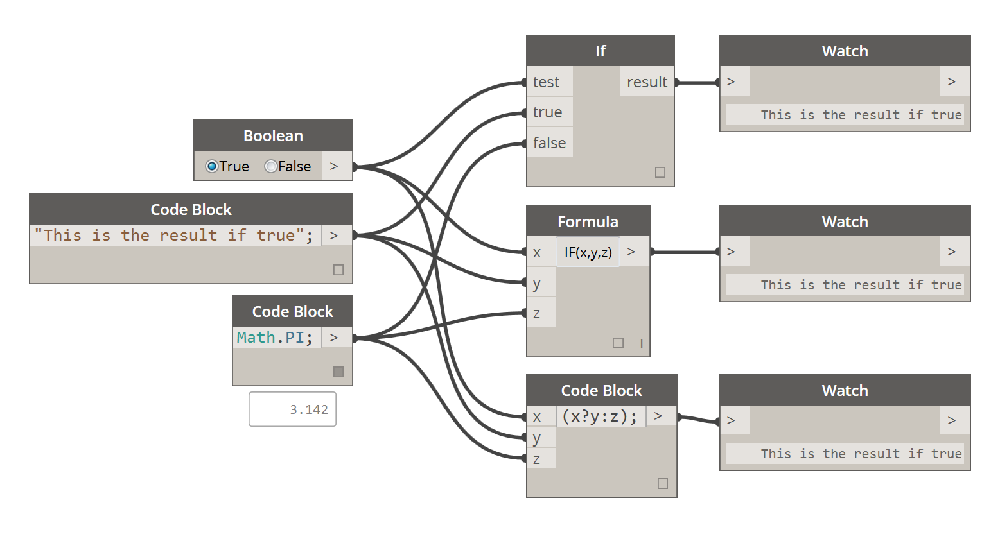
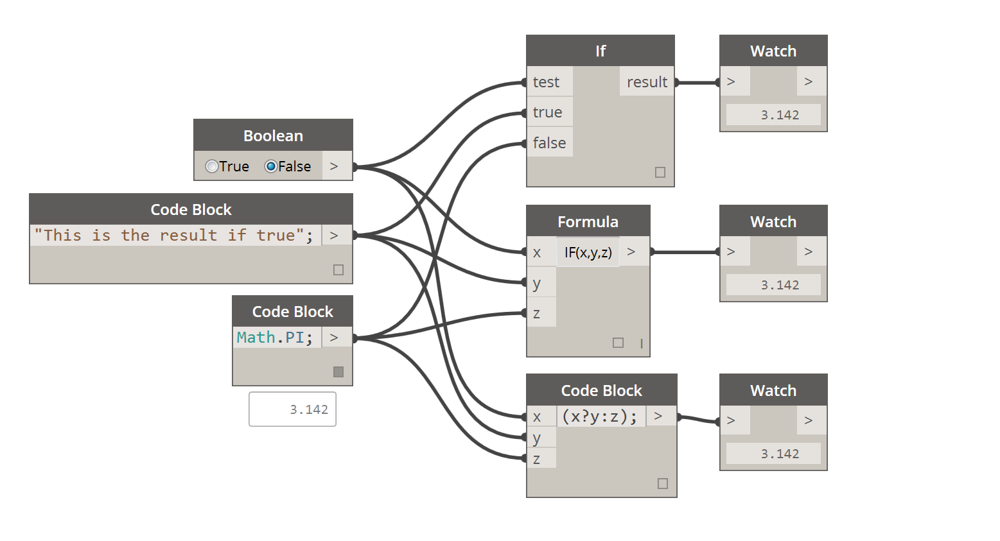
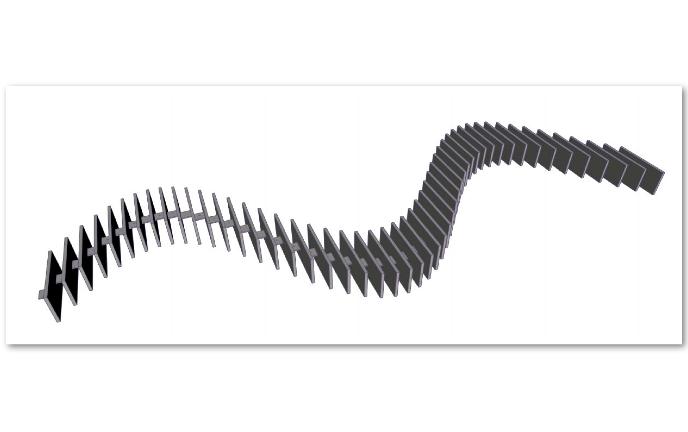
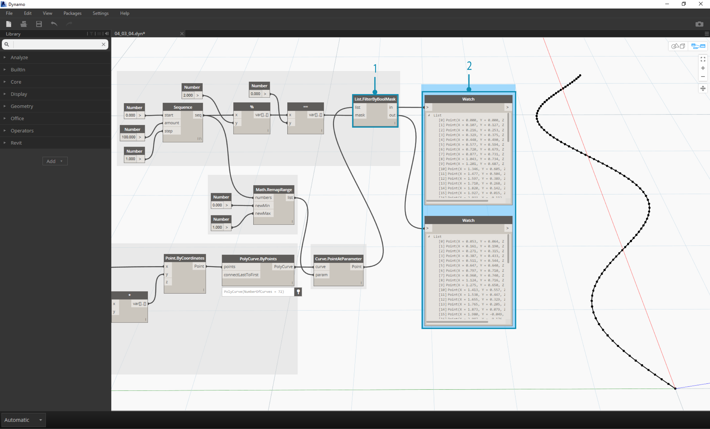

## Logik

**Logik**, genauer **Bedingungslogik** ermöglicht die Angabe einer Aktion oder einer Gruppe von Aktionen unter Verwendung einer Prüfung. Die Auswertung der Prüfung ergibt einen booleschen Wert für ```True``` oder ```False```, der zur Steuerung des Programmablaufs verwendet werden kann.

### Boolesche Werte

Numerische Variablen können für eine Vielzahl unterschiedlicher Zahlen stehen. Boolesche Variablen hingegen können nur zwei Werte annehmen, die als True oder False, Ja oder Nein, 1 oder 0 wiedergegeben werden. Booleschen Operationen werden wegen ihrer begrenzten Möglichkeiten nur selten zum Durchführen von Berechnungen verwendet.

### Bedingungsanweisungen

Die "If"-Anweisung ist ein wichtiges Konzept in der Programmierung: "Wenn *dies* zutrifft (True), dann geschieht *das*, andernfalls geschieht *etwas anderes*. Die aus der Anweisung resultierende Aktion wird durch einen booleschen Wert gesteuert. In Dynamo stehen mehrere Möglichkeiten zum Definieren von If-Anweisungen zur Verfügung:

|Symbol|Name|Syntax|Eingaben|Ausgaben|
| -- | -- | -- | -- | -- |
||Wenn|If|test, true, false|result|
||Formel|if (x, y,z)|x, y, z|result|
||Codeblock|(x?y:z)|x, y, z|result|

Die folgenden kurzen Beispiele zeigen die Funktionsweise dieser drei Blöcke in der If-Bedingungsanweisung.



> In dieser Abbildung wurde im *Boolean* die Option *True*, eingestellt, d. h., das Ergebnis ist die Zeichenfolge: *"this is the result if true".* Die drei möglichen Blöcke, mit deren Hilfe die *If*-Anweisung erstellt werden kann, funktionieren hier auf dieselbe Weise.



> Auch in diesem Fall funktionieren die Blöcke auf dieselbe Weise. Wenn Sie den *Boolean*-Wert in *False* ändern, wird als Ergebnis die Zahl *Pi* ausgegeben, wie in der ursprünglichen *If*-Anweisung festgelegt.

### Filtern einer Liste

> Laden Sie die Beispieldatei für diese Übungslektion herunter (durch Rechtsklicken und Wahl von Save Link As...): [Building Blocks of Programs - Logic.dyn](datasets/4-3/Building Blocks of Programs - Logic.dyn). Eine vollständige Liste der Beispieldateien finden Sie im Anhang.

In diesem Beispiel teilen Sie eine Liste von Zahlen in eine Liste mit geraden und eine Liste ungeraden Zahlen auf.


> 1. **Range**: Definieren Sie im Ansichtsbereich einen Zahlenbereich.
2. **Number**-Blöcke: Fügen Sie im Ansichtsbereich drei Number-Blöcke ein. Legen Sie in diesen Blöcken die folgenden Werte fest: *0.0* für *start*, *10.0* für *end* und *1.0* für *step*.
3. **Ausgabe**: Die Ausgabe zeigt eine Liste mit 11 Zahlen von 0-10.
4. **Modulus (%)**: Verbinden Sie *Range* mit *x* und *2.0* mit *y*. Mit dieser Funktion wird für jede Zahl aus der Liste der Rest bei Division durch 2 berechnet. Die Ausgabe für diese Liste ist eine Liste, die abwechselnd die Werte 0 und 1 enthält.
5. **Gleichheitsprüfung (==)**: Fügen Sie im Ansichtsbereich einen Block für die Gleichheitsprüfung hinzu. Verbinden Sie die Ausgabe des *Modulus*-Blocks mit der *x*-Eingabe und *0.0* mit der *y*-Eingabe.
6. **Watch**: Die Gleichheitsprüfung gibt eine Liste aus, die abwechselnd die Werte true und false enthält. Mithilfe dieser Werte werden die Einträge aus der Zahlenliste eingeordnet. Dabei steht *0* (bzw. *true*) für gerade und (*1* bzw. *false*) für ungerade Zahlen.
7. **List.FilterByBoolMask**: Dieser Block filtert die Werte anhand der eingegebenen Booleschen Operation in zwei Listen. Verbinden Sie den ursprünglichen *Range* mit der *list*-Eingabe und die *Gleichheitsprüfung**-Ausgabe mit der *mask*-Eingabe. Die *in*-Ausgabe enthält die true-Werte, die *out*-Ausgabe die false-Werte.
8. **Watch**: Als Ergebnis erhalten Sie eine Liste mit geraden und eine Liste mit ungeraden Zahlen. Damit haben Sie mithilfe logischer Operatoren Listen anhand eines Musters aufgeteilt.

### Aus Logik wird Geometrie

In diesem Schritt wenden Sie die in der ersten Übung erstellte Logik auf einen Modellierungsvorgang an.


> 1. Beginnen Sie mit den Blöcken aus der letzten Übung. Dabei bestehen jedoch einige Unterschiede:
2. Das Format wurde geändert.
3. Die Eingabewerte wurden geändert.
4. Die in-Listeneingabe für *List.FilterByBoolMask* wurde entfernt. Diese Blöcke werden momentan nicht benötigt, kommen aber weiter unten in dieser Übung zum Einsatz.


> Beginnen Sie, indem Sie die Blöcke wie in der Abbildung oben gezeigt miteinander verbinden. Diese Gruppe von Blöcken stellt eine parametrische Gleichung zum Definieren einer Sinuskurve dar. Einige Hinweise:

> 1. Im **ersten Schieberegler** müssen als Mindestwert 1, als Höchstwert 4 und als Schritt 0.01 angegeben werden.
2. Im **zweiten Schieberegler** müssen als Mindestwert 0, als Höchstwert 1 und als Schritt 0.01 angegeben werden.
3. **PolyCurve.ByPoints**: Indem Sie das oben gezeigte Blockdiagramm kopieren, erhalten im Ansichtsfenster der Dynamo-Vorschau eine Sinuskurve.

Für die Eingaben gilt hier folgende Regel: Verwenden Sie Zahlenblöcke für statische und Schieberegler für veränderliche Eigenschaften. Der anfangs definierte ursprüngliche Zahlenbereich soll erhalten bleiben. Für die Sinuskurve, die hier erstellt werden soll, wird jedoch mehr Flexibilität benötigt. Mithilfe dieser Schieberegler können Sie die Frequenz und Amplitude der Kurve ändern.



> Die Schritte dieser Definition werden hier nicht nacheinander beschrieben. Hier wird zunächst das Endergebnis gezeigt, um eine Vorstellung der fertigen Geometrie zu vermitteln. Die ersten beiden Schritte wurden separat durchgeführt und müssen jetzt zusammengeführt werden. Die Position der reißverschlussähnlichen Bauteile soll durch die zugrunde liegende Sinuskurve gesteuert werden, wobei mithilfe der True/False-Logik abwechselnd große und kleine Quader eingefügt werden.


> 1. **Math.RemapRange**: Erstellen Sie aus der in Schritt 01 erstellten Zahlenfolge eine neue Zahlenfolge, indem Sie den Bereich neu zuordnen. In Schritt 01 wurden Zahlen von 0 – 100 festgelegt. Diese Zahlen liegen zwischen 0 und 1, wie mithilfe der Eingaben *newMin* und *newMax* festgelegt.


> 1. **Curve.PointAtParameter**: Verbinden Sie *Polycurve.ByPoints* (aus Schritt 2) mit *curve* und *Math.RemapRange* mit *param*. Mithilfe dieses Schritts erstellen Sie Punkte entlang der Kurve. Die Zahlen mussten dem Bereich 0 bis 1 neu zugeordnet werden, da als Eingabe für *param* Werte in diesem Bereich verlangt werden. Der Wert *0* steht für den Startpunkt, der Wert *1* für die Endpunkte. Die Auswertung aller dazwischen liegenden Zahlen ergibt Werte im Bereich *[0,1]*.



> 1. **List.FilterByBoolMask - ** Verbinden Sie *Curve.PointAtParameter* aus dem vorigen Schritt mit der *list*-Eingabe.
2. **Watch**: Die Watch-Blöcke für *in* und *out* zeigen, dass zwei Listen für gerade bzw. ungerade Indizes erstellt wurden. Diese Punkte sind auf dieselbe Weise entlang der Kurve angeordnet, wie im folgenden Schritt gezeigt.


> 1. **Cuboid.ByLengths**: Stellen Sie die in der Abbildung oben gezeigten Verbindungen wieder her, um eine reißverschlussähnliche Struktur entlang der Kurve zu erhalten. Sie erstellen hier einfache Quader, deren Größe jeweils durch ihren auf der Kurve liegenden Mittelpunkt definiert wird. Die Logik der Aufteilung in gerade und ungerade Werte wird damit im Modell deutlich.


> 1. **Number Slider**: Wenn Sie zum Anfang dieser Definition zurückkehren, können Sie mit den Werten im Schieberegler experimentieren und beobachten, wie sich der "Reißverschluss" verändert. Die obere Reihe der Abbildungen zeigt den Wertebereich für den oberen Zahlen-Schieberegler. Er steuert die Frequenz der Welle.
2. **Number Slider**: Die untere Reihe der Abbildungen zeigt den Wertebereich für den unteren Zahlen-Schieberegler. Er steuert die Amplitude der Welle.

