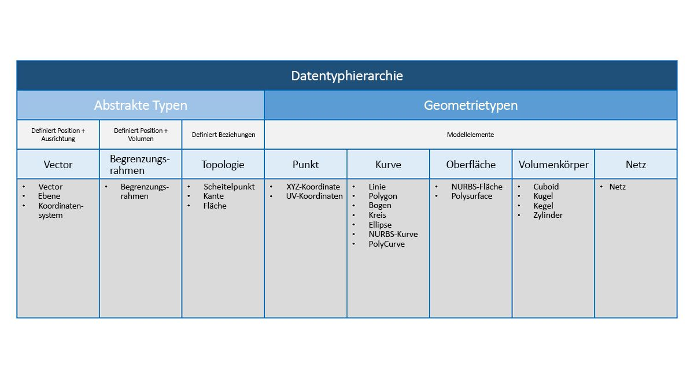
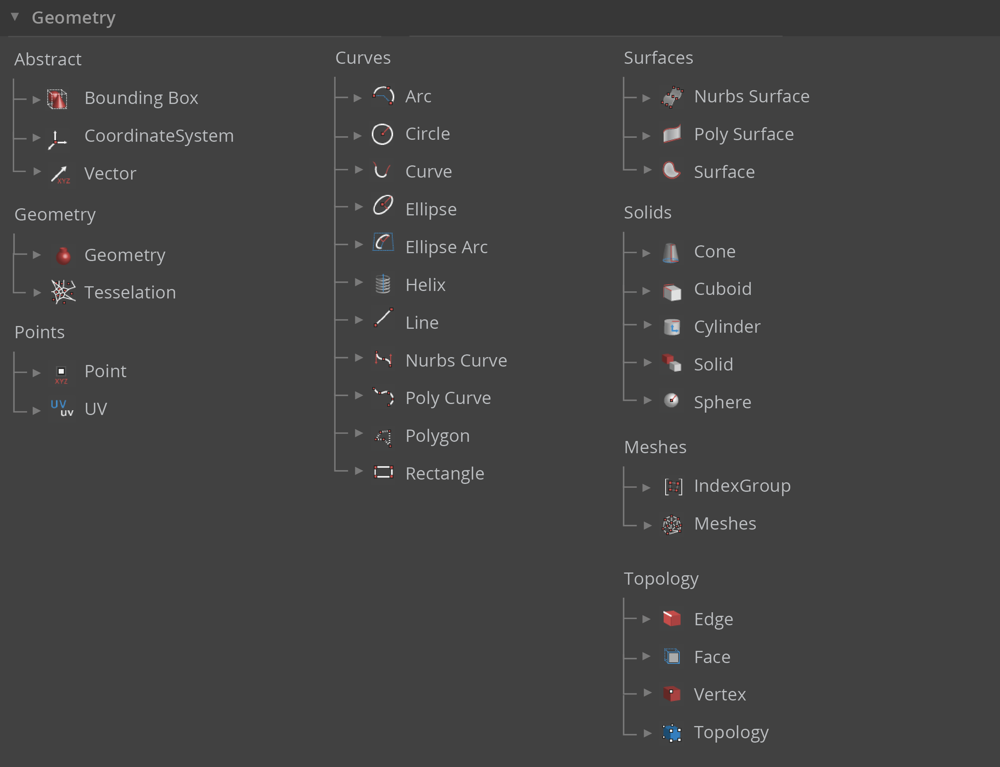

## Geometrie – Überblick

**Geometrie** ist die Sprache der Konstruktion. Wenn eine Programmiersprache oder Programmierungsumgebung in seinem Kern einen geometrischen Kernel aufweist, können Sie die Möglichkeiten für das Konstruktion präziser und robuster Modelle, die Automatisierung von Konstruktionsroutinen und die Generierung von Konstruktionsiterationen mit Algorithmen erschließen.

### Die Grundlagen

Die Geometrie ist nach traditioneller Definition die Studie der Form, Größe, relativen Position von Zahlen und der Eigenschaften im Raum. Dieser Bereich weist eine reiche Geschichte auf, die Tausende von Jahren zurückreicht. Mit dem Aufkommen und der Verbreitung des Computers verfügen Sie über ein leistungsstarkes Werkzeug für die Definition, Erforschung und Generierung von Geometrie. Es ist heute ein Leichtes, das Ergebnis komplexer geometrischer Interaktionen zu berechnen. Die Tatsache, dass dies getan wird, ist fast transparent.

> Wenn Sie neugierig sind und mithilfe Ihres Computers herausfinden wollen, wie vielfältig und komplex Geometrie sein kann, führen Sie eine schnelle Internetsuche nach dem Stanford Bunny durch – einem kanonischen Modell zum Testen von Algorithmen.

Das Verstehen von Geometrie im Kontext von Algorithmen, Berechnungen und Komplexität kann wie eine gewaltige Aufgabe erscheinen, es gibt jedoch einige wichtige und relativ einfachen Prinzipien, die als Grundlagen für weitergehende Anwendungen etabliert werden können:

1. Geometrie sind **Daten** – für den Computer und Dynamo, d. h., dass ein Bunny nichts anderes als eine Zahl ist.
2. Geometrie basiert auf **Abstraktion** – grundsätzlich werden geometrische Elemente durch Zahlen, Beziehungen und Formeln innerhalb eines bestimmten räumlichen Koordinatensystems beschrieben.
3. Geometrie verfügt über eine **Hierarchie** – Punkte werden verbunden, um Linien zu bilden, Linien werden verbunden, um Flächen zu bilden, usw.
4. Geometrie beschreibt gleichzeitig sowohl **das Bauteil als auch das Ganze** – bei einer Kurve handelt es sich sowohl um die Form als auch um alle möglichen Punkte entlang der Kurve

In der Praxis bedeutet dies, dass uns bewusst sein muss, womit wir arbeiten (welche Art von Geometrie, wie sie erzeugt wurde usw.), damit wir fließend unterschiedliche Geometrien zusammenstellen, zerlegen und neu zusammensetzen können, um komplexere Modelle zu entwickeln.

### Durchlaufen der Hierarchie

Nehmen Sie sich etwas Zeit, um die Beziehung zwischen der abstrakten und hierarchischen Beschreibung von Geometrie näher zu betrachten. Da diese beiden Konzepte miteinander verbunden, aber nicht immer auf den ersten Blick ersichtlich sind, können Sie schnell in eine konzeptuelle Sackgasse gelangen, sobald Sie damit beginnen, tiefergehende Arbeitsabläufe oder Modelle zu entwickeln. Verwenden Sie zunächst Dimensionalität als eine einfache Beschreibung des "Zeugs", das Sie modellieren. Die Anzahl der Bemaßungen, die erforderlich sind, um eine Form zu beschreiben, verdeutlich, wie Geometrie hierarchisch aufgebaut ist.

> 1. Ein **Punkt** (definiert durch Koordinaten) verfügt über keine Bemaßungen, sondern weist nur Zahlen auf, die die einzelnen Koordinaten beschreiben.
2. Eine **Linie** (definiert durch zwei Punkte) verfügt jetzt über *eine* Bemaßung – Sie können sich vorwärts (in positiver Richtung) oder rückwärts (in negativer Richtung) entlang der Linie bewegen.
3. Eine **Ebene** (definiert durch zwei Linien) verfügt über *zwei* Bemaßungen – Sie können sich jetzt weiter nach links oder nach rechts bewegen.
4. Ein **Quader** (definiert durch zwei Ebenen) verfügt über *drei* Bemaßungen – Sie können eine Position relativ zu oben oder unten definieren.

Dimensionalität stellt eine praktische Möglichkeit zum Kategorisieren von Geometrie dar, jedoch nicht unbedingt die beste. Schließlich verwenden wir zum Modellieren nicht nur Punkte, Linien, Ebenen und Quader, sondern auch mal etwas Gekrümmtes? Darüber hinaus gibt es eine vollkommen andere Kategorie der geometrischen Typen, die vollständig abstrakt sind, d. h. die Eigenschaften wie Ausrichtung, Volumen und Beziehungen zwischen Bauteilen definieren. Ein Vektor ist nicht wirklich greifbar. Wie kann er also relativ zu dem definiert werden, was im Raum angezeigt wird? Eine detailliertere Kategorisierung der geometrischen Hierarchie sollte den Unterschied zwischen abstrakten Typen und "Helfern" berücksichtigen, die jeweils danach gruppiert werden können, welche Schritte sie unterstützen, und nach den Typen, die die Beschreibung der Form von Modellelementen unterstützen.

### Geometrie in Dynamo Studio

Was bedeutet dies für die Verwendung von Dynamo? Durch das Verstehen der Geometrietypen und der Beziehungen, die sie zueinander aufweisen, können Sie leichter durch die Sammlung der **Geometrieknoten** navigieren, die in der Bibliothek für Sie verfügbar sind. Die Geometrieknoten sind in alphabetischer Reihenfolge im Gegensatz zu hierarchischen angeordnet. Sie werden hier also ähnlich wie in ihrem Layout in der Dynamo Benutzeroberfläche angezeigt.

Darüber hinaus sollte das Erstellen von Modellen in Dynamo und das Verbindung der Vorschau in der Hintergrundvorschau mit dem Datenstrom in unserem Diagramm im Laufe der Zeit intuitiver werden.

> 1. Beachten Sie das angenommene Koordinatensystem, das durch das Raster und die farbigen Achsen dargestellt wird.
2. Die ausgewählten Knoten rendern die entsprechende Geometrie (wenn der Knoten Geometrie erstellt) im Hintergrund in der Hervorhebungsfarbe.
> Laden Sie die Beispieldatei für dieses Bild herunter (durch Rechtsklicken und Wahl von "Save Link As..."): [Geometry for Computational Design - Geometry Overview.dyn](datasets/5-1/Geometry for Computational Design - Geometry Overview.dyn). Eine vollständige Liste der Beispieldateien finden Sie im Anhang.

### Weitere Informationen zu Geometrie

Das Erstellen von Modellen in Dynamo ist nicht darauf beschränkt, was mit Knoten generiert werden kann. Im Folgenden sind einige wichtige Möglichkeiten aufgeführt, wie Sie Ihren Prozess mit Geometrie auf die nächste Stufe stellen können:

1. Dynamo ermöglicht das Importieren von Dateien. Versuchen Sie, CSV-Dateien für Punktewolken zu verwenden, oder SAT-Dateien für das Einbeziehen von Flächen.
2. Bei Verwendung von Revit können Revit-Elemente für die Verwendung in Dynamo referenziert werden.
3. Der Dynamo Package Manager bietet zusätzliche Funktionen wie das [Mesh Toolkit](https://github.com/DynamoDS/Dynamo/wiki/Dynamo-Mesh-Toolkit) für erweiterte Geometrietypen und Vorgänge.

