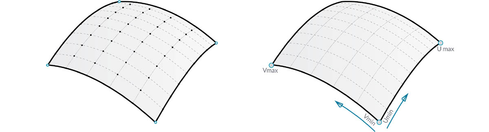

## Oberflächen

Mit dem Übergang von Kurven zu Oberflächen in einem Modell beginnen Sie, Objekte darzustellen, die in der dreidimensionalen Realität sichtbar sind. Kurven sind nicht immer planar (d. h., sie sind dreidimensional), der durch sie definierte Raum ist jedoch immer an eine Dimension gebunden. Mit Oberflächen kommen eine weitere Dimension und damit eine Reihe weiterer Eigenschaften hinzu, die Sie in anderen Modellierungsvorgängen nutzen können.

### Was ist eine Oberfläche?

Eine Oberfläche ist eine durch eine Funktion und zwei Parameter definierte mathematische Form. Der entsprechende Parameterraum wird nicht wie bei Kurven durch ```t```, sondern durch ```U``` und ```V``` beschrieben. Das bedeutet, dass bei der Arbeit mit dieser Art von Geometrie mehr geometrische Daten genutzt werden können. So sind z. B. bei Kurven Tangentenvektoren und Normalenebenen (die über die Länge der Kurve hinweg gedreht werden können), bei Oberflächen hingegen Normalenvektoren und Tangentialebenen vorhanden, deren Ausrichtung unverändert bleibt.


> 1. Oberfläche
2. U-Isokurve
3. V-Isokurve
4. UV-Koordinaten
5. Senkrechte Ebene
6. Normalenvektor

**Oberflächendomäne**: Die Domäne einer Oberfläche ist als der Bereich von UV-Parametern definiert, die als dreidimensionale Punkte auf der Oberfläche ausgewertet werden können. Die Domäne für jede der Dimensionen (U oder V) wird normalerweise in Form zweier Zahlen (U Min bis U Max) und (V Min bis V Max) beschrieben.


Die Kontur der Oberfläche ist dem Augenschein nach nicht unbedingt "rechteckig" und das Netz der Isokurven kann lokal eng- oder weitmaschiger sein; der durch die Domäne definierte "Raum" ist jedoch immer zweidimensional. In Dynamo wird immer angenommen, dass die Domäne einer Oberfläche durch den Mindestwert 0.0 und den Höchstwert 1.0 sowohl in U- als auch in V-Richtung definiert ist. Bei planaren oder gestutzten Oberflächen sind andere Domänen möglich.

**Isokurve** (oder isoparametrische Kurve): Eine durch einen konstanten U- oder V-Wert auf der Oberfläche und eine Domäne für die Werte in der dazugehörigen U- bzw. V-Richtung definierte Kurve.

**UV-Koordinaten**: Punkt im UV-Parameterraum, definiert durch U, V und manchmal W.


**Senkrechte Ebene**: Ebene, die an einer gegebenen UV-Koordinatenposition sowohl zur U- als auch zur V-Isokurve senkrecht steht.

**Normalenvektor**: Vektor, der die Aufwärtsrichtung relativ zur senkrechten Ebene definiert.

### NURBS-Oberflächen

**NURBS-Oberflächen** sind NURBS-Kurven sehr ähnlich. NURBS-Oberflächen sind vorstellbar als aus NURBS-Kurven gebildete Rastermit zwei Richtungen. Die Form einer NURBS-Oberfläche wird durch eine Reihe von Steuerpunkten und den Grad der Oberfläche in U- und V-Richtung definiert. Dieselben Algorithmen zur Berechnung von Form, Normalen, Tangenten, Krümmungen und anderer Eigenschaften mithilfe von Steuerpunkten, Gewichtungen und Grad kommen auch hier zum Einsatz.



Bei NURBS-Oberflächen werden zwei Richtungen für die Geometrie angenommen, da diese Oberflächen ungeachtet der sichtbaren Form rechtwinklige Raster von Steuerpunkten sind. Diese Richtungen liegen relativ zum Weltkoordinatensystem oft beliebig. Sie werden dennoch häufig zur Analyse von Modellen oder zum Generieren weiterer Geometrie auf Basis der Oberfläche verwendet.


> 1. Grad (U,V) = (3,3)
2. Grad (U,V) = (3,1)
3. Grad (U,V) = (1,2)
4. Grad (U,V) = (1,1)

### PolySurfaces

**PolySurfaces** setzen sich aus an einer Kante verbundenen Oberflächen zusammen. PolySurfaces bieten mehr als zweidimensionale UV-Definitionen: Sie können sich jetzt anhand der Topologie durch die verbundenen Formen bewegen.

> "Topologie" beschreibt in der Regel die Verbindungen und Beziehungen zwischen Teilen. In Dynamo ist Topologie darüber hinaus auch ein Typ von Geometrie. Sie ist, genauer, die übergeordnete Kategorie für Oberflächen, PolySurfaces und Körper.


Durch Zusammenfügen von Oberflächen (manchmal als "Pflasterung" bezeichnet) können komplexere Formen erstellt und Details entlang der Naht definiert werden. Beispielsweise können Sie die Kanten einer PolySurface mit Abrundungen oder Fasen versehen.

Importieren Sie eine Oberfläche in Dynamo und werten Sie sie an einer Parameterposition aus, um zu sehen, welche Informationen Sie extrahieren können.


> 1. *Surface.PointAtParameter* gibt den Punkt an der angegebenen UV-Koordinatenposition zurück.
2. *Surface.NormalAtParameter* gibt den Normalenvektor an der angegebenen UV-Koordinatenposition zurück.
3. *Surface.GetIsoline* gibt die isoparametrische Kurve an der U- oder V-Koordinatenposition zurück. Beachten Sie die isoDirection-Eingabe.
> Laden Sie die zu diesem Bild gehörige Beispieldatei herunter (durch Rechtsklicken und Wahl der Option Save Link As). Eine vollständige Liste der Beispieldateien finden Sie im Anhang.

> 1. [Geometry for Computational Design - Surfaces.dyn](datasets/5-5/Geometry for Computational Design - Surfaces.dyn)
2. [Surface.sat](datasets/5-5/Surface.sat)

