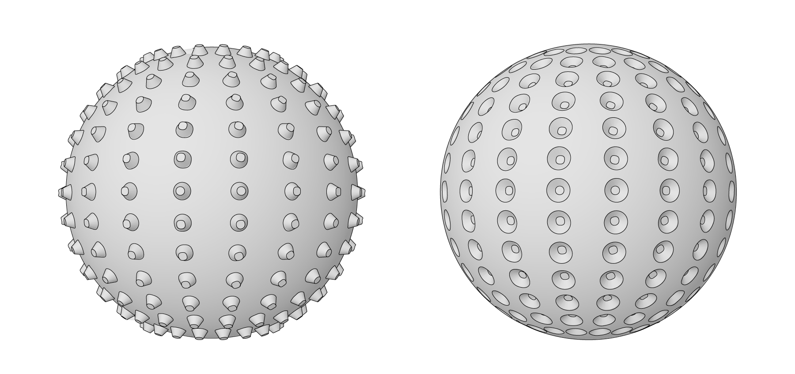

## Volumenkörper

Wenn wir komplexere Modelle erstellen möchten, die nicht aus einer einzelnen Fläche erstellt werden können, oder wenn wir ein explizites Volumen definieren möchten, müssen wir uns in den Bereich der Volumenkörper (und Flächenverbände) vorwagen. Selbst ein einfacher Würfel ist so komplex, dass er sechs Oberflächen erfordert, eine pro Seite. Volumenkörper ermöglichen den Zugriff auf zwei wichtige Konzepte, den Oberflächen nicht bieten – eine verfeinerte topologische Beschreibung (Flächen, Kanten, Scheitelpunkte) und boolesche Operationen.

### Was ist ein Volumenkörper?

Volumenkörper bestehen aus einer oder mehreren Oberflächen, die ein Volumen durch eine geschlossene Berandung enthalten, die "drinnen" oder "draußen" definiert. Unabhängig davon, wie viele dieser Oberflächen vorhanden sind, müssen Sie ein "wasserdichtes" Volumen bilden, um als Volumenkörper zu gelten. Volumenkörper können erstellt werden, indem Oberflächen oder Flächenverbände miteinander verbunden werden oder durch Verwendung von Vorgängen wie Ausformung, Extrusion und Drehung. Die Grundkörper Kugel, Würfel, Kegel und Zylinder sind ebenfalls Volumenkörper. Ein Würfel, von dem mindestens eine Fläche entfernt wurde, gilt als Flächenverband mit ähnlichen Eigenschaften wie ein Volumenkörper, aber nicht mehr als Volumenkörper selbst.

> 1. Eine Ebene besteht aus einer einzelnen Oberfläche und ist kein Volumenkörper.
2. Eine Kugel besteht aus einer einzelnen Oberfläche, aber *ist* ein Volumenkörper.
3. Ein Kegel besteht aus zwei Oberflächen, die miteinander verbunden sind, um einen Volumenkörper zu bilden.
4. Ein Zylinder besteht aus drei Oberflächen, die miteinander verbunden sind, um einen Volumenkörper zu bilden.
5. Ein Würfel besteht aus sechs Oberflächen, die miteinander verbunden sind, um einen Volumenkörper zu bilden.

### Topologie

Volumenkörper bestehen aus drei Typen von Elementen: Scheitelpunkten, Kanten und Flächen. Flächen sind die Oberflächen, die einen Volumenkörper bilden. Kanten sind die Kurven, die die Verbindung zwischen angrenzenden Flächen definieren, und Scheitelpunkte sind die Start- und Endpunkte der Kurven. Diese Elemente können mit den Topologieknoten abgefragt werden.

> 1. Flächen
2. Kanten
3. Scheitelpunkte

### Vorgänge

Volumenkörper können geändert werden, indem ihre Kanten abgerundet oder gefast werden, um scharfe Ecken und Winkel zu entfernen. Durch den Fasvorgang wird eine Regeloberfläche zwischen zwei Flächen erzeugt, während durch eine Abrundung ein Übergang zwischen Flächen erzeugt wird, um Tangentialität beizubehalten. 

> 1. Volumenkörperwürfel
2. Gefaster Würfel
3. Abgerundeter Würfel

### Boolesche Operationen

Boolesche Operationen für Volumenkörper sind Methoden zum Kombinieren von zwei oder mehr Volumenkörpern. Bei einer einzelnen booleschen Operation werden eigentlich vier Vorgänge durchgeführt:

1. Zwei oder mehr Objekte **überschneiden**.
2. Die Objekte an den Schnittpunkten **teilen**.
3. Unerwünschte Teile der Geometrie **löschen**.
4. Alles wieder miteinander **verbinden**.

Dadurch werden boolesche Operationen für Volumenkörper zu einem leistungsstarken und zeitsparenden Prozess. Es gibt drei boolesche Operationen für Volumenkörper, die unterscheiden, welche Teile der Geometrie beibehalten werden. 

> 1. **Vereinigung:** Die überlappenden Teile der Volumenkörper werden entfernt und sie werden zu einem einzelnen Volumenkörper verbunden.
2. **Differenz**: Ein Volumenkörper wird von einem anderen abgezogen. Der abzuziehende Volumenkörper wird als Werkzeug bezeichnet. Beachten Sie, dass Sie umschalten können, bei welchem Volumenkörper es sich um das Werkzeug handelt, um das inverse Volumen beizubehalten.
3. **Schnitt:** Nur das überschneidende Volumen der beiden Volumenkörper wird beibehalten.

Zusätzlich zu diesen drei Vorgänge sind in Dynamo die Knoten **Solid.DifferenceAll** und **Solid.UnionAll** verfügbar, mit denen Differenz- und Schnittvorgänge mit mehreren Volumenkörpern ausgeführt werden können. 

> 1. **UnionAll :** Vereinigungsvorgang mit Kugel und nach außen gerichteten Kegeln
2. **DifferenceAll :** Differenzvorgang mit Kugel und nach innen gerichteten Kegeln

Führen Sie mehrere boolesche Operationen aus, um einen Noppenball zu erstellen.

> 1. **Sphere.ByCenterPointRadius**: Der Basisvolumenkörper wird erstellt.
2. **Topology.Faces**, **Face.SurfaceGeometry**: Die Flächen des Volumenkörpers werden abgefragt und die Oberflächengeometrie wird konvertiert – in diesem Fall weist die Kugel nur eine Fläche auf.
3. **Cone.ByPointsRadii**: Mithilfe von Punkten auf der Oberfläche werden Kegel konstruiert.
4. **Solid.UnionAll**: Die Kegel und die Kugel werden vereinigt.
5. **Topology.Edges**: Die Kanten des neuen Volumenkörpers werden abgefragt.
6. **Solid.Fillet**: Die Kanten des Noppenballs werden abgerundet.
> Laden Sie die zu diesem Bild gehörigen Beispieldateien herunter (durch Rechtsklicken und Wahl der Option "Save Link As..."). Eine vollständige Liste der Beispieldateien finden Sie im Anhang. [Geometry for Computational Design - Solids.dyn](datasets/5-6/Geometry for Computational Design - Solids.dyn)

### Anhalten

Boolesche Operationen sind sehr komplex und ihre Berechnung kann möglicherweise viel Zeit in Anspruch nehmen. Verwenden Sie die Anhaltfunktion, um die Ausführung der ausgewählten Knoten und der betroffenen untergeordneten Knoten zu unterbrechen.

> Verwenden Sie das Kontextmenü, um den Vorgang "Vereinigung" für einen Volumenkörper anzuhalten.

> Der ausgewählte Knoten und alle untergeordneten Knoten werden in einem hellgrauen halbtransparenten Modus in einer Vorschau angezeigt und die betroffenen Drähte werden als gestrichelte Linien angezeigt. Die betroffene Geometrievorschau wird ebenfalls halbtransparent angezeigt. Sie können jetzt vorgelagerte Werte ändern, ohne die boolesche Vereinigung zu berechnen.

> Um die Ausführung der Knoten fortzusetzen, klicken Sie mit der rechten Maustaste und deaktivieren "Anhalten".

> Alle betroffenen Knoten und die zugehörigen Geometrievorschauen werden aktualisiert und wieder im standardmäßigen Vorschaumodus angezeigt.

