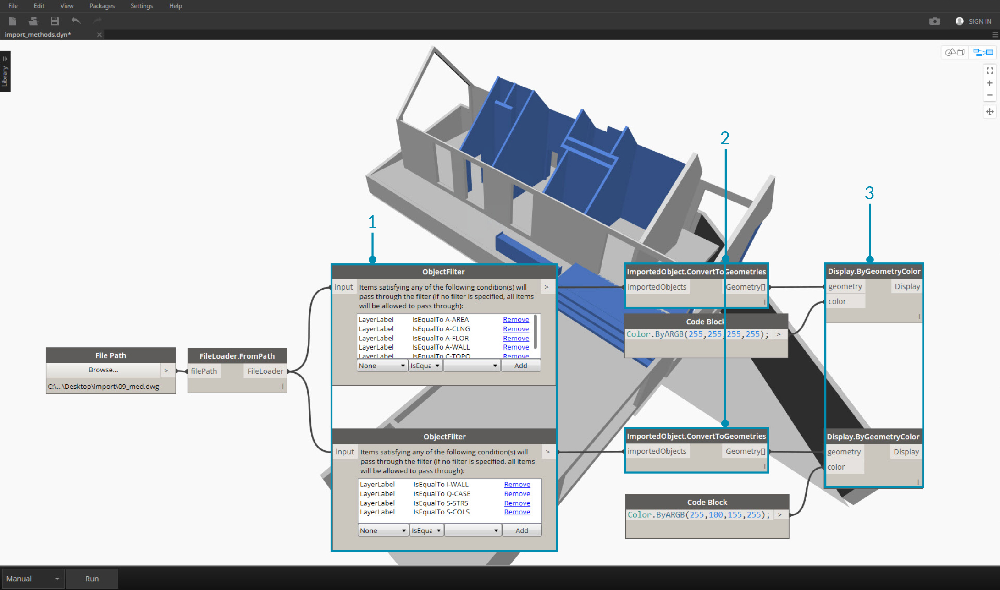

## Importieren von Geometrie

Es gibt mehrere Möglichkeiten zum Importieren von Geometrie in Dynamo. Der Import von Netzen mithilfe von *Mesh Toolkit* wurde im vorigen Abschnitt bereits gezeigt. Es ist ebenfalls möglich, Körpermodelle aus SAT-Dateien zu importieren. Mit diesen Verfahren können Sie Geometrie in anderen Plattformen entwickeln, sie in Dynamo laden und mithilfe visueller Programmierung parametrische Operationen anwenden.

Eine andere Methode für den Import von Geometrie nutzt einen Prozess namens *ATF-Translation*. In diesem Fall können Sie nicht nur die Geometrie, sondern auch die Struktur einer Datei importieren. So können Sie beispielsweise wählen, welche Layer aus einer DWG-Datei importiert werden sollen, anstatt das gesamte Modell zu importieren. Dies wird im Folgenden genauer beschrieben.

### Importieren von Geometrie aus einer DWG-Datei

Blöcke zum Importieren von DWG-Dateien in die Dynamo-Umgebung finden Sie unter *Translation*. (Anmerkung: Diese Tools stehen nur in [Dynamo Studio](http://www.autodesk.com/products/dynamo-studio/overview) zur Verfügung.) Die folgenden Beispiele zeigen eine Reihe von Komponenten, mit deren Hilfe Sie nach einer Datei suchen, ihren Inhalt importieren und diesen in für Dynamo verwendbare Geometrie konvertieren können. In Dynamo können Sie darüber hinaus bestimmte Objekte für den Import aus einer DWG-Datei filtern und auswählen, was im Folgenden gezeigt wird. Weitere Informationen zum Importieren von Geometrie aus einer DWG-Datei finden Sie in Ben Gohs [Blog-Post hier](http://dynamobim.org/dwg-import-in-dynamo-studio-0-9-1/).

### Importierte Objekte abrufen

Die einfachste Möglichkeit zum Importieren von DWG-Dateien in Dynamo Studio besteht darin, die gesamte Datei in den Arbeitsbereich zu importieren:

> 1. Suchen Sie mithilfe der File Path-Komponente nach der DWG-Datei, die in Dynamo importiert werden soll.
2. Verbinden Sie dies mit **FileLoader.FromPath**, um die Datei zu lesen.
3. Verwenden Sie die **FileLoader.GetImportedObjects**-Komponente zum Parsen der Geometrie für Dynamo Studio.
4. Mit **ImportedObject.ConvertToGeometries** werden die Objekte in Geometrie konvertiert, die Sie im Arbeitsbereich von Dynamo verwenden können.

Wie die Abbildung oben zeigt, werden sämtliche Typen von Geometrie – Oberflächen, Netze, Kurven und Linien – in Dynamo importiert.

### Objektfilter

Um festzulegen, welche Geometrieelemente aus der DWG-Datei importiert werden sollen, können Sie der Definition zusätzliche **ObjectFilter**-Blöcke hinzufügen. Der **ObjectFilter**-Block ist kompatibel entweder mit **FileLoader** oder mit einer Liste von **ImportedObject** und gibt eine **ImportedObject**-Liste aus.

Die folgenden Abbildungen zeigen die Bedingungsanweisungen in den einzelnen **ObjectFilter**-Blöcken. Jedes **ImportedObject**, das eine der Bedingungen in der Liste erfüllt, passiert den Filter. Sie können nach Layer-Bezeichnung (d. h. Layer-Namen), Geometrietyp, Streufarbe usw. filtern sowie Filter kombinieren, um die Auswahl zu präzisieren.

> 1. Ersetzen Sie **FileLoader.GetImportedObjects** durch **ObjectFilter**, um die DWG-Datei anhand bestimmter Bedingungen zu durchsuchen. In diesem Fall wird nur Oberflächengeometrie importiert. Die im vorigen Bild sichtbare Kurven- und Liniengeometrie wird entfernt.
2. Verbinden Sie den Filter mit **ImportedObject.ConvertToGeometries**, um die gefilterte Geometrie zu importieren.

Indem Sie zwei Filter mit unterschiedlichen Bedingungsanweisungen hinzufügen, können Sie die Liste der Geometrie in mehrere Gruppen unterteilen:

> 1. Ersetzen Sie **FileLoader.GetImportedObjects** durch zwei **ObjectFilter**-Module mit unterschiedlichen Bedingungsanweisungen. Die aus derselben Datei stammende Geometrie wird dadurch in zwei verschiedene Gruppen unterteilt.
2. Verbinden Sie den Filter mit **ImportedObject.ConvertToGeometries**, um die gefilterte Geometrie zu importieren.
3. Verbinden Sie **ImportedObject.ConvertToGeometries** mit **Display.ByGeometryColor**, um die Gruppen in verschiedenen Farben zu visualisieren.

### Explizite Objektauswahl

Der **ObjectSelector**-Block bietet eine alternative Methode zum Importieren von Objekten aus der DWG-Datei. Bei dieser Methode werden keine Filter verwendet, sondern Sie können gezielt wählen, welche Objekte und Layer in Dynamo importiert werden sollen.

> 1. Ersetzen Sie **FileLoader.GetImportedObjects** durch **ObjectSelector**, um bestimmte Layer und Objekte in einer DWG-Datei abzurufen.
2. Verbinden Sie Filter mit **ImportedObject.ConvertToGeometries**.

