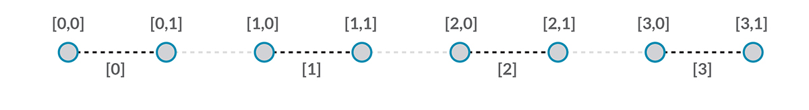
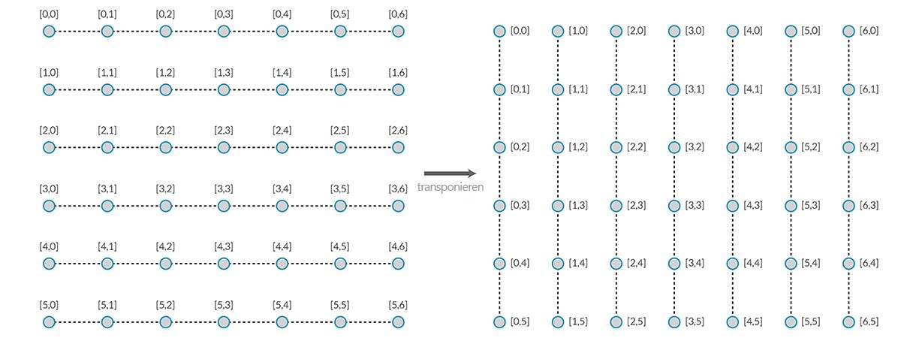
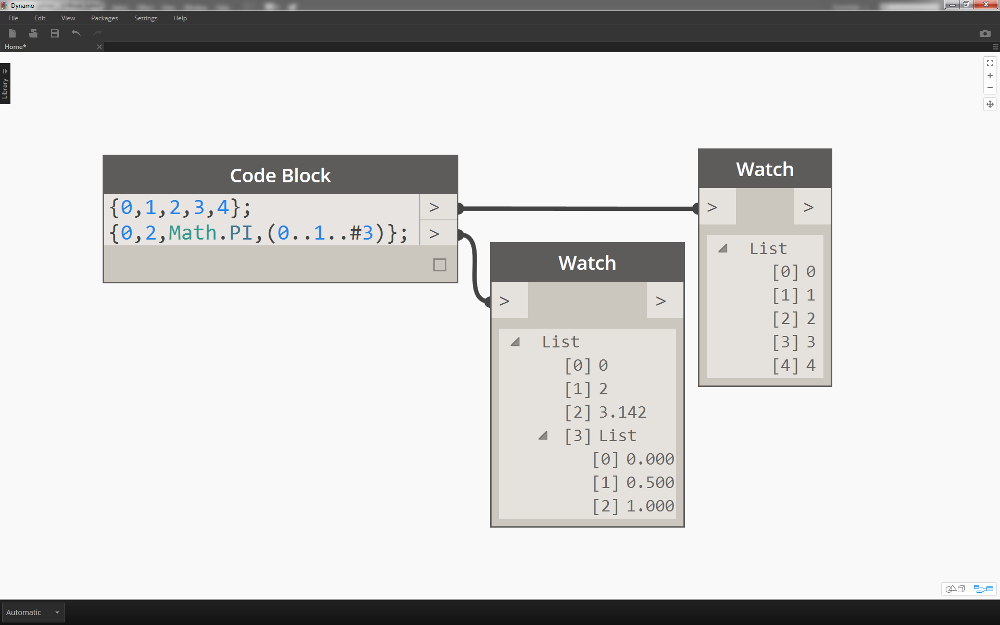
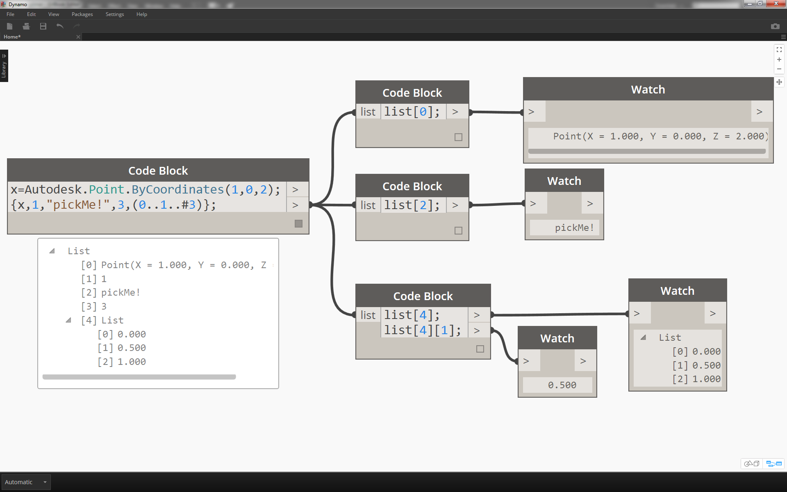

## Listen von Listen

In diesem Abschnitt kommt eine weitere Ebene zur Hierarchie hinzu. Für den Einstieg wurde ein Stapel Karten als Beispiel betrachtet. Angenommen, eine Schachtel enthält mehrere solche Stapel. In diesem Fall entspricht die Schachtel einer Liste von Stapeln und jeder Stapel einer Liste von Karten. Dies ist eine Liste von Listen. Als Analogie für diesen Abschnitt dient die unten gezeigte rote Kiste eine Liste von Münzstapeln, wobei jeder Stapel einer Liste von Münzen entspricht.


> Foto von [Dori](https://commons.wikimedia.org/wiki/File:Stack_of_coins_0214.jpg).

Welche **Abfragen** sind in der Liste von Listen möglich? Dies ermöglicht den Zugriff auf vorhandene Eigenschaften.

* Anzahl von Münzarten? 2.
* Wert der Münzarten? 0,01 $ und 0,25 $.
* Material der Vierteldollars? 75 % Kupfer und 25 % Nickel.
* Material der Cents? 97,5 % Zink und 2,5 % Kupfer.

Welche **Aktionen** können in der Liste von Listen durchgeführt werden? Diese Aktionen bewirken Änderungen in der Liste von Listen entsprechend der jeweiligen Operation.

* Wählen Sie einen bestimmten Stapel von Vierteldollars oder Cents aus.
* Wählen Sie einen bestimmten Vierteldollar oder Cent aus.
* Ordnen Sie den Stapel aus Vierteldollars und Cents neu.
* Mischen Sie die Stapel zusammen.

Auch in diesem Fall steht in Dynamo für jeden der oben genannten Vorgänge ein entsprechender Block zur Verfügung. Da allerdings keine realen Objekte, sondern abstrakte Daten verarbeitet werden, sind Regeln zum Navigieren in der Datenhierarchie erforderlich.

Die bei der Arbeit mit Listen von Listen verwendeten Daten sind komplex und umfassen mehrere Ebenen, was aber auch die Möglichkeit für äußerst wirkungsvolle parametrische Operationen eröffnet. Im Folgenden werden zunächst die Grundlagen im Einzelnen erläutert und in weiteren Lektionen einige weitere Operationen betrachtet.

## Hierarchie von oben nach unten

Das in diesem Abschnitt eingeführte Grundprinzip lautet: **Dynamo behandelt auch Listen als Objekte**. Diese Hierarchie von oben nach unten wurde im Hinblick auf objektorientierte Programmierung entwickelt. Anstatt Unterelemente mithilfe eines Befehls wie etwa List.GetItemAtIndex auszuwählen, wählt Dynamo den entsprechenden Index in der Hauptliste innerhalb der Datenstruktur. Dieses Element kann eine weitere Liste sein. Ein Beispielbild soll dies verdeutlichen:

#### Übung – Hierarchie von oben nach unten

> Laden Sie die zu dieser Übungslektion gehörige Beispieldatei herunter (durch Rechtsklicken und Wahl der Option "Save Link As"): [Top-Down-Hierarchy.dyn](datasets/6-3/Top-Down-Hierarchy.dyn). Eine vollständige Liste der Beispieldateien finden Sie im Anhang.


> 1. Im *Codeblock* wurden zwei Bereiche definiert:``` 0..2; 0..3; ```
2. Diese Bereiche sind mit einem *Point.ByCoordinates*-Block unter Verwendung der Vergitterung *"Kreuzprodukt"* verbunden. Dadurch wird ein Raster von Punkten erstellt und zugleich wird eine Liste von Listen als Ausgabe zurückgegeben.
3. Beachten Sie, dass im *Watch*-Block 3 Listen mit jeweils 4 Elementen angezeigt werden.
4. Bei Verwendung von *List.GetItemAtIndex* mit dem Index 0 wählt Dynamo die erste Liste sowie ihren gesamten Inhalt aus. In anderen Programmen wird eventuell das erste Element jeder Liste in der Datenstruktur ausgewählt, Dynamo verwendet jedoch eine von oben nach unten geordnete Hierarchie zur Verarbeitung der Daten.

### Flatten und List.Flatten

Der Befehl Flatten entfernt alle Datenebenen aus einer Datenstruktur. Dies ist hilfreich, wenn Sie für Ihre Operationen keine Datenhierarchien benötigen, birgt jedoch auch Risiken, da Informationen entfernt werden. Das folgende Beispiel zeigt das Ergebnis nach der Vereinfachung einer Liste mit Daten.

#### Übungslektion – Flatten

> Laden Sie die zu dieser Übungslektion gehörige Beispieldatei herunter (durch Rechtsklicken und Wahl der Option "Save Link As"): [Flatten.dyn](datasets/6-3/Flatten.dyn). Eine vollständige Liste der Beispieldateien finden Sie im Anhang.


> 1. Fügen Sie im *Codeblock* eine Zeile mit Code zum Definieren eines Bereichs ein:``` -250..-150..#4; ```.
2. Der *Codeblock* wird mit den *x*- und *y*-Eingaben eines *Point.ByCoordinates*-Blocks verbunden, wobei die Vergitterung *"Kreuzprodukt"* verwendet wird, um ein Raster aus Punkten zu erhalten.
3. Im *Watch*-Block wird angezeigt, dass eine Liste von Listen erstellt wurde.
4. Ein *PolyCurve.ByPoints*-Block referenziert die einzelnen Listen und erstellt die entsprechenden Polykurven. Die Dynamo-Vorschau zeigt vier Polykurven für die Zeilen im Raster.


> 1. Durch Einfügen von *flatten* vor dem Block für die Polykurven entsteht eine einzelne Liste, die sämtliche Punkte enthält. Der Block für die Polykurven referenziert diese Liste und erstellt nur eine Kurve. Da alle Punkte in derselben Liste enthalten sind, entsteht eine zickzackförmige Polykurve, die durch sämtliche Punkten aus der Liste verläuft.

Darüber hinaus stehen auch Optionen zum Vereinfachen isolierter Datenebenen zur Verfügung. Mithilfe des Blocks List.Flatten können Sie festlegen, wie viele Datenebenen unterhalb der ersten Hierarchieebene vereinfacht werden sollen. Dies ist sehr hilfreich bei komplexen Datenstrukturen, die für Ihren Arbeitsablauf nicht unbedingt erforderlich sind. Eine weitere Möglichkeit besteht darin, den Flatten-Block als Funktion in List.Map einzusetzen. [List.Map](#listmap-and-listcombine) wird weiter unten ausführlicher beschrieben.

### Chop

Bei der parametrischen Modellierung ist es zuweilen erforderlich, die Datenstruktur einer bestehenden Liste präziser zu differenzieren. Hierfür stehen ebenfalls zahlreiche Blöcke zur Verfügung, wobei Chop die einfachste Version darstellt. Mit Chop können Sie eine Liste in Unterlisten mit der angegebenen Anzahl Elemente unterteilen.

#### Übungslektion – List.Chop

> Laden Sie die zu dieser Übungslektion gehörige Beispieldatei herunter (durch Rechtsklicken und Wahl der Option "Save Link As"): [Chop.dyn](datasets/6-3/Chop.dyn). Eine vollständige Liste der Beispieldateien finden Sie im [Appendix](../Appendix/A_appendix.md).



> Mit *List.Chop _und dem _subLength*-Wert 2 entstehen vier Listen mit je zwei Elementen.

Der Befehl Chop teilt Listen gemäß der angegebenen Listenlänge. In gewisser Weise stellt Chop das Gegenteil zu Flatten dar: Der Datenstruktur werden neue Ebenen hinzugefügt, anstatt dass vorhandene entfernt werden. Dieses Werkzeug ist hilfreich für geometrische Operationen wie im Beispiel unten gezeigt.


### List.Map und List.Combine

Mit List.Map/Combine wird eine angegebene Funktion auf die eingegebene Liste angewendet, allerdings geschieht dies eine Ebene tiefer in der Hierarchie. Kombinationen entsprechen Maps, wobei für Kombinationen allerdings mehrere Eingaben entsprechend der Eingabe einer gegebenen Funktion möglich sind.

#### Übungslektion – List.Map

*Anmerkung: Diese Übung wurde mit einer früheren Version von Dynamo erstellt. Die Funktion List.Map lässt sich großenteils durch die neu hinzugefügte Funktion List@Level ersetzen. Weitere Informationen finden Sie weiter unten unter [List@Level](#listlevel).*

> Laden Sie die zu dieser Übungslektion gehörige Beispieldatei herunter (durch Rechtsklicken und Wahl der Option "Save Link As"): [Map.dyn](datasets/6-3/Map.dyn). Eine vollständige Liste der Beispieldateien finden Sie im [Appendix](../Appendix/A_appendix.md).

Ziehen Sie als kurze Einführung den List.Count-Block aus dem vorigen Abschnitt heran.


> Der *List.Count*-Block zählt alle Elemente in einer Liste. An diesem Beispiel wird die Funktionsweise von *List.Map* gezeigt.


> 1. Fügen Sie zwei Zeilen Code in den *Codeblock* ein:

```
-50..50..#Nx;
-50..50..#Ny;
```

Nach der Eingabe dieses Codes werden im Codeblock zwei Eingaben für Nx und Ny erstellt.

2. Definieren Sie mit zwei *Integer Slidern* die Werte für *Nx* und *Ny*, indem Sie die Schieberegler mit dem *Codeblock* verbinden.
3. Verbinden Sie jede Zeile des Codeblocks mit der entsprechenden *X*- bzw. *Y*-Eingabe eines *Point.ByCoordinates*-Blocks. Klicken Sie mit der rechten Maustaste auf den Block und wählen Sie zuerst Vergitterung und dann *"Kreuzprodukt"*. Dadurch wird ein Raster aus Punkten erstellt. Da der Bereich zwischen -50 und 50 definiert wurde, umfasst er das vorgabemäßige Raster von Dynamo.
4. In einem *Watch*-Block werden die erstellten Punkte angezeigt. Beachten Sie die Datenstruktur. Es wurde eine Liste von Listen erstellt. Jede Liste entspricht einer Reihe von Punkten im Raster.


> 1. Verbinden Sie einen *List.Count*-Block mit der Ausgabe des Watch-Blocks aus dem vorigen Schritt.
2. Verbinden Sie einen *Watch*-Block mit der Ausgabe des List.Count-Blocks.

Der List.Count-Block gibt den Wert 5 aus. Dieser Wert ist gleich dem Wert der im Codeblock definierten Variablen Nx. Dies geschieht aus dem folgenden Grund:

* Im Point.ByCoordinates-Block wird die x-Eingabe als primäre Eingabe zum Erstellen von Listen verwendet. Für Nx = 5 und Ny = 3 ergibt sich daher eine Liste, die fünf Listen mit je 3 Elementen enthält.
* Da Listen in Dynamo als Objekte behandelt werden, wird der List.Count-Block auf die Hauptliste in der Hierarchie angewendet. Das Ergebnis ist der Wert 5, d. h. die Anzahl der Listen in der Hauptliste.


> 1. Mithilfe eines *List.Map*-Blocks bewegen Sie sich eine Ebene tiefer in die Hierarchie und führen dort eine *"Funktion"* aus.
2. Beachten Sie, dass der *List.Count*-Block keine Eingabe hat. Er wird als Funktion eingesetzt, d. h., der *List.Count*-Block wird auf jede einzelne Liste eine Ebene unterhalb der Hauptliste in der Hierarchie angewendet. Die leere Eingabe von *List.Count* entspricht der Listeneingabe von *List.Map*.
3. Als Ergebnis von *List.Count* erhalten Sie jetzt eine Liste mit fünf Elementen, jeweils mit dem Wert 3. Dies entspricht der Länge jeder Unterliste.

#### Übungslektion – List.Combine

*Anmerkung: Diese Übung wurde mit einer früheren Version von Dynamo erstellt. Die Funktionalität von List.Combine lässt sich großenteils durch die neu hinzugefügte Funktion List@Level ersetzen. Weitere Informationen finden Sie weiter unten unter *[*List@Level*](#listlevel)*.*

> Laden Sie die zu dieser Übungslektion gehörige Beispieldatei herunter (durch Rechtsklicken und Wahl der Option "Save Link As"): [Combine.dyn](datasets/6-3/Combine.dyn). Eine vollständige Liste der Beispieldateien finden Sie im [Appendix](../Appendix/A_appendix.md).

In dieser Übung wird eine ähnliche Logik verwendet wie für List.Map, wobei allerdings mehrere Elemente einbezogen werden. In diesem Fall soll jede der Kurven in einer Liste durch eine andere Anzahl von Punkten unterteilt werden.


> 1. Definieren Sie im *Codeblock* einen Bereich mit der Syntax ```..20..#4; ```und dem Wert```20; ``` in der Zeile darunter.
2. Verbinden Sie den *Codeblock* mit zwei *Point.ByCoordinates*-Blöcken.
3. Erstellen Sie eine *Line.ByStartPointEndPoint* aus den *Point.ByCoordinates*-Blöcken.
4. Der *Watch*-Block zeigt vier Linien.


> 1. Unter dem Diagramm für die Linienerstellung sollen mithilfe eines _code block _ vier separate Bereiche zum Unterteilen der einzelnen Linien erstellt werden. Verwenden Sie dazu die folgenden Codezeilen:
```
0..1..#3;
0..1..#4;
0..1..#5;
0..1..#6;
```

2. Mithilfe eines *List.Create*-Blocks werden die vier Zeilen aus dem *Codeblock* in ein und derselben Liste zusammengefasst.
3. Der *Watch*-Block zeigt eine Liste von Listen.


> 1. *Curve.PointAtParameter* kann nicht durch direkte Verbindung der Linien mit den *parameter*-Werten angewendet werden. Dies ist nur auf der nächsttieferen Ebene der Hierarchie möglich. Verwenden Sie hierfür *List.Combine*.


> Mithilfe von *List.Combine* werden die einzelnen Linien unter Verwendung der angegebenen Bereiche unterteilt. Da dieser Vorgang etwas komplexer ist, wird er hier im Detail beschrieben.

> 1. Fügen Sie als Erstes einen *Curve.PointAtParameter*-Block im Ansichtsbereich hinzu. Dies ist die *„Funktion“ bzw. der *„Kombinator“*, der auf den List.Combine*-Block angewendet wird. Dies wird etwas weiter unten genauer beschrieben.
2. Fügen Sie im Ansichtsbereich einen *List.Combine*-Block hinzu. Durch Klicken auf *"+"* oder *"-"* können Sie Eingaben hinzufügen oder entfernen. Verwenden Sie in diesem Fall die vorgegebenen zwei Eingaben für den Block.
3. Verbinden Sie den *Curve.PointAtParameter*-Block mit der *"comb"*-Eingabe von *List.Combine*. Eine weitere wichtige Eingabe in einem der Blöcke: Achten Sie darauf, mit der rechten Maustaste auf die *param-Eingabe von _Curve.PointAtParameter* zu klicken und *Vorgabewert verwenden* zu deaktivieren. Wenn ein Block als Funktion ausgeführt wird, müssen Vorgabewerte in Dynamo-Eingaben entfernt werden. In anderen Worten: Es wird grundsätzlich angenommen, dass Vorgabewerte mit zusätzlichen Blöcken verbunden sind. Aus diesem Grund müssen Sie in diesem Fall die Vorgabewerte entfernen.
4. Es sind zwei Eingaben vorhanden: die Linien und die Parameter zum Erstellen der Punkte. Wie und in welcher Reihenfolge werden diese mit den *List.Combine*-Eingaben verbunden?
5. Die Reihenfolge der leeren Eingaben in *Curve.PointAtParameter* (von oben nach unten) muss auch für die Eingaben im Kombinator eingehalten werden. Die Linien müssen daher mit *List1* von *List.Combine* verbunden werden.
6. Dementsprechend werden die Parameterwerte mit der *list2*-Eingabe von *List.Combine* verbunden.
7. Im *Watch*-Block und in der Dynamo-Vorschau sind vier Linien zu erkennen und jede dieser Linien ist entsprechend den Bereichen aus dem *Code Block* unterteilt.

### List@Level

Die Funktion List@Level kann als Alternative zu List.Map eingesetzt werden und ermöglicht es, die Listenebene, mit der Sie arbeiten möchten, direkt am Eingabeanschluss auszuwählen. Diese Funktion kann auf jeden Eingabeanschluss eines Blocks angewendet werden und ermöglicht einen schnelleren und einfacheren Zugriff auf die Ebenen in Listen als andere Methoden. Geben Sie im Block einfach an, welche Ebene der Liste Sie als Eingabe verwenden möchten, und überlassen Sie die Ausführung dem Block.

#### Übungslektion – List@Level

In dieser Übung isolieren Sie mithilfe der Funktion List@Level eine bestimmte Datenebene.

> Laden Sie die zu dieser Übungslektion gehörige Beispieldatei herunter (durch Rechtsklicken und Wahl der Option "Save Link As"): [List@Level](datasets/6-3/Listatlevel.dyn). Eine vollständige Liste der Beispieldateien finden Sie im [Appendix](../Appendix/A_appendix.md).


> 1. Sie beginnen mit einem einfachen 3D-Raster von Punkten.
2. Da das Raster mit Bereichen für X, Y und Z konstruiert wurde, ist bekannt, dass drei Datenstufen vorhanden ist, jeweils eine Liste für X, Y und Z.
3. Diese Stufen entsprechen verschiedenen **Ebenen**. Die Ebenen werden im unteren Bereich des Vorschaufensters angezeigt. Die Spalten für die Listenebenen entsprechen den oben angegebenen Listendaten und erleichtern es, die Ebene zu finden, auf der Sie arbeiten möchten.
4. Die Ebenen sind in umgekehrter Reihenfolge geordnet, d. h., die unterste Datenebene ist immer "L1". Dadurch wird sichergestellt, dass Ihre Diagramme wie geplant funktionieren, auch wenn vorangehende Schritte geändert werden.


> 1. Um die Funktion List@Level zu verwenden, klicken Sie auf '>'. In diesem Menü werden zwei Kontrollkästchen angezeigt.
2. **Ebenen verwenden**: Aktiviert die Funktion List@Level. Nach dem Klicken auf diese Option können Sie durch die Eingabelistenebenen navigieren und die Ebene auswählen, die der Block verwenden soll. Über dieses Menü können Sie durch Navigieren nach oben oder unten rasch Optionen für verschiedene Ebenen testen.
3. **Listenstruktur beibehalten**: Ist dies aktiviert, haben Sie die Möglichkeit, die Ebenenstruktur der Eingabe beizubehalten. In manchen Fällen haben Sie eventuell Ihre Daten absichtlich in Unterlisten geordnet. Indem Sie diese Option aktivieren, können Sie Ihre Listenstruktur beibehalten, sodass keine Informationen verloren gehen.

In diesem einfachen 3D-Raster können Sie auf die Listenstruktur zugreifen und sie visualisieren, indem Sie durch die Listenebenen blättern. Mit jeder Kombination aus Listenebene und Index erhalten Sie eine andere Untergruppe von Punkten aus der ursprünglichen 3D-Punktmenge.


> 1. Mit der Angabe "@L2" in DesignScript wählen Sie ausschließlich die Liste auf Ebene 2 aus.
2. Die Liste auf Ebene 2 mit dem Index 0 enthält nur die Gruppe von Punkten mit dem ersten Y-Wert, d. h. nur das XZ-Raster.
3. Wenn Sie den Ebenenfilter in "L1" ändern, sind sämtliche Daten auf der ersten Listenebene sichtbar. Die Liste auf Ebene 1 mit dem Index 0 enthält alle 3D-Punkte in einer unstrukturierten Liste.
4. Mit "L3" werden nur die Punkte auf der dritten Listenebene angezeigt. Die Liste auf Ebene 3 mit dem Index 0 enthält nur die Gruppe von Punkten mit dem ersten Z-Wert, d. h. nur das XY-Raster.
5. Mit "L4" werden nur die Punkte auf der dritten Listenebene angezeigt. Die Liste auf Ebene 4 mit dem Index 0 enthält nur die Gruppe von Punkten mit dem ersten X-Wert, d. h. nur das YZ-Raster.

Obwohl dieses Beispiel auch mithilfe von List.Map erstellt werden kann, bietet List@Level eine wesentlich einfachere Interaktion und erleichtert dadurch den Zugriff auf die Daten des Blocks. Unten sehen Sie die Methoden List.Map und List@Level im Vergleich:


> 1. Beide Methoden ermöglichen den Zugriff auf dieselben Punkte, mit List@Level ist jedoch der mühelose Wechsel zwischen Datenebenen innerhalb desselben Blocks möglich.
2. Für den Zugriff auf ein Punktraster mithilfe von List.Map benötigen Sie außer dem eigentlichen List.Map-Block einen List.GetItemAtIndex-Block. Für jeden Schritt auf eine tiefere Listenebene benötigen Sie einen weiteren List.Map-Block. Dies könnte je nach Komplexität Ihrer Listen bedeuten, dass Sie Ihrem Diagramm eine größere Anzahl von List.Map-Blöcken hinzufügen müssen, um die richtige Informationsebene zu erreichen.
3. In diesem Beispiel gibt der List.GetItemAtIndex-Block zusammen mit dem List.Map-Block dieselbe Punktgruppe mit derselben Listenstruktur zurück wie List.GetItemAtIndex mit der Auswahl "L3".

### Transpose

Transpose gehört zu den Grundfunktionen bei der Arbeit mit Listen von Listen. Mit Transpose werden genau wie in Tabellenkalkulationsprogrammen die Spalten und Zeilen einer Datenstruktur vertauscht. Dies wird in einer einfachen Matrix unten gezeigt. Im darauf folgenden Abschnitt wird beschrieben, wie Sie mithilfe von Transpose geometrische Beziehungen erstellen können.



#### Übungslektion – List.Transpose

> Laden Sie die zu dieser Übungslektion gehörige Beispieldatei herunter (durch Rechtsklicken und Wahl der Option "Save Link As"): [Transpose.dyn](datasets/6-3/Transpose.dyn). Eine vollständige Liste der Beispieldateien finden Sie im Anhang.


> Löschen Sie die *List.Count*-Blöcke aus der vorhergegangenen Übungslektion, sodass Sie mit Geometrie arbeiten und die Struktur der Daten sehen können.

> 1. Verbinden Sie einen *PolyCurve.ByPoints*-Block mit der Ausgabe des Beobachtungsblocks für *Point.ByCoordinates*.
2. Die Ausgabe zeigt 5 Polykurven, die auch in der Dynamo-Vorschau angezeigt werden. Der Dynamo-Block sucht nach einer Liste von Punkten (bzw. in diesem Fall nach einer Liste von Listen von Punkten) und erstellt jeweils eine Polykurve. Dies bedeutet, dass jede Liste in eine Kurve in der Datenstruktur umgewandelt wurde.


> 1. Um eine solche Kurve zu isolieren, verwenden Sie den *List.GetItemAtIndex*-Block.
2. Fragen Sie mithilfe des *Codeblock*-Werts 2 das dritte Element aus der Hauptliste ab.
3. *PolyCurve.ByPoints* gibt nur eine Kurve aus, da nur eine Liste mit dem Block verbunden ist.


> 1. Ein *List.Transpose*-Block vertauscht sämtliche Elemente mit allen Listen in einer Liste von Listen. Dies wirkt kompliziert, folgt aber derselben Logik wie die Funktion Transponieren in Microsoft Excel: Spalten und Zeilen in einer Datenstruktur werden vertauscht.
2. Im abstrakten Ergebnis ist zu sehen, dass Transpose die Listenstruktur aus 5 Listen mit je 3 Elementen in 3 Listen mit je 5 Elementen umgewandelt hat.
3. Das geometrische Ergebnis aus *PolyCurve.ByPoints* zeigt 3 Polykurven, die rechtwinklig zu den Originalkurven liegen.

### Erstellen mithilfe von Codeblöcken

In der Codeblock-Notation wird "[]" zum Definieren einer Liste verwendet. Mit diesem Verfahren können Sie Listen wesentlich schneller und flexibler erstellen als mithilfe des List.Create-Blocks. Genauere Informationen zu Codeblöcken finden Sie in Kapitel 7. Die folgende Abbildung zeigt, wie Sie eine Liste mit mehreren Ausdrücken in einem Codeblock definieren können.



### Codeblock-Abfrage

Die Codeblock-Notation verwendet eckige Klammern ("[]") als schnelle und einfache Möglichkeit zur Auswahl bestimmter Elemente, die aus einer komplexen Datenstruktur abgerufen werden sollen. Codeblöcke werden in Kapitel 7 detaillierter erläutert. Die folgende Abbildung zeigt, wie Sie mithilfe von Codeblöcken eine Liste mit mehreren Datentypen abfragen können.



### Übungslektion: Abfragen und Einfügen von Daten

> Laden Sie die zu dieser Übungslektion gehörige Beispieldatei herunter (durch Rechtsklicken und Wahl der Option "Save Link As"): [ReplaceItems.dyn](datasets/6-3/ReplaceItems.dyn). Eine vollständige Liste der Beispieldateien finden Sie im Anhang.

In dieser Übungslektion wird ein Teil der in der vorigen Lektion erstellten Logik zum Bearbeiten einer Oberfläche verwendet. Die Navigation in der Datenstruktur ist etwas komplexer, obwohl das angestrebte Ergebnis intuitiv wirkt. Die Oberfläche soll durch Verschieben eines Steuerpunkts strukturiert werden.


> 1. Beginnen Sie mit der oben gezeigten Folge von Blöcken. Dadurch wird eine einfache, das vorgegebene Dynamo-Raster umfassende Oberfläche erstellt.
2. Fügen Sie mithilfe eines *Codeblock* diese beiden Codezeilen ein und verbinden Sie sie mit den *u*- und *v*-Eingaben von *Surface.PointAtParameter*.
```
-50..50..#3;
-50..50..#5;
```

3. Achten Sie darauf, als Vergitterung von *Surface.PointAtParameter* die Option *Kreuzprodukt* zu wählen.
4. Im *Watch*-Block wird eine Liste aus drei Listen mit je fünf Elementen angezeigt.


> In diesem Schritt fragen Sie den Mittelpunkt des eben erstellten Rasters ab. Dazu wird die mittlere Zeile der mittleren Liste ausgewählt, wie es nahe liegt.

> 1. Sie können auch nacheinander auf die Elemente im Watch-Block klicken, um sicherzustellen, dass es sich um den richtigen Punkt handelt.
2. Schreiben Sie im *Codeblock* eine einfache Codezeile zum Abfragen einer Liste von Listen:<br xmlns="http://www.w3.org/1999/xhtml"/>```points[1][2];```
3. Verschieben Sie mithilfe von *Geometry.Translate* den ausgewählten Punkt in *Z*-Richtung um *20* Einheiten nach oben.


> 1. Wählen Sie mithilfe eines *List.GetItemAtIndex*-Blocks auch die mittlere Reihe von Punkten aus. Anmerkung: Ähnlich wie im vorigen Schritt können Sie die Liste auch mithilfe eines *Codeblock* abfragen, wobei Sie die Zeile ```points[1];``` eingeben.


> Damit haben Sie den Mittelpunkt abgefragt und ihn nach oben verschoben. Als Nächstes müssen Sie den verschobenen Punkt in die ursprüngliche Datenstruktur einfügen.

> 1. Dazu ersetzen Sie zuerst das Listenelement, das Sie zuvor isoliert haben.
2. Mit *List.ReplaceItemAtIndex* ersetzen Sie das mittlere Element mit dem Index *"2"* durch das Ersatzelement, das mit dem verschobenen Punkt (*Geometry.Translate*) verbunden ist.
3. Die Ausgabe zeigt, dass der verschobene Punkt in das mittlere Element der Liste eingegeben wurde.


> Jetzt müssen Sie die geänderte Liste in die ursprüngliche Datenstruktur, d. h. die Liste von Listen, einfügen.

> 1. Ersetzen Sie nach demselben Prinzip die mittlere Liste mithilfe von *List.ReplaceItemAtIndex* durch die geänderte Liste.
2. Beachten Sie, dass in den *Codeblocks*, die die Indizes für diese beiden Blöcke definieren, die Werte 1 und 2 angegeben wurde, was der ursprünglichen Abfrage aus dem *Codeblock* (*points[1][2]*) entspricht.
3. Wenn Sie die Liste mit *index 1* auswählen, wird die Datenstruktur in der Dynamo-Vorschau hervorgehoben. Damit haben Sie den verschobenen Punkt in die ursprüngliche Datenstruktur aufgenommen.


> Es gibt viele Möglichkeiten zum Erstellen einer Oberfläche aus dieser Punktgruppe. In diesem Fall erstellen Sie die Oberfläche durch Erheben und Verbinden von Kurven.

> 1. Erstellen Sie einen *NurbsCurve.ByPoints*-Block und verbinden Sie ihn mit der neuen Datenstruktur, um drei Nurbs-Kurven zu erstellen.


> 1. Verbinden Sie einen *Surface.ByLoft*-Block mit der Ausgabe von *NurbsCurve.ByPoints*. Damit haben Sie eine geänderte Oberfläche erstellt. Sie können den ursprünglichen *Z*-Wert der Geometrie ändern. Beobachten Sie, wie die Geometrie durch diese Verschiebung aktualisiert wird.

